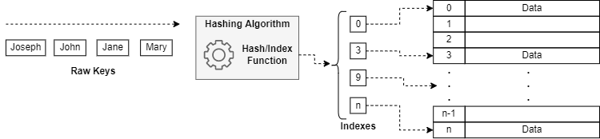

# Understanding Hash Tables

## 1. Introduction

**Techniques to efficiently manage data are traditional hot topics in computer science.** Besides storing data, recovering it from the storage with efficiency is another relevant concern.

Even with the best algorithm that does some specific data processing, we’ll have poor performance if the data management is not optimized. So, recovering and providing data to the algorithm as well as saving its outputs becomes a performance bottleneck.

**Several techniques to keep and manage data have been proposed over time.** Examples are [arrays](https://www.baeldung.com/cs/common-data-structures#arrays), [linked lists](https://www.baeldung.com/cs/linked-list-data-structure), [trees](https://www.baeldung.com/cs/tree-examples), and [graphs](https://www.baeldung.com/cs/graphs). These data structures are excellent for multiple purposes. But, the time complexity to find and recover stored data in them is typically higher than in another data structure: the hash tables.

**So, this tutorial explores the most relevant concepts regarding hash tables.** First, we’ll have a brief review of hashing. Thus, we’ll study hash tables and how they work. Next, we’ll see how to solve some potential problems regarding hash collisions. Finally, we’ll compare hash tables with other data structures concerning the complexity of data management.

## 2. Basics of Hashing

**Before specifically studying hash tables, we need to understand** [**hashing**](https://www.baeldung.com/cs/hashing)**.** In summary, hashing is the process that takes a variable-length input and produces a fixed-length output value, called hash code or just hash.

A hashing function is responsible for transforming a variable-length input into a hash. There is no standard hash function. It means that we can develop the hash functions according to the general expected characteristics of our data inputs.

The following image depicts, on a high level, how a hashing mechanism works:

It is relevant to notice that the hashing function can both increase or decrease the number of bytes of the variable-length input. Thus, if the input is bigger than the hash code, the number of bytes will decrease. Otherwise, it will increase.

**In short, hashing has several applications in computer science, such as storing and verifying passwords, creating message signatures, and providing data management structures (the main topic of this tutorial).**

## 3. Hash Tables

**Hash tables are data structures that associate specific keys to corresponding values.** These tables are typically implemented with an associative array to store the data. Moreover, they use a hash function to compute at which point of the array the data should be stored (the index).

So, we can understand a hash table as a key-value lookup. Thus, given a key associated with a value (data), we can recover the corresponding value through a quick lookup on the table.

For instance, we can associate people’s names with their personal information with a hash table. In this way, the people’s names are our raw keys. A hash function process these raw keys to determine their corresponding indexes in the hash table, providing direct access to the personal information.

The image below depicts a hash table and its processes as described in the last paragraph:

**Over time, hash tables became very popular in the computing scenario.** Thus, different programming languages moved efforts to provide this kind of data structure natively or through built-in libraries.

Examples of developed structures are the [HashMaps in Java](https://www.baeldung.com/java-hashmap), the dict class (dictionary) in Python, the map class in c++, and the alist in Lisp.

Hash tables are good examples of a time-space tradeoff. If the available time is infinite, we can only keep all the keys linked to the same index and execute a binary search to recover the specific data.

On the other hand, if the space is infinite, we can use the complete key as the index itself, having as many individual memory buckets as necessary to store the data corresponding to the keys.

**However, we don’t have infinite time or space in the real world.** Thus, we will eventually deal with hash collisions and index sharing, as discussed in the following subsection.

### 3.1. Collisions in Hash Tables

Since hash functions map variable-length keys to fixed-length indexes, they actually map an infinite set to a finite one. In such a way, collisions will eventually occur.

In hash tables, a collision means that the hash function mapped multiple required keys to the same index and consequently to the same memory bucket of the table.

**So, many techniques were proposed to tackle collisions.** We’ll have a brief explanation of the most relevant ones:

- **Separate Chaining**: the separate chaining technique tackle collisions by supporting linked lists in the memory buckets of a hash table. So, data mapped to the same memory bucket (the key generates the same index) are appended to the linked list
- **Linear Probing**: also called open addressing, this technique deals with collisions finding the first following index to the determined one that has a free memory bucket to insert the data
- **Resize and Copy**: a simple technique that resizes the hash table and redistributes the data on it when a collision occurs. This process aims to solve an immediate collision problem and avoid other collisions in the near future

## 4. Complexity of Data Management

Hash table is a great structure in terms of data management. The key-value scheme adopted by this data structure is intuitive and fits well with multiple data from different scenarios.

**Furthermore, the average complexity to search, insert, and delete data in a hash table is O(1) — a constant time.** It means that, on average, a single hash table lookup is sufficient to find the desired memory bucket regardless of the aimed operation.

However, the worst case for these operations is typically O(n) — linear time. This case occurs when all the data in a hash table have keys that map to the same index.

In this scenario, the hash table will constantly execute a technique to solve the collisions. Some of these techniques, such as separate chaining and linear probing, require extra time to scan lists or the table itself, thus increasing the worst case of time complexity.

But, a well-designed hash table typically presents few collisions. So, this data structure is still a versatile and agile option to keep and provide data.

### 4.1. Comparing Hash Tables With Other Data Structures

Naturally, we have other data structures to manage data in addition to hash tables. **A traditional example is unordered linked lists.** For our discussions, let’s consider a double-linked circular list implementation.

In linked lists, inserting and deleting a given element is quite simple. The most simple insertion is the appending operation. With a defined number of operations, we can append a new element to a list in constant time — O(1). Similarly, given an element to delete, we can execute the operation in a constant time — O(1).

It is relevant to highlight that here we consider that the pointer to an element is already available to append or delete it from the list.

However, the most challenging about linked lists is searching for a particular element. **In such a case, the average complexity is O(n).** It occurs since we need to check each list element until finding a specific one.

We can reduce the searching complexity by employing other techniques, such as binary search. But, in such a scenario, we’ll need an ordered linked list, which increases the complexity of inserting an element into the list.

**Let’s consider an ordered double-linked circular list.** If we keep the list ordered with the insertion sort algorithm, we’ll have an insertion complexity of O(n); the deleting complexity is still O(1); and, employing binary search to find elements, we’ll have a searching complexity of O(log n).

The following table compares the average time complexity of the unordered lists, ordered lists, and hash tables for insertion, deleting, and searching operations:

## 5. Conclusion

**In this tutorial, we studied hash tables.** First, we had a review of hashing. So, we explored the data struct of hash tables. In this context, we investigated the time complexity of inserting, deleting, and searching data in hash tables. Finally, we compared the time complexity of these operations in hash tables with other data management structures.

**We can see that hash tables have tempting average time complexity for all considered data management operations.** In particular, a constant time complexity to search data makes the hash tables excellent resources to reduce the number of loops in an algorithm.

Finally, although having a linear time complexity in the worst case, a well-balanced hash function and a well-dimensioned hash table naturally avoid collisions. So, the worst-case time complexity tends to do not to happen.