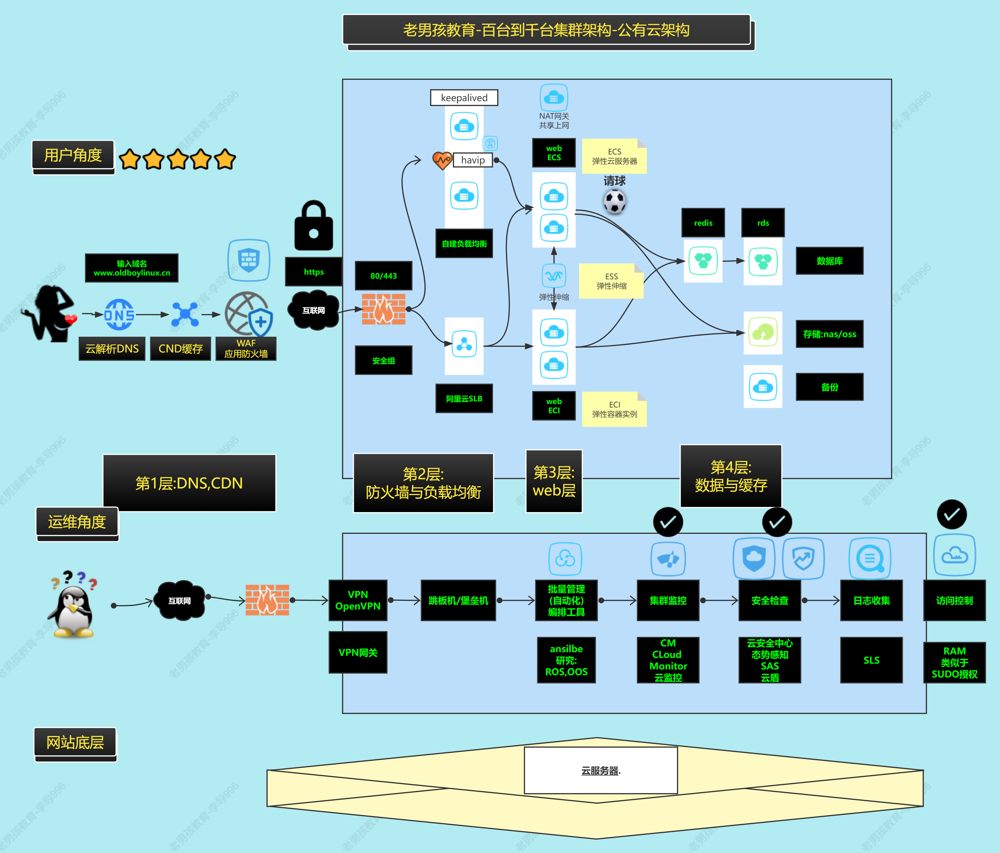
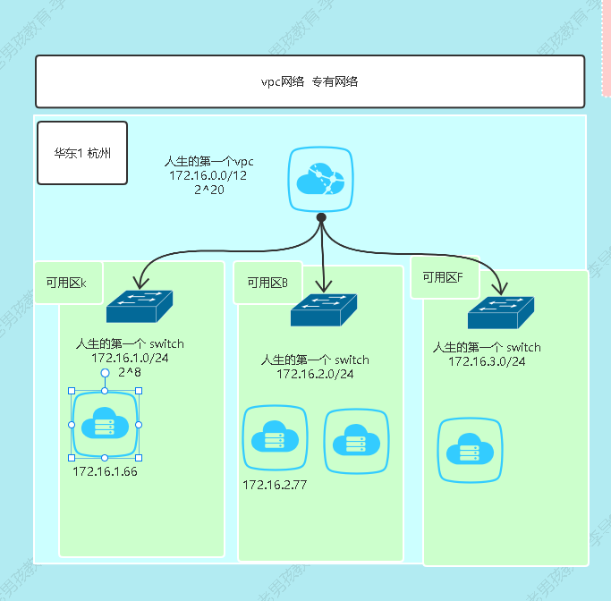
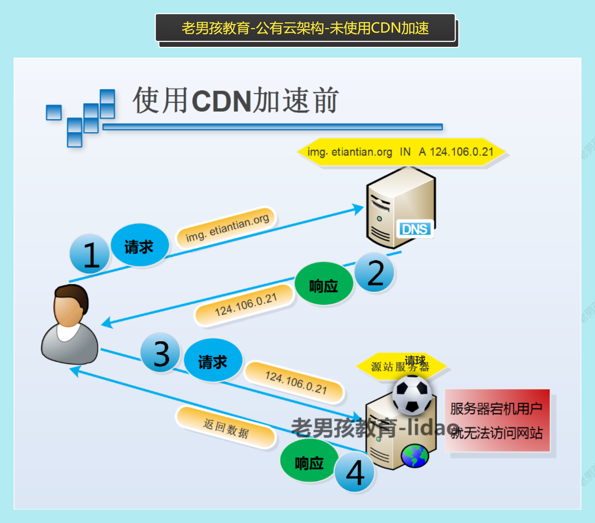
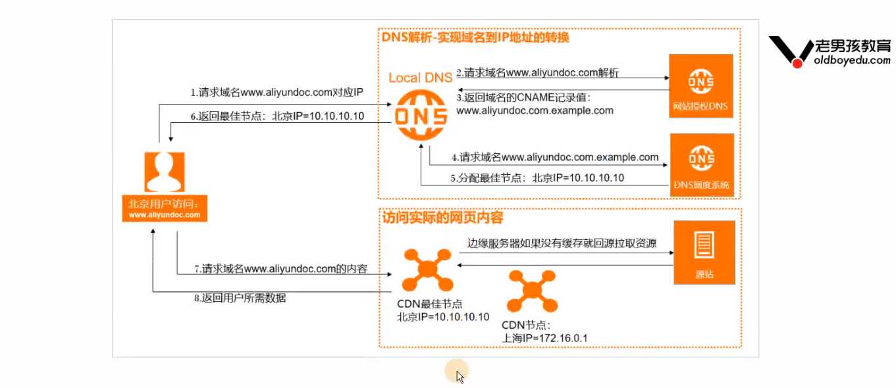
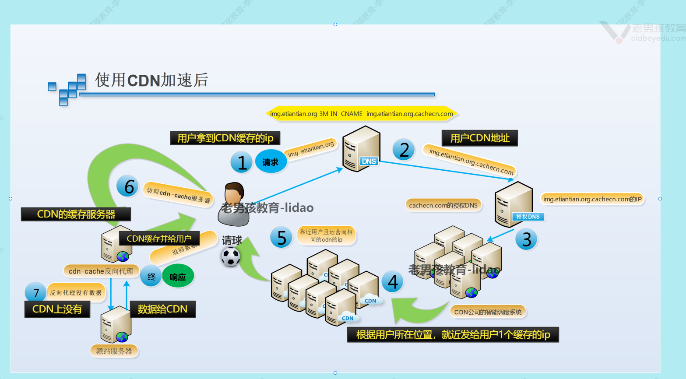

# Aliyun

## 阿里云架构概述

### 架构概述

## 安全组与vpc

### vpc

#### **概述**  

vpc 虚拟专有网络,虚拟局域网,自定义网段, vpc网络相当于一 个大的网段(局域网),还可以通过创建虚拟交换机划分子网. 

**配置建议** 

一个地区配置1个vpc 

这个地区的不同的可用区，每个可用区创建1个交换即可。 （创建vpc的时候最多只能创建3个交换机，多的部分可以后面添加） 

### 安全组 sg

#### 概述  

安全组： 防火墙，屏蔽或开启，端口和ip地址. 

实现iptables的filter表功能。 

阿里云安全组默认规则是:白名单,默认拒绝. 

## CDN

#### CDN概述

cdn 内容分发式网络：可以理解为分布式缓存

应用场景：加速用户访问，可以让用户就近访问。

如果不使用CDN,用户需要直接访问网站获取数据，如果用户与网
站不在同一地区可能访问慢。

使用CDN,用户访问网站的域名域名缓存服务的 

IP如果缓存上有数据直接给用户,如果没有CDN缓存会找源 站，要数据缓存数据发给用户。 

#### 专有名词

加速域名：加速域名是指接入CDN,用于加速源站的域名，也是您最终暴露给终端用户访问的域名。支持添加泛域名，如"*.example.com"

