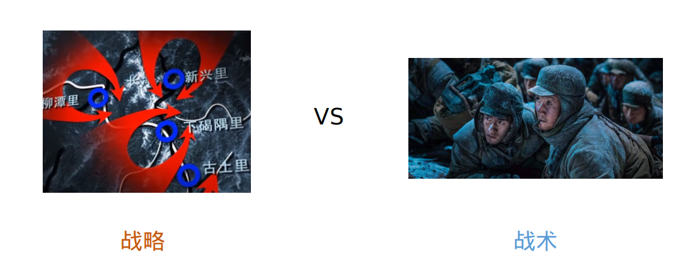
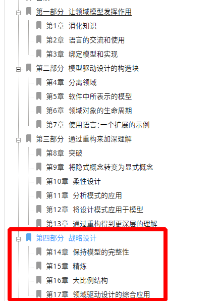
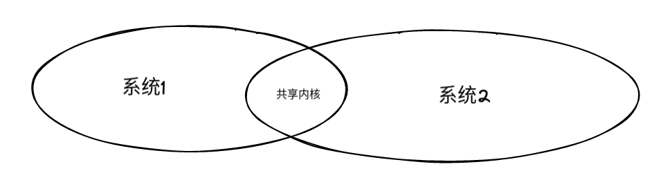
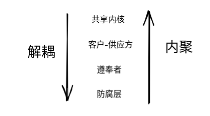

# 你真的需要防腐层吗？DDD 系统间的7种关系梳理与实践


> **简介：** 当提到系统间交互的时候，人们都会想到大名鼎鼎的防腐层，用来防止其他系统的模型变更对本系统造成影响。但是在实践这个模式的过程中，我们常常会遇到问题。此时我们也应该考虑下其他的系统交互方式。

当提到系统间交互的时候，人们都会想到大名鼎鼎的防腐层，即用一个 Adaptor 进行系统间模型的转换，用来防止其他系统的模型变更对本系统造成影响。但是在实践这个模式的过程中，我们是否常常遇到如下问题：


- 业务代码只有三行，模型转换代码却写了几十行
- 为了给前端增加一个返回值，需要给整条链路上的每个模型增加一个属性，可链路上还会涉及好几个系统，一不小心漏加，还会导致 bug
- 明明是类似的东西，在不同接口中却是不同的类，导致调用方没法统一处理。


这个时候，我们就应该仔细思考 “防腐层” 是否真的适合了。防腐层一词最早出现于 Evans 《领域驱动设计》，英文为 Anticorruption Layer，简称 ACL（下文中都会称之为 ACL），如果去翻阅原著，会发现 “防腐层" 只不过是 Evans 定义的九种系统间关系的一种，在设计系统间关系时，我们应该根据实际情况灵活选择，而不是生搬硬套 ACL 来处理所有的系统间关系。


## DDD 的战略模式与战术模式：ACL 属于哪种？

毛爷爷曾说“战略上藐视敌人，战术上重视敌人”，战略一般是指比较大的规划，而战术更加偏向具体执行，在长津湖战役中，彭德怀将美军分割成四个部分分别击破的规划，就是战略，电影中第七穿插连在新兴里击退美军的过程就是战术。



具体到软件工程中，战略是指高层视角的系统与人员规划，可能涉及多团队的合作关系，往往由架构师拍板决策；而战术一般是具体的类和方法的设计，开发者一般有更大的话语权。

在《领域驱动设计》中，前三部分主要讲战术设计，最后一部分专门讲战略设计。



ACL 这个词出现在 "战略设计" 部分。这可能违背大多数人的直觉，因为在日常工作中，我们常常不加思考地就引入一个 ACL，以为这就是一个简单的设计模式。其实两个系统间是否要引入 ACL，是架构师对于系统间关系深思熟虑的结果，并不是一个简单的代码层面的设计模式。

此处涉及到两个相关的 DDD 术语：“限界上下文”（Bounded Context）和“上下文映射图”（Context Map）。一个系统所管理的业务范围称之为“限界上下文”（Bounded Context），而且我们前文所说的 “系统间关系”，本质上就是两个 “限界上下文” 之间的关系，这种系统间关系在 DDD 中我们称之为 “上下文映射图”（Context Map），ACL 就是一种 “上下文映射图”。


## 7 种系统间关系

本节将根据耦合度从高到低逐一探讨这些关系。耦合度高有时并不是坏事，它能够让团队内部的系统更加内聚，而不是无法整合的碎块。我们应该根据具体情况进行选择。

因为系统间关系往往也是组织架构的反映，此处每种关系除了描述其相关的技术架构，本节也将描述其适用的组织架构。


### 共享内核（Shared Kernel）

系统间共享部分模型和相关逻辑，是最亲密的合作关系。



当负责这两个系统的团队存在非常紧密的合作关系（甚至就是同一个团队），并且业务上十分相似时，共享内核就是一个不错的选择。在职责上，即使共享内核有专门的 owner，其任何修改都需要经过多方探讨，因为其中的任何模型更改都会深刻地影响这几个系统。

最典型的就是业务系统以及业务相关的批量导入导出系统，两者虽然因为技术原因（隔离消耗资源的任务）被划分成了两个系统，但是它们的模型理论上应该完全共享的（即共享内核），这样才能保证业务上的修改及时反映到导入导出中。试想如果这种场景还用 ACL 做隔离的话，每次业务系统修改，还需要同步在导入导出模型中做修改，这将是非常麻烦的。

**以下是一个简单的Java示例，展示如何在两个系统之间共享内核：**

```java
// 共享的数据模型
public class UserModel {
    private int id;
    private String name;
    private int age;

    // getter和setter方法省略
}

// 共享的业务逻辑
public class UserService {
    public void createUser(UserModel user) {
        // 创建用户的逻辑
    }

    public void updateUser(UserModel user) {
        // 更新用户的逻辑
    }

    public void deleteUser(int userId) {
        // 删除用户的逻辑
    }

    // 其他业务方法省略
}

// 系统A使用共享内核
public class SystemA {
    private UserService userService; // 通过依赖注入引用共享的UserService

    public void doSomething() {
        UserModel user = new UserModel();
        user.setId(1);
        user.setName("Alice");
        user.setAge(20);

        userService.createUser(user);
    }
}

// 系统B使用共享内核
public class SystemB {
    private UserService userService; // 通过依赖注入引用共享的UserService

    public void doSomething() {
        UserModel user = new UserModel();
        user.setId(1);
        user.setName("Bob");
        user.setAge(30);

        userService.updateUser(user);
    }
}
```

在这个示例中，`UserModel`是共享的数据模型，`UserService`是共享的业务逻辑。`SystemA`和`SystemB`通过依赖注入的方式引用`UserService`，以便共享这些逻辑。当`SystemA`需要创建一个新用户时，它可以调用`userService.createUser()`方法，当`SystemB`需要更新一个用户时，它可以调用`userService.updateUser()`方法。由于两个系统共享同一个`UserService`实例，所以对用户的修改会在两个系统中保持一致。


### 客户-供应方（Customer-Supplier）

两个系统虽然相对独立发展，但是底层系统（Supplier, 供应方）愿意为上层系统（Customer, 客户）的需求负责，并且做对应的变更。这也是一种非常亲密的合作关系，只比共享内核弱一点。

因为两个系统在实现时会互相考虑对方，此时两者交互部分的模型会非常相似，**相比共享内核，它只共享一些模型，不共享逻辑代码**。

例如，智能办公的表单导出系统依赖表单搜索系统搜索需要导出的数据，表单搜索系统的维护者是同一个团队的开发者，他会接受导出相关的所有搜索需求，所以不需要在此基础上再进行任何封装，直接将表单搜索系统提供的 `QueryCondition` 模型作为导出任务模型的一个属性：

```java
public class ExportJob {
    // 来自搜索系统的模型
    private QueryCondition queryCondition;
    // 其他属性
    private Long id;
    //...省略
}
```

**以下是一个简单的Java示例，展示了客户系统如何依赖供应方系统提供的数据模型：**

```java
// Supplier系统提供的数据模型
public class QueryCondition {
    private String keyword;
    private Date startDate;
    private Date endDate;

    // getter和setter方法省略
}

// Customer系统的导出任务模型，依赖于Supplier提供的QueryCondition模型
public class ExportJob {
    private QueryCondition queryCondition; // 引用Supplier提供的QueryCondition

    private Long id;
    private String fileName;
    private Date startTime;
    private Date endTime;

    // getter和setter方法省略
}

// Customer系统中的导出任务服务，依赖Supplier提供的QueryCondition模型
public class ExportService {
    private ExportJobDao exportJobDao; // 数据库访问对象

    // Supplier提供的QueryCondition作为参数
    public void createExportJob(QueryCondition queryCondition) {
        ExportJob exportJob = new ExportJob();
        exportJob.setQueryCondition(queryCondition);
        // 设置其他属性

        exportJobDao.create(exportJob);
    }
}
```

在这个示例中，`QueryCondition`是供应方系统提供的数据模型，`ExportJob`是客户系统的导出任务模型，`ExportService`是客户系统的导出任务服务。客户系统依赖供应方系统提供的`QueryCondition`模型，将其作为`ExportJob`的一个属性，用于导出任务的筛选条件。在`ExportService`中，客户系统依赖供应方系统提供的`QueryCondition`模型，将其作为参数，创建一个新的导出任务。


### 遵奉者（Conformist）

两个系统完全独立发展，底层系统因为没有人力或者其他原因，不可能因为上层系统的需求做出任何变更。这与下文 ACL 适用的情况类似。

上层系统的模型设计与底层系统的模型严格地保持一致，虽然也是需要一个转换层转换，但是没有做任何“真正”的转换，最多只是简单的属性拷贝，这是和 ACL 的主要区别，ACL 会做更加复杂的转换。

例如，钉钉的外部 ISV（三方应用开发商）想要基于钉钉通讯录开发一款应用，因为这个三方应用所有功能都是基于钉钉通讯录，ISV 可以采取的最合适的方式就是定义一批和钉钉通讯录差不多的模型，这样才能最充分地利用通讯录已有功能，概念上的一致性也有助于和钉钉通讯录开发人员沟通。

**以下是一个简单的Java示例：**

```java
假设有一个上层系统需要与底层系统共享一个用户模型，但是底层系统无法做出任何变更，因此上层系统需要定义一个与底层系统的用户模型保持一致的模型。
// 底层系统的用户模型
public class User {
    private Long id;
    private String name;
    private String email;
    //...省略
}

// 上层系统的用户模型，与底层系统的用户模型保持一致
public class SharedUser {
    private Long id;
    private String name;
    private String email;
    //...省略
    
    public static SharedUser from(User user) {
        SharedUser sharedUser = new SharedUser();
        sharedUser.setId(user.getId());
        sharedUser.setName(user.getName());
        sharedUser.setEmail(user.getEmail());
        return sharedUser;
    }
    
    public User toUser() {
        User user = new User();
        user.setId(this.id);
        user.setName(this.name);
        user.setEmail(this.email);
        return user;
    }
}
```

上层系统可以使用 `SharedUser` 来表示用户，并且可以使用 `from` 方法将底层系统的 `User` 转换为 `SharedUser`，以及使用 `toUser` 方法将 `SharedUser` 转换为底层系统的 `User`。这样，上层系统就可以使用与底层系统保持一致的模型，并且可以通过转换方法与底层系统进行交互。

Conformist模式下的转换层可以被省略，因为上下游系统使用相同的模型，所以没有必要对模型进行真正的转换。相对而言，ACL模式下的转换层则需要进行更加复杂的转换，因为上下游系统使用的模型可能存在较大差异。


### 防腐层（ACL）

ACL 对应的组织架构与遵奉者类似。

ACL 适合两种情况：

- 同样的概念在两个系统中有不同的含义：“用户”概念在 IM 中就是消息发起接受方，但是在钉钉通讯录中却是指某个组织内的、含有职位，角色等信息的职员
- 模型相差巨大：比如 excel 表格和钉钉文档中的表格

ACL 是指复杂的数据转换层，在转换数据时需要做概念上的翻译。

以下是一个简单的 ACL 转换示例，假设有一个微信公众号和一个钉钉群，它们的用户模型相差巨大，需要使用 ACL 进行转换：

```java
微信公众号用户模型：
public class WechatUser {
    private String openId;
    private String nickname;
    private String avatarUrl;
    // 其他属性
}

钉钉群用户模型：
public class DingTalkUser {
    private String userId;
    private String name;
    private String avatar;
    // 其他属性
}

ACL 转换层：
public class UserTranslator {
    public DingTalkUser translateToDingTalkUser(WechatUser wechatUser) {
        DingTalkUser dingTalkUser = new DingTalkUser();
        dingTalkUser.setUserId(wechatUser.getOpenId());
        dingTalkUser.setName(wechatUser.getNickname());
        dingTalkUser.setAvatar(wechatUser.getAvatarUrl());
        // 其他属性转换
        return dingTalkUser;
    }

    public WechatUser translateToWechatUser(DingTalkUser dingTalkUser) {
        WechatUser wechatUser = new WechatUser();
        wechatUser.setOpenId(dingTalkUser.getUserId());
        wechatUser.setNickname(dingTalkUser.getName());
        wechatUser.setAvatarUrl(dingTalkUser.getAvatar());
        // 其他属性转换
        return wechatUser;
    }
}


微信公众号调用 ACL 转换层：
WechatUser wechatUser = new WechatUser();
wechatUser.setOpenId("123456");
wechatUser.setNickname("Alice");
wechatUser.setAvatarUrl("http://example.com/avatar.jpg");

UserTranslator translator = new UserTranslator();
DingTalkUser dingTalkUser = translator.translateToDingTalkUser(wechatUser);

// 使用转换后的 DingTalkUser 在钉钉群中进行相关操作
```


### 另谋它路（Separate Way）

“最好”的解耦方法就是完全另写一套代码。

这有点像 “拆中台” 的思路，研究了半天，发现依赖复杂的中台，还不如业务团队自己写一套简单的系统实现。

这已经不能算是系统间关系了，是 “完全没有关系” 的意思。


### 开放主机服务（Open Host Service）与发布语言（Published Language）

直接举例，底层服务开放一个 Http 接口（开放主机服务），允许以 json 的数据格式（发布语言）进行调用。

它们其实就是开放 RPC 调用。他们被单独列出来完全是因为 《领域驱动设计》这本书成书较早，互联网软件比较少，RPC 也没有特别规范的标准。在微服务时代，限界上下文的调用几乎都通过 RPC 进行，并且使用 Hsf, Dubbo 等 RPC 框架将发布语言封装在最底层。这也是我将本条放在最后一个的原因。

**开放 RPC 调用包括 HTTP 调用。HTTP 本身就是一种 RPC 协议，可以用于调用开放的主机服务。实际上，很多基于 HTTP 的框架和协议，比如 RESTful API，就是一种开放主机服务的实现方式。而 Hsf, Dubbo 等 RPC 框架也可以通过 HTTP 协议实现远程过程调用。因此，开放主机服务和发布语言的概念在 RPC 中仍然具有一定的重要性。**


## 总结

软件工程追求的终极目标就是 “高内聚，低耦合”，翻译成两个正面的指标就是内聚和解耦：

- 共享内核：内聚度最高，解耦最差
- ACL：内聚度最低，解耦最强



这张图恰恰反映了软件工程没有银弹的道理，通过梳理系统间关系，合理的控制系统的内聚与耦合程度，才是项目架构的难点所在。

ACL 被滥用的原因在于开发者将自己写的一小部分代码像“伊甸园”一样保护起来，这是比较简单的处理方式，但是**如果要梳理如何和现有业务与系统结合，却要付出大量精力。这就导致系统过度“解耦”，以至于同一个团队维护的业务系统却给调用方一种支离破碎的感觉**。

因此是否引入 ACL 要根据两个系统当前情况和未来规划决定，如果满足：

- 同一个团队维护
- 属于同一个业务
- 模型差别不大

其中的一到两条。此时可以考虑暂时不引入 ACL，而是采用共享内核，或者客户-供应商来处理系统间关系。

但是这条定律也只能作为参考，还是需要结合现实中对于内聚与解耦的需求决定，毕竟软件工程中唯一的定律就是没有定律。