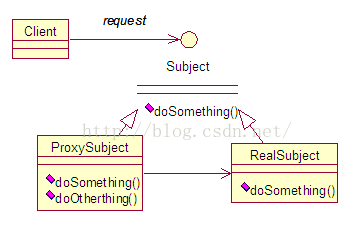
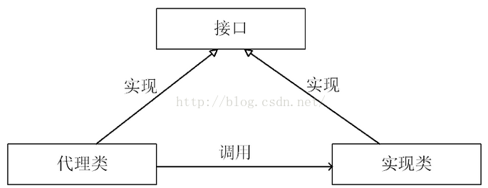
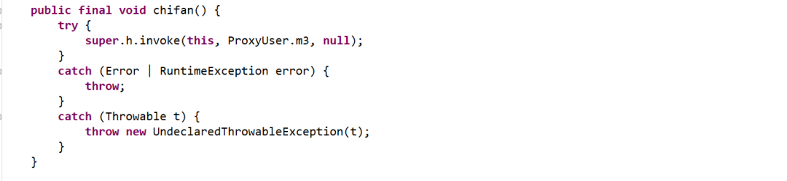
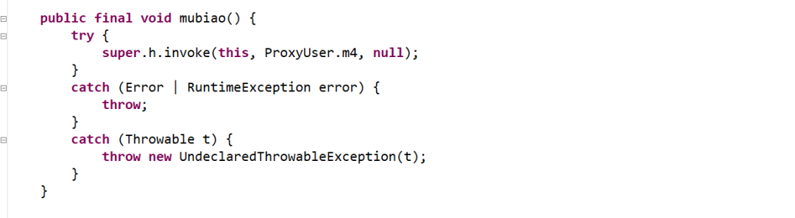
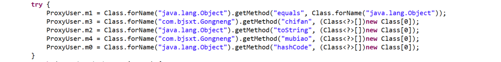

# JDK 动态代理


## 一、什么是代理？

代理是一种常用的设计模式，

代理是一种常用的设计模式，其目的就是为其他对象提供一个代理以控制对某个对象的访问。代理类负责为委托类预处理消息，过滤消息并转发消息，以及进行消息被委托类执行后的后续处理。

代理模式UML图：



简单结构示意图：




为了保持行为的一致性，代理类和委托类通常会实现相同的接口，所以在访问者看来两者没有丝毫的区别。通过代理类这中间一层，能有效控制对委托类对象的直接访问，也可以很好地隐藏和保护委托类对象，同时也为实施不同控制策略预留了空间，从而在设计上获得了更大的灵活性。Java 动态代理机制以巧妙的方式近乎完美地实践了代理模式的设计理念。


## 二、Java 动态代理类 

Java动态代理类位于java.lang.reflect包下，一般主要涉及到以下两个类：

(1)Interface InvocationHandler：该接口中仅定义了一个方法

```java
public object invoke(Object obj,Method method, Object[] args)
```

在实际使用时，第一个参数obj一般是指代理类，method是被代理的方法，args为该方法的参数数组。**这个抽象方法在代理类中动态实现。**

(2)Proxy：该类即为动态代理类，其中主要包含以下内容：

protected Proxy(InvocationHandler h)：构造函数，用于给内部的h赋值。

static Class getProxyClass (ClassLoaderloader, Class[] interfaces)：获得一个代理类，其中loader是类装载器，interfaces是真实类所拥有的全部接口的数组。

static Object newProxyInstance(ClassLoaderloader, Class[] interfaces, InvocationHandler h)：返回代理类的一个实例，返回后的代理类可以当作被代理类使用(可使用被代理类的在Subject接口中声明过的方法)


所谓DynamicProxy是这样一种class：它是在运行时生成的class，在生成它时你必须提供一组interface给它，然后该class就宣称它实现了这些 interface。你当然可以把该class的实例当作这些interface中的任何一个来用。当然，这个DynamicProxy其实就是一个Proxy，它不会替你作实质性的工作，在生成它的实例时你必须提供一个handler，由它接管实际的工作。

在使用动态代理类时，我们必须实现InvocationHandler接口


## **三、动态代理使用及原理**


### **动态代理步骤：**

1.创建一个实现接口Gongneng的类，它必须实现invoke方法
2.创建被代理的类以及接口
3.通过Proxy的静态方法
newProxyInstance(ClassLoaderloader, Class[] interfaces, InvocationHandler h)创建一个代理
4.通过代理调用方法


### **jdk动态代理的使用**


**1、需要动态代理的接口：**

```java

package com.bjsxt;

public interface Gongneng {
  void chifan();
  void mubiao();
}
```


**2、需要代理的实际对象**

```java

package com.bjsxt;

public class Laozong implements Gongneng{

  @Override
  public void chifan() {
    System.out.println("吃饭");
  }

  @Override
  public void mubiao() {
    System.out.println("目标");
  }
}
```


**3、InvocationHandler实现类**

```java

package com.bjsxt;

import java.lang.reflect.InvocationHandler;
import java.lang.reflect.Method;

public class Mishu implements InvocationHandler {
  //要代理的真实对象
  private Laozong laozong=new Laozong() ;
  /** 
     * 该方法负责集中处理动态代理类上的所有方法调用。
     * 调用处理器根据这三个参数进行预处理或分派到委托类实例上反射执行 
     * 
     * @param proxy  代理类实例 
     * @param method 被调用的方法对象 
     * @param args   调用参数 
     * @return 
     * @throws Throwable 
     */ 
  @Override
  public Object invoke(Object proxy, Method method, Object[] args) throws Throwable {
    System.out.println("预约时间");
    Object result = method.invoke(laozong, args);
    System.out.println("记录访客信息");
    return result;
  }
}
```


**4、测试**

```java

package com.bjsxt;

import java.lang.reflect.Proxy;

public class Women {
  public static void main(String[] args) {
    System.out.println(Women.class.getClassLoader()==Laozong.class.getClassLoader());
    Mishu mishu = new Mishu();
    //第一个参数:反射时使用的类加载器
    //第二个参数:Proxy需要实现什么接口
    //第三个参数:通过接口对象调用方法时,需要调用哪个类的invoke方法
    Gongneng gongneng = (Gongneng) Proxy.newProxyInstance(Women.class.getClassLoader(), new Class[]{Gongneng.class}, mishu);

    //Laozong laozong = (Laozong) gongneng;
    gongneng.chifan();
  }
}
```


**5、输出结果如下**

```java
true
预约时间
吃饭
记录访客信息
```


### 动态代理是如何实现的

**关键代码如下**

```java
Gongneng gongneng = (Gongneng) Proxy.newProxyInstance(Women.class.getClassLoader(), new Class[]{Gongneng.class}, mishu);
```

通过跟踪提示代码可以看出：当代理对象调用真实对象的方法时，其会自动的跳转到代理对象关联的handler对象的invoke方法来进行调用。

也就是说，当代码执行到：

**gongneng.chifan()**这句话时，会自动调用Mishu的invoke方法。这是为啥呢？

我们看看Proxy类的静态方法newProxyInstance的源码

```java

public static Object newProxyInstance(ClassLoader loader,
                                          Class<?>[] interfaces,
                                          InvocationHandler h)
        throws IllegalArgumentException
{
		//检查h 不为空，否则抛异常
        if (h == null) {
            throw new NullPointerException();
        }

        final Class<?>[] intfs = interfaces.clone();
        final SecurityManager sm = System.getSecurityManager();
        if (sm != null) {
            checkProxyAccess(Reflection.getCallerClass(), loader, intfs);
        }

        /*
         * 获得与指定类装载器和一组接口相关的代理类类型对象
         */
        Class<?> cl = getProxyClass0(loader, intfs);

        /*
         * Invoke its constructor with the designated invocation handler.
         */
        try {
            //获取代理对象的构造方法（也就是$Proxy0(InvocationHandler h)）  
            final Constructor<?> cons = cl.getConstructor(constructorParams);
            final InvocationHandler ih = h;
            if (sm != null && ProxyAccessHelper.needsNewInstanceCheck(cl)) {
                // create proxy instance with doPrivilege as the proxy class may
                // implement non-public interfaces that requires a special permission
                return AccessController.doPrivileged(new PrivilegedAction<Object>() {
                    public Object run() {
                        return newInstance(cons, ih);
                    }
                });
            } else {
             //生成代理类的实例并把InvocationHandlerImpl的实例传给它的构造方法
                return newInstance(cons, ih);
            }
        } catch (NoSuchMethodException e) {
            throw new InternalError(e.toString());
        }
    }
```

我们再进去getProxyClass0方法看一下：

```java
 /**
     * Generate a proxy class.  Must call the checkProxyAccess method
     * to perform permission checks before calling this.
     */
    private static Class<?> getProxyClass0(ClassLoader loader,
                                           Class<?>... interfaces) {
        if (interfaces.length > 65535) {
            throw new IllegalArgumentException("interface limit exceeded");
        }
 
        // If the proxy class defined by the given loader implementing
        // the given interfaces exists, this will simply return the cached copy;
        // otherwise, it will create the proxy class via the ProxyClassFactory
        return proxyClassCache.get(loader, interfaces);
    }
```

真相还是没有来到，继续，看一下 proxyClassCache

```java
/**
     * a cache of proxy classes
     */
    private static final WeakCache<ClassLoader, Class<?>[], Class<?>>
        proxyClassCache = new WeakCache<>(new KeyFactory(), new ProxyClassFactory());
```

奥，原来用了一下缓存啊

那么它对应的get方法啥样呢？

```java
 /**
     * Look-up the value through the cache. This always evaluates the
     * {@code subKeyFactory} function and optionally evaluates
     * {@code valueFactory} function if there is no entry in the cache for given
     * pair of (key, subKey) or the entry has already been cleared.
     *
     * @param key       possibly null key
     * @param parameter parameter used together with key to create sub-key and
     *                  value (should not be null)
     * @return the cached value (never null)
     * @throws NullPointerException if {@code parameter} passed in or
     *                              {@code sub-key} calculated by
     *                              {@code subKeyFactory} or {@code value}
     *                              calculated by {@code valueFactory} is null.
     */
    public V get(K key, P parameter) {
        Objects.requireNonNull(parameter);
 
        expungeStaleEntries();
 
        Object cacheKey = CacheKey.valueOf(key, refQueue);
 
        // lazily install the 2nd level valuesMap for the particular cacheKey
        ConcurrentMap<Object, Supplier<V>> valuesMap = map.get(cacheKey);
        if (valuesMap == null) {
			//putIfAbsent这个方法在key不存在的时候加入一个值,如果key存在就不放入
            ConcurrentMap<Object, Supplier<V>> oldValuesMap
                = map.putIfAbsent(cacheKey,
                                  valuesMap = new ConcurrentHashMap<>());
            if (oldValuesMap != null) {
                valuesMap = oldValuesMap;
            }
        }
 
        // create subKey and retrieve the possible Supplier<V> stored by that
        // subKey from valuesMap
        Object subKey = Objects.requireNonNull(subKeyFactory.apply(key, parameter));
        Supplier<V> supplier = valuesMap.get(subKey);
        Factory factory = null;
 
        while (true) {
            if (supplier != null) {
                // supplier might be a Factory or a CacheValue<V> instance
                V value = supplier.get();
                if (value != null) {
                    return value;
                }
            }
            // else no supplier in cache
            // or a supplier that returned null (could be a cleared CacheValue
            // or a Factory that wasn't successful in installing the CacheValue)
 
            // lazily construct a Factory
            if (factory == null) {
                factory = new Factory(key, parameter, subKey, valuesMap);
            }
 
            if (supplier == null) {				
                supplier = valuesMap.putIfAbsent(subKey, factory);
                if (supplier == null) {
                    // successfully installed Factory
                    supplier = factory;
                }
                // else retry with winning supplier
            } else {
                if (valuesMap.replace(subKey, supplier, factory)) {
                    // successfully replaced
                    // cleared CacheEntry / unsuccessful Factory
                    // with our Factory
                    supplier = factory;
                } else {
                    // retry with current supplier
                    supplier = valuesMap.get(subKey);
                }
            }
        }
    }
```

我们可以看到它调用了 supplier.get(); 获取动态代理类，其中supplier是Factory,这个类定义在WeakCach的内部。

来瞅瞅，get里面又做了什么？

```java
 public synchronized V get() { // serialize access
            // re-check
            Supplier<V> supplier = valuesMap.get(subKey);
            if (supplier != this) {
                // something changed while we were waiting:
                // might be that we were replaced by a CacheValue
                // or were removed because of failure ->
                // return null to signal WeakCache.get() to retry
                // the loop
                return null;
            }
            // else still us (supplier == this)
 
            // create new value
            V value = null;
            try {
                value = Objects.requireNonNull(valueFactory.apply(key, parameter));
            } finally {
                if (value == null) { // remove us on failure
                    valuesMap.remove(subKey, this);
                }
            }
            // the only path to reach here is with non-null value
            assert value != null;
 
            // wrap value with CacheValue (WeakReference)
            CacheValue<V> cacheValue = new CacheValue<>(value);
 
            // try replacing us with CacheValue (this should always succeed)
            if (valuesMap.replace(subKey, this, cacheValue)) {
                // put also in reverseMap
                reverseMap.put(cacheValue, Boolean.TRUE);
            } else {
                throw new AssertionError("Should not reach here");
            }
 
            // successfully replaced us with new CacheValue -> return the value
            // wrapped by it
            return value;
        }
    }
```

发现重点还是木有出现，但我们可以看到它调用了valueFactory.apply(key, parameter)方法：

```java
 /**
     * A factory function that generates, defines and returns the proxy class given
     * the ClassLoader and array of interfaces.
     */
    private static final class ProxyClassFactory
        implements BiFunction<ClassLoader, Class<?>[], Class<?>>
    {
        // prefix for all proxy class names
        private static final String proxyClassNamePrefix = "$Proxy";
 
        // next number to use for generation of unique proxy class names
        private static final AtomicLong nextUniqueNumber = new AtomicLong();
 
        @Override
        public Class<?> apply(ClassLoader loader, Class<?>[] interfaces) {
 
            Map<Class<?>, Boolean> interfaceSet = new IdentityHashMap<>(interfaces.length);
            for (Class<?> intf : interfaces) {
                /*
                 * Verify that the class loader resolves the name of this
                 * interface to the same Class object.
                 */
                Class<?> interfaceClass = null;
                try {
                    interfaceClass = Class.forName(intf.getName(), false, loader);
                } catch (ClassNotFoundException e) {
                }
                if (interfaceClass != intf) {
                    throw new IllegalArgumentException(
                        intf + " is not visible from class loader");
                }
                /*
                 * Verify that the Class object actually represents an
                 * interface.
                 */
                if (!interfaceClass.isInterface()) {
                    throw new IllegalArgumentException(
                        interfaceClass.getName() + " is not an interface");
                }
                /*
                 * Verify that this interface is not a duplicate.
                 */
                if (interfaceSet.put(interfaceClass, Boolean.TRUE) != null) {
                    throw new IllegalArgumentException(
                        "repeated interface: " + interfaceClass.getName());
                }
            }
 
            String proxyPkg = null;     // package to define proxy class in
            int accessFlags = Modifier.PUBLIC | Modifier.FINAL;
 
            /*
             * Record the package of a non-public proxy interface so that the
             * proxy class will be defined in the same package.  Verify that
             * all non-public proxy interfaces are in the same package.
             */
            for (Class<?> intf : interfaces) {
                int flags = intf.getModifiers();
                if (!Modifier.isPublic(flags)) {
                    accessFlags = Modifier.FINAL;
                    String name = intf.getName();
                    int n = name.lastIndexOf('.');
                    String pkg = ((n == -1) ? "" : name.substring(0, n + 1));
                    if (proxyPkg == null) {
                        proxyPkg = pkg;
                    } else if (!pkg.equals(proxyPkg)) {
                        throw new IllegalArgumentException(
                            "non-public interfaces from different packages");
                    }
                }
            }
 
            if (proxyPkg == null) {
                // if no non-public proxy interfaces, use com.sun.proxy package
                proxyPkg = ReflectUtil.PROXY_PACKAGE + ".";
            }
 
            /*
             * Choose a name for the proxy class to generate.
             */
            long num = nextUniqueNumber.getAndIncrement();
            String proxyName = proxyPkg + proxyClassNamePrefix + num;
 
            /*
             * Generate the specified proxy class.
             */
            byte[] proxyClassFile = ProxyGenerator.generateProxyClass(
                proxyName, interfaces, accessFlags);
            try {
                return defineClass0(loader, proxyName,
                                    proxyClassFile, 0, proxyClassFile.length);
            } catch (ClassFormatError e) {
                /*
                 * A ClassFormatError here means that (barring bugs in the
                 * proxy class generation code) there was some other
                 * invalid aspect of the arguments supplied to the proxy
                 * class creation (such as virtual machine limitations
                 * exceeded).
                 */
                throw new IllegalArgumentException(e.toString());
            }
        }
    }
```

通过看代码终于找到了重点：

```java
//生成字节码
byte[] proxyClassFile = ProxyGenerator.generateProxyClass(proxyName, interfaces, accessFlags);
```


那么接下来我们也使用测试一下，使用这个方法生成的字节码是个什么样子

```java

package com.bjsxt;
import java.io.FileNotFoundException;
import java.io.FileOutputStream;
import java.io.IOException;
import sun.misc.ProxyGenerator;

public class Test {
  public static void main(String[] args) throws Exception{

     Gongneng user = new Laozong();
     Class[] interfaces = user.getClass().getInterfaces();

      String name = "ProxyUser";
      byte[] proxyClassFile = ProxyGenerator.generateProxyClass(name , interfaces);
      FileOutputStream out =null;  
          try {  
              out = new FileOutputStream("d:/"+name+".class");  
              out.write(proxyClassFile);  
          } catch (FileNotFoundException e) {  
              e.printStackTrace();  
          } catch (IOException e) {  
              e.printStackTrace();  
          }finally {  
              if(null!=out) try {  
                  out.close();  
              } catch (IOException e) {  
                  e.printStackTrace();  
              }  
          }   
  }

}
```

我们在d盘可以找到ProxyUser.class，用反编译工具打开可以看到

```java

import com.bjsxt.*;
import java.lang.reflect.*;

public final class ProxyUser extends Proxy implements Gongneng
{
    private static Method m1;
    private static Method m3;
    private static Method m2;
    private static Method m4;
    private static Method m0;

    public ProxyUser(final InvocationHandler invocationHandler) {
        super(invocationHandler);
    }

    public final boolean equals(final Object o) {
        try {
            return (boolean)super.h.invoke(this, ProxyUser.m1, new Object[] { o });
        }
        catch (Error | RuntimeException error) {
            throw;
        }
        catch (Throwable t) {
            throw new UndeclaredThrowableException(t);
        }
    }

    public final void chifan() {
        try {
            super.h.invoke(this, ProxyUser.m3, null);
        }
        catch (Error | RuntimeException error) {
            throw;
        }
        catch (Throwable t) {
            throw new UndeclaredThrowableException(t);
        }
    }

    public final String toString() {
        try {
            return (String)super.h.invoke(this, ProxyUser.m2, null);
        }
        catch (Error | RuntimeException error) {
            throw;
        }
        catch (Throwable t) {
            throw new UndeclaredThrowableException(t);
        }
    }

    public final void mubiao() {
        try {
            super.h.invoke(this, ProxyUser.m4, null);
        }
        catch (Error | RuntimeException error) {
            throw;
        }
        catch (Throwable t) {
            throw new UndeclaredThrowableException(t);
        }
    }

    public final int hashCode() {
        try {
            return (int)super.h.invoke(this, ProxyUser.m0, null);
        }
        catch (Error | RuntimeException error) {
            throw;
        }
        catch (Throwable t) {
            throw new UndeclaredThrowableException(t);
        }
    }

    static {
        try {
            ProxyUser.m1 = Class.forName("java.lang.Object").getMethod("equals", Class.forName("java.lang.Object"));
            ProxyUser.m3 = Class.forName("com.bjsxt.Gongneng").getMethod("chifan", (Class<?>[])new Class[0]);
            ProxyUser.m2 = Class.forName("java.lang.Object").getMethod("toString", (Class<?>[])new Class[0]);
            ProxyUser.m4 = Class.forName("com.bjsxt.Gongneng").getMethod("mubiao", (Class<?>[])new Class[0]);
            ProxyUser.m0 = Class.forName("java.lang.Object").getMethod("hashCode", (Class<?>[])new Class[0]);
        }
        catch (NoSuchMethodException ex) {
            throw new NoSuchMethodError(ex.getMessage());
        }
        catch (ClassNotFoundException ex2) {
            throw new NoClassDefFoundError(ex2.getMessage());
        }
    }
}
```

这就是最终真正的代理类，它继承自Proxy并实现了我们定义的Gongneng接口

也就是说：

```java
Gongneng gongneng = (Gongneng) Proxy.newProxyInstance(Women.class.getClassLoader(), new Class[]{Gongneng.class}, mishu);
```

**这里的gongneng实际是这个类的一个实例，那么我们调用它的：**

```java
gongneng.chifan();
```

**就是调用我们定义的Mishu的 invoke方法：**







**所以呢，真正的代理是JDK动态生成的它继承自Proxy并实现了我们定义的Gongneng接口，在实现Gongneng接口方法的内部，通过反射调用了Mishu的invoke方法。**

