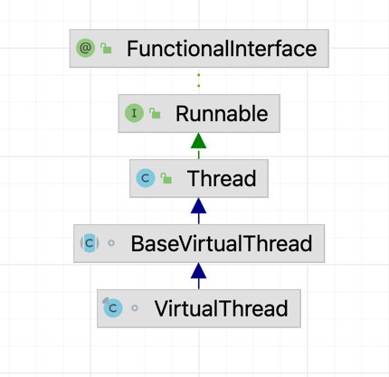
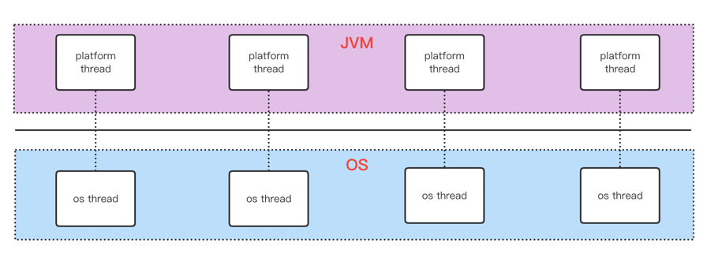
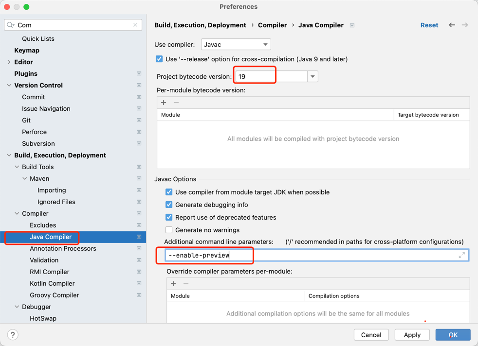
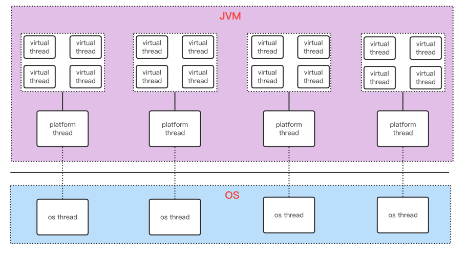

# Java终于发布了"协程"--虚拟线程

今天分享的内容是 Java 的一个重量级功能：虚拟线程。


## 背景

2022-09-20，JDK 19 发布了GA版本，备受瞩目的协程功能也算尘埃落地，不过，此次 GA版本并不是以协程来命名，而是使用了 Virtual
Thread（虚拟线程），并且是 preview预览版本。小编最早关注到协程功能是在 2020年，那时孵化项目叫做 Java project Loom，

使用的是 Fiber（直译为：纤维，意译为：轻量级线程，即协程），但是 GA版本为何最终被定义为 Virtual Thread（虚拟线程），原因不得而知。

>GA: General Availability，正式发布的版本，在国外都是用 GA来指代 release版本；
>
>JEP: JDK Enhancement Proposal, JDK增强建议，JEP是一个JDK核心技术相关的增强建议文档；


## 为什么需要虚拟线程

既然 Java官方推出一个和线程这么相近的概念，必定是要解决线程的某些问题，因此，我们先回顾下线程的一些特点：

- Java中的线程是对操作系统线程的一个简单包装，线程的创建，调度和销毁等都是由操作系统完成；
- 线程切换需要消耗CPU时间，这部分时间是与业务无关的；
- 线程的性能直接受操作系统处理能力的影响；

因此，线程是一种重量级的资源，作为一名 Java程序员应该深有体会。所以，为了更好的管理线程，Java采用了池化（线程池）的方式进行管理线程，避免线程频繁创建和销毁带来的开销。但是，尽管线程池避免线程大部分创建和销毁的开销，但是线程的调度还是直接受操作系统的影响，那么有没有更好的方式来打破这种限制，因此，虚拟线程就孕育而生。

在 JDK 19源码中，官方直接在 java.lang包下新增一个 VirtualThread类来表示虚拟线程，为了更好的区分虚拟线程和原有的 Thread线程，官方给 Thread类赋予了一个高大上的名字：平台线程。

下面给出了 JDK 19中虚拟线程的 Diagram截图以及平台线程和系统线程的关系图：





>想了解更多关系线程的知识，可以参考往期的文章：[深度剖析：Java线程运行机制，程序员必看的知识点！](https://translate.google.com/website?sl=zh-CN&tl=zh-TW&hl=zh-TW&prev=search&u=https://mp.weixin.qq.com/s?__biz%3DMzIwNDAyOTI2Nw%3D%3D%26mid%3D2247484253%26idx%3D1%26sn%3D4df8111a0d3c8b1c7d9c2d64cc3aac9b%26chksm%3D96c72f61a1b0a67749c5f2c1377f24294e61e8791d363db206a91f7887f0e8bc899388a89e86%26token%3D334208502%26lang%3Dzh_CN%23rd)


## 如何创建虚拟线程                                                                                     

### 1.通过 Thread.startVirtualThread()创建

如下示例代码，通过 Thread.startVirtualThread()可以创建一个新的并且已启动的虚拟线程，该方法等价于 Thread.ofVirtual().start(task)：

```
public class VirtualThreadTest {

  public static void main(String[] args) {
    CustomThread customThread = new CustomThread();
    // 创建并且启动虚拟线程
    Thread.startVirtualThread(customThread);
  }
}

class CustomThread implements Runnable {
  @Override
  public void run() {
    System.out.println("CustomThread run");
  }
}
```

### 2.通过 Thread.ofVirtual()创建

如下示例代码，通过 Thread.ofVirtual().unstarted()方式可以创建一个新的未启动的虚拟线程，然后通过 Thread.start()来启动线程，也可以通过 Thread.ofVirtual().start()直接创建一个新的并已启动的虚拟线程：

```
public class VirtualThreadTest {

  public static void main(String[] args) {
    CustomThread customThread = new CustomThread();
    // 创建并且不启动虚拟线程，然后 unStarted.start()方法启动虚拟线程
    Thread unStarted = Thread.ofVirtual().unstarted(customThread);
    unStarted.start();

    // 等同于
    Thread.ofVirtual().start(customThread);
  }
}

class CustomThread implements Runnable {
  @Override
  public void run() {
    System.out.println("CustomThread run");
  }
}
```

### 3.通过 ThreadFactory创建

如下示例代码，通过 ThreadFactory.newThread()方式就能创建一个虚拟线程，然后通过 Thread.start()来启动线程：

```
public class VirtualThreadTest {

  public static void main(String[] args) {
    CustomThread customThread = new CustomThread();
    // 获取线程工厂类
    ThreadFactory factory = Thread.ofVirtual().factory();
    // 创建虚拟线程
    Thread thread = factory.newThread(customThread);
    // 启动线程
    thread.start();
  }
}

class CustomThread implements Runnable {
  @Override
  public void run() {
    System.out.println("CustomThread run");
  }
}
```

### 4.通过 Executors.newVirtualThreadPerTaskExecutor()创建

如下示例代码，通过 JDK自带的Executors工具类方式创建一个虚拟线程，然后通过 executor.submit()来启动线程：

```
public class VirtualThreadTest {

  public static void main(String[] args) {
    CustomThread customThread = new CustomThread();
    ExecutorService executor = Executors.newVirtualThreadPerTaskExecutor();
    executor.submit(customThread);
  }
}

class CustomThread implements Runnable {
  @Override
  public void run() {
    System.out.println("CustomThread run");
  }
}
```

通过上述列举的 4种创建虚拟线程的方式可以看出，官方为了降低虚拟线程的门槛，尽力复用原有的Thread线程类，这样可以平滑的过渡到虚拟线程的使用。不过，在
Java 19中，虚拟线程还是一个预览功能，默认关闭，需要使用参数 –enable-preview 来启用该功能，预览功能源码和启动虚拟线程指令如下：

```java
// Thread 源码，通过 @PreviewFeature 注解来标注 虚拟线程为 预览功能
public class Thread implements Runnable {
  /**
   * Creates a virtual thread to execute a task and schedules it to execute.
   This method is equivalent to: Thread.ofVirtual().start(task);
   Params: task – the object to run when the thread executes
   Returns: a new, and started, virtual thread
   Throws: UnsupportedOperationException – if preview features are not enabled
   Since: 19
   See Also: Inheritance when creating threads
   * @param task
   * @return
   */
  @PreviewFeature(feature = PreviewFeature.Feature.VIRTUAL_THREADS)
  public static Thread startVirtualThread(Runnable task) {
    Objects.requireNonNull(task);
    // 判断是否开启虚拟线程功能
    PreviewFeatures.ensureEnabled();
    var thread = ThreadBuilders.newVirtualThread(null, null, 0, task);
    thread.start();
    return thread;
  }

  // 异常信息提醒 可以通过 --enable-preview 开启虚拟线程功能
  public static void ensureEnabled() {
    if (!isEnabled()) {
      throw new UnsupportedOperationException(
        "Preview Features not enabled, need to run with --enable-preview");
    }
  }
}
```


```
# 开启虚拟线程功能
java --source 19 --enable-preview XXX.java
```

IDEA 中配置 –enable-preview 如下图：



为了更好的感受虚拟线程的性能，我们模拟一个对比测试用例：分别使用虚拟线程和线程池执行10w个任务，每个线程任务睡眠10ms，统计各自的总耗时和创建的最大平台线程总数，示例代码如下：

```
// 虚拟线程
public class VirtualThreadTest {
  static List<Integer> list = new ArrayList<>();

  public static void main(String[] args) {
    // 开启一个线程来监控当前的平台线程（系统线程）总数
    ScheduledExecutorService scheduledExecutorService = Executors.newScheduledThreadPool(1);
    scheduledExecutorService.scheduleAtFixedRate(() -> {
      ThreadMXBean threadBean = ManagementFactory.getThreadMXBean();
      ThreadInfo[] threadInfo = threadBean.dumpAllThreads(false, false);
      saveMaxThreadNum(threadInfo.length);
    }, 10, 10, TimeUnit.MILLISECONDS);

    long start = System.currentTimeMillis();
    ExecutorService executor = Executors.newVirtualThreadPerTaskExecutor();
    for (int i = 0; i < 10000; i++) {
      executor.submit(() -> {
        // 线程睡眠 10ms，可以等同于模拟业务耗时10ms
        try {
          TimeUnit.MILLISECONDS.sleep(10);
        } catch (InterruptedException e) {

        }
      });
    }
    executor.close();
    System.out.println("max：" + list.get(0) + " platform thread/os thread");
    System.out.printf("totalMillis：%dms\n", System.currentTimeMillis() - start);
  }
}

public class ThreadTest {
    static List<Integer> list = new ArrayList<>();
    public static void main(String[] args) {
      // 开启一个线程来监控当前的平台线程（系统线程）总数
        ScheduledExecutorService scheduledExecutorService = Executors.newScheduledThreadPool(1);
        scheduledExecutorService.scheduleAtFixedRate(() -> {
            ThreadMXBean threadBean = ManagementFactory.getThreadMXBean();
            ThreadInfo[] threadInfo = threadBean.dumpAllThreads(false, false);
            saveMaxThreadNum(threadInfo.length);
        }, 1, 1, TimeUnit.SECONDS);

        long start = System.currentTimeMillis();
        ExecutorService executor = Executors.newFixedThreadPool(200);
        for (int i = 0; i < 100000; i++) {
            executor.submit(() -> {
                try {
                    // 线程睡眠 10ms，可以等同于模拟业务耗时10ms
                    TimeUnit.MILLISECONDS.sleep(10);
                } catch (InterruptedException e) {

                }
            });
        }
        executor.close();
        System.out.println("max：" + list.get(0) + " platform thread/os thread");
        System.out.printf("totalMillis：%dms\n", System.currentTimeMillis() - start);
    }
}

// 保存平台线程的创建的最大总数
public static List<Integer> saveMaxThreadNum(int num) {
    if (list.isEmpty()) {
      list.add(num);
    } else {
      Integer integer = list.get(0);
      if (num > integer) {
        list.add(0, num);
      }
    }
    return list;
  }
```

两个示例的运行结果：


通过运行结果可以发现：

- 使用虚拟线程执行 10w个任务总耗时为：129ms，最大创建了 18个平台线程；
- 使用线程池执行 10w个任务总耗时为：6103 ms，最大创建了 207个平台线程；
- 两者总耗时差50倍，最大创建的平台线程总数差 10倍，因此性能差可想而知；


## 核心源码解析

首先从 VirtualThread类开始，源码如下：

```java
/**
 * A thread that is scheduled by the Java virtual machine rather than the operating system.
 */
final class VirtualThread extends BaseVirtualThread {

  /**
   * Creates a new {@code VirtualThread} to run the given task with the given
   * scheduler. If the given scheduler is {@code null} and the current thread
   * is a platform thread then the newly created virtual thread will use the
   * default scheduler. If given scheduler is {@code null} and the current
   * thread is a virtual thread then the current thread's scheduler is used.
   *
   * @param scheduler the scheduler or null
   * @param name thread name
   * @param characteristics characteristics
   * @param task the task to execute
   */
  VirtualThread(Executor scheduler, String name, int characteristics, Runnable task) {
    super(name, characteristics, /*bound*/ false);
    Objects.requireNonNull(task);

    // choose scheduler if not specified
    if (scheduler == null) {
      Thread parent = Thread.currentThread();
      if (parent instanceof VirtualThread vparent) {
        scheduler = vparent.scheduler;
      } else {
        scheduler = DEFAULT_SCHEDULER;
      }
    }

    this.scheduler = scheduler;
    this.cont = new VThreadContinuation(this, task);
    this.runContinuation = this::runContinuation;
  }

  /**
   * 创建默认的调度器
   * Creates the default scheduler.
   */
  @SuppressWarnings("removal")
  private static ForkJoinPool createDefaultScheduler() {
    ForkJoinWorkerThreadFactory factory = pool -> {
      PrivilegedAction<ForkJoinWorkerThread> pa = () -> new CarrierThread(pool);
      return AccessController.doPrivileged(pa);
    };
    PrivilegedAction<ForkJoinPool> pa = () -> {
      int parallelism, maxPoolSize, minRunnable;
      String parallelismValue = System.getProperty("jdk.virtualThreadScheduler.parallelism");
      String maxPoolSizeValue = System.getProperty("jdk.virtualThreadScheduler.maxPoolSize");
      String minRunnableValue = System.getProperty("jdk.virtualThreadScheduler.minRunnable");
      if (parallelismValue != null) {
        parallelism = Integer.parseInt(parallelismValue);
      } else {
        parallelism = Runtime.getRuntime().availableProcessors();
      }
      if (maxPoolSizeValue != null) {
        maxPoolSize = Integer.parseInt(maxPoolSizeValue);
        parallelism = Integer.min(parallelism, maxPoolSize);
      } else {
        maxPoolSize = Integer.max(parallelism, 256);
      }
      if (minRunnableValue != null) {
        minRunnable = Integer.parseInt(minRunnableValue);
      } else {
        minRunnable = Integer.max(parallelism / 2, 1);
      }
      Thread.UncaughtExceptionHandler handler = (t, e) -> { };
      boolean asyncMode = true; // FIFO
      return new ForkJoinPool(parallelism, factory, handler, asyncMode,
        0, maxPoolSize, minRunnable, pool -> true, 30, SECONDS);
    };
    return AccessController.doPrivileged(pa);
  }
}
```

通过 VirtualThread类的源码可以总结出：

- VirtualThread继承 BaseVirtualThread类，BaseVirtualThread类继承 Thread类；
- 虚拟线程是 JVM进行调度的，而不是操作系统；
- VirtualThread类是一个终态类，因此该类无法被继承，无法被扩展；

VirtualThread类，只提供了一个构造器，接收 4个参数：

- Executor scheduler：如果给定的调度器为空并且当前线程是平台线程，那么新创建的虚拟线程将使用默认调度程序（底层采用 ForkJoinPool），如果给定的调度器为空并且当前线程是虚拟线程，则使用当前线程的调度程序
- String name：自定义线程名
- int characteristics：线程特征值
- Runnable task：需要执行的任务

然后我们看下 JDK中创建虚拟线程的源码：

```java
public class Thread implements Runnable {
  /**
   * Creates a virtual thread to execute a task and schedules it to execute.
   This method is equivalent to: Thread.ofVirtual().start(task);
   Params: task – the object to run when the thread executes
   Returns: a new, and started, virtual thread
   Throws: UnsupportedOperationException – if preview features are not enabled
   Since: 19
   See Also: Inheritance when creating threads
   * @param task
   * @return
   */
  @PreviewFeature(feature = PreviewFeature.Feature.VIRTUAL_THREADS)
  public static Thread startVirtualThread(Runnable task) {
    Objects.requireNonNull(task);
    // 判断是否开启虚拟线程功能
    PreviewFeatures.ensureEnabled();
    var thread = ThreadBuilders.newVirtualThread(null, null, 0, task);
    thread.start();
    return thread;
  }

  // 异常信息提醒 可以通过 --enable-preview 开启虚拟线程功能
  public static void ensureEnabled() {
    if (!isEnabled()) {
      throw new UnsupportedOperationException(
        "Preview Features not enabled, need to run with --enable-preview");
    }
  }
}

class ThreadBuilders {
    static Thread newVirtualThread(Executor scheduler,
                                   String name,
                                   int characteristics,
                                   Runnable task) {
        if (ContinuationSupport.isSupported()) {
            return new VirtualThread(scheduler, name, characteristics, task);
        } else {
            if (scheduler != null)
                throw new UnsupportedOperationException();
            return new BoundVirtualThread(name, characteristics, task);
        }
    }

  /**
   * Returns a builder for creating a virtual {@code Thread} or {@code ThreadFactory}
   * that creates virtual threads.
   *
   * @apiNote The following are examples using the builder:
   * {@snippet :
   *   // Start a virtual thread to run a task.
   *   Thread thread = Thread.ofVirtual().start(runnable);
   *
   *   // A ThreadFactory that creates virtual threads
   *   ThreadFactory factory = Thread.ofVirtual().factory();
   * }
   *
   * @return A builder for creating {@code Thread} or {@code ThreadFactory} objects.
   * @throws UnsupportedOperationException if preview features are not enabled
   * @since 19
   */
  @PreviewFeature(feature = PreviewFeature.Feature.VIRTUAL_THREADS)
  public static Builder.OfVirtual ofVirtual() {
    PreviewFeatures.ensureEnabled();
    return new ThreadBuilders.VirtualThreadBuilder();
  }
}
```

Thread.startVirtualThread()创建虚拟线程，会调用ThreadBuilders.newVirtualThread()，最终调用 new VirtualThread()构造器来创建虚拟线程。

从上文我们在介绍虚拟线程创建的 4种方式也可以看出，虚拟线程创建的入口在 Thread 或者 Executors 类中，和以前使用线程或者线程池的习惯保持一致。

```java
final class VirtualThread extends BaseVirtualThread {
    /**
     * Mounts this virtual thread onto the current platform thread. On
     * return, the current thread is the virtual thread.
     */
    @ChangesCurrentThread
    private void mount() {
        // sets the carrier thread
        Thread carrier = Thread.currentCarrierThread();
        setCarrierThread(carrier);

        // sync up carrier thread interrupt status if needed
        if (interrupted) {
            carrier.setInterrupt();
        } else if (carrier.isInterrupted()) {
            synchronized (interruptLock) {
                // need to recheck interrupt status
                if (!interrupted) {
                    carrier.clearInterrupt();
                }
            }
        }

        // set Thread.currentThread() to return this virtual thread
        carrier.setCurrentThread(this);
    }


  /**
   * Unmounts this virtual thread from the carrier. On return, the
   * current thread is the current platform thread.
   */
  @ChangesCurrentThread
  private void unmount() {
    // set Thread.currentThread() to return the platform thread
    Thread carrier = this.carrierThread;
    carrier.setCurrentThread(carrier);

    // break connection to carrier thread, synchronized with interrupt
    synchronized (interruptLock) {
      setCarrierThread(null);
    }
    carrier.clearInterrupt();
  }
}
```

mount() 和 unmount() 是虚拟线程两个核心方法：

- mount()，可以将此虚拟线程挂载到当前平台线程上，返回时，当前线程是虚拟线程；
- unmount()，从载体线程卸载此虚拟线程，返回时，当前线程是平台线程

通过这两个方式可以看出虚拟线程是搭载在平台线程上运行，运行结束后，从平台线程上卸载。


## 虚拟线程的状态和转换

下表总结了虚拟线程中的所有线程状态以及状态之间转化的条件：

| 状态                  | 转换条件                                |
| --------------------- | --------------------------------------- |
| NEW -> STARTED        | Thread.start                            |
| STARTED -> TERMINATED | failed to start                         |
| STARTED -> RUNNING    | first run                               |
| RUNNING -> PARKING    | Thread attempts to park                 |
| PARKING -> PARKED     | cont.yield successful, thread is parked |
| PARKING -> PINNED     | cont.yield failed, thread is pinned     |
| PARKED -> RUNNABLE    | unpark or interrupted                   |
| PINNED -> RUNNABLE    | unpark or interrupted                   |
| RUNNABLE -> RUNNING   | continue execution                      |
| RUNNING -> YIELDING   | Thread.yield                            |
| YIELDING -> RUNNABLE  | yield successful                        |
| YIELDING -> RUNNING   | yield failed                            |
| RUNNING -> TERMINATED | done                                    |


## 3种线程的关系

VirtualThread，Platform Thread，OS Thread 三者的关系如下图：



**说明：**
在现有的线程模型下，一个 Java线程相当于一个操作系统线程，多个虚拟线程需要挂载在一个平台线程（载体线程）上，每个平台线程和系统线程一一对应。因此，VirtualThread是属于 JVM级别的线程，由JVM调度，它是非常轻量级的资源，使用完后立即被销毁，因此就不需要像平台线程一样使用池化（线程池）。
虚拟线程在执行到 IO 操作或 Blocking操作时，会自动切换到其他虚拟线程执行，从而避免当前线程等待，可以高效通过少数线程去调度大量虚拟线程，最大化提升线程的执行效率。


## 总结

- Virtual Thread将会在性能上带来的巨大提高，不过，目前业界80~90%的代码还跑在 Java 8上，等 JDK
  19投入实际生产环境，可能需要一个漫长的过程；
- 虚拟线程高度复用了现有的 Thread线程的功能，方便现有方式平滑迁移到虚拟线程；
- 虚拟线程是将 Thread作为载体线程，它并没有改变原来的线程模型；
- 虚拟线程是 JVM调度的，而不是操作系统调度；
- 使用虚拟线程可以显著提高程序吞吐量；
- 虚拟线程适合 并发任务数量很高 或者 IO密集型的场景，对于 计算密集型任务还需通过过增加CPU核心解决，或者利用分布式计算资源来来解决；
- 虚拟线程目前只是一个预览功能，只能从源码和简单的测试来分析，并无真实生产环境的验证；

曾一段时间内，JDK一直致力于 Reactor响应式编程，试图从这条路子来提升 Java的性能，但是最终发现：响应式编程难理解，难调试，难使用，
因此又把焦点转向了同步编程，为了改善性能，虚拟线程诞生了。或许虚拟线程很难在短时间内运用到实际生产中，但是通过官方的JDK版本发布，我们可以看到：尽管是 Oracle这样的科技型巨头也会走弯路，了解 JDK的动态，可以帮助我们更好的把握学习 Java的重心以及后面的发展趋势。


## 参考

[Virtual Thread JEP](https://translate.google.com/website?sl=zh-CN&tl=zh-TW&hl=zh-TW&prev=search&u=https://openjdk.org/jeps/425)

[java-virtual-threads](https://translate.google.com/website?sl=zh-CN&tl=zh-TW&hl=zh-TW&prev=search&u=https://www.infoq.com/articles/java-virtual-threads/)