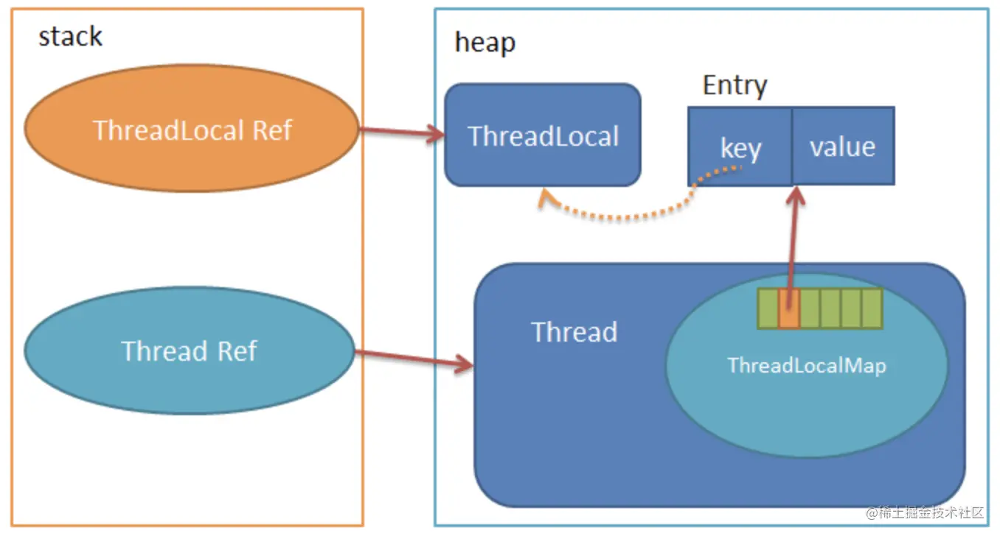

# ThreadLocal

## ThreadLocal的作用

ThreadLocal的作用是提供线程内的局部变量，说白了，就是在各线程内部创建一个变量的副本，相比于使用各种锁机制访问变量，ThreadLocal的思想就是用空间换时间，使各线程都能访问属于自己这一份的变量副本，变量值不互相干扰，减少同一个线程内的多个函数或者组件之间一些公共变量传递的复杂度。


## ThreadLocal源码



我们可以看出每个Thread维护一个**ThreadLocalMap**，存储在ThreadLocalMap内的就是一个以Entry为元素的table数组，Entry就是一个key-value结构，key为ThreadLocal，value为存储的值。类比HashMap的实现，其实就是每个线程借助于一个哈希表，存储线程独立的值。我们可以看看Entry的定义：

```java
static class Entry extends WeakReference<ThreadLocal<?>> {
    /** The value associated with this ThreadLocal. */
    Object value;

    Entry(ThreadLocal<?> k, Object v) {
        super(k);
        value = v;
    }
}
```

这里ThreadLocal和key之间的线是虚线，因为Entry是继承了WeakReference实现的，当ThreadLocal Ref销毁时，指向堆中ThreadLocal实例的唯一一条强引用消失了，只有Entry有一条指向ThreadLocal实例的弱引用，假设你知道弱引用的特性，**那么这里ThreadLocal实例是可以被GC掉的**。**这时Entry里的key为null了，那么直到线程结束前，Entry中的value都是无法回收的，这里可能产生内存泄露，后面会说如何解决**。


### get方法

```java
public T get() {
    // 返回当前 ThreadLocal 所在的线程
    Thread t = Thread.currentThread();
    // 从线程中拿到 ThreadLocalMap
    ThreadLocalMap map = getMap(t);
    if (map != null) {
        // 从 map 中拿到 entry
        ThreadLocalMap.Entry e = map.getEntry(this);
        // 如果不为空，读取当前 ThreadLocal 中保存的值
        if (e != null) {
            @SuppressWarnings("unchecked")
            T result = (T)e.value;
            return result;
        }
    }
    // 若 map 为空，则对当前线程的 ThreadLocal 进行初始化，最后返回当前的 ThreadLocal 对象关联的初值，即 value
    return setInitialValue();
}
```


**ThreadLocalMap的getEntry()方法**

```java
private Entry getEntry(ThreadLocal<?> key) {
    // 首先是计算索引位置i
    int i = key.threadLocalHashCode & (table.length - 1);
    Entry e = table[i];
    // 根据获取Entry，如果Entry存在且Entry的key恰巧等于ThreadLocal，那么直接返回Entry对象，
    // 否则，也就是在此位置上找不到对应的Entry，那么就调用getEntryAfterMiss
    if (e != null && e.get() == key)
        return e;
    else
        return getEntryAfterMiss(key, i, e);
}
```


**getEntryAfterMiss()方法**

```java
private Entry getEntryAfterMiss(ThreadLocal<?> key, int i, Entry e) {
    Entry[] tab = table;
    int len = tab.length;

    while (e != null) {
        ThreadLocal<?> k = e.get();
        // 如果k==key,那么代表找到了这个所需要的Entry，直接返回
        if (k == key)
            return e;
        // 如果k==null，那么证明这个Entry中key已经为null,那么这个Entry就是一个过期对象，这里调用                 // expungeStaleEntry清理该Entry。这里解答了前面留下的一个坑，即ThreadLocal Ref销毁时，                 // ThreadLocal实例由于只有Entry中的一条弱引用指着，那么就会被GC掉，Entry的key没了，
        // value可能会内存泄露的，其实在每一个get，set操作时都会不断清理掉这种key为null的Entry的。
        if (k == null)
            expungeStaleEntry(i);
        // 如果e一直不为空，那么就调用nextIndex，不断递增i
        else
            i = nextIndex(i, len);
        e = tab[i];
    }
    return null;
}
```


**expungeStaleEntry()方法**

```java
private int expungeStaleEntry(int staleSlot) {
    Entry[] tab = table;
    int len = tab.length;

    // expunge entry at staleSlot
    tab[staleSlot].value = null;
    tab[staleSlot] = null;
    size--;

    // Rehash until we encounter null
    Entry e;
    int i;
    for (i = nextIndex(staleSlot, len);
         (e = tab[i]) != null;
         i = nextIndex(i, len)) {
        ThreadLocal<?> k = e.get();
        if (k == null) {
            e.value = null;
            tab[i] = null;
            size--;
        } else {
            int h = k.threadLocalHashCode & (len - 1);
            if (h != i) {
                tab[i] = null;

                // Unlike Knuth 6.4 Algorithm R, we must scan until
                // null because multiple entries could have been stale.
                while (tab[h] != null)
                    h = nextIndex(h, len);
                tab[h] = e;
            }
        }
    }
    return i;
}
```

看上面这段代码主要有两部分：

1. **expunge entry at staleSlot**：这段主要是将i位置上的Entry的value设为null，Entry的引用也设为null，那么系统GC的时候自然会清理掉这块内存；
2. **Rehash until we encounter null**: 这段就是扫描位置staleSlot之后，null之前的Entry数组，清除每一个key为null的Entry，同时若是key不为空，做rehash，调整其位置。

> 为什么要做rehash呢？

> 因为我们在清理的过程中会把某个值设为null，那么这个值后面的区域如果之前是连着前面的，那么下次循环查找时，就会只查到null为止。

> 举个例子就是：...,<key1(hash1), value1>, <key2(hash1), value2>,...（即key1和key2的hash值相同） 此时，若插入<key3(hash2), value3>，其hash计算的目标位置被<key2(hash1), value2>占了，于是往后寻找可用位置，hash表可能变为： ..., <key1(hash1), value1>, <key2(hash1), value2>, <key3(hash2), value3>, ... 此时，若<key2(hash1), value2>被清理，显然<key3(hash2), value3>应该往前移(即通过rehash调整位置)，否则若以key3查找hash表，将会找不到key3


### set 方法


### 参考

https://juejin.cn/post/6868305490040848392

## 内存泄露


我们发现无论是set，get还是remove方法，过程中key为null的Entry都会被擦除，那么Entry内的value也就没有强引用链，GC时就会被回收。那么怎么会存在内存泄露呢？但是以上的思路是假设你调用get或者set方法了，很多时候我们都没有调用过，所以最佳实践就是

**1 .使用者需要手动调用remove函数，删除不再使用的ThreadLocal.**

**2 .还有尽量将ThreadLocal设置成`private static`的，这样ThreadLocal会尽量和线程本身一起消亡。**

