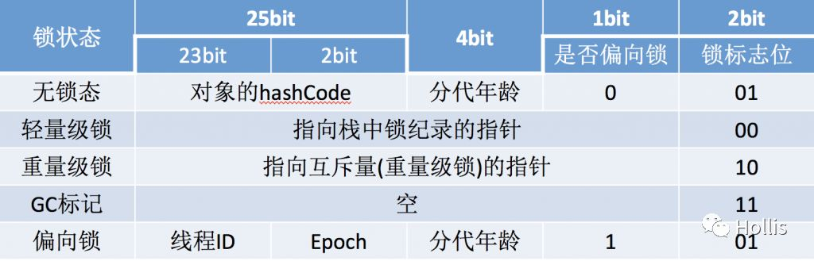

# Java的对象头


## Java对象模型回顾

每一个Java类，在被JVM加载的时候，JVM会给这个类创建一个`instanceKlass`，保存在方法区，用来在JVM层表示该Java类。当我们在Java代码中，使用new创建一个对象的时候，JVM会创建一个`instanceOopDesc`对象，这个对象中包含了对象头以及实例数据。

这里提到的对象头到底是什么呢？

```c++
class oopDesc {
  friend class VMStructs;
 private:
  volatile markOop  _mark;
  union _metadata {
    wideKlassOop    _klass;
    narrowOop       _compressed_klass;
  } _metadata;
}
```

上面代码中的`_mark`和`_metadata`其实就是对象头的定义。关于`_metadata`之前就介绍过，这里不再赘述。由于这个专题主要想介绍和JAVA并发相关的知识，所以本文展开介绍一下`_mark` ，即mark word。

对象头信息是与对象自身定义的数据无关的额外存储成本，考虑到虚拟机的空间效率，Mark Word被设计成一个非固定的数据结构以便在极小的空间内存储尽量多的信息，它会根据对象的状态复用自己的存储空间。

对markword的设计方式上，非常像网络协议报文头：将mark word划分为多个比特位区间，并在不同的对象状态下赋予比特位不同的含义。下图描述了在32位虚拟机上，在对象不同状态时 mark word各个比特位区间的含义。



同样，在HotSpot的源码中我们可以找到关于对象头对象的定义，会一一印证上图的描述。对应与markOop.hpp类。

```c++
enum { age_bits                 = 4,
      lock_bits                = 2,
      biased_lock_bits         = 1,
      max_hash_bits            = BitsPerWord - age_bits - lock_bits - biased_lock_bits,
      hash_bits                = max_hash_bits > 31 ? 31 : max_hash_bits,
      cms_bits                 = LP64_ONLY(1) NOT_LP64(0),
      epoch_bits               = 2
};

```

从上面的枚举定义中可以看出，对象头中主要包含了GC分代年龄、锁状态标记、哈希码、epoch等信息。

从上图中可以看出，对象的状态一共有五种，分别是无锁态、轻量级锁、重量级锁、GC标记和偏向锁。在32位的虚拟机中有两个Bits是用来存储锁的标记为的，但是我们都知道，两个bits最多只能表示四种状态：00、01、10、11，那么第五种状态如何表示呢 ，就要额外依赖1Bit的空间，使用0和1来区分。

> 在32位的HotSpot虚拟机 中对象未被锁定的状态下，Mark Word的32个Bits空间中的25Bits用于存储对象哈希码(HashCode)，4Bits用于存储对象分代年龄，2Bits用于存储锁标志位，1Bit固定为0，表示非偏向锁。

markOop.hpp类中有关于对象状态的定义：

> enum { locked_value             = 0,
>
>​		 unlocked_value           = 1,
>​         monitor_value            = 2,
>​         marked_value             = 3,
>​         biased_lock_pattern      = 5 
>
>};

简单翻译一下：

>locked_value(00) = 0
>
>unlocked_value(01) = 1
>
>monitor_value(10) = 2
>
>marked_value(11) = 3
>
>biased*lock*pattern(101) = 5

关于为什么要定义这么多状态，上面提到的轻量级锁、重量级锁、偏向锁以及他们之前的关系，会在下一篇文章中重点阐述，敬请期待。