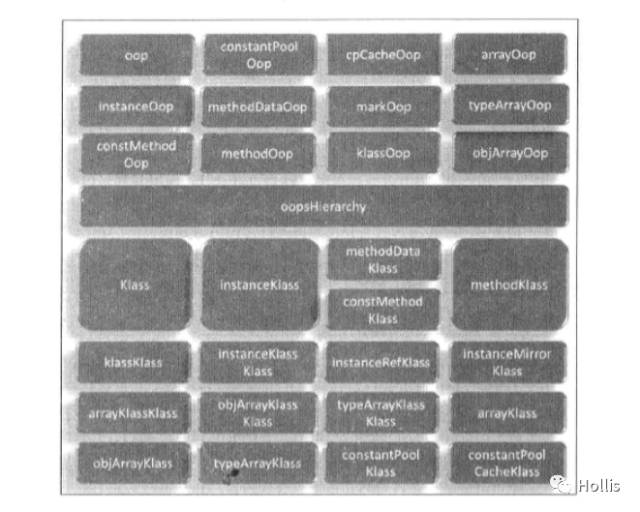
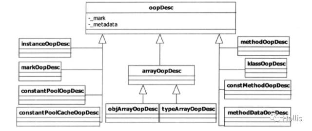
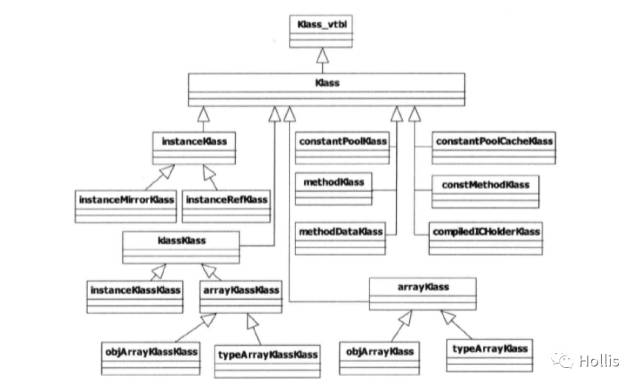
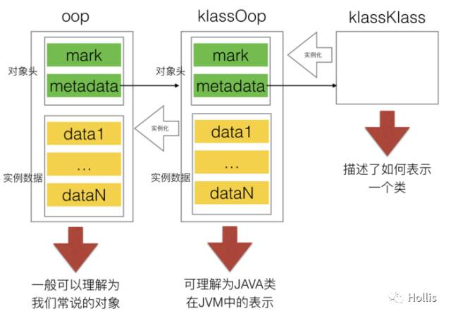
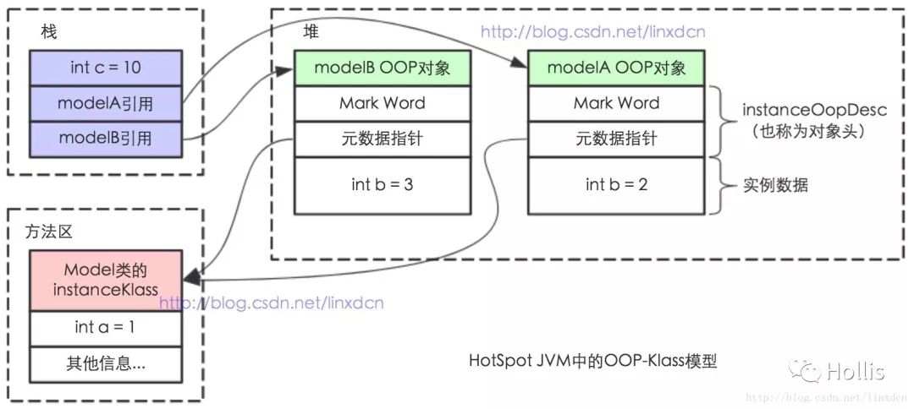

# Java的对象模型


大家都知道的是，Java对象保存在堆内存中。在内存中，一个Java对象包含三部分：对象头、实例数据和对齐填充。其中对象头是一个很关键的部分，因为**对象头中包含锁状态标志、线程持有的锁等标志**。这篇文章就主要从Java对象模型入手，找一找我们关心的对象头以及对象头中和锁相关的运行时数据在JVM中是如何表示的。


## Java的对象模型

任何一个接触过Java的人都知道，Java是一种面向对象语言。在学习Java的过程中你一定对下面两句话不陌生：

- 1、在面向对象的软件中，对象（Object）是某一个类（Class）的实例。
- 2、一切皆对象

我们还知道，在JVM的内存结构中，对象保存在堆内存中，而我们在对对象进行操作时，其实操作的是对象的引用。那么对象本身在JVM中的结构是什么样的呢？本文的所有分析均基于HotSpot虚拟机。


## oop-klass model

HotSpot是基于c++实现，而c++是一门面向对象的语言，本身是具备面向对象基本特征的，所以Java中的对象表示，最简单的做法是为每个Java类生成一个c++类与之对应。但HotSpot JVM并没有这么做，而是设计了一个`OOP-Klass Model`。OOP（`Ordinary Object Pointer`）指的是普通对象指针，而`Klass`用来描述对象实例的具体类型。

为什么HotSpot要设计一套`oop-klass model`呢？答案是：HotSopt JVM的设计者不想让每个对象中都含有一个`vtable`（虚函数表）

这个解释似乎可以说得通。众所周知，C++和Java都是面向对象的语言，面向对象语言有一个很重要的特性就是多态。关于多态的实现，C++和Java有着本质的区别。

>多态是面向对象的最主要的特性之一，是一种方法的动态绑定，实现运行时的类型决定对象的行为。多态的表现形式是父类指针或引用指向子类对象，在这个指针上调用的方法使用子类的实现版本。多态是IOC、模板模式实现的关键。
>
>>在C++中通过虚函数表的方式实现多态，每个包含虚函数的类都具有一个虚函数表（virtual table），在这个类对象的地址空间的最靠前的位置存有指向虚函数表的指针。在虚函数表中，按照声明顺序依次排列所有的虚函数。由于C++在运行时并不维护类型信息，所以在编译时直接在子类的虚函数表中将被子类重写的方法替换掉。
>>
>>在Java中，在运行时会维持类型信息以及类的继承体系。每一个类会在方法区中对应一个数据结构用于存放类的信息，可以通过Class对象访问这个数据结构。其中，类型信息具有superclass属性指示了其超类，以及这个类对应的方法表（其中只包含这个类定义的方法，不包括从超类继承来的）。而每一个在堆上创建的对象，都具有一个指向方法区类型信息数据结构的指针，通过这个指针可以确定对象的类型。

上面这段是我从网上摘取过来的，说的有一定道理，但是也不全对。至于为啥，我会在后文介绍到Klass的时候细说。

关于opp-klass模型的整体定义，在HotSpot的源码中可以找到。

oops模块可以分成两个相对独立的部分：OOP框架和Klass框架。

在oopsHierarchy.hpp里定义了oop和klass各自的体系。


## oop




## oop体系：

```c++
//定义了oops共同基类
typedef class   oopDesc*                            oop;
//表示一个Java类型实例
typedef class   instanceOopDesc*            instanceOop;
//表示一个Java方法
typedef class   methodOopDesc*                    methodOop;
//表示一个Java方法中的不变信息
typedef class   constMethodOopDesc*            constMethodOop;
//记录性能信息的数据结构
typedef class   methodDataOopDesc*            methodDataOop;
//定义了数组OOPS的抽象基类
typedef class   arrayOopDesc*                    arrayOop;
//表示持有一个OOPS数组
typedef class   objArrayOopDesc*            objArrayOop;
//表示容纳基本类型的数组
typedef class   typeArrayOopDesc*            typeArrayOop;
//表示在Class文件中描述的常量池
typedef class   constantPoolOopDesc*            constantPoolOop;
//常量池告诉缓存
typedef class   constantPoolCacheOopDesc*   constantPoolCacheOop;
//描述一个与Java类对等的C++类
typedef class   klassOopDesc*                    klassOop;
//表示对象头
typedef class   markOopDesc*                    markOop;
```

**上面列出的是整个Oops模块的组成结构，其中包含多个子模块。每一个子模块对应一个类型，每一个类型的OOP都代表一个在JVM内部使用的特定对象的类型。**

从上面的代码中可以看到，有一个变量opp的类型是`oppDesc` ，OOPS类的共同基类型为`oopDesc`。

```c++
class oopDesc {
  friend class VMStructs;
 private:
  volatile markOop  _mark;
  union _metadata {
    wideKlassOop    _klass;
    narrowOop       _compressed_klass;
  } _metadata;
}
```

**在Java程序运行过程中，每创建一个新的对象，在JVM内部就会相应地创建一个对应类型的OOP对象。**在HotSpot中，根据JVM内部使用的对象业务类型，具有多种`oopDesc`的子类。除了`oppDesc`类型外，opp体系中还有很多`instanceOopDesc`、`arrayOopDesc` 等类型的实例，他们都是`oopDesc`的子类。



这些OOPS在JVM内部有着不同的用途，例如**，instanceOopDesc表示类实例，arrayOopDesc表示数组。**也就是说，**当我们使用new创建一个Java对象实例的时候，JVM会创建一个instanceOopDesc对象来表示这个Java对象。同理，当我们使用new创建一个Java数组实例的时候，JVM会创建一个arrayOopDesc对象来表示这个数组对象。**

在HotSpot中，oopDesc类定义在oop.hpp中，instanceOopDesc定义在instanceOop.hpp中，arrayOopDesc定义在arrayOop.hpp中。

简单看一下相关定义：

```
class instanceOopDesc : public oopDesc {
}

class arrayOopDesc : public oopDesc {
}
```

通过上面的源码可以看到，`instanceOopDesc`实际上就是继承了`oopDesc`，并没有增加其他的数据结构，也就是说**instanceOopDesc中包含两部分数据：markOop _mark和union _metadata。**

这里的`markOop`你可能又熟悉了，这不就是OOPS体系中的一部分吗，上面注释中已经说过，他表示对象头。 **_metadata是一个联合体，这个字段被称为元数据指针。指向描述类型Klass对象的指针。**

**HotSpot虚拟机中，对象在内存中存储的布局可以分为三块区域：对象头、实例数据和对齐填充。在虚拟机内部，一个Java对象对应一个instanceOopDesc的对象，该对象中有两个字段分别表示了对象头和实例数据。那就是_mark和_metadata。**

文章开头我们就说过，之所以我们要写这篇文章，是因为对象头中有和锁相关的运行时数据，这些运行时数据是`synchronized`以及其他类型的锁实现的重要基础。因为本文主要介绍的`oop-klass`模型，在这里暂时不对对象头做展开，下一篇文章介绍。

前面介绍到的`_metadata`是一个共用体，其中`_klass`是普通指针，`_compressed_klass`是压缩类指针。在深入介绍之前，就要来到`oop-Klass`中的另外一个主角`klass`了。


## klass

klass体系 

```java
//klassOop的一部分，用来描述语言层的类型
class  Klass;
//在虚拟机层面描述一个Java类
class   instanceKlass;
//专有instantKlass，表示java.lang.Class的Klass
class     instanceMirrorKlass;
//专有instantKlass，表示java.lang.ref.Reference的子类的Klass
class     instanceRefKlass;
//表示methodOop的Klass
class   methodKlass;
//表示constMethodOop的Klass
class   constMethodKlass;
//表示methodDataOop的Klass
class   methodDataKlass;
//最为klass链的端点，klassKlass的Klass就是它自身
class   klassKlass;
//表示instanceKlass的Klass
class     instanceKlassKlass;
//表示arrayKlass的Klass
class     arrayKlassKlass;
//表示objArrayKlass的Klass
class       objArrayKlassKlass;
//表示typeArrayKlass的Klass
class       typeArrayKlassKlass;
//表示array类型的抽象基类
class   arrayKlass;
//表示objArrayOop的Klass
class     objArrayKlass;
//表示typeArrayOop的Klass
class     typeArrayKlass;
//表示constantPoolOop的Klass
class   constantPoolKlass;
//表示constantPoolCacheOop的Klass
class   constantPoolCacheKlass;
```

和`oopDesc`是其他oop类型的父类一样，Klass类是其他klass类型的父类。



Klass向JVM提供两个功能：

- 实现语言层面的Java类（在Klass基类中已经实现）
- 实现Java对象的分发功能（由Klass的子类提供虚函数实现）

文章开头的时候说过：之所以设计`oop-klass`模型，是因为HotSopt JVM的设计者不想让每个对象中都含有一个虚函数表。

**HotSopt JVM的设计者把对象一拆为二，分为klass和oop，其中oop的职能主要在于表示对象的实例数据，所以其中不含有任何虚函数。而klass为了实现虚函数多态，所以提供了虚函数表。所以，关于Java的多态，其实也有虚函数的影子在。**

`_metadata`是一个共用体，其中`_klass`是普通指针，`_compressed_klass`是压缩类指针。这两个指针都指向**instanceKlass对象，它用来描述对象的具体类型。**


## instanceKlass

JVM在运行时，需要一种用来标识Java内部类型的机制。在HotSpot中的解决方案是：**为每一个已加载的Java类创建一个instanceKlass对象，用来在JVM层表示Java类。**

来看下instanceKlass的内部结构：

```c++
 //类拥有的方法列表
  objArrayOop     _methods;
  //描述方法顺序
  typeArrayOop    _method_ordering;
  //实现的接口
  objArrayOop     _local_interfaces;
  //继承的接口
  objArrayOop     _transitive_interfaces;
  //域
  typeArrayOop    _fields;
  //常量
  constantPoolOop _constants;
  //类加载器
  oop             _class_loader;
  //protected域
  oop             _protection_domain;
      ....
```

可以看到，一个类该具有的东西，这里面基本都包含了。

这里还有个点需要简单介绍一下。

在JVM中，对象在内存中的基本存在形式就是oop。那么，对象所属的类，在JVM中也是一种对象，因此它们实际上也会被组织成一种oop，即klassOop。同样的，对于klassOop，也有对应的一个klass来描述，它就是klassKlass，也是klass的一个子类。klassKlass作为oop的klass链的端点。关于对象和数组的klass链大致如下图：


在这种设计下，JVM对内存的分配和回收，都可以采用统一的方式来管理。oop-klass-klassKlass关系如图：




## 内存存储

关于一个Java对象，他的存储是怎样的，一般很多人会回答：对象存储在堆上。稍微好一点的人会回答：对象存储在堆上，对象的引用存储在栈上。今天，再给你一个更加显得牛逼的回答：

> 对象的实例（instantOopDesc)保存在堆上，对象的元数据（instantKlass）保存在方法区，对象的引用保存在栈上。

其实如果细追究的话，上面这句话有点故意卖弄的意思。因为我们都知道。**方法区用于存储虚拟机加载的类信息、常量、静态变量、即时编译器编译后的代码等数据。** 所谓加载的类信息，其实不就是给每一个被加载的类都创建了一个 instantKlass对象么。

***talk is cheap ,show me the code*** ：

```c++
class Model
{
    public static int a = 1;
    public int b;

    public Model(int b) {
        this.b = b;
    }
}

public static void main(String[] args) {
    int c = 10;
    Model modelA = new Model(2);
    Model modelB = new Model(3);
}
```

存储结构如下：




## 总结

**每一个Java类，在被JVM加载的时候，JVM会给这个类创建一个instanceKlass，保存在方法区，用来在JVM层表示该Java类。当我们在Java代码中，使用new创建一个对象的时候，JVM会创建一个instanceOopDesc对象，这个对象中包含了两部分信息，方法头以及元数据。对象头中有一些运行时数据，其中就包括和多线程相关的锁的信息。元数据其实维护的是指针，指向的是对象所属的类的instanceKlass。**

