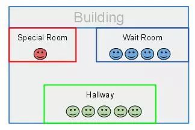
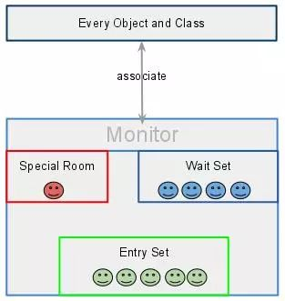
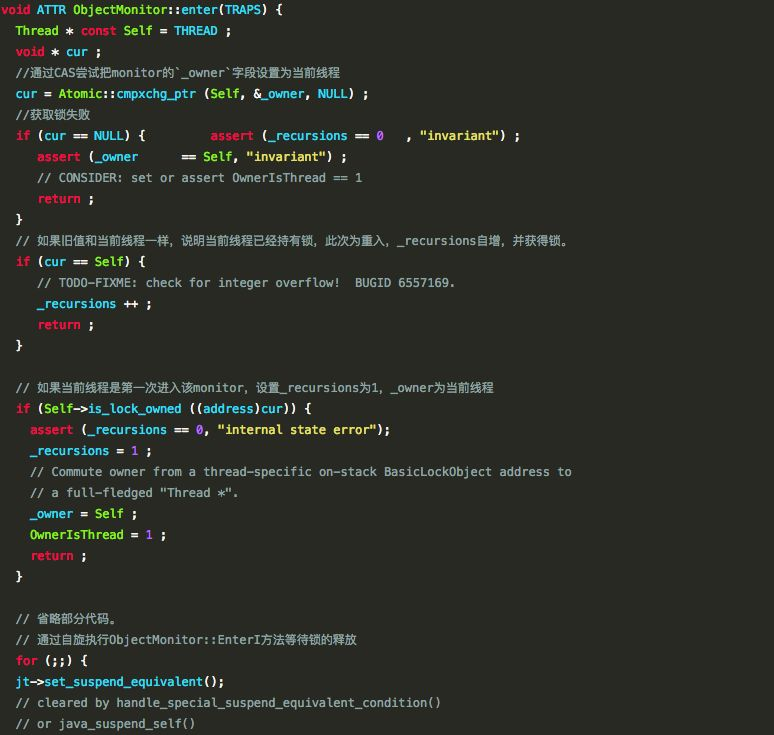
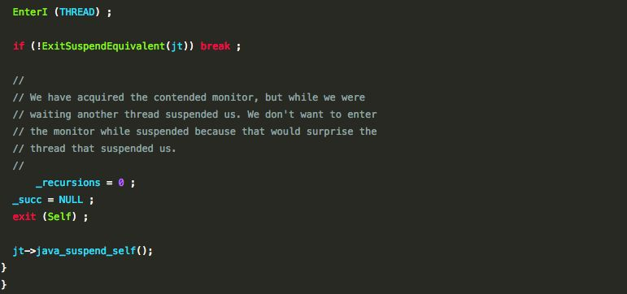
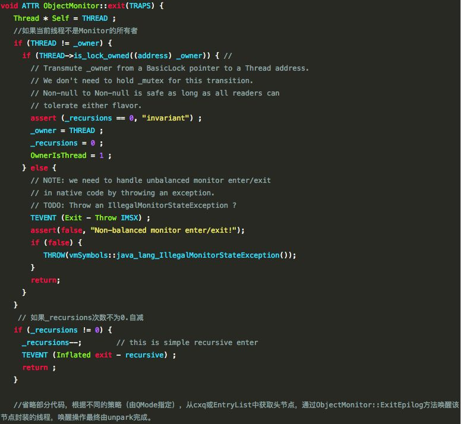
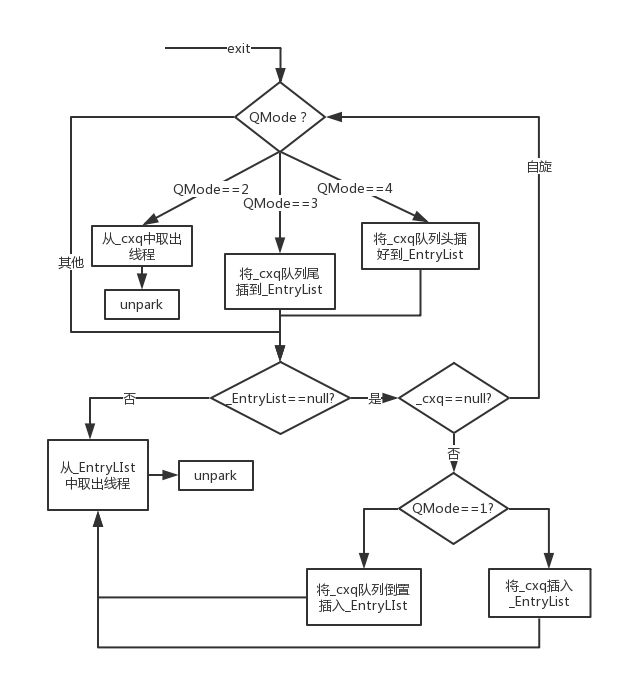

# Moniter的实现原理

在[深入理解多线程（一）——Synchronized的实现原理](http://mp.weixin.qq.com/s?__biz=MzI3NzE0NjcwMg==&mid=2650120537&idx=1&sn=f56201217c0ca6fde45ee12965b56296&chksm=f36bbc78c41c356ee363367addcdc0b311afb2f9df86a7ee20d21348b3332fd64f273d6028ca&scene=21#wechat_redirect)中介绍过关于`Synchronize`的实现原理，无论是同步方法还是同步代码块，无论是`ACC_SYNCHRONIZED`还是`monitorenter`、`monitorexit`都是基于`Monitor`实现的，那么这篇来介绍下什么是**Monitor**。


## 操作系统中的管程

如果你在大学学习过操作系统，你可能还记得管程（monitors）在操作系统中是很重要的概念。同样Monitor在java同步机制中也有使用。

>管程 (英语：Monitors，也称为监视器) 是一种程序结构，结构内的多个子程序（对象或模块）形成的多个工作线程互斥访问共享资源。这些共享资源一般是硬件设备或一群变量。管程实现了在一个时间点，最多只有一个线程在执行管程的某个子程序。与那些通过修改数据结构实现互斥访问的并发程序设计相比，管程实现很大程度上简化了程序设计。 管程提供了一种机制，线程可以临时放弃互斥访问，等待某些条件得到满足后，重新获得执行权恢复它的互斥访问。


## Java线程同步相关的Moniter

在多线程访问共享资源的时候，经常会带来可见性和原子性的安全问题。为了解决这类线程安全的问题，Java提供了同步机制、互斥锁机制，这个机制保证了在同一时刻只有一个线程能访问共享资源。这个机制的保障来源于监视锁Monitor，每个对象都拥有自己的监视锁Monitor。

先来举个例子，然后我们在上源码。我们可以把监视器理解为包含一个特殊的房间的建筑物，这个特殊房间同一时刻只能有一个客人（线程）。这个房间中包含了一些数据和代码。



如果一个顾客想要进入这个特殊的房间，他首先需要在走廊（Entry Set）排队等待。调度器将基于某个标准（比如 FIFO）来选择排队的客户进入房间。如果，因为某些原因，该客户客户暂时因为其他事情无法脱身（线程被挂起），那么他将被送到另外一间专门用来等待的房间（Wait Set），这个房间的可以可以在稍后再次进入那件特殊的房间。如上面所说，这个建筑屋中一共有三个场所。



总之，监视器是一个用来监视这些线程进入特殊的房间的。他的义务是保证（同一时间）只有一个线程可以访问被保护的数据和代码。

Monitor其实是一种同步工具，也可以说是一种同步机制，它通常被描述为一个对象，主要特点是：

> 对象的所有方法都被“互斥”的执行。好比一个Monitor只有一个运行“许可”，任一个线程进入任何一个方法都需要获得这个“许可”，离开时把许可归还。
>
> 通常提供singal机制：允许正持有“许可”的线程暂时放弃“许可”，等待某个谓词成真（条件变量），而条件成立后，当前进程可以“通知”正在等待这个条件变量的线程，让他可以重新去获得运行许可。


### 监视器的实现

在Java虚拟机(HotSpot)中，Monitor是基于C++实现的，由ObjectMonitor实现的，其主要数据结构如下：

```c++
  ObjectMonitor() {
    _header       = NULL;
    _count        = 0;
    _waiters      = 0,
    _recursions   = 0;
    _object       = NULL;
    _owner        = NULL;
    _WaitSet      = NULL;
    _WaitSetLock  = 0 ;
    _Responsible  = NULL ;
    _succ         = NULL ;
    _cxq          = NULL ;
    FreeNext      = NULL ;
    _EntryList    = NULL ;
    _SpinFreq     = 0 ;
    _SpinClock    = 0 ;
    OwnerIsThread = 0 ;
  }
```

源码地址：objectMonitor.hpp

ObjectMonitor中有几个关键属性：

>_owner：指向持有ObjectMonitor对象的线程
>
>_WaitSet：存放处于wait状态的线程队列
>
>_EntryList：存放处于等待锁block状态的线程队列
>
>_recursions：锁的重入次数
>
>_count：用来记录该线程获取锁的次数

当多个线程同时访问一段同步代码时，首先会进入`_EntryList`队列中，当某个线程获取到对象的monitor后进入`_Owner`区域并把monitor中的`_owner`变量设置为当前线程，同时monitor中的计数器`_count`加1。即获得对象锁。

若持有monitor的线程调用`wait()`方法，将释放当前持有的monitor，`_owner`变量恢复为`null`，`_count`自减1，同时该线程进入`_WaitSet`集合中等待被唤醒。若当前线程执行完毕也将释放monitor(锁)并复位变量的值，以便其他线程进入获取monitor(锁)。如下图所示


ObjectMonitor类中提供了几个方法：

**获得锁**






释放锁






除了enter和exit方法以外，objectMonitor.cpp中还有

```c++
void      wait(jlong millis, bool interruptable, TRAPS);
void      notify(TRAPS);
void      notifyAll(TRAPS);
```

等方法。


## 总结

上面介绍的就是HotSpot虚拟机中Moniter的的加锁以及解锁的原理。

通过这篇文章我们知道了`sychronized`加锁的时候，会调用objectMonitor的`enter`方法，解锁的时候会调用`exit`方法。事实上，只有在JDK1.6之前，`synchronized`的实现才会直接调用ObjectMonitor的`enter`和`exit`，这种锁被称之为**重量级锁**。为什么说这种方式操作锁很重呢？

- Java的线程是映射到操作系统原生线程之上的，如果要阻塞或唤醒一个线程就需要操作系统的帮忙，这就要从用户态转换到核心态，因此状态转换需要花费很多的处理器时间，对于代码简单的同步块（如被`synchronized`修饰的`get` 或`set`方法）状态转换消耗的时间有可能比用户代码执行的时间还要长，所以说`synchronized`是java语言中一个重量级的操纵。

所以，在JDK1.6中出现对锁进行了很多的优化，进而出现**轻量级锁**，**偏向锁**，**锁消除**，**适应性自旋锁**，**锁粗化**(自旋锁在1.4就有 只不过默认的是关闭的，jdk1.6是默认开启的)，这些操作都是为了在线程之间更高效的共享数据 ，解决竞争问题。**后面的文章会继续介绍这几种锁以及他们之间的关系。**

