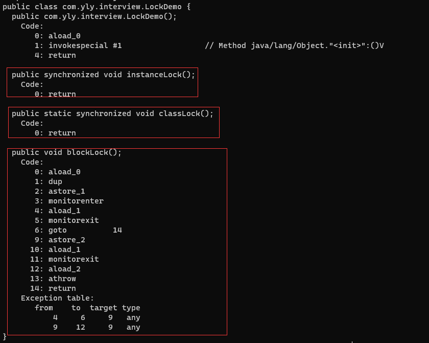
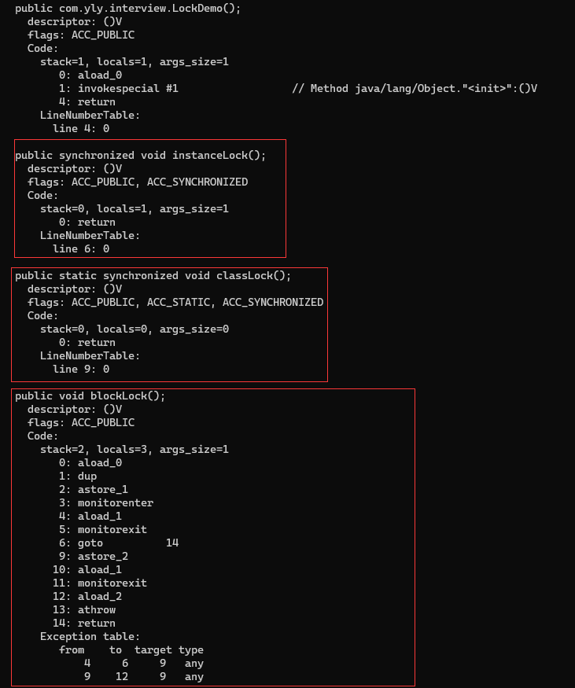

# synchronized

在[再有人问你Java内存模型是什么，就把这篇文章发给他](http://mp.weixin.qq.com/s?__biz=MzI3NzE0NjcwMg==&mid=2650121599&idx=1&sn=42b2cfabfb3057ac6c09026a8b9656cd&chksm=f36bb85ec41c31489e461a53e78f2959f0224c87c312724f420265b70e67e4efdae2331155aa&scene=21#wechat_redirect)中我们曾经介绍过，Java语言为了解决并发编程中存在的原子性、可见性和有序性问题，提供了一系列和并发处理相关的关键字，比如synchronized、volatile、final、concurren包等。

在《深入理解Java虚拟机》中，有这样一段话：

>`synchronized`关键字在需要原子性、可见性和有序性这三种特性的时候都可以作为其中一种解决方案，看起来是“万能”的。的确，大部分并发控制操作都能使用synchronized来完成。

首先需要明确的一点是:Java多线程的锁都是基于对象的，Java中的每一个对象都可以作为一个锁。
还有一点需要注意的是，我们常听到的类锁其实也是对象锁。
Java类只有一个Class对象(可以有多个实例对象，多个实例共享这个Class对象)，而Class对象也是特殊的Java对象。所以我们常说的类锁，其实就是Class对象的锁。


## synchronized的用法

我们通常使用synchronized 关键字来给一段代码或一个方法上锁。它通常有以下三种形式:

```java
 	//关键字在实例方法上，锁为当前实例
    public synchronized void instanceLock() {
    }

    //关键字在静态方法上，锁为当前Class对象
    public static synchronized void classLock() {
    }

    //关键字在代码块上，锁为括号里面的对象
    public void blockLock() {
        Object o = new Object();
        synchronized (o) {
        }
    }
```


## synchronized的实现原理

Java 中每一个对象都可以作为锁，这是 synchronized 实现同步的基础：

1. 普通同步方法，锁是当前实例对象
2. 静态同步方法，锁是当前类的 class 对象
3. 同步方法块，锁是括号里面的对象

当一个线程访问同步代码块时，它首先是需要得到锁才能执行同步代码，当退出或者抛出异常时必须要释放锁，那么它是如何来实现这个机制的呢？我们先看一段简单的代码：

```java
public class LockDemo {
    public synchronized void instanceLock() {
    }

    public static synchronized void classLock() {
    }

    public void blockLock() {
        synchronized (this) {
        }
    }
}
```

利用 Javap 工具查看生成的 class 文件信息来分析 synchronized 的实现

 **javap -c LockDemo.class**



 **javap -v LockDemo.class**



从上面可以看出：

**1）同步代码块是使用 monitorenter 和 monitorexit 指令实现的；**

**2）同步方法（在这看不出来需要看JVM底层实现）依靠的是方法修饰符上的ACC_SYNCHRONIZED 实现。**

关于这部分内容，在JVM规范中也可以找到相关的描述。


### 同步方法

The Java® Virtual Machine Specification中有关于方法级同步的介绍：

```
Method-level synchronization is performed implicitly, as part of method invocation and return. A synchronized method is distinguished in the run-time constant pool's methodinfo structure by the ACCSYNCHRONIZED flag, which is checked by the method invocation instructions. When invoking a method for which ACC_SYNCHRONIZED is set, the executing thread enters a monitor, invokes the method itself, and exits the monitor whether the method invocation completes normally or abruptly. During the time the executing thread owns the monitor, no other thread may enter it. If an exception is thrown during invocation of the synchronized method and the synchronized method does not handle the exception, the monitor for the method is automatically exited before the exception is rethrown out of the synchronized method.
```

主要说的是： 方法级的同步是隐式的。同步方法的常量池中会有一个`ACC_SYNCHRONIZED`标志。当某个线程要访问某个方法的时候，会检查是否有`ACC_SYNCHRONIZED`，如果有设置，则需要先获得监视器锁，然后开始执行方法，方法执行之后再释放监视器锁。这时如果其他线程来请求执行方法，会因为无法获得监视器锁而被阻断住。值得注意的是，如果在方法执行过程中，发生了异常，并且方法内部并没有处理该异常，那么在异常被抛到方法外面之前监视器锁会被自动释放。


### 同步代码块

同步代码块使用`monitorenter`和`monitorexit`两个指令实现。 The Java® Virtual Machine Specification 中有关于这两个指令的介绍：

**monitorenter**

>Each object is associated with a monitor. A monitor is locked if and only if it has an owner. The thread that executes monitorenter attempts to gain ownership of the monitor associated with objectref, as follows:
>
>>If the entry count of the monitor associated with objectref is zero, the thread enters the monitor and sets its entry count to one. The thread is then the owner of the monitor.
>>
>>If the thread already owns the monitor associated with objectref, it reenters the monitor, incrementing its entry count.
>>
>>If another thread already owns the monitor associated with objectref, the thread blocks until the monitor's entry count is zero, then tries again to gain ownership.


**monitorexit**

> The thread that executes monitorexit must be the owner of the monitor associated with the instance referenced by objectref.
>
> The thread decrements the entry count of the monitor associated with objectref. If as a result the value of the entry count is zero, the thread exits the monitor and is no longer its owner. Other threads that are blocking to enter the monitor are allowed to attempt to do so.

大致内容如下： 可以把执行`monitorenter`指令理解为加锁，执行`monitorexit`理解为释放锁。 每个对象维护着一个记录着被锁次数的计数器。未被锁定的对象的该计数器为0，当一个线程获得锁（执行`monitorenter`）后，该计数器自增变为 1 ，当同一个线程再次获得该对象的锁的时候，计数器再次自增。当同一个线程释放锁（执行`monitorexit`指令）的时候，计数器再自减。当计数器为0的时候。锁将被释放，其他线程便可以获得锁。


### 总结

>同步方法通过`ACC_SYNCHRONIZED`关键字隐式的对方法进行加锁。当线程要执行的方法被标注上`ACC_SYNCHRONIZED`时，需要先获得锁才能执行该方法。
>
>同步代码块通过`monitorenter`和`monitorexit`执行来进行加锁。当线程执行到`monitorenter`的时候要先获得所锁，才能执行后面的方法。当线程执行到`monitorexit`的时候则要释放锁。
>
>每个对象自身维护这一个被加锁次数的计数器，当计数器数字为0时表示可以被任意线程获得锁。当计数器不为0时，只有获得锁的线程才能再次获得锁。即可重入锁。
>
>无论是`ACC_SYNCHRONIZED`还是`monitorenter`、`monitorexit`都是基于Monitor实现的，在Java虚拟机(HotSpot)中，Monitor是基于C++实现的，由ObjectMonitor实现。
>
>ObjectMonitor类中提供了几个方法，如`enter`、`exit`、`wait`、`notify`、`notifyAll`等。`sychronized`加锁的时候，会调用objectMonitor的enter方法，解锁的时候会调用exit方法。（关于Monitor详见[深入理解多线程（四）—— Moniter的实现原理](http://mp.weixin.qq.com/s?__biz=MzI3NzE0NjcwMg==&mid=2650120784&idx=1&sn=3436c978f0d7ab3bb672d03689518902&chksm=f36bbf71c41c36672a3a6a7edebe0b913f2f5cf33d75d594d228f086ec7bdb9e253ab0beeae4&scene=21#wechat_redirect)）


## synchronized与原子性

原子性是指一个操作是不可中断的，要全部执行完成，要不就都不执行。

我们在[Java的并发编程中的多线程问题到底是怎么回事儿](http://mp.weixin.qq.com/s?__biz=MzI3NzE0NjcwMg==&mid=2650121739&idx=1&sn=7b60f56d408457f34d5fc0b200ed32bb&chksm=f36bbb2ac41c323c000e2a51e76c627d17f4759d3a54c520a073506ef3de0c46e196f11cd287&scene=21#wechat_redirect)中分析过：

线程是CPU调度的基本单位。CPU有时间片的概念，会根据不同的调度算法进行线程调度。当一个线程获得时间片之后开始执行，在时间片耗尽之后，就会失去CPU使用权。所以在多线程场景下，由于时间片在线程间轮换，就会发生原子性问题。

在Java中，为了保证原子性，提供了两个高级的字节码指令`monitorenter`和`monitorexit`。

前面介绍过，这两个字节码指令，在Java中对应的关键字就是`synchronized`。

通过`monitorenter`和`monitorexit`指令，可以保证被`synchronized`修饰的代码在同一时间只能被一个线程访问，在锁未释放之前，无法被其他线程访问到。

**因此，在Java中可以使用synchronized来保证方法和代码块内的操作是原子性的。**

>线程1在执行`monitorenter`指令的时候，会对Monitor进行加锁，加锁后其他线程无法获得锁，除非线程1主动解锁。即使在执行过程中，由于某种原因，比如CPU时间片用完，线程1放弃了CPU，但是，他并没有进行解锁。而由于`synchronized`的锁是可重入的，下一个时间片还是只能被他自己获取到，还是会继续执行代码。直到所有代码执行完。这就保证了原子性。


## synchronized与可见性

可见性是指当多个线程访问同一个变量时，一个线程修改了这个变量的值，其他线程能够立即看得到修改的值。

我们在[再有人问你Java内存模型是什么，就把这篇文章发给他](http://mp.weixin.qq.com/s?__biz=MzI3NzE0NjcwMg==&mid=2650121599&idx=1&sn=42b2cfabfb3057ac6c09026a8b9656cd&chksm=f36bb85ec41c31489e461a53e78f2959f0224c87c312724f420265b70e67e4efdae2331155aa&scene=21#wechat_redirect)中分析过：

Java内存模型规定了所有的变量都存储在主内存中，每条线程还有自己的工作内存，线程的工作内存中保存了该线程中是用到的变量的主内存副本拷贝，线程对变量的所有操作都必须在工作内存中进行，而不能直接读写主内存。不同的线程之间也无法直接访问对方工作内存中的变量，线程间变量的传递均需要自己的工作内存和主存之间进行数据同步进行。所以，就可能出现线程1改了某个变量的值，但是线程2不可见的情况。

前面我们介绍过，被`synchronized`修饰的代码，在开始执行时会加锁，执行完成后会进行解锁。

而为了保证可见性，有一条规则是这样的：对一个变量解锁之前，必须先把此变量同步回主存中。这样解锁后，后续线程就可以访问到被修改后的值。

**所以，synchronized关键字锁住的对象，其值是具有可见性的。**


## synchronized与有序性

有序性即程序执行的顺序按照代码的先后顺序执行。

我们在[再有人问你Java内存模型是什么，就把这篇文章发给他](http://mp.weixin.qq.com/s?__biz=MzI3NzE0NjcwMg==&mid=2650121599&idx=1&sn=42b2cfabfb3057ac6c09026a8b9656cd&chksm=f36bb85ec41c31489e461a53e78f2959f0224c87c312724f420265b70e67e4efdae2331155aa&scene=21#wechat_redirect)中分析过：

除了引入了时间片以外，由于处理器优化和指令重排等，CPU还可能对输入代码进行乱序执行，比如load->add->save 有可能被优化成load->save->add 。这就是可能存在有序性问题。

这里需要注意的是，`synchronized`是无法禁止指令重排和处理器优化的。也就是说，`synchronized`无法避免上述提到的问题。

那么，为什么还说`synchronized`也提供了有序性保证呢？

这就要再把有序性的概念扩展一下了。

Java程序中天然的有序性可以总结为一句话：如果在本线程内观察，所有操作都是天然有序的。如果在一个线程中观察另一个线程，所有操作都是无序的。

以上这句话也是《深入理解Java虚拟机》中的原句，但是怎么理解呢？周志明并没有详细的解释。这里我简单扩展一下，这其实和`as-if-serial语义`有关。

`as-if-serial`语义的意思指：不管怎么重排序（编译器和处理器为了提高并行度），单线程程序的执行结果都不能被改变。编译器和处理器无论如何优化，都必须遵守`as-if-serial`语义。

这里不对`as-if-serial语义`详细展开了，简单说就是，`as-if-serial语义`保证了单线程中，指令重排是有一定的限制的，而只要编译器和处理器都遵守了这个语义，那么就可以认为单线程程序是按照顺序执行的。当然，实际上还是有重排的，只不过我们无须关心这种重排的干扰。

**所以呢，由于synchronized修饰的代码，同一时间只能被同一线程访问。那么也就是单线程执行的。所以，可以保证其有序性。**

