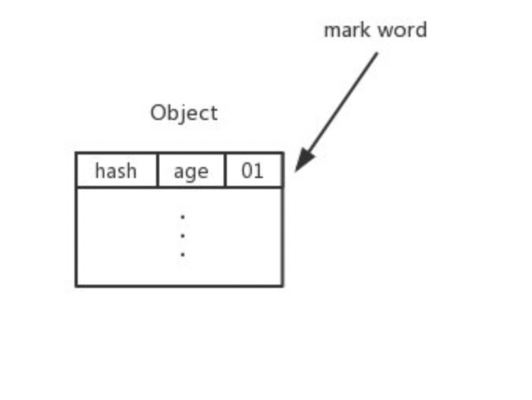
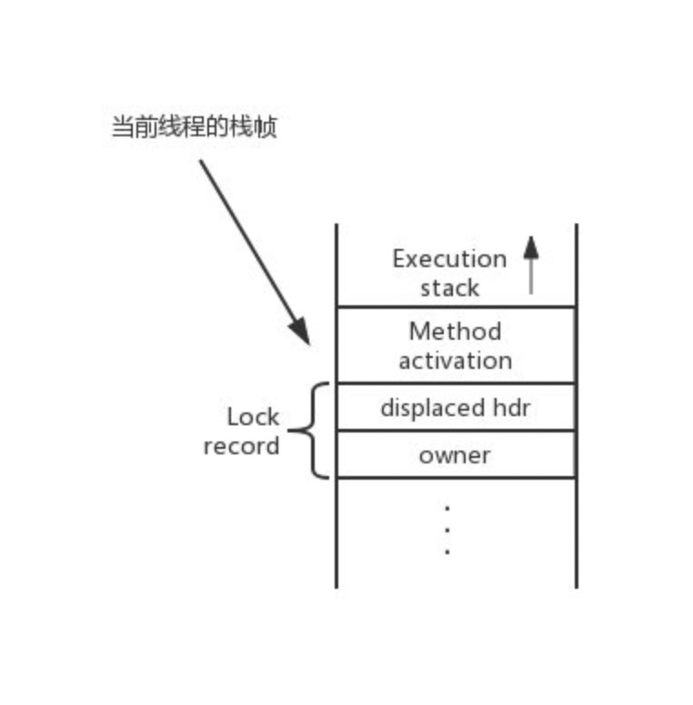
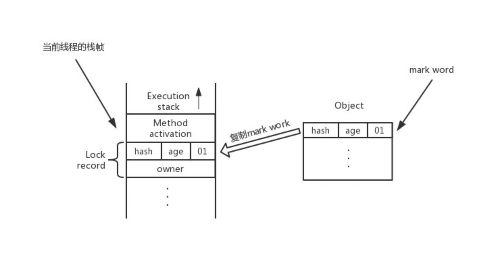
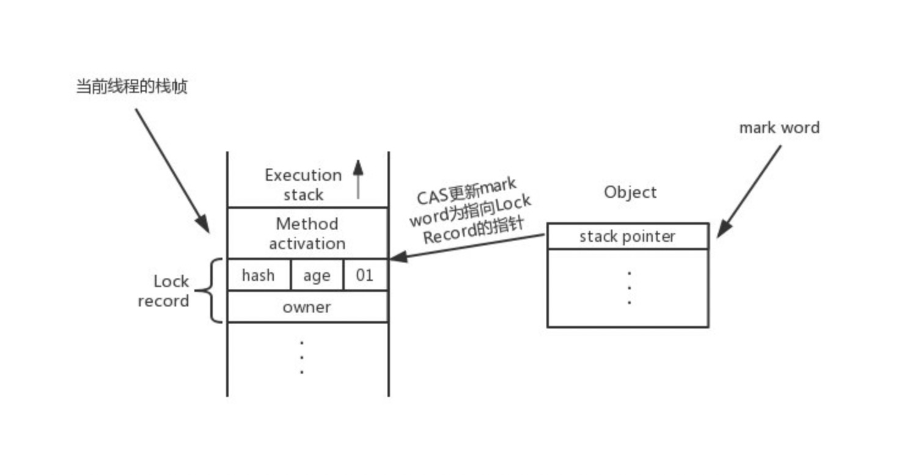
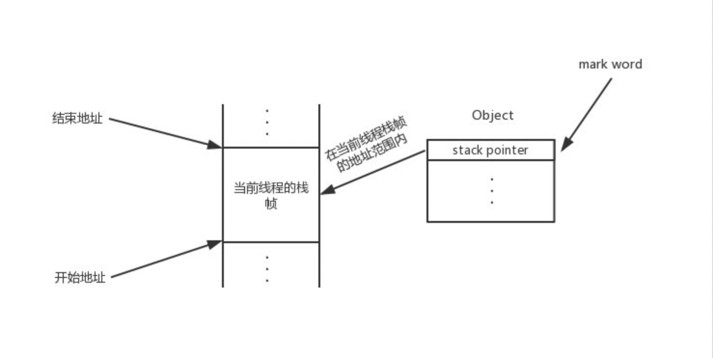
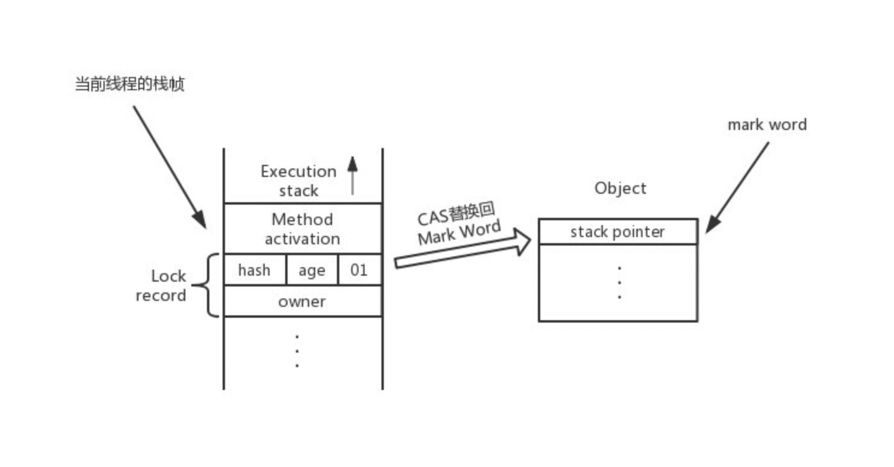

# 轻量级锁加锁 & 解锁过程

`轻量级锁`是对 synchronized 的一种优化机制，它是一种乐观锁，适用于多线程竞争比较弱的情况。在这种情况下，相对于传统的重量级互斥锁（使用操作系统互斥量加锁），轻量级锁的性能更好。

轻量级锁通过操作加锁对象的对象头中的 `Mark Word `进行加锁。在 HotSpot 虚拟机中，对象头分为两部分：一部分用于存储对象自身的运行时数据 (例如 hashcode、GC Age 等)，它的位数和虚拟机的位数对应，这部分数据叫做`「Mark Word」`。另一部分用于存储指向方法区对象类型数据的指针。除此之外，对于数组对象，还会存储数组的长度。


## Mark Word 的不同状态

如下是 32 位 HotSpot 虚拟机中` Mark Word` 在不同状态下存储的信息：

| 锁状态   | 25 bit                       | 4bit         | 1bit         | 2bit |      |
| -------- | ---------------------------- | ------------ | ------------ | ---- | ---- |
| 23bit    | 2bit                         | 是否是偏向锁 | 锁标志位     |      |      |
| 无锁     | 对象的 hashCode              | 对象分代年龄 | 0            | 01   |      |
| 偏向锁   | 线程 ID                      | Epoch        | 对象分代年龄 | 1    | 01   |
| 轻量级锁 | 指向栈中锁记录的指针         | 00           |              |      |      |
| 重量级锁 | 指向互斥量（重量级锁）的指针 | 10           |              |      |      |
| GC 标记  | 空                           | 11           |              |      |      |

**synchronized** 有 4 种锁状态，从低到高分别为：**无锁状态**、**偏向锁状态**、**轻量级锁状态**、**重量级锁状态**，锁可以升级但不能降级。本文主要讨论的是轻量级锁的加锁和解锁过程。

## 轻量级锁加锁

**轻量级锁加**锁的前提是锁对象不能带有偏向特征。加锁的过程可分为两种情况来讨论：一种是无锁状态 (锁标志位为 01，偏向标志位为 0)，可直接尝试加锁。另一种是有锁状态，需检查是否为当前线程持有的轻量级锁。

```c++
assert(!mark->has_bias_pattern(), "should not see bias pattern here");
```


### 无锁状态

无锁状态下，锁标志位为 01，偏向标志位为 0，可直接尝试加锁


#### Mark Word 初始状态

代码进入同步块时，同步对象处于无锁状态，锁标志位为 “01”，偏向标志位为 “0”



#### 建立锁记录

第一步：在加锁前，虚拟机需要在当前线程的栈帧中建立**锁记录**（Lock Record）的空间。Lock Record 中包含一个 `_displaced_header` 属性，用于存储锁对象的 Mark Word 的拷贝。



#### 复制锁对象的 Mark Word

第二步：将锁对象的 Mark Word 复制到锁记录中，这个复制过来的记录叫做 Displaced Mark Word。具体来讲，是将 mark word 放到锁记录的 `_displaced_header` 属性中。



```c++
// 将Mark Word保存在锁记录中
lock->set_displaced_header(mark);
```

```c++
class BasicLock VALUE_OBJ_CLASS_SPEC {
  friend class VMStructs;
 private:
  volatile markOop _displaced_header;
 public:
  void         set_displaced_header(markOop header)   { _displaced_header = header; }
  ......  
};
```


#### CAS 更新锁对象的 Mark Word

第三步：虚拟机使用 CAS 操作尝试将锁对象的 Mark Word 更新为指向**锁记录**的指针。如果更新成功，这个线程就获得了该对象的锁



```c++
// lock: 指向Lock Record的指针
// obj()->mark_addr(): 锁对象的Mark Word地址
// mark: 锁对象的Mark Word
if (mark == (markOop) Atomic::cmpxchg_ptr(lock, obj()->mark_addr(), mark)) {
    TEVENT (slow_enter: release stacklock) ;
    return ;
}
```


### 有锁状态

有锁状态下，如果是当前线程持有的轻量级锁，则说明是重入，不需要争抢锁。否则，说明有多个线程竞争，轻量级锁需要升级为重量级锁。


#### 当前线程持有锁

对应无锁状态的第二步：锁对象处于加锁状态，并且锁对象的 Mark Word 指向当前线程的栈帧范围内，说明当前线程已经持有该轻量级锁，再次获取到该锁，也就是锁重入。



此时不需要争抢锁，可执行同步代码

```c++
// Mark Word 处于加锁状态，当前线程持有的锁(Mark Word 指向的是当前线程的栈帧地址范围)
if (mark->has_locker() && THREAD->is_lock_owned((address)mark->locker())) {
  assert(lock != mark->locker(), "must not re-lock the same lock");
  assert(lock != (BasicLock*)obj->mark(), "don't relock with same BasicLock");
  // 锁重入，将 Displaced Mark Word 设置为 null
  lock->set_displaced_header(NULL);
  return;
}
```

每次获取轻量级锁时都会创建一个 Lock Record，锁重入时会创建多个指向同一个 Object 的 Lock Record，除第一次设置 `Displaced Mark Word` ，后面均设置为 null


#### 不是当前线程持有的锁

上一种条件不满足，说明存在多个线程竞争锁，轻量级锁要膨胀了。对！就是 inflate 膨胀了！ :laughing: 膨胀成重量级锁后再加锁

```c++
// The object header will never be displaced to this lock,
// so it does not matter what the value is, except that it
// must be non-zero to avoid looking like a re-entrant lock,
// and must not look locked either.
lock->set_displaced_header(markOopDesc::unused_mark());
ObjectSynchronizer::inflate(THREAD, obj())->enter(THREAD);
```


## 轻量级锁解锁

解锁的思路是使用 CAS 操作把当前线程的栈帧中的 `Displaced Mark Word` 替换回锁对象中去，如果替换成功，则解锁成功。


### CAS 替换回 Mark Word



```c++
...
mark = object->mark() ;

// If the object is stack-locked by the current thread, try to
// swing the displaced header from the box back to the mark.
if (mark == (markOop) lock) {
  assert (dhw->is_neutral(), "invariant") ;
  // 将 Displaced Mark Word 替换回去
  if ((markOop) Atomic::cmpxchg_ptr (dhw, object->mark_addr(), mark) == mark) {
    TEVENT (fast_exit: release stacklock) ;
    return;
  }
}
```


### 替换失败

替换失败，轻量级锁膨胀成重量级锁后再解锁

```c++
ObjectSynchronizer::inflate(THREAD, object)->exit (true, THREAD) ;
```


### 锁重入

如上文所讲：加锁时，如果是锁重入，会将 `Displaced Mark Word` 设置为 null。相对应地，解锁时，如果判断 `Displaced Mark Word` 为 null 则说明是锁重入，不做替换操作

```c++
markOop dhw = lock->displaced_header();
markOop mark ;
if (dhw == NULL) {
    // Recursive stack-lock.
    // Diagnostics -- Could be: stack-locked, inflating, inflated.
    mark = object->mark() ;
    assert (!mark->is_neutral(), "invariant") ;
    if (mark->has_locker() && mark != markOopDesc::INFLATING()) {
      assert(THREAD->is_lock_owned((address)mark->locker()), "invariant") ;
    }
    if (mark->has_monitor()) {
      ObjectMonitor * m = mark->monitor() ;
      assert(((oop)(m->object()))->mark() == mark, "invariant") ;
      assert(m->is_entered(THREAD), "invariant") ;
    }
    return ;
}
```


## 参考代码

**bytecodeInterpreter.cpp**

代码位置：`hotspot/src/share/vm/interpreter/bytecodeInterpreter.cpp`

```c++
/* monitorenter and monitorexit for locking/unlocking an object */
CASE(_monitorenter): {
    ...

    // traditional lightweight locking
    if (!success) {
      markOop displaced = lockee->mark()->set_unlocked();
      entry->lock()->set_displaced_header(displaced);
      bool call_vm = UseHeavyMonitors;
      if (call_vm || Atomic::cmpxchg_ptr(entry, lockee->mark_addr(), displaced) != displaced) {
        // Is it simple recursive case?
        if (!call_vm && THREAD->is_lock_owned((address) displaced->clear_lock_bits())) {
          entry->lock()->set_displaced_header(NULL);
        } else {
          // 轻量级锁加锁
          CALL_VM(InterpreterRuntime::monitorenter(THREAD, entry), handle_exception);
        }
      }
      ...
  }
  ...
}
```

**interpreterRuntime.cpp**

代码位置： `hotspot/src/share/vm/interpreter/interpreterRuntime.cpp`

```c++
if (UseBiasedLocking) {
  // Retry fast entry if bias is revoked to avoid unnecessary inflation
  ObjectSynchronizer::fast_enter(h_obj, elem->lock(), true, CHECK);
} else {
  // 轻量级锁加锁
  ObjectSynchronizer::slow_enter(h_obj, elem->lock(), CHECK);
}
```

如果使用偏向锁，则进入 fast_enter 代码逻辑，否则进入 slow_enter 轻量级锁加锁逻辑


### **参考**

https://gorden5566.com/post/1019.html

> 周志明。深入理解 Java 虚拟机
> [死磕 Synchronized 底层实现：轻量级锁](https://github.com/farmerjohngit/myblog/issues/14)
> [(六) synchronized 的源码分析](https://mp.weixin.qq.com/s?__biz=MzUxNDA1NDI3OA==&mid=2247484986&idx=3&sn=565359c429b80736ffc16c46fb0d8591&chksm=f94a87d3ce3d0e)

相关文章

- [关于轻量级锁的一些问题](https://gorden5566.com/post/post/1057.html)

  

  

### 问答

**Tsingxin**

您好，想请问一下，轻量级锁解锁过程，CAS 替换回 Mark Word，是在什么情况下导致的替换失败呢？

**gorden5566**

[@Tsingxin](https://gorden5566.com/post/1019.html#5efb44cdfd84ef0008413f18) , 这个CAS替换操作可以分为3步

1. 获取锁对象的 mark word
2. 判断 mark word 正是指向 LockRecord 的指针
3. CAS 原子替换：判断对象的 mark word 对应地址的值，看是否为第一步取到的 mark word，如果是则替换成功

替换失败则说明：在第 1 步和第 3 步之间，锁对象 mark word 对应地址的值已经被改掉了

比如在这之间有另外一个线程加锁，因为当前线程还未释放掉锁，所以触发了锁膨胀，修改了锁对象的 mark word 值


**Anonymous**

博主您好，我的疑问是，您写到“轻量级锁加锁的前提是锁对象不能带有偏向特征”，但是出现偏向锁升级的时候，此时mark-word不应该是【Thread-ID | 1 | 01】，这样的吗，这种情况下。另外，在禁用偏向锁的时候，才会出现markword中有hashcode的存在，如果开始偏向锁，初始状态应该是【null | 1 | 01】，这和图文也不太符合，还是说我理解错了

**gorden5566**

[@Anonymous](https://gorden5566.com/post/1019.html#5eeda78c8ebe65000884f9d9) , 在没有开启偏向锁的时候，加锁时会直接进入 slow_enter，此时不会有偏向特征

```c++
if (UseBiasedLocking) {
  // Retry fast entry if bias is revoked to avoid unnecessary inflation
  ObjectSynchronizer::fast_enter(h_obj, elem->lock(), true, CHECK);
} else {
  ObjectSynchronizer::slow_enter(h_obj, elem->lock(), CHECK);
}
```

如果开启了偏向锁，则会进入 fast_enter，在加锁失败时会撤销偏向锁，将 mark word 恢复到无锁状态或设置为轻量级锁状态

文章里主要讨论的是 slow_enter 里轻量级锁加锁、解锁的过程，关于偏向锁的处理可以看下 fast_enter 的代码逻辑


**Akashi**

博主麻烦请问一下，轻量级锁加锁的时候状态是什么时候改的呢？加完锁还是处于无锁状态吗（001）
我找了半天实在是没找到哪里有改状态的…….

**gorden5566**

[@Akashi](https://gorden5566.com/post/1019.html#5edd3076c141340006673999) , 是通过 CAS 设置 Lock Record 地址时设置的

```c
if (mark == (markOop) Atomic::cmpxchg_ptr(lock, obj()->mark_addr(), mark)) {
    TEVENT (slow_enter: release stacklock) ;
    return ;
}
```

设置完之后，锁对象的 Mark Word 存储的是指向加锁线程的 Lock Record 的指针

因为轻量级锁的锁标志位为 `00`，所以此时 Mark Word 的二进制后两位应为 `00`

这样可以反推出 Lock Record 的地址末两位是 `00`，也就是 4 的倍数

从 BasicObjectLock 定义的注释来看，`BasicLock _lock` 也就是 Lock Record 必须按两个字对齐，这也符合前面的推测

```c
// A BasicObjectLock associates a specific Java object with a BasicLock.
// It is currently embedded in an interpreter frame.

// Because some machines have alignment restrictions on the control stack,
// the actual space allocated by the interpreter may include padding words
// after the end of the BasicObjectLock.  Also, in order to guarantee
// alignment of the embedded BasicLock objects on such machines, we
// put the embedded BasicLock at the beginning of the struct.
class BasicObjectLock VALUE_OBJ_CLASS_SPEC {
friend class VMStructs;
private:
BasicLock _lock; // the lock, must be double word aligned
oop _obj; // object holds the lock;
```


**bobo**

谢谢楼主的博客，写的还是比较清晰。按照自己的理解，指出一个小问题：😀

“轻量级锁是对 synchronized 的一种优化机制，它适用于没有多线程竞争的情况。” 偏向锁才适用于没有多线程竞争的情况，轻量级锁和重量级锁均用于多线程场景，区别在于重量级锁依赖操作系统语义，在无法获取锁时，线程直接进入阻塞状态； 而轻量级锁会自旋一段时间，尝试获取锁，超时后再转为重量级锁。

**gorden5566**

[@bobo](https://gorden5566.com/post/1019.html#5e6ca09791db2800773ed57a) , 感谢指正，这里描述的确实不准确 😅
在轻量级锁状态下，如果线程 CAS 修改 MarkWord 失败（获取锁失败），则会通过自旋继续尝试，若仍然失败则需升级为重量级锁。
因此在竞争比较弱的情况下，由于不阻塞线程，使用轻量级锁响应会更快。在竞争比较激烈的情况下，相对于直接使用重量级锁，额外多了自旋进行 CAS 的开销，响应会更慢些。不过轻量级锁一旦升级成重量级锁，就不会再恢复回去，这样就避免了更多无用的自旋操作。


**Anonymous**

[@gorden5566](https://gorden5566.com/post/1019.html#5e73af2f21460d006b2240d8) , 请问我在你推荐的 死磕源码里面怎么没有看到自旋操作呢？请问你有看到吗？

[@bobo](https://gorden5566.com/post/1019.html#5e6ca09791db2800773ed57a) , 源码里没看到轻量级锁有自旋操作唉，请问你有看到吗？

**gorden5566**

[@Anonymous](https://gorden5566.com/post/1019.html#5eac0145e0a51f00071b7615) , 获取轻量级锁失败时会先 **1.锁膨胀** 再进入 **2.重量级锁加锁过程**

```java
ObjectSynchronizer::inflate(THREAD, obj())->enter(THREAD);
```

1. 锁膨胀时，如果锁状态为 INFLATING 或者尝试修改锁状态为 INFLATING 失败，则会进行循环尝试

2. 重量级锁加锁时，先尝试 cas 获取锁，如果失败再自旋获取锁，最后才会进入阻塞队列等待

   ```java
   // Try one round of spinning *before* enqueueing Self
   // and before going through the awkward and expensive state
   // transitions.  The following spin is strictly optional ...
   // Note that if we acquire the monitor from an initial spin
   // we forgo posting JVMTI events and firing DTRACE probes.
   if (Knob_SpinEarly && TrySpin (Self) > 0) {
     assert (_owner == Self      , "invariant") ;
     assert (_recursions == 0    , "invariant") ;
     assert (((oop)(object()))->mark() == markOopDesc::encode(this), "invariant") ;
     Self->_Stalled = 0 ;
     return ;
   }
   ```

   以上是个人读的 jdk8u 源码，仅供参考