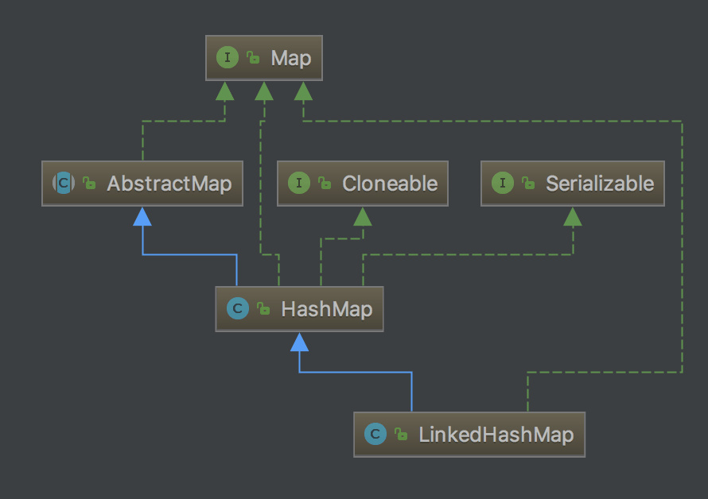
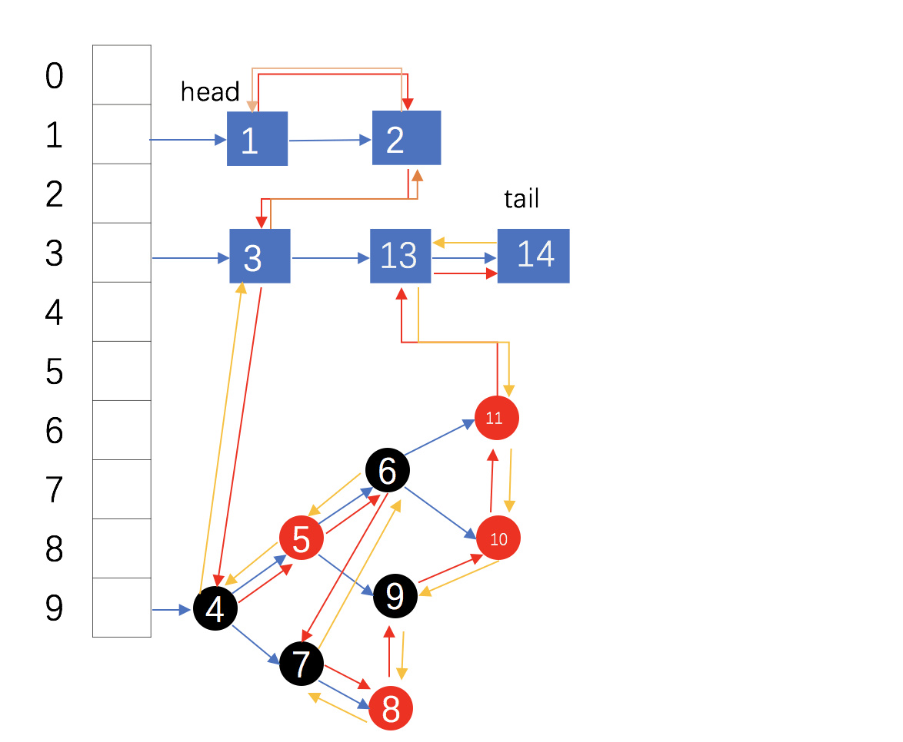
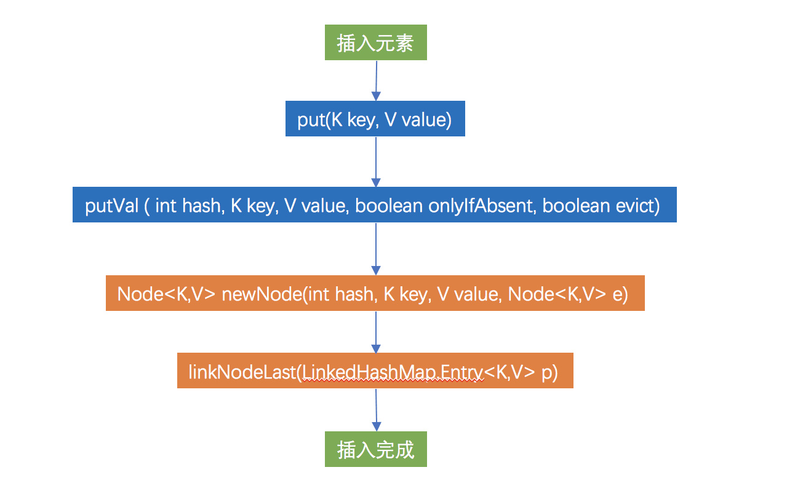
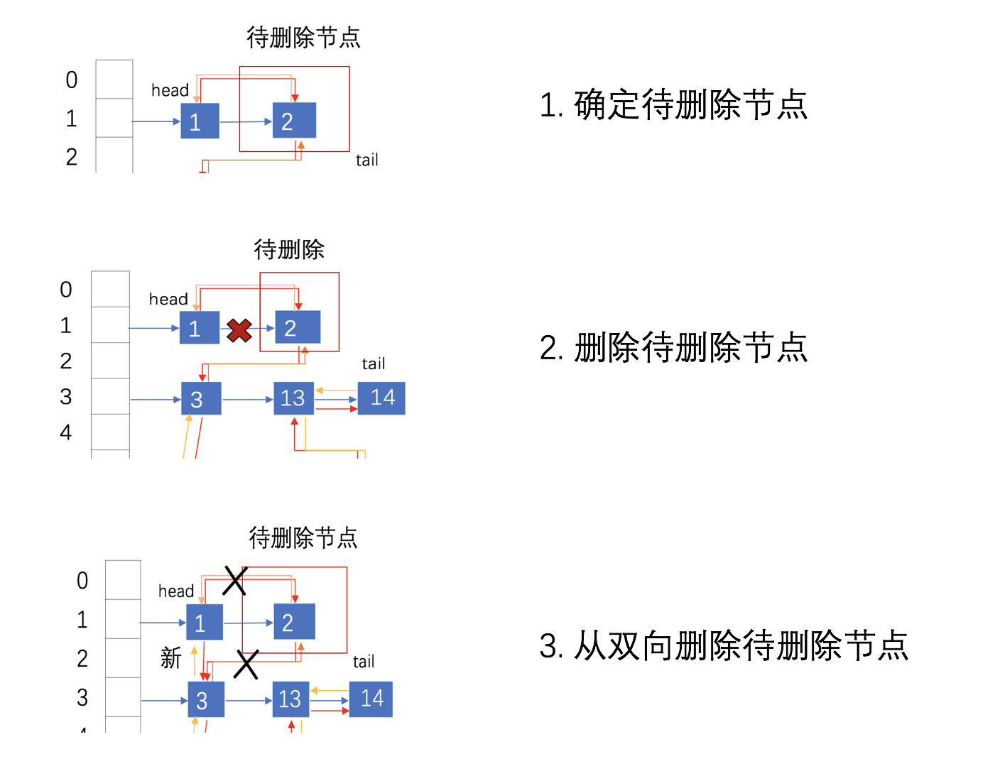
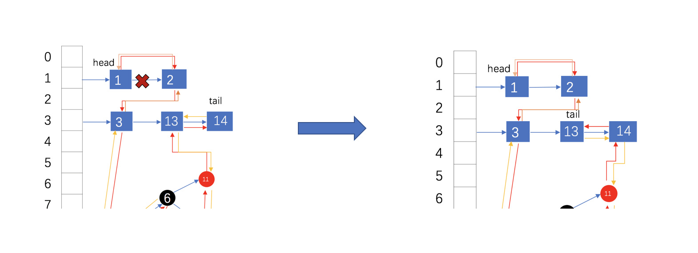

# LinkedHashMap 源码分析

上周学习了 `HashMap` 的源码感觉收获颇多，虽然红黑树这个坑自己还没有填，但是我没脸没皮的先看了 `LinkedHashMap` 的源码。因为`LinkedHashMap`的确跟`HashMap`有很大关系，看完这篇文章相信大家也会有这种感觉。由于有了 `HashMap` 源码的分析铺垫，这篇文章我们将从以下几个方面来分析 `LinkedHashMap`的源码：

1. **LinkedHashMap 与 HashMap 的关系**
2. **LinkedHashMap 双向链表的构建过程**
3. **LinkedHashMap 删除节点的过程**
4. **LinkedHashMap 如何维持访问顺序**
5. **LinkedHashMap - LRU (Least Recently Used) 最简单的构建方式**


## LinkedHashMap 与 HashMap 的关系

我们先来看下 `LinkedHashMap` 的体系图:



图片很直接的说明了一个问题，那就是 `LinkedHashMap` 直接继承自`HashMap` ，这也就说明了上文中我们说到的 `HashMap` 一切重要的概念 `LinkedHashMap` 都是拥有的，这就包括了，hash 算法定位 hash 桶位置，哈希表由数组和单链表构成，并且当单链表长度超过 8 的时候转化为红黑树，扩容体系，这一切都跟 `HashMap` 一样。那么除了这么多关键的相同点以外，`LinkedHashMap` 比 `HashMap` 更加强大，这体现在：

- **LinkedHashMap 内部维护了一个双向链表，解决了 HashMap 不能随时保持遍历顺序和插入顺序一致的问题**
- **LinkedHashMap 元素的访问顺序也提供了相关支持，也就是我们常说的 LRU（最近最少使用）原则。**

接下介绍中也贯穿着这两个不同点的源码分析以及如何应用。


## LinkedHashMap 双向链表的构建过程


为了便于理解，在看具体源码之前，我们先看一张图，这张图可以很好的体现 `LinkedHashMap` 中个各个元素关系：



> 假设图片中红黄箭头代表元素添加顺序，蓝箭头代表单链表各个元素的存储顺序。head 表示双向链表头部，tail 代表双向链表尾部

上篇文章分析的 `HashMap` 源码的时候我们有一张示意图，说明了 `HashMap` 的存储结构为，数组 + 单链表 + 红黑树，从上边的图片我们也可以看出  `LinkedHashMap` 底层的存储结构并没有发生变化。

唯一变化的是使用双向链表（图中红黄箭头部分）记录了元素的添加顺序，我们知道  `HashMap` 中的 Node 节点只有 next 指针，对于双向链表而言只有 next 指针是不够的，所以 `LinkedHashMap` 对于 Node 节点进行了拓展：

```java
static class Entry<K,V> extends HashMap.Node<K,V> {
   Entry<K,V> before, after;
   Entry(int hash, K key, V value, Node<K,V> next) {
       super(hash, key, value, next);
   }
}
```

`LinkedHashMap` 基本存储单元 `Entry<K,V>` 继承自 `HashMap.Node<K,V>`,并在此基础上添加了 before 和 after 这两个指针变量。这 before 变量在每次添加元素的时候将会链接上一次添加的元素，而上一次添加的元素的 after 变量将指向该次添加的元素，来形成双向链接。值得注意的是 `LinkedHashMap` 并没有覆写任何关于 HashMap put 方法。所以调用 `LinkedHashMap` 的 put 方法实际上调用了父类 HashMap 的方法。为了方便理解我们这里放一下 `HashMap` 的 putVal 方法。

```java
final V putVal(int hash, K key, V value, boolean onlyIfAbsent,
              boolean evict) {
              
   Node<K,V>[] tab; Node<K,V> p; int n, i;
   
   if ((tab = table) == null || (n = tab.length) == 0)
       n = (tab = resize()).length;
   if ((p = tab[i = (n - 1) & hash]) == null)
       tab[i] = newNode(hash, key, value, null);
   else {// 发生 hash 碰撞了
       Node<K,V> e; K k;
       if (p.hash == hash &&
           ((k = p.key) == key || (key != null && key.equals(k))))
           e = p;
       else if (p instanceof TreeNode){....}
       else {
          //hash 值计算出的数组索引相同，但 key 并不同的时候 循环整个单链表
           for (int binCount = 0; ; ++binCount) {
               if ((e = p.next) == null) {//遍历到尾部
                    // 创建新的节点，拼接到链表尾部
                   p.next = newNode(hash, key, value, null);
                   ....
                   break;
               }
               //如果遍历过程中找到链表中有个节点的 key 与 当前要插入元素的 key 相同，
               //此时 e 所指的节点为需要替换 Value 的节点，并结束循环
               if (e.hash == hash &&
                   ((k = e.key) == key || (key != null && key.equals(k))))
                   break;
               //移动指针    
               p = e;
           }
       }
       //如果循环完后 e!=null 代表需要替换e所指节点 Value
       if (e != null) {
           V oldValue = e.value//保存原来的 Value 作为返回值
           // onlyIfAbsent 一般为 false 所以替换原来的 Value
           if (!onlyIfAbsent || oldValue == null)
               e.value = value;
           afterNodeAccess(e);//该方法在 LinkedHashMap 中的实现稍后说明
           return oldValue;
       }
   }
   //操作数增加
   ++modCount;
   //如果 size 大于扩容阈值则表示需要扩容
   if (++size > threshold)
       resize();
   afterNodeInsertion(evict);
   return null;
}
```

可以看出每次添加新节点的时候实际上是调用 `newNode` 方法生成了一个新的节点，放到指定 hash 桶中,但是很明显，`HashMap` 中 `newNode` 方法无法完成上述所讲的双向链表节点的间的关系，所以 `LinkedHashMap` 复写了该方法：

```java
// HashMap newNode 中实现
Node<K,V> newNode(int hash, K key, V value, Node<K,V> next) {
    return new Node<>(hash, key, value, next);
}

// LinkedHashMap newNode 的实现
Node<K,V> newNode(int hash, K key, V value, Node<K,V> e) {
    LinkedHashMap.Entry<K,V> p =
        new LinkedHashMap.Entry<K,V>(hash, key, value, e);
    // 将 Entry 接在双向链表的尾部
    linkNodeLast(p);
    return p;
}
```

可以看出双向链表的操作一定在 `linkNodeLast`方法中实现：

```java
/**
* 该引用始终指向双向链表的头部
*/
transient LinkedHashMap.Entry<K,V> head;

/**
* 该引用始终指向双向链表的尾部
*/
transient LinkedHashMap.Entry<K,V> tail;
```

```java
// newNode 中新节点，放到双向链表的尾部
private void linkNodeLast(LinkedHashMap.Entry<K,V> p) {
    // 添加元素之前双向链表尾部节点
   LinkedHashMap.Entry<K,V> last = tail;
   // tail 指向新添加的节点
   tail = p;
   //如果之前 tail 指向 null 那么集合为空新添加的节点 head = tail = p
   if (last == null)
       head = p;
   else {
       // 否则将新节点的 before 引用指向之前当前链表尾部
       p.before = last;
       // 当前链表尾部节点的 after 指向新节点
       last.after = p;
   }
}
```



`LinkedHashMap` 链表创建步骤，可用上图几个步骤来描述，蓝色部分是 `HashMap` 的方法，而橙色部分为 `LinkedHashMap` 独有的方法。

当我们创建一个新节点之后，通过`linkNodeLast`方法，将新的节点与之前双向链表的最后一个节点（tail）建立关系，在这部操作中我们仍不知道这个节点究竟储存在哈希表表的何处，但是无论他被放到什么地方，节点之间的关系都会加入双向链表。如上述图中节点 3 和节点 4 那样彼此拥有指向对方的引用，这么做就能确保了双向链表的元素之间的关系即为添加元素的顺序。


## LinkedHashMap 删除节点的操作


如插入操作一样，`LinkedHashMap` 没有重写的 remove 方法，使用的仍然是 `HashMap` 中的代码，我们先来回忆一下 HashMap 中的 remove 方法：

```java
 public V remove(Object key) {
   Node<K,V> e;
   return (e = removeNode(hash(key), key, null, false, true)) == null ?
       null : e.value;
}

// HashMap 中实现
 final Node<K,V> removeNode(int hash, Object key, Object value,
                               boolean matchValue, boolean movable) {
   Node<K,V>[] tab; Node<K,V> p; int n, index;
   //判断哈希表是否为空，长度是否大于0 对应的位置上是否有元素
   if ((tab = table) != null && (n = tab.length) > 0 &&
       (p = tab[index = (n - 1) & hash]) != null) {
       
       // node 用来存放要移除的节点， e 表示下个节点 k ，v 每个节点的键值
       Node<K,V> node = null, e; K k; V v;
       //如果第一个节点就是我们要找的直接赋值给 node
       if (p.hash == hash &&
           ((k = p.key) == key || (key != null && key.equals(k))))
           node = p;
       else if ((e = p.next) != null) {
            // 遍历红黑树找到对应的节点
           if (p instanceof TreeNode)
               node = ((TreeNode<K,V>)p).getTreeNode(hash, key);
           else {
                //遍历对应的链表找到对应的节点
               do {
                   if (e.hash == hash &&
                       ((k = e.key) == key ||
                        (key != null && key.equals(k)))) {
                       node = e;
                       break;
                   }
                   p = e;
               } while ((e = e.next) != null);
           }
       }
       // 如果找到了节点
       // !matchValue 是否不删除节点
       // (v = node.value) == value ||
                            (value != null && value.equals(v))) 节点值是否相同，
       if (node != null && (!matchValue || (v = node.value) == value ||
                            (value != null && value.equals(v)))) {
           //删除节点                 
           if (node instanceof TreeNode)
               ((TreeNode<K,V>)node).removeTreeNode(this, tab, movable);
           else if (node == p)
               tab[index] = node.next;
           else
               p.next = node.next;
           ++modCount;
           --size;
           afterNodeRemoval(node);// 注意这个方法 在 Hash表的删除操作完成调用该方法
           return node;
       }
   }
   return null;
}

```

LinkedHashMap 通过调用父类的  HashMap 的 remove 方法将 Hash 表的中节点的删除操作完成即：

1. 获取对应 key 的哈希值 hash(key)，定位对应的哈希桶的位置
2. 遍历对应的哈希桶中的单链表或者红黑树找到对应 key 相同的节点，在最后删除，并返回原来的节点。

对于 `afterNodeRemoval（node）` HashMap 中是空实现，而该方法，正是 LinkedHashMap 删除对应节点在双向链表中的关系的操作：

```java
//  从双向链表中删除对应的节点 e 为已经删除的节点
void afterNodeRemoval(Node<K,V> e) { 
    LinkedHashMap.Entry<K,V> p =
        (LinkedHashMap.Entry<K,V>)e, b = p.before, a = p.after;
    // 将 p 节点的前后指针引用置为 null 便于内存释放
    p.before = p.after = null;
    // p.before 为 null，表明 p 是头节点 
    if (b == null)
        head = a;
    else//否则将 p 的前驱节点连接到 p 的后驱节点
        b.after = a;
    // a 为 null，表明 p 是尾节点
    if (a == null)
        tail = b;
    else //否则将 a 的前驱节点连接到 b 
        a.before = b;
}
```

因此 LinkedHashMap 节点删除方式如下图步骤一样：




## LinkedHashMap 维护节点访问顺序


上边我们分析了 `LinkedHashMap` 与 `HashMap` 添加和删除元素的不同，可以看出除了维护 Hash表中元素的关系以外，LinkedHashMap 还在添加和删除元素的时候维护着一个双向链表。那么这个双向链表究竟有何用呢？我们来看下边这个例子，我们对比一下在相同元素添加顺序的时候，遍历 Map 得到的结果：

```java
 //Map<String, Integer> map = new HashMap<>();
    Map<String, Integer> map = new LinkedHashMap<>();
  // 使用三个参数的构造法方法来指定 accessOrder 参数的值
  //Map<String, Integer> map = new LinkedHashMap<>(10,0.75f,true);


   map.put("老大", 1);
   map.put("老二", 2);
   map.put("老三", 3);
   map.put("老四", 4);

   Set<Map.Entry<String, Integer>> entrySet = map.entrySet();
   Iterator iter1 = entrySet.iterator();
   

    while (iter1.hasNext()) {
      Map.Entry entry = (Map.Entry) iter1.next();
      System.out.print("key:  " + entry.getKey() + "   ");
      System.out.println("value:  " + entry.getValue());
    }
       
    System.out.println("老三的值为：" + map.get("老三"));
    System.out.println("老大的值为：" + map.put("老大",1000));
    
    Iterator iter2 = entrySet.iterator();
    while (iter2.hasNext()) {
      // 遍历时，需先获取entry，再分别获取key、value
      Map.Entry entry = (Map.Entry) iter2.next();
      System.out.print("key:  " + entry.getKey() + "   ");
      System.out.println("value:  " + entry.getValue());
    }

```


```java
/*** HashMap 遍历结果*/
key:  老二   value:  2
key:  老四   value:  4
key:  老三   value:  3
key:  老大   value:  1
老三的值为：3
老大的值为：1
key:  老二   value:  2
key:  老四   value:  4
key:  老三   value:  3
key:  老大   value:  1000

/*** LinkedHashMap 遍历结果*/
key:  老大   value:  1
key:  老二   value:  2
key:  老三   value:  3
key:  老四   value:  4
老三的值为：3
老大的值为：1
key:  老大   value:  1000
key:  老二   value:  2
key:  老三   value:  3
key:  老四   value:  4

```

由上述方法结果可以看出：

1. `HashMap` 的遍历结果是跟添加顺序并无关系
2. `LinkedHashMap` 的遍历结果就是添加顺序

这就是双向链表的作用。双向链表能做的不仅仅是这些，在介绍双向链表维护访问顺序前我们看来看一个重要的参数:

```
final boolean accessOrder;// 是否维护双向链表中的元素访问顺序
```

该方法随 LinkedHashMap 构造参数初始化，accessOrder 默认值为 false，我们可以通过三个参数构造方法指定该参数的值，参数定义为 final 说明外部不能改变。

```java
public LinkedHashMap(int initialCapacity, float loadFactor) {
   super(initialCapacity, loadFactor);
   accessOrder = false;
}
 
public LinkedHashMap(int initialCapacity) {
        super(initialCapacity);
        accessOrder = false;
}

public LinkedHashMap() {
        super();
        accessOrder = false;
}

public LinkedHashMap(Map<? extends K, ? extends V> m) {
   super();
   accessOrder = false;
   putMapEntries(m, false);
}

//可以指定 LinkedHashMap 双向链表维护节点访问顺序的构造参数
public LinkedHashMap(int initialCapacity,
                         float loadFactor,
                         boolean accessOrder) {
        super(initialCapacity, loadFactor);
        this.accessOrder = accessOrder;
}
```

我们试着使用三个参数的构造方法来创建上述例子中的 Map，并查看结果如下

```java
//第一次遍历
key:  老大   value:  1
key:  老二   value:  2
key:  老三   value:  3
key:  老四   value:  4

老三的值为：3
老大的值为：1

//第二次遍历
key:  老二   value:  2
key:  老四   value:  4
key:  老三   value:  3
key:  老大   value:  1000

```

可以看出当我们使用 access 为 true 后，我们访问元素的顺序将会在下次遍历的时候体现，最后访问的元素将最后获得。其实这一切在 HashMap 源码中也早有伏笔, 还记得我们在每次 `putVal/get/repalce` 最后都有一个 `void afterNodeAccess(Node<K,V> e)` 方法，该方法在 HashMap 中是空实现，但是在 LinkedHasMap 中该后置方法，将作为维护节点访问顺序的重要方法，我们来看下其实现:

```java
//将被访问节点移动到链表最后
void afterNodeAccess(Node<K,V> e) { // move node to last
   LinkedHashMap.Entry<K,V> last;
   if (accessOrder && (last = tail) != e) {
       LinkedHashMap.Entry<K,V> p =
           (LinkedHashMap.Entry<K,V>)e, b = p.before, a = p.after;
       //访问节点的后驱置为 null    
       p.after = null;
       //如访问节点的前驱为 null 则说明 p = head
       if (b == null)
           head = a;
       else
           b.after = a;
       //如果 p 不为尾节点 那么将 a 的前驱设置为 b    
       if (a != null)
           a.before = b;
       else
           last = b;
           
       if (last == null)
           head = p;
       else {
           p.before = last;
           last.after = p;
       }
       tail = p;// 将 p 接在双向链表的最后
       ++modCount;
   }
}
```

我们以下图举例看下整个 `afterNodeAccess` 过程是是怎么样的，比如我们该次操作访问的是 13 这个节点，而 14 是其后驱，11 是其前驱，且 tail = 14 。在通过 get 访问 13 节点后， 13变成了 tail 节点，而14变成了其前驱节点，相应的 14的前驱变成 11 ，11的后驱变成了14， 14的后驱变成了13.



由此我们得知，`LinkedHashMap` 通过`afterNodeAccess` 这个后置操作，可以在 `accessOrde = true` 的时候，使双向链表维护哈希表中元素的访问顺序。

上述测试例子中是使用了 LinkedHashMap 的迭代器，由于有双向链表的存在，它相比 HashMap 遍历节点的方式更为高效，我们来对比看下两者的迭代器中的 `nextNode` 方法：

```java
 // HashIterator nextNode 方法
 final Node<K,V> nextNode() {
       Node<K,V>[] t;
       Node<K,V> e = next;
       if (modCount != expectedModCount)
           throw new ConcurrentModificationException();
       if (e == null)
           throw new NoSuchElementException();
        //遍历 table 寻找下个存有元素的 hash桶   
       if ((next = (current = e).next) == null && (t = table) != null) {
           do {} while (index < t.length && (next = t[index++]) == null);
       }
       return e;
   }
   
  // LinkedHashIterator nextNode 方法
final LinkedHashMap.Entry<K,V> nextNode() {
       LinkedHashMap.Entry<K,V> e = next;
       if (modCount != expectedModCount)
           throw new ConcurrentModificationException();
       if (e == null)
           throw new NoSuchElementException();
       current = e;
       //直接指向了当前节点的 after 后驱节点
       next = e.after;
       return e;
   }
```

更为明显的我们可以查看两者的 containsValue 方法：

```java
//LinkedHashMap 中 containsValue 的实现
public boolean containsValue(Object value) {
    // 直接遍历双向链表去寻找对应的节点
   for (LinkedHashMap.Entry<K,V> e = head; e != null; e = e.after) {
       V v = e.value;
       if (v == value || (value != null && value.equals(v)))
           return true;
   }
   return false;
}
//HashMap 中 containsValue 的实现
public boolean containsValue(Object value) {
   Node<K,V>[] tab; V v;
   if ((tab = table) != null && size > 0) {
        //遍历 哈希桶索引
       for (int i = 0; i < tab.length; ++i) 
            //遍历哈希桶中链表或者红黑树
           for (Node<K,V> e = tab[i]; e != null; e = e.next) {
               if ((v = e.value) == value ||
                   (value != null && value.equals(v)))
                   return true;
           }
       }
   }
   return false;
}

```


## Java 中最简单的 LRU 构建方式


LRU 是 Least Recently Used 的简称，即近期最少使用，相信做 Android 的同学一定知道 LruCache 这个东西, Glide 的三级缓存中内存缓存中也使用了这个 LruCache 类。 有兴趣的同学可以去查看一下[Glide缓存源码解析](https://juejin.cn/post/6844903491735928846)。

**LRU 算法实现的关键就像它名字一样，当达到预定阈值的时候，这个阈值可能是内存不足，或者容量达到最大，找到最近最少使用的存储元素进行移除，保证新添加的元素能够保存到集合中。**

下面我们来讲解下，Java 中 LRU 算法的最简单的实现。我们还记得在每次调用 HashMap 的 putVal 方法添加完元素后还有个后置操作，`void afterNodeInsertion(boolean evict) { }` 就是这个方法。 LinkedHashMap 重写了此方法：

```java
// HashMap 中 putVal 方法实现 evict 传递的 true，表示表处于创建模式。
public V put(K key, V value) {
   return putVal(hash(key), key, value, false, true);
}

final V putVal(int hash, K key, V value, boolean onlyIfAbsent,
                   boolean evict) { .... }


//evict 由上述说明大部分情况下都传 true 表示表处于创建模式
void afterNodeInsertion(boolean evict) { // possibly remove eldest
   LinkedHashMap.Entry<K,V> first;
   //由于 evict = true 那么当链表不为空的时候 且 removeEldestEntry(first) 返回 true 的时候进入if 内部
   if (evict && (first = head) != null && removeEldestEntry(first)) {
       K key = first.key;
       removeNode(hash(key), key, null, false, true);//移除双向链表中处于 head 的节点
   }
}

 //LinkedHashMap 默认返回 false 则不删除节点。 返回 true 双向链表中处于 head 的节点
protected boolean removeEldestEntry(Map.Entry<K,V> eldest) {
   return false;
}
```

由上述源码可以看出，如果如果 `removeEldestEntry(Map.Entry<K,V> eldest)` 方法返回值为 true 的时候，当我们添加一个新的元素之后，`afterNodeInsertion`这个后置操作，将会删除双向链表最初的节点，也就是 head 节点。那么我们就可以从 `removeEldestEntry` 方法入手来构建我们的 LruCache 

```java
public class LruCache<K, V> extends LinkedHashMap<K, V> {

   private static final int MAX_NODE_NUM = 2<<4;

   private int limit;

   public LruCache() {
       this(MAX_NODE_NUM);
   }

   public LruCache(int limit) {
       super(limit, 0.75f, true);
       this.limit = limit;
   }

   public V putValue(K key, V val) {
       return put(key, val);
   }

   public V getValue(K key) {
       return get(key);
   }
   
   /**
    * 判断存储元素个数是否预定阈值
    * @return 超限返回 true，否则返回 false
    */
   @Override
   protected boolean removeEldestEntry(Map.Entry<K, V> eldest) {
       return size() > limit;
   }
}
```

我们构建了一个 `LruCache` 类， 他继承自 `LinkedHashMap` 在构建的时候，调用了 `LinkedHashMap` 的三个参数的构造方法且 `accessOrder` 传入 true，并覆写了 `removeEldestEntry` 方法，当 Map 中的节点个数超过我们预定的阈值时候在 `putValue` 将会执行 `afterNodeInsertion` 删除最近没有访问的元素。 下面我们来测试一下：

```java
  //构建一个阈值为 3 的 LruCache 类
    LruCache<String,Integer> lruCache = new LruCache<>(3);
    
    
    lruCache.putValue("老大", 1);
    lruCache.putValue("老二", 2);
    lruCache.putValue("老三", 3);
    
    lruCache.getValue("老大");
    
    //超过指定 阈值 3 再次添加元素的 将会删除最近最少访问的节点
    lruCache.putValue("老四", 4);
    
    System.out.println("lruCache = " + lruCache);
```

运行结果当然是删除 key 为 "老二" 的节点：

```java
lruCache = {老三=3, 老大=1, 老四=4}
```


## 总结

本文并没有从以往的增删改查四种操作上去分析 `LinkedHashMap` 的源码，而是通过 `LinkedHashMap` 中不同于 `HashMap` 的几大特点来展开分析。

1. **LinkedHashMap 拥有与 HashMap 相同的底层哈希表结构，即数组 + 单链表 + 红黑树，也拥有相同的扩容机制。**
2. **LinkedHashMap 相比 HashMap 的拉链式存储结构，内部额外通过 Entry 维护了一个双向链表。**
3. **HashMap 元素的遍历顺序不一定与元素的插入顺序相同，而 LinkedHashMap 则通过遍历双向链表来获取元素，所以遍历顺序在一定条件下等于插入顺序。**
4. **LinkedHashMap 可以通过构造参数 accessOrder 来指定双向链表是否在元素被访问后改变其在双向链表中的位置。**

看完这篇文章我们也可以轻松的回答面试题之 LinkedHashMap 与 HashMap 的区别了。这篇文章就到此结束了。意犹未尽的朋友可以查看我之前的关于其他集合源码的分析。（皮了一下，我很开心~）

