# Zebra


## Zebra介绍


###  介绍

**Zebra**是一款基于JDBC API协议上开发出的的数据库访问层 (Data Access Layer) 解决方案，具备**轻量灵活、高可用、高性能等特性**。专注于解决传统关系型数据库的扩展性问题，在分布式场景下充分利用关系型数据库的能力，提供诸如**动态数据源、读写分离、分库分表、数据库请求监控、等**功能。Zebra由美团点评基础架构团队自主研发, 目前应用于公司内部外卖、配送、酒旅等各大业务线，经过丰富场景验证，品质值得信赖。


### 核心价值

简化了读写分离、分库分表的开发工作，使得业务方在分库分库、读写分离的情况下，依然可以像操作单个库那样去操作，屏蔽底层实现的复杂性，对业务透明。提供了从读写分离到分库分表全生命周期的技术支持。


### Zebra有哪些产品组件，各有什么功能？

zebra主要是以客户端的形式提供服务，客户端又细分为3个组件：zebra-client、zebra-dao、zebra-cat-client。

- zebra-client（核心） : 除了监控外，几乎zebra所有核心功能，如读写分离、分库分表、就近路由、流量控制
- zebra-cat-client（可选）: 提供端到端的监控，将监控信息上报到[CAT监控平台](https://github.com/dianping/cat)
- zebra-dao(可选)：对mybatis的轻量级封装，兼容mybatis原有的功能，并额外提供了异步化接口、分页插件、多数据源等功能
- zebra-admin-web：zebra配置管理平台 用于管理zk和保存在zk中的zebra配置
- zebra-sample: zebra客户端使用的demo， 太简陋了， 不如直接看 zebra-client里边的单元测试 比较完善


#### zebra-client(核心依赖)

#####  读写分离

> 关于读写分离的基础知识，请参考：[zebra读写分离介绍](https://github.com/Meituan-Dianping/Zebra/wiki/Zebra读写分离介绍)

作为一个访问层组件，读写分离是一个基本要求。 zebra目前支持的如下能力：

- 支持水平扩展从库，灵活的调整各个从库的任意流量比例
- 支持优先就近选择从库进行读取数据，避免跨机房访问
- 灵活的强制走主库策略，支持单条SQL或者整个请求内所有SQL等维度
- ......


##### 分库分表

> 关于分库分表的基础知识，请参考：[zebra分库分表介绍](https://github.com/Meituan-Dianping/Zebra/wiki/Zebra分库分表介绍)

目前分库分表支持能力如下：

- 同时支持分库和分表，路由策略可以通过groovy脚本进行灵活定制
- 支持hash分表和range分表
- 完善的SQL解析，支持聚合，分组，排序，Limit等语句
- 支持多维度的分表策略
- 配置均集中式配置和存储，简化业务代码的配置文件
- ......


##### 高可用

在整体架构图中可以看到，目前整个数据库的高可用使用到了两个组件，其中一个开源组件是MHA，它来负责主库的检测和切换。另外一个是自研服务，它用来负责从库的可用性检测和故障时从库的摘除。


##### 就近路由

参考：[Zebra路由设计](https://github.com/Meituan-Dianping/Zebra/wiki/Zebra路由设计)

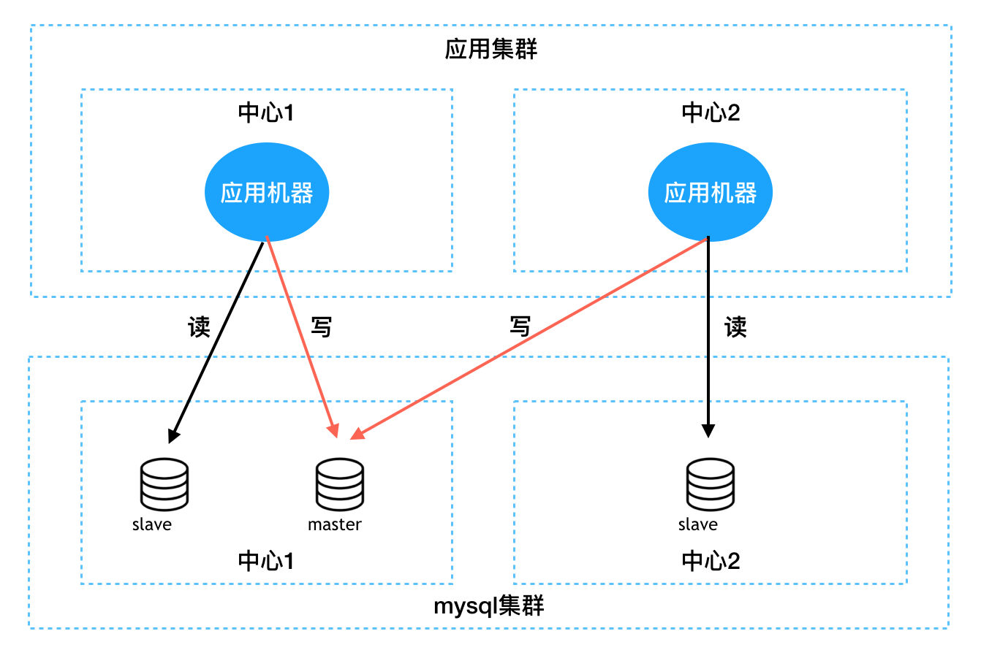

为了满足高可用的需求,mysql集群和业务服务器集群一般需要进行多机房/多中心部署,为此会产生跨机房/中心访问的问题。为了平衡跨机房/中心访问带来的延迟问题，需要应用机器能够优先访问部署在同一机房/中心的DB。


##### 流量控制

> 参考：[Zebra流量控制](https://github.com/Meituan-Dianping/Zebra/wiki/Zebra流量控制)

在系统访问量较大时，某些库的负载可能非常高，或者因为临时故障或系统bug导致大量异常SQL打到某个库上。为了防止数据库被这些异常流量打垮，需要在数据库访问层上对MySQL进行保护，因此zebra需要提供对某些特定SQL或某个库进行限流的功能。（SQL限流只是用于临时解决问题，事后还需业务方进行优化或扩容）


####  zebra-cat-client

##### 端到端监控

端到端的监控，一端指的是应用服务器，另一端指的是数据库服务器，一次端到端过程，就是一次完整的请求响应过程，中间经历两次来回网络的开销。端到端监控之所以重要，因为它最能够客观的反映SQL的性能。比起MySQL服务端的监控指标，端到端监控还把来回的两次网络开销算了进去。过往的历史经验来看，会经常出现在端到端监控上看到慢查询，但这条慢查询却不能够在MySQL服务器上查出，这是因为有可能这条SQL在网络上多花了开销，或者在MySQL的队列中多等待了一段时间。 因此，端到端的监控是如此的重要！ zebra使用的是cat来进行端到端的监控。在这些监控平台上，可以明确的看到具体的某条SQL的性能指标，包括平均响应时间、99线、999线等。在CAT上还能够抓取出慢查询报表告诉开发，然后开发对这些慢查询进行优化。

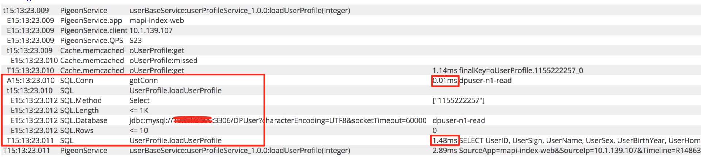 举例来说，上图是CAT上SQL打点的一个截图，从中可以看到以下信息：

- 从连接池拿到连接花了0.01ms(SQL.Conn)
- 整个SQL(UserProfile.loadUserProfile)的执行开始时间（15:13:23.010）和 结束时间（15:13:23.011）
- 这条SQL查询的结果为 0 (SQL.Rows)
- 在dpuser-n1-read数据库上进行了查询Select
- 这条SQL具体的SQL是：SELECT UserID,......，和这条PreparedStatement需要的参数是：115522257
- 这条SQL总共执行了1.48ms
- 整个调用链路上SQL的位置


#### zebra-dao

> 参考：[zebra-dao接入指南](https://github.com/Meituan-Dianping/Zebra/wiki/Zebra-dao接入指南)

对mybatis的轻量级封装，所有mybatis原有的功能都具备，额外提供了异步化接口、分页插件、多数据源等功能。用法本质上就是mybatis的用法。


##### 异步化接口

一个服务可能包括RPC调用请求、MemCached请求、KV存储请求以及MySQL数据库调用，目前其它三种请求的组件都有异步化的接口，但是数据库调用并没有。所以，在这个情况下，开发了这个异步化的DAO。目前，美团点评公司内部已有多个业务接入使用，已经接受了线上环境的验证和考验。


##### 分页插件

支持逻辑分页和物理分页


##### 多数据源

支持配置多个数据源，通过注解的方式指应该使用哪个数据源。


## zebra客户端结构

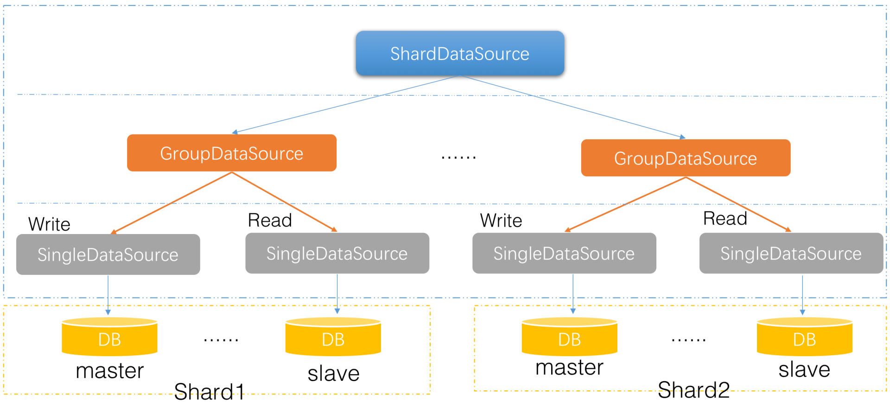

1. 最上层 **ShardDataSource**： 用于分库分表； 包含一个或多个 GroupDataSrouce
2. **GroupDataSource**： 主要用于读写分离， 分库中的一个shard
3. 最下层的 **SingleDataSource**： 主要用于和 mysql 单个实例的连接， 这边是真正和连接池 dbcp/druid/hikaricp 打交道的

ShardDataSource、GroupDataSource都实现了JDBC协议的**javax.sql.DataSource**接口，因此你可以把二者都当做一个普通的数据库连接池来使用。所有读写分离、分库分表的底层实现逻辑，都对用户进行了屏蔽。


## 分库分表数据源ShardDataSource初始化过程

**ShardDataSource** 间接实现了 jdbc api 的 DataSource 接口

它持有多个GroupDataSource，存于 dataSourcePool 的 map 中 ，dataSourcePool 由数据源仓储 DataSourceRepository 初始化

**ConfigService** 是 zebra 配置获取的接口，包含本地配置、远程配置和zk配置这几个实现 也可以注册spi的方式自定义配置获取逻辑

**ShardRouter** 为分片路由器，负责根据分片键和路由规则定位到目标分库和分表， 唯一实现类 **DefaultShardRouter** ； 它由 RouterBuilder 构造器负责解析 configService 拉取的配置构建而成


### 初始化过程 ShardDatasource#init()

1. ConfigServiceFactory 根据配置的类型（本地配置文件/zk） 创建具体的ConfigService实例
2. 传入configService，实例化routerFactory : RouteBuilder ，它借助 configService获取路由配置并解析
3. 初始化 cat 过滤器，用于上报监控
4. 如果有自定义过滤器，则把这些封装到一个 DefaultJdbcFilterChain 责任链里边 依次初始化
5. 正式开始初始化 ShardDatsource#initInternal()
   1. 通过 routerFactory 构建出 ShardRouter
   2. DataSourceRepository.getInstance()
   3. 初始化dataSourceRepository ，内部会挨个初始化 GroupDataSource
   4. GroupDataSource 初始化sql执行线程池 SQLThreadPoolExecutor， 如果是读写分离的则会创建1个读1个写 总共2个线程池
   5. SQLParser.init(); 初始化 sql 解析器， 基于 alibabali.druid ast ； 解析一下 "select * from Test"


## 分库分表语句ShardPreparedStatement执行过程

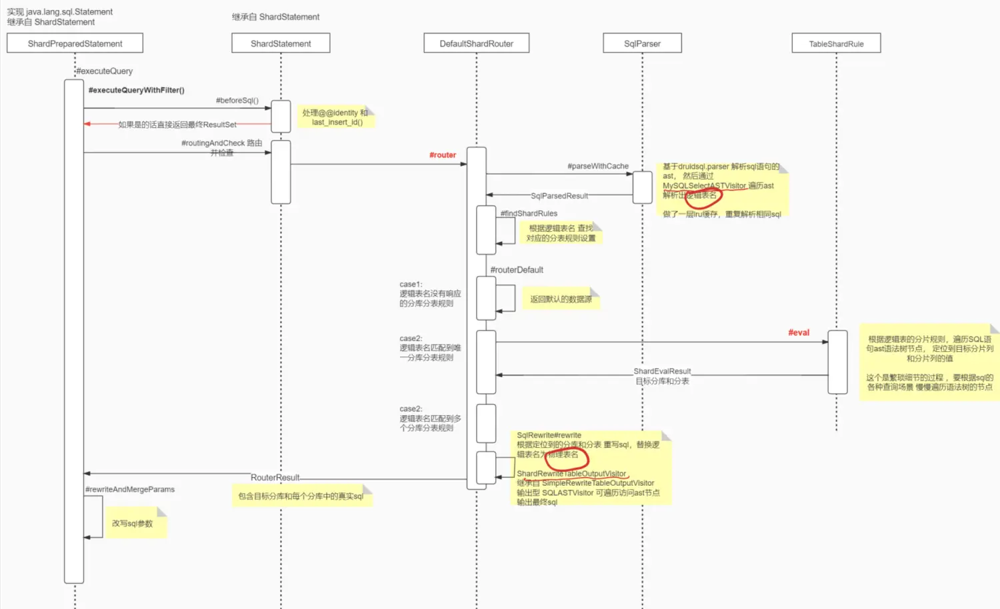

主要过程包括：

1. 分库分表的路由定位
2. sql语句的 ast 抽象语法树的解析
3. 通过自定义 SQLASTVisitor (**MySQLSelectASTVisitor**) 遍历sql ast，解析出逻辑表名
4. 查找逻辑表名对应的分库分表规则
5. 根据逻辑表的分库分表规则，遍历sql ast定位分片键的值 根据中间件的设计需要支持分库分表语句的各种sql场景，遍历ast树，做一堆if else判断 （分库分表后，不应该支持复杂的sql，可酌情考虑公司业务场景 需要支持的sql语句 来遍历 sql树）
6. SqlRewrite#rewrite 改写 sql语句，根据逻辑表的分库分表规则和分片键的值，将逻辑表名改写成目标物理表名； 改写后的sql即为在目标分库中执行的真实SQL 改写sql的过程也是利用 **SQLASTVisitor** 来操作的，不过用的自定义的 **ShardRewriteTableOutputVisitor** （继承输出型visitor：**SQLASTOutputVisitor**）来遍历 sql tree 输出sql字符串， 遇到 SQLExprTableSource 节点的时候改写表名
7. 路由到目标的分库和分表 可能是多个库和表， #reWriteAndMergeParams 会把sql参数塞到所有重写后的的分表sql语句中
8. 后面再执行的时候 会根据 路由结果是不是多个分库，按照配置单库并发度 concurrencyLevel （默认是1）来决定在每个目标分库中不同表的sql是用一个java 线程还是多个java线程并行执行， 具体过程 参考 [如果定位到多个分库表怎么执行的？](https://www.cnblogs.com/mushishi/p/15022072.html)


## 逻辑表名的解析过程

zebra 解析sql使用的阿里druid连接池内部的 ast解析器

`SQLParser#parseInternal(SQLStatement stmt)` 解析sql 语句的时候，会使用自定义 ast 的访问器 AbstractMySQLASTVisitor 去访问 SQLStatement 的 SQLExprTableSource

```java
@Override
public boolean visit(SQLExprTableSource x) {
	SQLName table = (SQLName) x.getExpr();
	String simpleName = table.getSimpleName();
	String tableName = simpleName.startsWith("`") ? parseTableName(simpleName) : simpleName;
 
	result.getRouterContext().getTableSet().add(tableName);
 
	return true;
}
```

从而获取到逻辑表名， 填充到路由上下文 RouterContext 中供后续使用。


## 如果定位到多个分库或分表怎么执行的

假设分库分表情况如下

- 分库 id0：分表 test_0 、 test_1
- 分库 id1:  分表 test_2、 test_3

sql语句： `select test.* from test`


### 一、路由结果

`DefaultRouter#router` 路由出来的结果两个 RouterResult， 每个里边有多个分表的sql， 即所有分库下的所有test分表

```yaml
dbName: id0
sqls：
- SELECT test_0.* \nFROM test_0
- SELECT test_1.* \nFROM test_1
 
dbName: id1
sqls：
- SELECT test_2.* \nFROM test_2
- SELECT test_3.* \nFROM test_3
```


### 二、执行过程

如果路由定位到多个分库，会根据并发度n，将每个分库的sql语句 拆分成n个任务，放入线程池执行
默认单库并发度 concurrentLevel = 1, 执行过程为

(1) 执行分库id0里各分表的sql

- 从分库id0 对应的数据源中一个数据连接，创建 (SELECT test_0.* \nFROM test_0)的 statement
- 从分库id0 对应的数据源中一个数据连接，创建l (SELECT test_1.* \nFROM test_1 )的statement
- 把这两个statement包裹到一个线程task中

(2) 执行分库id1里各分表的sql

- 从分库id1 对应的数据源中一个数据连接，创建 (SELECT test_2.* \nFROM test_2 ) 的statement
- 从分库id1 对应的数据源中一个数据连接，创建l (SELECT test_3.* \nFROM test_3 )的statement
- 把这两个statement包裹到一个线程task中

(3) 把这两个task 丢到 SQLThreadPoolExecutor 中执行， 阻塞等待执行完毕


### 三、结果集合并

ShardResultSet#init() -> ShardResultSetMerger.merge 合并这四个 ResultSet

ShardResultSet 内部包含多个sql执行的结果集 ResultSet， 它实现了 ResultSet ，当从它遍历查询结果的时候，会根据 MergeContext( join、limit…etc）来组合结果数据

debug单测入口：

```
com.dianping.zebra.shard.jdbc.MultiDBPreparedStatementLifeCycleTest#testSingleRouterResult1
```


### 总结

路由定位到多个分库或分表的执行逻辑：

`ShardPrepardStatement#normalSelectExecute` 会依次执行这多个路由目标分库 RouterResult 内的语句，然后 `ShardPrepardStatement#executeQueryByOriginal`执行单个分库内的所有sql， 如果它发现有多个sql需要执行，则会根据 单库并发度的配置 concurrentLevel=1

(1) 默认concurrentLevel = 1 ，每个分库内不同表的sql， 先创建对应的 statement， 然后会打包到**一个**task里

(2) 如果 concurrentLevel > 1， 则每个分库会获取 concurrentLevel 个数据库连接，将这几条分表的sql均摊到这几个数据库连接，创建多个statement， 包成 concurrentLevel 个线程task

(3) 然后丢到java线程池中并发执行 ，然后阻塞等待执行完毕，获取结果


## 不带分片键的sql会怎么执行

`TableShardRule#eval` 根据路由规则解析sql的时候如果没匹配找到分片键的值

```java
// full table scan if is not insert sql.
if (type != SqlType.INSERT && type != SqlType.REPLACE) {
	if (forbidNoShardKeyWrite) {
		if (SqlType.UPDATE == type || SqlType.DELETE == type) {
			throw new ShardRouterException("Update or delete is forbidden without shard key!");
		}
	}
	return new ShardEvalResult(tableName, masterDimension.getAllDBAndTables()); // 返回所有的库表
} else {
	throw new ShardRouterException("Cannot find any shard columns in your insert sql.");
}
```

1. 如果是 insert 或 replace 语句，必须提供分片键的值，不然直接报错
2. 如果禁止不带分片键的写操作 forbidNoShardKeyWrite = true，则直接报错；否则返回所有的分库和分表，全表扫描


## 分组数据源GroupDataSource及其初始化 

GroupDataSource 负责一组 db节点，包含多个SingleDataSource， 将它们分为一个主和多个从进行读写分离和多个从库的负载均衡； 对应db部署架构的话 对应一个分库 或 一主多从

shardDataSource分库分表中的分库对应的就是 GroupDataSource，也可单独读写分离、负载均衡使用


### 初始化过程 GroupDataSource#init()

```java
public synchronized void init() {
	if (StringUtils.isBlank(jdbcRef)) {
		throw new ZebraException("jdbcRef cannot be empty");
	}
 
	this.checkJdbcRefInitializationTimes();
 
	if (init) {
		throw new ZebraException(String.format("GroupDataSource [%s] is already initialized once.", jdbcRef));
	} else {
		this.init = true;
	}
 
	try {
	             // 权限检查，根据配置判断当前应用是否有db的访问权限
		this.securityCheck();
		// 初始化配置相关的组件
		this.initConfig();
		// 加载自定义jdbcFilter过滤器
		this.initFilters();
		// 逐个执行jdbcFilter过滤器 initGroupDataSource
		if (filters != null && filters.size() > 0) {
			JdbcFilter chain = new DefaultJdbcFilterChain(filters) {
				@Override
				public void initGroupDataSource(GroupDataSource source, JdbcFilter chain) {
					if (index < filters.size()) {
						filters.get(index++).initGroupDataSource(source, chain);
					} else {
						// 开始初始化
						source.initInternal();
					}
				}
			};
			chain.initGroupDataSource(this, chain);
		} else {
			// 开始初始化
			initInternal();
		}
 
		// 记录下启动次数
		this.recordJdbcRefInitializationTimes();
	} catch (Exception e) {
		String errorMsg = "init GroupDataSource[" + jdbcRef + "] error!";
		LOGGER.error(errorMsg, e);
		throw new ZebraException(errorMsg, e);
	}
}
```


### 开始初始化 #initInternal()

```java
protected void initInternal() {
	// 初始化 SingleDataSource 单数据的源管理器
	// 启动监控线程任务 CloseDataSourceTask, 不断轮训待关闭的SingleDataSource(配置刷新后 老的ds或者主动关闭的ds）
	SingleDataSourceManagerFactory.getDataSourceManager().init();
	// 初始化主库和从库的SingleDataSource
	initDataSources();
	// 初始化读写策略，可以强指定读master
	initReadWriteStrategy();
	// 将GroupDataSource自身加入到 配置刷新列表中，每隔60秒会检查一次配置，如果发生变更的话会重新拉取配置 重建sds
	DataSourceConfigRefresh.getInstance().register(this);
	LOGGER.info(String.format("GroupDataSource(%s) successfully initialized.", jdbcRef));
}
```


### initDataSource(); 初始化数据源，会将读写数据源单独初始化

```java
private void initDataSources() {
	try {
		// 初始化读库数据源，连接获取的时候读库间根据权重负载均衡 选择SingleDataSource
		this.**readDataSource** = new LoadBalancedDataSource(getLoadBalancedConfig(groupConfig.getDataSourceConfigs()),
		      this.filters, systemConfigManager.getSystemConfig(), this.configManagerType, this.configService,
		      groupConfig.getRouterStrategy());
		this.readDataSource.init();
		// 初始化写库(master)数据源 快速失败
		this.**writeDataSource** = new FailOverDataSource(getFailoverConfig(groupConfig.getDataSourceConfigs()),
		      this.filters);
		this.writeDataSource.init();
	} catch (RuntimeException e) {
		try {
			this.close(this.readDataSource, this.writeDataSource);
		} catch (SQLException ignore) {
		}
 
		throw new ZebraException("fail to initialize group dataSource [" + jdbcRef + "]", e);
	}
}
```

- LoadBalancedDataSource 也是实现了DataSource的，它包裹分组内所有从库的 SingleDataSource 根据负载策略选取 sds
- FailOverDataSource 同样实现了DataSource，它包裹写库的 SingleDataSource

这两个算是装饰模式。


## 分组数据源GroupDataSource读写分离

前面 [分组数据源GroupDataSource及其初始化](https://www.cnblogs.com/mushishi/p/15022066.html) 已经知道 GroupDataSource 在初始化的时候会初始化两个DataSource， 读 readDataSource + 写 writeDataSource

由于zebra 也是基于 jdbc规范实现的， 所以sql执行的过程和 jdbc api最原始的api一样的

1.  从DataSource 获取连接 #getConnection
2. Connection 创建语句 #prepareStatement
3.  语句的执行 Statement#executeQuery()

可以顺着上述jdbc api的执行过程查看代码执行逻辑， 发现其中读写分离的核心逻辑位于 `GroupConnection#getRealConnection(sql, forceWrite)` 中， 根据不同的情况 从 读 readDataSource 还是 writeDataSource 取底层连接

具体过程：

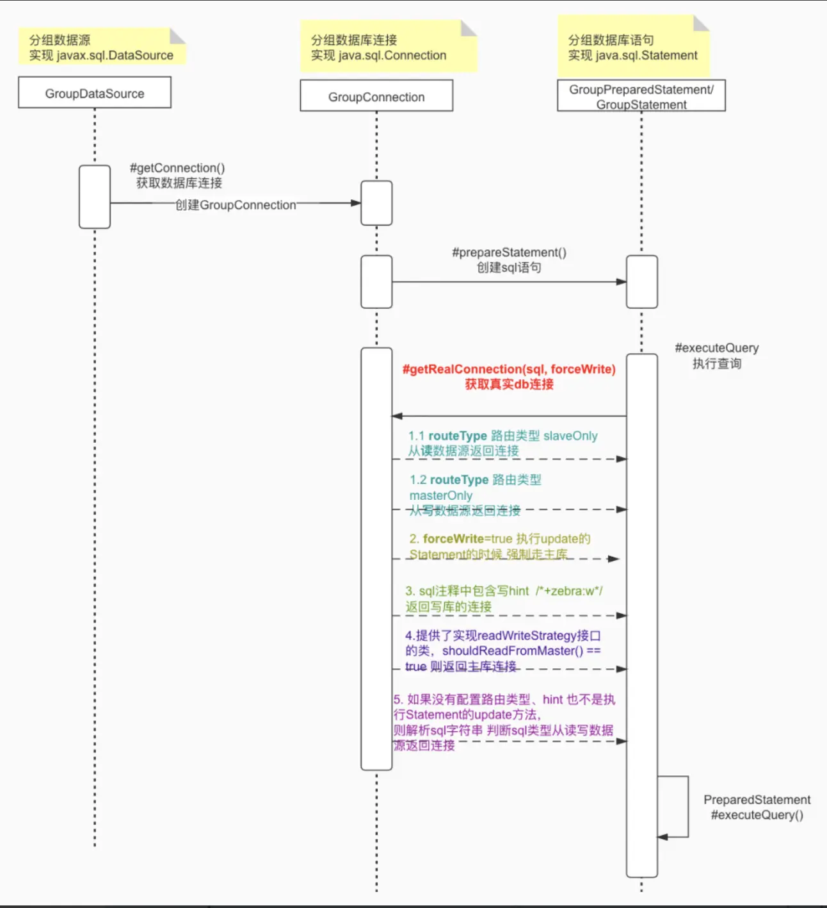


### 读写库判断逻辑

- **routeType** 路由类型默认为 masterSlave 读写分离, 可在配置文件修改

- **forceWrite**=true的场景为直接调用 Statement 的更新方法 Statement#executeUpdate 或批量执行场景

  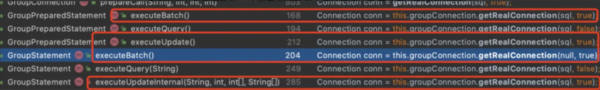

- **sql hint** 在sql前增加了特殊注释 /*+zebra:w*/ 则走写库

- **ReadWriteStrategy** 则是一个预定义的java接口， 如果提供了实现类， 则会根据 #shouldReadFromMaster() 来判断强制从写库读数据， 主要用于避免 写主库然后读从库 而从库同步延迟的问题。`ZebraForceMasterHelper#forceMasterInLocalContext()` 强制读主库就是基于 ReadWriteStrategy 的实现类 LocalContextReadWriteStrategy 来实现的 （内部用的ThreadLocal存储状态）

- 最后，会直接根据 sql 字符串解析是读操作(select) 还是写操作(update/delete/select for update/ddl ..) 来从读ds还是写ds获取连接。

需要debug的话，可以从单元测试入手

- LocalContextReadWriteStrategyTest
- CustomizedReadWriteStrategyWrapperTest
- com.dianping.zebra.group.jdbc.DPGroupPreparedStatementTest#test_read_and_write_perpared_statement


## GroupDataSource读库的负载均衡

GroupDataSource的物理结构

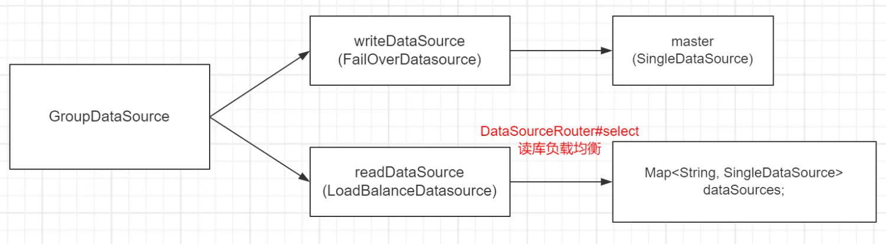


### 负载均衡的对象

zebra的负载均衡是在GroupDataSource的读库 readDataSource( LoadBalanceDataSource) 中进行的, 它内部包含多个读库节点的SingleDataSource

```
LoadBalanceDataSource#getConnection() -> router.select(context);
```


### 关键对象DataSourceRouter 数据源路由器

负载均衡由 DataSourceRouter 数据源路由器实现具体的逻辑 => 它是个套娃负载均衡由 DataSourceRouter 数据源路由器实现具体的逻辑 => 它是个套娃

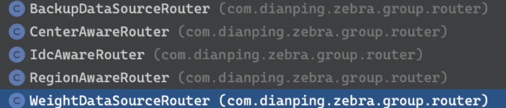

包含 中心路由、idc路由、区域路由和权重， 这几个负载均衡算法是嵌套执行的， 从范围大到小逐层进行

默认的 routerStrategy=“WeightRouter" 即 WeightDataSourceRouter 在最里层同机房范围内的多个读库是根据权重来选择的

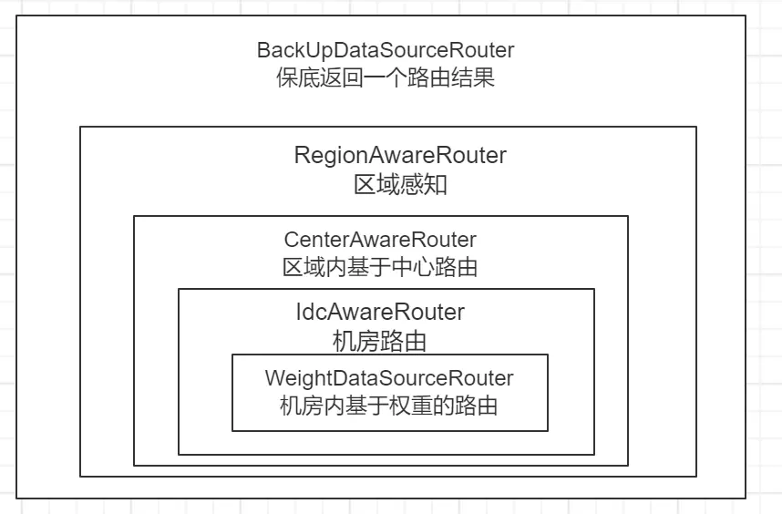

了解更多，官方文档 [zebra路由设计](https://github.com/Meituan-Dianping/Zebra/wiki/Zebra路由设计)

区域、中心、机房，最后都会走向基于权重的路由 `WeightDataSourceRouter#select()`

```java
public RouterTarget select(Set<RouterTarget> excludeTargets) {
	if (!this.targets.isEmpty()) {
		TreeSet<RouterTarget> weights = this.targets;
		int tmpGroupDataSourceTargetSize = this.groupDataSourceTargetSize;
 
		if (excludeTargets != null && !excludeTargets.isEmpty()) {
			// 需要排除某些GroupDataSourceTarget的话，就重新copy一个weights
			TreeSet<RouterTarget> copyWeights = new TreeSet<RouterTarget>();
			tmpGroupDataSourceTargetSize = 0;
			for (RouterTarget routerTarget : weights) {
				if (excludeTargets.contains(routerTarget)) {
					continue;
				}
				// 先将节点先放入到排序集合中
				// 假设  节点1 -> weight=2, 节点2 -> weight=3
				// 则在排序树中 节点1 -> sort=2, 节点2 -> sort = 2+3
				int weight = routerTarget.getWeight();
				tmpGroupDataSourceTargetSize += weight;
				copyWeights.add(new RouterTarget(routerTarget.getId(), weight, tmpGroupDataSourceTargetSize - 1));
			}
			weights = copyWeights;
		}
 
		if (weights.isEmpty() || tmpGroupDataSourceTargetSize <= 0) {
			return null;
		}
		// 取一个随机数
		int randomNum = random.nextInt(tmpGroupDataSourceTargetSize);
		RouterTarget tempForSearch = new RouterTarget(null, -1, randomNum);
		//排序集合中最靠近随机数的entry则为目标节点
		return weights.ceiling(tempForSearch);
	} else {
		return null;
	}
}
}
```

想要查看具体执行细节 ，可以debug 源码里 com.dianping.zebra.group.router 包下的 DataSourceRouter 单测。


## GroupDataSource配置变更实时生效

在初始化 GroupDataSource 的时候，会往它的配置管理器 DefaultDataSourceConfigManager中添加了一个配置监听器

代码路径：`GroupDataSource#init() -> initConfig();`

```java
this.dataSourceConfigManager.addListerner(new GroupDataSourceConfigChangedListener());
```

```java
public class GroupDataSourceConfigChangedListener implements PropertyChangeListener {
    @Override
    public synchronized void propertyChange(PropertyChangeEvent evt) {
        refresh(evt.getPropertyName());
    }
}
```

在监听到配置变更（zk或http）的时候，会调用分组ds内部的 `GroupDataSource#refresh` 方法进行刷新

```java
@Override
public synchronized void refresh(String propertyToChange) {
    if (!this.init) {
        return;
    }

    // 拉取最新配置
    final GroupDataSourceConfig newGroupConfig = buildGroupConfig();

    // 如果配置未变更，则不再往下执行
    if (this.groupConfig.toString().equals(newGroupConfig.toString())) {
        return;
    }

    // 随机阻塞一会，避免对db造成瞬时大量地连接压力
    SmoothReload sr = new SmoothReload(getMaxWarmupTime());
    sr.waitForReload();

    // jdbc 过滤器 #refreshGroupDataSource 通知group ds刷新了
    if (filters != null && filters.size() > 0) {
        JdbcFilter chain = new DefaultJdbcFilterChain(filters) {
            @Override
            public void refreshGroupDataSource(GroupDataSource source, String propertyToChange, JdbcFilter chain) {
                if (index < filters.size()) {
                    filters.get(index++).refreshGroupDataSource(source, propertyToChange, chain);
                } else {
                    // 刷新地内部逻辑
                    source.refreshInternal(newGroupConfig);
                }
            }
        };
        chain.refreshGroupDataSource(this, propertyToChange, chain);
    } else {
        refreshInternal(newGroupConfig);
    }
}
```


```java
	private void refreshInternal(GroupDataSourceConfig groupDataSourceConfig) {
		LOGGER.info(String.format("start to refresh the GroupDataSource(%s)...", jdbcRef));

		try {
			// 重置写库 singleDataSource
			Map<String, DataSourceConfig> newFailoverConfig = getFailoverConfig(
			      groupDataSourceConfig.getDataSourceConfigs());
			this.writeDataSource.refresh(newFailoverConfig);

			// 重置读库
			Map<String, DataSourceConfig> newLoadBalancedConfig = getLoadBalancedConfig(
			      groupDataSourceConfig.getDataSourceConfigs());
			this.readDataSource.refresh(newLoadBalancedConfig);

			this.groupConfig = groupDataSourceConfig;

			initFilters();
			refreshReadWriteStrategyConfig();

			LOGGER.info(String.format("refresh the GroupDataSources(%s) successfully!", jdbcRef));
		} catch (Throwable e) {
			// never here
			LOGGER.error(e.getMessage(), e);
			LOGGER.warn(String.format("fail to refresh the GroupDataSource(%s)", jdbcRef));
			throw new ZebraConfigException("fail to refresh the GroupDataSource(" + jdbcRef + ")", e);
		}
	}
```

参考 [分组GroupDataSource及其初始化](https://www.cnblogs.com/mushishi/p/15022066.html) 中初始化的写库和读库的 ds 类型

1. 刷新写库 `writeDataSource#refresh (FailOverDataSource#refresh)` 筛选配置中的第一个写库，新建SingleDataSource 替换掉老的，然后销毁老的sds
2. 刷新读库 `readDataSource#refresh (LoadBalanceDataSource#refresh)`
3. 筛选配置中的所有读库，新建SingleDataSource 替换掉老的，然后销毁老的sds

一般是直接重建底层 DataSource连接池 ，不然要根据底层数据库连接池的支持情况来 更新单个属性，这样适配起来就会非常的繁琐， 而这种db配置变更本身是非常低频或者在故障的时候急救措施， 重建 DataSource 期间少许的报错也可以接受

除了这个实时的配置更新之外，还有一个 **DataSourceConfigRefresh** 每隔1分钟，检查一次group分组和分组内single的配置是否发生变化； 这样就避免了 配置更新的时候由于网络异常等原因 数据源刷新失败

> zebra 只支持整个GroupDataSource 粒度的配置刷新，没有单独刷新 SingleDataSource配置， 不能单独调整连接池的配置
> 如果读写分离中其中一个db节点故障，要切换成备份节点，这个时候 zebra就只能整体变动整个Group分组，切换会比较费时； 个人觉得还是需要支持单个 db节点（SingleDataSouce）的配置变更，方便故障切换


## SingleDataSource构建和初始化

SingleDataSource 对应 GroupDataSource 主库节点 或一个从库节点

由于它是对应的是实际的db节点，直接和底层数据库连接池打交道； zebra 将它的生命周期交由 SingleDataSourceManager 进行管理，负责构建、启停、销毁， 销毁的过程是异步的，先将其塞到阻塞队列 `BlockingQueue<SingleDataSource> toBeClosedDataSource` 中，有一个监控线程每隔100ms从队列中取出待关闭的ds 关闭之 （这个或许有助于配置变更时加快 GroupDataSource 的重建）


### SingleDataSource的构建和初始化

SingleDataSourceManager#createDataSource()

-> initDataSourceWithFilters()

-> initDataSourceOrigin()

#### (1) 构建SingleDataSource对象: SingleDataSourceManager#createDataSource()

```java
// internal use only
public SingleDataSource(DataSourceConfig config, List<JdbcFilter> filters) {
    this.datasourceId = config.getId();
    this.config = config;
    this.punisher = new CountPunisher(this, config.getTimeWindow(), config.getPunishLimit());
    this.filters = filters;
    this.poolType = config.getType();
    // 懒加载
    this.lazyInit = config.isLazyInit();
    this.withDefalutValue = true;
    this.forceClose = false;
    // 根据配置构建对应的底层数据库连接池 
    this.dataSourcePool = DataSourcePoolFactory.buildDataSourcePool(config);

    initDataSourceWithFilters(config);
}
```

**this.poolType：** 连接池类型，如 hikaricp、druid

**this.lazyInit：**  是否惰性初始化，默认是true， 底层连接池真正初始化的时候 会直接初始化 initialSize个物理连接，过程较慢， 如果为false 那么会影响应用启动时间

**this.dataSourcePool：** 对底层连接池的包装类， 根据 poolType 初始化对应的类型

**DataSourcePool** 的定义

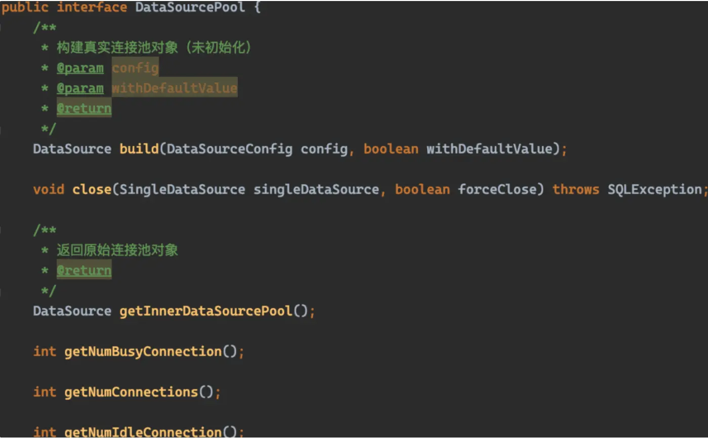

DataSourcePool 实现类则对应各种连接池，命名规则为 xxDataSourcePool

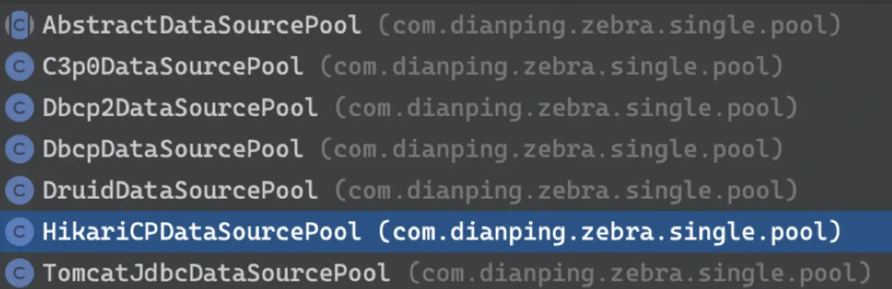

以目前最快的连接池 hikariCP为例，适配类为 HikariDataSourcePool， #build() 返回 HikariDataSource 对象

#### (2) 初始化 initDataSourceWithFilters() -> initDataSourceOrigin()

`initDataSourceWithFilters()` 看名字，依旧是先执行以下自定义的 jdbcFilter 当前生命周期的过滤器方法 jdbcFilter#initDataSourceOrigin()

#### (3) initDataSourceOrigin() 初始化底层连接池

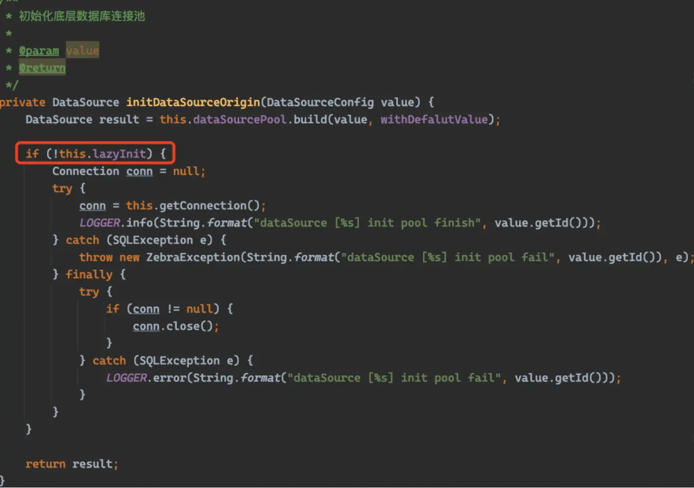

1. DataSource result = this.dataSourcePool.build(value, withDefalutValue); 构建底层连接池对象， 如hikariCp的 HikariCPDataSource、 druid的DruidDataSource
2. 初始化连接 如果非惰性初始化 this.lazyInit = false(默认是true) 的话才调用 getConnection() 让底层连接池进行初始化， 否则的话不执行；

底层连接池一般是在第一次获取连接的时候，进行初始化操作 如一次性初始化 initialSize 个物理连接，这个过程比较慢，不建议设为false。

### SindleDataSource#close()

当SingleDataSource#close 的时候，会一起关闭内部的 DataSourcePool 进而把底层的 连接池给关闭了。

## insert后获取自增值的处理

sql语句：

```sql
(1) insert into [table] xx  values(x,x,xx);
(2) select @@Identity; 或 select last_insert_id();
```

比如这种常见的 insert 后要获取自增主键值的， 需要在同一个连接同一个statement操作

如先 `Statement#executeUpdate("insert into [table] xx values(x,x,xx);")` ， 然后再用同一个`statement#executeQuery("select @@Identity;")` 获取自增值

1. 执行第一条语句后 zebra 会先把第一条sql语句执行后 原生 jdbc Statement#getGeneratedKeys() 返回的 ResultSet 缓存在ShardStatement 里
2. 等后面的语句执行到 select @@identity; 的时候 直接返回 generatedKey。


## 如果数据库连接建立失败会怎样


### 如果数据库连接首次建立失败，会怎么样？

`SingleDataSource#initDataSourceOrigin -> this.dataSourcePool.build` 构建底层数据库连接池的时候，如果创建失败会直接抛出一个异常 ，初始化状态不会置为 true，如下

```java
throw new ZebraConfigException(String.format("HikariCP dataSource [%s] created error : ", config.getId()), e);
```

如果配置的不是懒加载，则会直接去获取下连接 getConnectionOrigin() 来触发底层连接池的初始化 ，这个时候连接建立失败 则抛出底层数据库连接池的内部异常，不会执行到 init=true 这行代码，连接池处于未初始化状态，下次再 getConnection 的时候会再次去初始化


### 如果配置变更后，配置无效导致连接池重建失败，会影响老的连接池吗？

当配置发生变化的时候， GroupDataSource 会重建内部的 SingleDataSource

```java
// create new
newMaster = this.dataSourceManager.createDataSource(config, this.filters);
 
// switch first
SingleDataSource oldMaster = master;
this.master = newMaster;
this.configs = newFailoverConfig;
 
// close after
this.dataSourceManager.destoryDataSource(oldMaster);
```

它是先构建新SingleDataSource 然后替换旧的，也就是说如果新的构建失败， 则不会走到替换的步骤，继续使用老数据源


### 那么，问题来了， 如果在配置变更的时候 网络有问题，导致连接超时 会怎么样？

默认底层连接池是懒加载的， 只是构建了底层连接池的对象实例， 不会去执行初始化(获取连接) 的操作，这一步不会失败；等实际要执行sql的时候，获取连接超时失败的话，下次再次重试就好了

如果 lazyInit 设置为 false， 就有可能导致配置更新了，但是由于新数据源构建后初始化失败而没有替换掉老的


## JdbcFilter过滤器和SPI扩展

### 一、 JdbcFilter 过滤器

zebra 定义了 JdbcFilter 过滤器， 它包含的方法覆盖了 zebra 执行生命周期的各个环节（如各层数据源的初始化/刷新、分组连接的获取/关闭、sql的执行 等）； 那么就方便在各个环节进行监控上报等操作了

```java
public interface JdbcFilter {
	int DEFAULT_ORDER = 0;
 
	int MAX_ORDER = Integer.MAX_VALUE;
 
	int MIN_ORDER = Integer.MIN_VALUE;
 
	/**
	 * filter ordering <br>
	 * filter_with_order_3_start filter_with_order_2_start
	 * filter_with_order_1_start targer_start filter_with_order_1_finish
	 * filter_with_order_2_finish filter_with_order_3_finish
	 *
	 * @return the order of execute
	 */
	int getOrder();
 
	/**
	 * init filter
	 */
	void init();
 
	/** GroupDataSource Filter **/
	void initGroupDataSource(GroupDataSource source, JdbcFilter chain);
 
	void refreshGroupDataSource(GroupDataSource source, String propertiesName, JdbcFilter chain);
 
	GroupConnection getGroupConnection(GroupDataSource source, JdbcFilter chain) throws SQLException;
 
	FailOverDataSource.FindMasterDataSourceResult findMasterFailOverDataSource(
			FailOverDataSource.MasterDataSourceMonitor source, JdbcFilter chain);
 
	void closeGroupConnection(GroupConnection source, JdbcFilter chain) throws SQLException;
 
	void closeGroupDataSource(GroupDataSource source, JdbcFilter chain) throws SQLException;
 
	void switchFailOverDataSource(FailOverDataSource source, JdbcFilter chain);
 
	/** SingleDataSource Filter **/
	DataSource initSingleDataSource(SingleDataSource source, JdbcFilter chain);
 
	SingleConnection getSingleConnection(SingleDataSource source, JdbcFilter chain) throws SQLException;
 
	String processSQL(DataSourceConfig dsConfig, SQLProcessContext ctx, JdbcFilter chain) throws SQLException;
 
	<T> T executeSingleStatement(SingleStatement source, SingleConnection conn, String sql, List<String> batchedSql,
			boolean isBatched, boolean autoCommit, Object params, JdbcFilter chain) throws SQLException;
 
	void closeSingleConnection(SingleConnection source, JdbcFilter chain) throws SQLException;
 
	void closeSingleDataSource(SingleDataSource source, JdbcFilter chain) throws SQLException;
 
	void closeSingleResultSet(SingleResultSet source, JdbcFilter chain) throws SQLException;
 
	/** ShardDataSource Filter **/
	void initShardDataSource(ShardDataSource source, JdbcFilter chain);
 
	ResultSet executeShardQuery(ShardStatement source, String sql, JdbcFilter chain) throws SQLException;
 
	int executeShardUpdate(ShardStatement source, String sql, int autoGeneratedKeys, int[] columnIndexes,
			String[] columnNames, JdbcFilter chain) throws SQLException;
 
	void shardRouting(RouterResult rr, JdbcFilter chain) throws SQLException;
 
	void shardMerge(ShardResultSet rs, JdbcFilter chain) throws SQLException;
 
	void configChanged(PropertyChangeEvent evt, JdbcFilter chain);
}
```

都是些 void 的无害方法，在zebra数据源、配置及sql代理执行过程的各个点，会执行 JdbcFilter 的对应方法；如在GroupDataSource 初始化的时候，会调用 JdbcFilter#initGroupDataSource 方法

```java
JdbcFilter chain = new DefaultJdbcFilterChain(filters) {
      @Override
      public void initGroupDataSource(GroupDataSource source, JdbcFilter chain) {
          if (index < filters.size()) {
              filters.get(index++).initGroupDataSource(source, chain);
          } else {
              // 开始初始化
              source.initInternal();
          }
      }
  };
 
```

zebra 里边的 JdbcFilter 由 **DefaultFilterManager** 类负责管理，只要是实现了 JdbcFilter 接口的类就会被它通过类加载的方式加载到， 多个filter的执行是加入到责任链 DefaultJdbcFilterChain 里执行的

自带的 JdbcFilter有

- CatFilter上报监控信息到cat
- WallFilter 流控


#### 如何扩展 Filter？

1. 实现Filter接口 一般继承`DefaultJdbcFilter` 即可，Zebra默认提供wallFilter和CatFilter，开发者可以进行参考

   `public class WallFilter extends DefaultJdbcFilter`

2. 注册 Filter

Filter的类加载文件放置在 `META-INF/zebra-filter.properties` 目录下,格式为

- 文件名：zebra.filter.${filterName}=类路径

- 内容： zebra.filter.wall=com.dianping.zebra.filter.wall.WallFilter

  

### 二、SPI扩展

[ZebraSpi扩展说明](https://github.com/Meituan-Dianping/Zebra/wiki/ZebraSpi扩展说明)

zebra 的 SPI 注解

```java
@Target({ ElementType.METHOD, ElementType.TYPE })
@Retention(RetentionPolicy.RUNTIME)
@Inherited
public @interface Spi {
	String name() default "";
 
	Scope scope() default Scope.SINGLETON;
}
```

它针对的是 配置获取方式 **ConfigService**

自定义的 ConfigService Spi 类加载文件可以放置在 `META-INF/services/com.dianping.zebra.config.ConfigService` 文件中 进行注册，如

com.dianping.zebra.config.ZookeeperConfigService

com.dianping.zebra.config.PropertyConfigService

如 zk 配置的定义：

```java
@Spi(name = "zookeeper", scope = Scope.SINGLETON)
public class ZookeeperConfigService implements ConfigService
```

他们会被 ExtensionLoader 加载并创建对象，用于配置拉取。


## 流控设计 

之所以要进行流量控制，是要避免业务应用流出量倾斜，超过分库能承载的压力

zebra的限流架构

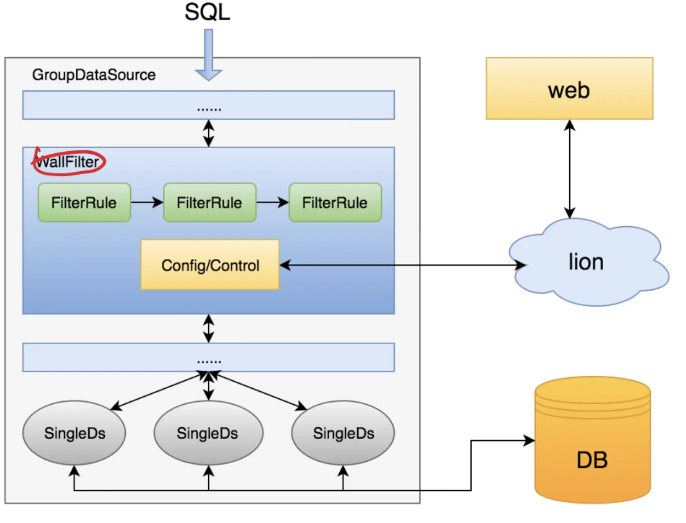

### **粒度**

1. 指定要保护的db节点
2. 指定要流控的应用ip
3. 指定sqlId， 计算规则： sqlId = MD5(/*appName*/{mapper方法}).subString(0, 8)


### 限流策略：

1. **autoControl 自动限流**， 失败率达到一定的阈值后触发 小于的时候逐步恢复(线性、指数)
2. **forceControl 强制限流**，会对所有连接进行过滤，立即将流量降到下限； 用于紧急情况，需要手动开启和关闭

流程的处理收拢在 **WallFilter**（实现JdbcFilter的 processSql方法）。

更详细的说明： 参见官方 [zebra流量控制](https://github.com/Meituan-Dianping/Zebra/wiki/Zebra流量控制)


## 参考

https://www.cnblogs.com/mushishi/p/15022316.html