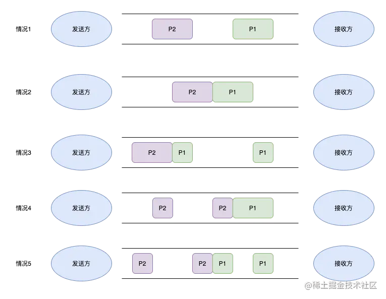
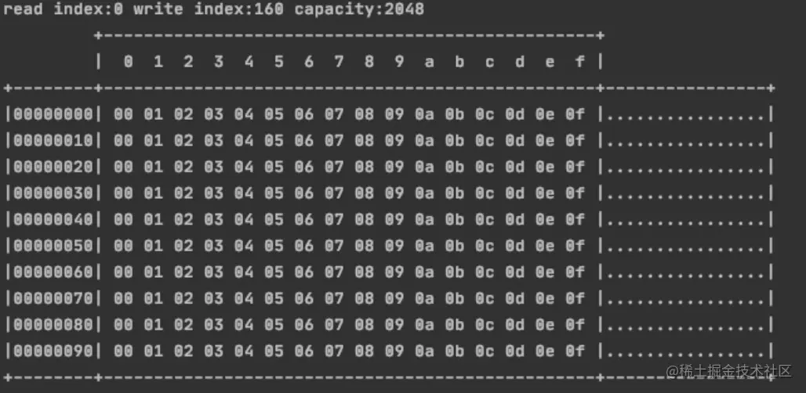
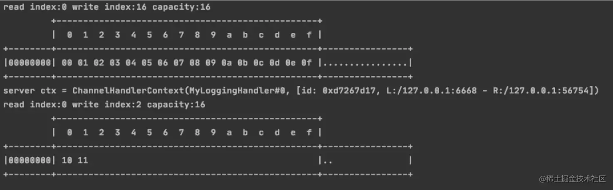
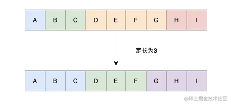
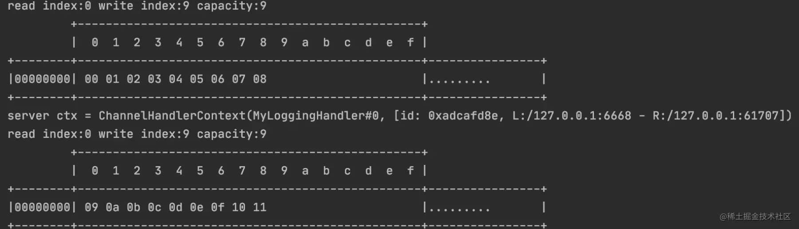
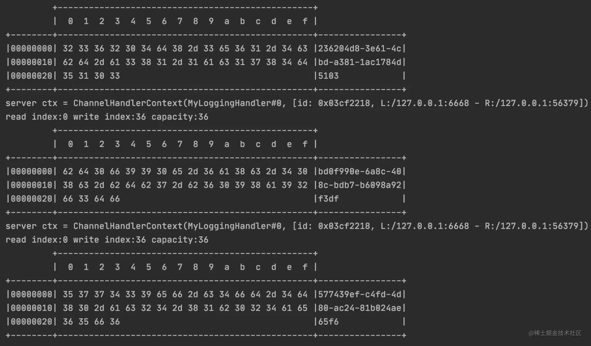
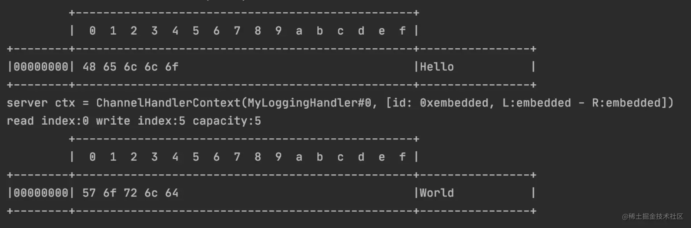

# 浅谈Netty源码-粘包半包


## 什么是粘包半包

TCP是面向连接的，可靠的，支持字节流传输的协议。也就是说TCP在保持连接的情况下，消息是没有边界的，发送方可以持续不断地把包发送到接收方，如果发送的数据包太小，TCP会基于Nagle算法对较小的数据包进行整合，所以使用TCP作为传输协议，会有以下几种情况



如上图

1. 接收方接收到的包是独立完整的数据包
2. 发送方发送的包粘在一起了，由于每个包长度不定，服务端无法拆开，这就是粘包现象，粘包原因有两种，一：发送方开启了Nagle算法，整合了多个包进行发送。二：接收方没有及时处理数据且接收窗口足够大导致缓冲区缓冲了多个数据包
3. 3、4、5都是拆包现象，拆包原因有两种，一：发送方发送的数据量大于协议的 MSS 或者 MTU，必须拆包。（MSS 是 TCP 层的最大分段大小，TCP 层发送给 IP 层的数据不能超过该值；MTU 是最大传输单元，是物理层提供给上层一次最大传输数据的大小，用来限制 IP 层的数据传输大小）。二：接收方的缓冲区无法承接此时发送方的数据量


### 代码演示


#### 粘包

```java
public class NettyServer {

    public static void main(String[] args) throws InterruptedException {

        // 1.创建两个线程组 bossGroup 和 workerGroup
        // 2.bossGroup只是处理连接请求，真正的和客户端业务处理，会交给workerGroup完成
        // 3.两个都是无限循环
        EventLoopGroup bossGroup = new NioEventLoopGroup();
        EventLoopGroup workerGroup = new NioEventLoopGroup();

        try {
            // 创建服务器端的启动对象，配置参数
            ServerBootstrap bootstrap = new ServerBootstrap();

            // 使用链式编程来进行设置
            // 设置两个线程组
            bootstrap.group(bossGroup, workerGroup)
                    // 使用NioServerSocketChannel作为服务器的通道实现
                    .channel(NioServerSocketChannel.class)
                    // 创建一个通道测试对象
                    .childHandler(new ChannelInitializer<SocketChannel>() {
                        @Override
                        protected void initChannel(SocketChannel socketChannel) throws Exception {
                            socketChannel.pipeline().addLast(new MyLoggingHandler());
                        }
                    });

            System.out.println("server is ready");
            // 绑定一个端口并且同步，生成一个ChannelFuture对象
            // 启动服务器（并绑定端口）
            ChannelFuture cf = bootstrap.bind(6668).sync();
            // 对关闭通道进行监听
            cf.channel().closeFuture().sync();
        } finally {
            bossGroup.shutdownGracefully();
            workerGroup.shutdownGracefully();
        }

    }
}

```

为了比较清晰地看到服务端接收到的信息，我们新增一个打印日志的Handler

```java
public class MyLoggingHandler extends ChannelInboundHandlerAdapter {


    /**
     * @param ctx 上下文对象，含有管道、通道、地址
     * @param msg 客户端发送的数据，默认Object
     * @throws Exception
     */
    @Override
    public void channelRead(ChannelHandlerContext ctx, Object msg) throws Exception {
        System.out.println("server ctx = " + ctx);
        // 将msg转成一个ByteBuf
        ByteBuf byteBuf = (ByteBuf) msg;
        int length = byteBuf.readableBytes();
        int rows = length / 16 + (length % 15 == 0? 0 : 1) + 4;
        StringBuilder str = new StringBuilder(rows * 80 * 2)
                .append("read index:").append(byteBuf.readerIndex())
                .append(" write index:").append(byteBuf.writerIndex())
                .append(" capacity:").append(byteBuf.capacity())
                .append(NEWLINE);

        appendPrettyHexDump(str, byteBuf);
        System.out.println(str.toString());
    }

    // 处理异常，关闭通道
    @Override
    public void exceptionCaught(ChannelHandlerContext ctx, Throwable cause) throws Exception {
        ctx.close();
    }
}

```

设置一个客户端分开10次发送消息

```java
public class NettyClient {

    public static void main(String[] args) throws InterruptedException {
        send();
    }

    private static void send() throws InterruptedException {
        EventLoopGroup eventExecutors = new NioEventLoopGroup();

        try {
            // 客户端使用的不是ServerBootstrap，而是Bootstrap
            Bootstrap bootstrap = new Bootstrap();

            bootstrap.group(eventExecutors)
                    .channel(NioSocketChannel.class)
                    .handler(new ChannelInboundHandlerAdapter() {
                        @Override
                        public void channelActive(ChannelHandlerContext ctx) throws Exception {
                            // 分开10次发送消息
                            for (int i = 0; i < 10; i++) {
                                ByteBuf buffer = ctx.alloc().buffer(16);
                                buffer.writeBytes(new byte[]{0, 1, 2, 3, 4, 5, 6, 7, 8, 9, 10, 11, 12, 13, 14, 15});
                                ctx.writeAndFlush(buffer);
                            }
                        }
                    });

            System.out.println("客户端 ok");

            ChannelFuture channelFuture = bootstrap.connect("127.0.0.1", 6668).sync();
            channelFuture.channel().closeFuture().sync();
        } finally {
            eventExecutors.shutdownGracefully();
        }
    }
}

```


可以看到，服务端一次性接收到了所有消息




#### 拆包

设置服务端接收缓冲区为16个字节，客户端一次性发送18个字节的包，以此来查看服务端是如何接收的

```java
java
public class NettyServer {

    public static void main(String[] args) throws InterruptedException {

        // 1.创建两个线程组 bossGroup 和 workerGroup
        // 2.bossGroup只是处理连接请求，真正的和客户端业务处理，会交给workerGroup完成
        // 3.两个都是无限循环
        EventLoopGroup bossGroup = new NioEventLoopGroup();
        EventLoopGroup workerGroup = new NioEventLoopGroup();

        try {
            // 创建服务器端的启动对象，配置参数
            ServerBootstrap bootstrap = new ServerBootstrap();

            // 使用链式编程来进行设置
            // 设置两个线程组
            bootstrap.group(bossGroup, workerGroup)
                    // 使用NioServerSocketChannel作为服务器的通道实现
                    .channel(NioServerSocketChannel.class)
                    // 设置接收端ByteBuf的数值，固定缓存区接收字节数为16
                    .childOption(ChannelOption.RCVBUF_ALLOCATOR, new AdaptiveRecvByteBufAllocator(16, 16, 16))
                    // 创建一个通道测试对象
                    .childHandler(new ChannelInitializer<SocketChannel>() {
                        @Override
                        protected void initChannel(SocketChannel socketChannel) throws Exception {
                            socketChannel.pipeline().addLast(new MyLoggingHandler());
                        }
                    });

            System.out.println("server is ready");
            // 绑定一个端口并且同步，生成一个ChannelFuture对象
            // 启动服务器（并绑定端口）
            ChannelFuture cf = bootstrap.bind(6668).sync();
            // 对关闭通道进行监听
            cf.channel().closeFuture().sync();
        } finally {
            bossGroup.shutdownGracefully();
            workerGroup.shutdownGracefully();
        }

    }
}

```


```java
public static void main(String[] args) throws InterruptedException {
        send();
    }

    private static void send() throws InterruptedException {
        EventLoopGroup eventExecutors = new NioEventLoopGroup();

        try {
            // 客户端使用的不是ServerBootstrap，而是Bootstrap
            Bootstrap bootstrap = new Bootstrap();

            bootstrap.group(eventExecutors)
                    .channel(NioSocketChannel.class)
                    .handler(new ChannelInboundHandlerAdapter() {
                        @Override
                        public void channelActive(ChannelHandlerContext ctx) throws Exception {
                            for (int i = 0; i < 1; i++) {
                                ByteBuf buffer = ctx.alloc().buffer(16);
                                // 发送18个字节
                                buffer.writeBytes(new byte[]{0, 1, 2, 3, 4, 5, 6, 7, 8, 9, 10, 11, 12, 13, 14, 15, 16, 17});
                                ctx.writeAndFlush(buffer);
                            }
                        }
                    });

            System.out.println("客户端 ok");

            ChannelFuture channelFuture = bootstrap.connect("127.0.0.1", 6668).sync();
            channelFuture.channel().closeFuture().sync();
        } finally {
            eventExecutors.shutdownGracefully();
        }
    }

```


可以看到，18个字节分开了两个包接收




## 如何解决粘包半包问题

粘包半包问题的根本原因在于服务器不知道如何解析发送过来的数据包，所以我们要给出解析数据包的规则，Netty中内置了许多Handler来解决粘包拆包问题


### 定长解码器（FixedLengthFrameDecoder）




如上图，指定数据长度，对数据进行分割

```java
public class NettyServer {

    public static void main(String[] args) throws InterruptedException {
      
        EventLoopGroup bossGroup = new NioEventLoopGroup();
        EventLoopGroup workerGroup = new NioEventLoopGroup();

        try {
            ServerBootstrap bootstrap = new ServerBootstrap();

            bootstrap.group(bossGroup, workerGroup)
                    .channel(NioServerSocketChannel.class)
                    .childHandler(new ChannelInitializer<SocketChannel>() {
                        @Override
                        protected void initChannel(SocketChannel socketChannel) throws Exception {
                            // 新增一个指定长度的定长解码器，长度为9
                            socketChannel.pipeline().addLast(new FixedLengthFrameDecoder(9));
                            socketChannel.pipeline().addLast(new MyLoggingHandler());
                        }
                    });

            System.out.println("server is ready");

            ChannelFuture cf = bootstrap.bind(6668).sync();
            cf.channel().closeFuture().sync();
        } finally {
            bossGroup.shutdownGracefully();
            workerGroup.shutdownGracefully();
        }
    }
}

```


```java
public class NettyClient {

    public static void main(String[] args) throws InterruptedException {
        send();
    }

    private static void send() throws InterruptedException {
        EventLoopGroup eventExecutors = new NioEventLoopGroup();

        try {
            Bootstrap bootstrap = new Bootstrap();

            bootstrap.group(eventExecutors)
                    .channel(NioSocketChannel.class)
                    .handler(new ChannelInboundHandlerAdapter() {
                        @Override
                        public void channelActive(ChannelHandlerContext ctx) throws Exception {
                            for (int i = 0; i < 1; i++) {
                                ByteBuf buffer = ctx.alloc().buffer(16);
                                // 发送18个字节的数据
                                buffer.writeBytes(new byte[]{0, 1, 2, 3, 4, 5, 6, 7, 8, 9, 10, 11, 12, 13, 14, 15, 16, 17});
                                ctx.writeAndFlush(buffer);
                            }
                        }
                    });

            System.out.println("客户端 ok");

            ChannelFuture channelFuture = bootstrap.connect("127.0.0.1", 6668).sync();
            channelFuture.channel().closeFuture().sync();
        } finally {
            eventExecutors.shutdownGracefully();
        }
    }

}

```


可以看到，分成两批接收




### 指定分割符解码器（LineBasedFrameDecoder）

数据包中根据 `\n`或者`\r\n`进行分割，LineBasedFrameDecoder构造器中有一个maxLength的参数，意思是如果在此最大长度中仍然找不到分割符，会抛出相关异常

服务端代码跟之前类似，只是换了一个Handler

```java
.childHandler(new ChannelInitializer<SocketChannel>() {
    @Override
    protected void initChannel(SocketChannel socketChannel) throws Exception {
      socketChannel.pipeline().addLast(new LineBasedFrameDecoder(1024));
      socketChannel.pipeline().addLast(new MyLoggingHandler());
    }
});

```

客户端代码修改了发送的数据包，每个String后面都加了`\n`

```java
bootstrap.group(eventExecutors)
        .channel(NioSocketChannel.class)
        .handler(new ChannelInboundHandlerAdapter() {
          @Override
          public void channelActive(ChannelHandlerContext ctx) throws Exception {
            ByteBuf buffer = ctx.alloc().buffer(38);

            for (int i = 0; i < 3; i++) {
              StringBuilder sb = new StringBuilder();
              sb.append(UUID.randomUUID().toString());
              sb.append("\n");
              buffer.writeBytes(sb.toString().getBytes(StandardCharsets.UTF_8));
            }

            ctx.writeAndFlush(buffer);
          }
  });

```

可以看到，按照UUID进行了分隔



当然，我们也可以指定分割符，`DelimiterBasedFrameDecoder`这个使用Netty的这个类进行实现


### LengthFieldBasedFrameDecoder

这个解码器能力比较强，可以定制化消息内容，使用起来也比较复杂


如上图，发送的消息由以上几部分组成，与这几个部分关联的是以下几个构造器中的参数

maxFrameLength，lengthFieldOffset，lengthFieldLength，lengthAdjustment，initialBytesToStrip

1. 长度标志：存储具体数据的长度，由lengthFieldOffset+lengthFieldLength进行设置，比如lengthFieldOffset=0，lengthFieldLength=2，便表示头两个字节存储了具体数据的长度，如果这两个字节存储的数据为`0x0009`，便表示具体数据的长度为9

1. 附加信息：可以在此处添加消息版本号或者其他信息，这些数据都不属于具体数据，所以在真正切割数据时，我们要把这部分数据切割掉，可以使用lengthAdjustment进行调整，表示我需要从哪里开始读取数据

1. 具体数据：数据包的真正内容
2. 未用空间：maxFrameLength用来定义最大长度，未用空间与这个相对应
3. initialBytesToStrip：因为数据包中包含了长度标志，附加信息等数据，我们真正读取的时候如果不需要这些信息，可以使用这个字段去掉

>具体数据的起始位置可以通过以下公式计算：
>
>起始位置 = lengthFieldOffset + lengthFieldLength + lengthAdjustment

```java
public class EncoderTest {

    public static void main(String[] args) {
        // 使用EmbeddedChannel测试handler
        EmbeddedChannel channel = new EmbeddedChannel(
                new LengthFieldBasedFrameDecoder(1024, 0, 4, 1, 5),
                new MyLoggingHandler()
        );

        // 模拟客户端，写入数据
        ByteBuf buffer = ByteBufAllocator.DEFAULT.buffer();
        send(buffer, "Hello");
        channel.writeInbound(buffer);
        send(buffer, "World");
        channel.writeInbound(buffer);
    }

    private static void send(ByteBuf buf, String message) {
        // 得到数据的长度
        int length = message.length();
        byte[] bytes = message.getBytes(StandardCharsets.UTF_8);
        // 数据长度标识为4个字节
        buf.writeInt(length);
        // 附加信息
        buf.writeByte(0x01);
        // 具体数据
        buf.writeBytes(bytes);
    }
}

```

可以看到，根据构造器参数进行了解析



