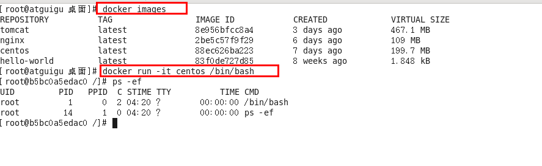
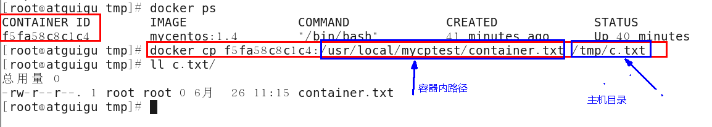

## docker

```awk
# 搜索tomcat镜像
docker search tomcat

# 拉取tomcat镜像
docker pull tomcat

# 查看所有镜像
docker images

# 运行nginx容器，-d 后台运行容器并打印出容器ID，-p 将容器的8080端口映射到主机的3355端口
docker run -d -p 3355:8080 --name tomcat01 tomcat

# 进入容器
docker exec -it tomcat01 /bin/bash

# 进入容器拷贝文件
cd /usr/local/tomcat/
cp -r webapps.dist/* webapps/
exit

# 查看所有运行中的容器：
docker ps

# 通过容器名称停止容器：
docker container stop tomcat01

# 通过容器名称移除容器：
docker container rm tomcat01

# 重启docker
systemctl restart docker

```

### 帮助命令

#### docker version

#### docker  info

#### docker --help

### 镜像命令

#### docker images

列出本地主机上的镜像


各个选项说明:
REPOSITORY：表示镜像的仓库源
TAG：镜像的标签
IMAGE ID：镜像ID
CREATED：镜像创建时间
SIZE：镜像大小
 同一仓库源可以有多个 TAG，代表这个仓库源的不同个版本，我们使用 REPOSITORY:TAG 来定义不同的镜像。
如果你不指定一个镜像的版本标签，例如你只使用 ubuntu，docker 将默认使用 ubuntu:latest 镜像

##### OPTIONS说明：

a :列出本地所有的镜像（含中间映像层）

-q :只显示镜像ID。

--digests :显示镜像的摘要信息

--no-trunc :显示完整的镜像信息

#### docker search 

docker search  某个XXX镜像名字

##### 网站

https://hub.docker.com

##### 命令

docker search [OPTIONS] 镜像名字

OPTIONS说明：

--no-trunc : 显示完整的镜像描述

-s : 列出收藏数不小于指定值的镜像。

--automated : 只列出 automated build类型的镜像

#### docker pull

docker pull 某个XXX镜像名字

docker pull 镜像名字[:TAG]

#### docker rmi 

docker rmi 某个XXX镜像名字ID

删除单个  docker rmi  -f 镜像ID

删除多个  docker rmi -f 镜像名1:TAG 镜像名2:TAG 

删除全部  docker rmi -f $(docker images -qa)


### 容器命令

有镜像才能创建容器，这是根本前提(下载一个CentOS镜像演示)

docker pull centos

#### 新建并启动容器

docker run [OPTIONS] IMAGE [COMMAND] [ARG...]

OPTIONS说明（常用）：有些是一个减号，有些是两个减号

> --name="容器新名字": 为容器指定一个名称；
> -d: 后台运行容器，并返回容器ID，也即启动守护式容器；
> -i：以交互模式运行容器，通常与 -t 同时使用；
> -t：为容器重新分配一个伪输入终端，通常与 -i 同时使用；
> -P: 随机端口映射；
> -p: 指定端口映射，有以下四种格式
>       ip:hostPort:containerPort
>       ip::containerPort
>       hostPort:containerPort
>       containerPort

#使用镜像centos:latest以交互模式启动一个容器,在容器内执行/bin/bash命令。
docker run -it centos /bin/bash 



#### 列出当前所有正在运行的容器

docker ps [OPTIONS]

OPTIONS说明（常用）：

-a :列出当前所有正在运行的容器+历史上运行过的
-l :显示最近创建的容器。
-n：显示最近n个创建的容器。
-q :静默模式，只显示容器编号。
--no-trunc :不截断输出。

#### 退出容器

exit   --容器停止退出

ctrl+P+Q  --容器不停止退出

#### 启动容器

docker start 容器ID或者容器名

#### 重启容器

docker restart 容器ID或者容器名

#### 停止容器

docker stop 容器ID或者容器名

#### 强制停止容器

docker kill 容器ID或者容器名

#### 删除已停止的容器

docker rm 容器ID

一次性删除多个容器

docker rm -f $(docker ps -a -q)

docker ps -a -q | xargs docker rm

#### 重要

##### 启动守护式容器

docker run -d 容器名

> #使用镜像centos:latest以后台模式启动一个容器
> docker run -d centos
>
> 问题：然后docker ps -a 进行查看, 会发现容器已经退出
> 很重要的要说明的一点: Docker容器后台运行,就必须有一个前台进程.
> 容器运行的命令如果不是那些一直挂起的命令（比如运行top，tail），就是会自动退出的。
>
> 这个是docker的机制问题,比如你的web容器,我们以nginx为例，正常情况下,我们配置启动服务只需要启动响应的service即可。例如
> service nginx start
> 但是,这样做,nginx为后台进程模式运行,就导致docker前台没有运行的应用,
> 这样的容器后台启动后,会立即自杀因为他觉得他没事可做了.
> 所以，最佳的解决方案是,将你要运行的程序以前台进程的形式运行

##### 查看容器日志

docker logs -f -t --tail 容器ID

  -t 是加入时间戳

 -f 跟随最新的日志打印

--tail 数字 显示最后多少条

##### 查看容器内运行的进程

docker top 容器ID

##### 查看容器内部细节

docker inspect 容器ID

##### 进入正在运行的容器并以命令行交互

##### 从容器内拷贝文件到主机上

docker cp  容器ID:容器内路径 目的主机路径




### 日志命令


查看service 日志

```shell
docker service logs -f --tail 200 yxg8ytas0c6c
```


## 镜像加速

>aliyun指南:https://cr.console.aliyun.com/cn-qingdao/instances/mirrors

1、调整镜像源

```shell
vi /etc/docker/daemon.json
```

配如下地址

```shell
{
	"registry-mirrors": [
		"https://2a6bf1988cb6428c877f723ec7530dbc.mirror.swr.myhuaweicloud.com",
		"https://docker.m.daocloud.io",
		"https://hub-mirror.c.163.com",
		"https://mirror.baidubce.com",
		"https://your_preferred_mirror",
		"https://dockerhub.icu",
		"https://docker.registry.cyou",
		"https://docker-cf.registry.cyou",
		"https://dockercf.jsdelivr.fyi",
		"https://docker.jsdelivr.fyi",
		"https://dockertest.jsdelivr.fyi",
		"https://mirror.aliyuncs.com",
		"https://dockerproxy.com",
		"https://mirror.baidubce.com",
		"https://docker.m.daocloud.io",
		"https://docker.nju.edu.cn",
		"https://docker.mirrors.sjtug.sjtu.edu.cn",
		"https://docker.mirrors.ustc.edu.cn",
		"https://mirror.iscas.ac.cn",
		"https://docker.rainbond.cc"
	]
}
```


2、重新加载配置文件及docker服务

```shell
systemctl daemon-reload
systemctl restart docker
```


## 日常使用


### 粘贴

在 Vim 中粘贴 JSON 内容时，尤其是从剪贴板或其他地方复制的大段内容，为了避免自动缩进和格式错乱，建议使用以下步骤之一：


###  方法一：使用 “粘贴模式” (`paste` 模式，推荐)

在 Vim 中输入命令模式：

```
:set paste
```

然后进入插入模式（`i` 或 `a`），粘贴你复制好的 JSON 内容（右键或 Ctrl+Shift+V）。

粘贴完成后，记得关闭粘贴模式（恢复正常缩进）：

```
:set nopaste
```
