# Service Mesh


## 理论篇


### Service Mesh 的演进过程


#### 第一阶段：控制逻辑和业务逻辑耦合

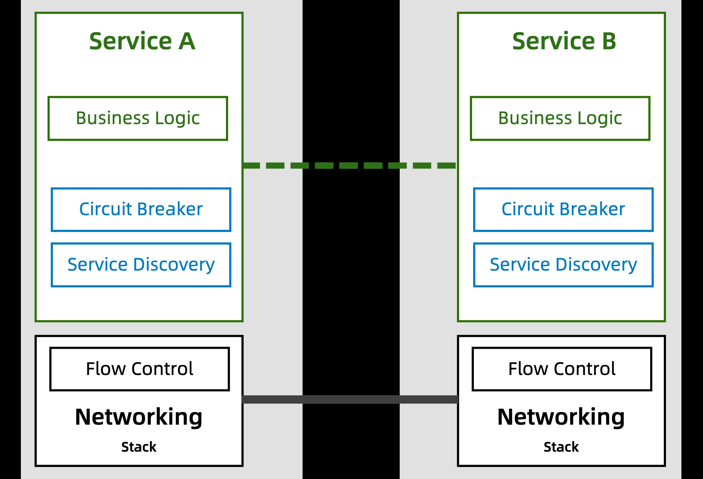


#### 第二阶段：公共库

- 解耦
- 消除重复
- 成本
- 语言绑定
- 仍有侵入

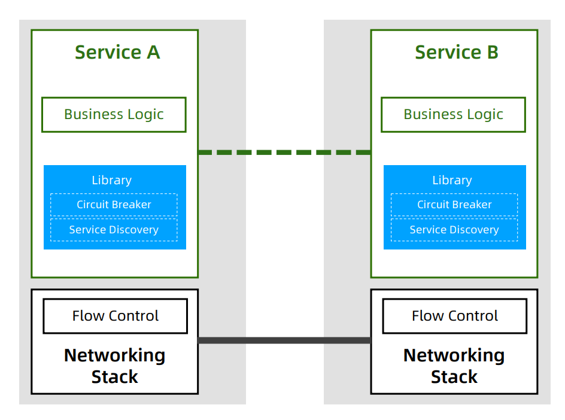

这些公共库市面上也有很多产品，比如说Spring Cloud的一些组件以及Netflix开源的一些产品。 公共库最大的好处毫无疑问就是进行了解耦和消除重复，你可以不用在每个服务里面都重复地去编写刚才我们所说的那种for循环的逻辑。但是公共库同样不是完美的，它依然还有其他的问题，比如说最大的一个问题就是成本问题，一个是人力成本（安排专人去负责和学习），一个是时间成本（公共库升级需要重新部署一份）。另外公共库一般都是语言绑定的，它并不是完全的和平台无关，所以这就导致你很可能需要在你原有的基础上引入新的语言或者是技术栈。

虽然公共库可以消除重复，但是本质上它依然是和你的应用程序同时运行在同一个进程中，依然是对你的应用有侵入的，因此公共库仍然不是完美的方案。


#### 第三阶段：代理

- 功能简陋
- 思路正确

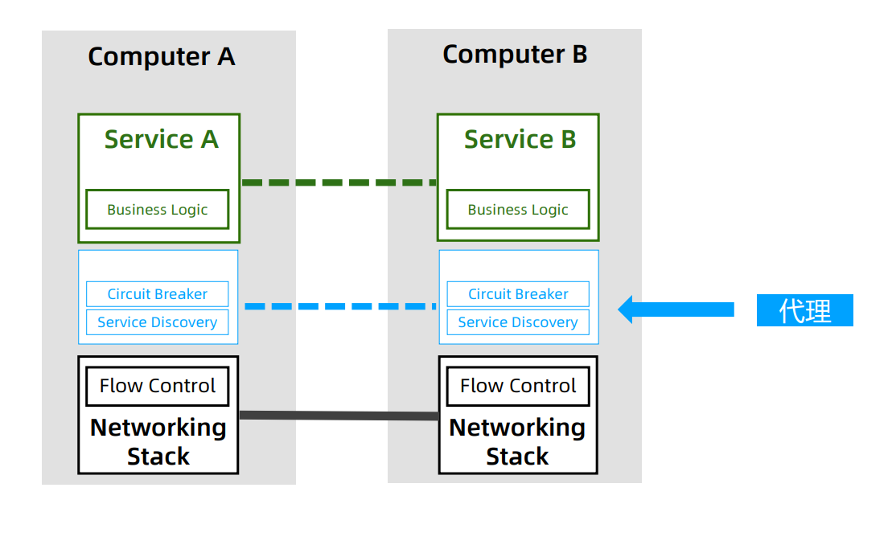

从这个图上我们可以看到一些细微的差别，我们的公共库不再和现有的业务逻辑部署在一起了，而是单独的抽出了一个模块，这个模块就是代理，由代理去包含相应的控制逻辑，这样就完全和你的应用解耦了。代理模式有一个最大的问题就是功能简陋。


#### 第四阶段：边车模式（Sidecar)

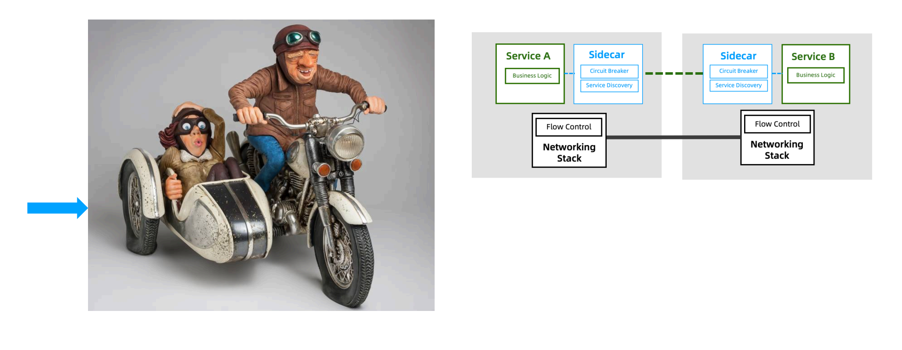

我们在应用旁边部署一个Sidecar,由Sidecar来去处理所有的网路请求，最后处理完成之后，再把请求转发给应用本身，这就是典型的一个Sidecar。


#### 第五阶段：Service Mesh 的出现

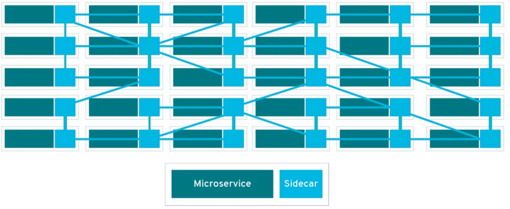


#### Service Mesh 演进总结

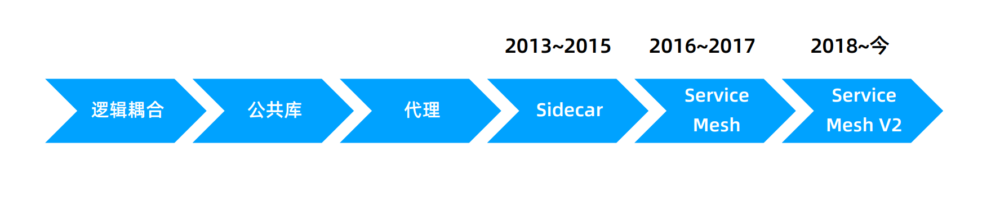

Service Mesh 可以简单理解为就是Sidecar的一个网络拓扑组合，到了18年以后，为了去管理整个Sidecar网络，我们在这个产品的形态上又增加了控制平面。形成了现在我们常说的第二代的Service Mesh。


### Service Mesh - 服务通信的济世良方


#### Service Mesh 的定义

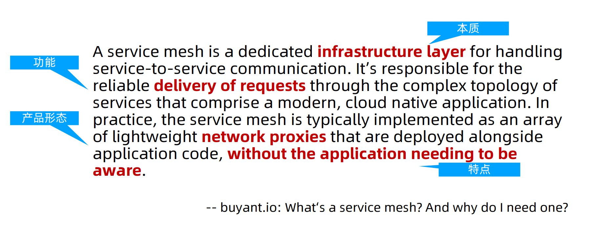

>Service Mesh 是一个**基础设施层**，用来处理服务与服务之间的通信，它主要的**功能是**自云原生应用这种复杂的服务拓扑情况下进行可靠地**请求分发**。一般情况下它会**实现**为一组**轻量化的网络代理**，部署在你的应用代码的旁边，并且跟你的应用是**完全透明**。


#### Service Mesh 的产品形态

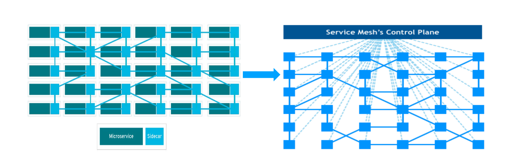

​                                                           Service Mesh 是 Sidecar 的网络拓扑模式


#### Service Mesh 的主要功能

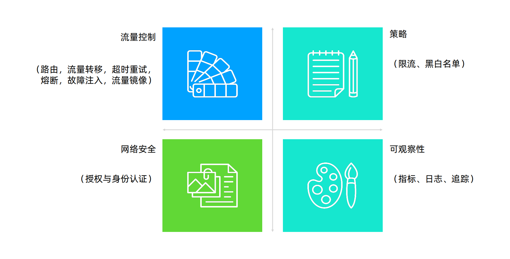


#### Service Mesh 和 Kubernetes 的关系

- **Kubernetes**
  - 解决容器编排与调度问题
  - 本质上是管理应用生命周期（调度器）
  - 给予 Service Mesh 支持和帮助
- **Service Mesh**
  - 解决服务间网络通信问题
  - 本质上是管理服务通信（代理）
  - 是对 Kubernetes 网络功能方面的扩展和延伸


#### Service Mesh 和 API 网关的异同点

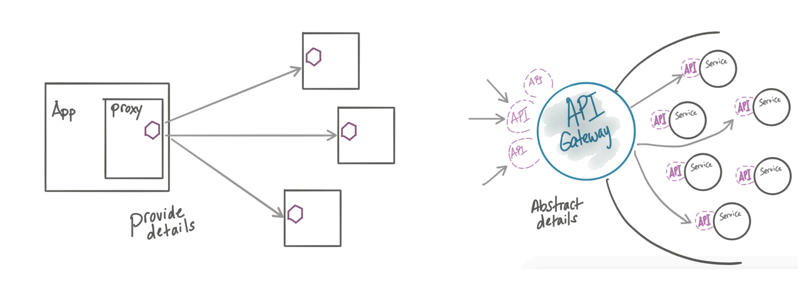

- 功能有重叠，但角色不同
- Service Mesh 在应用内，API 网关在应用之上（边界）


#### Service Mesh 技术标准

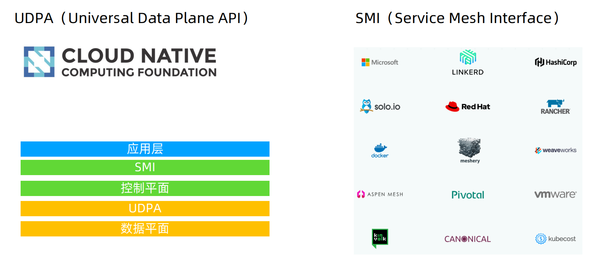


## lstio 入门篇


### 为什么 Istio 有如此高的呼声


#### 什么是 Istio

- 官方定义：它是一个完全开源的服务网格，作为透明的一层接入到现有的分布式 应用中。它也是一个平台，可以与任何日志、遥测和策略系统进行集成。Istio 多 样化的特性让你能够成功且高效地运行微服务架构，并提供保护、连接和监控微服务的统一方法。
- 名字来源
- Service Mesh 的新形态：增加控制平面

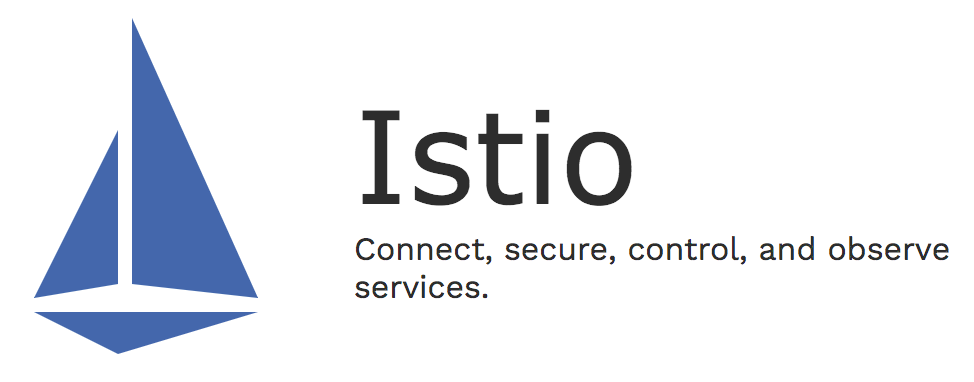


#### 为什么使用 Istio

- 优势
  - 轻松构建服务网格
  - 应用代码无需更改
- 功能强大


#### Istio 的核心功能

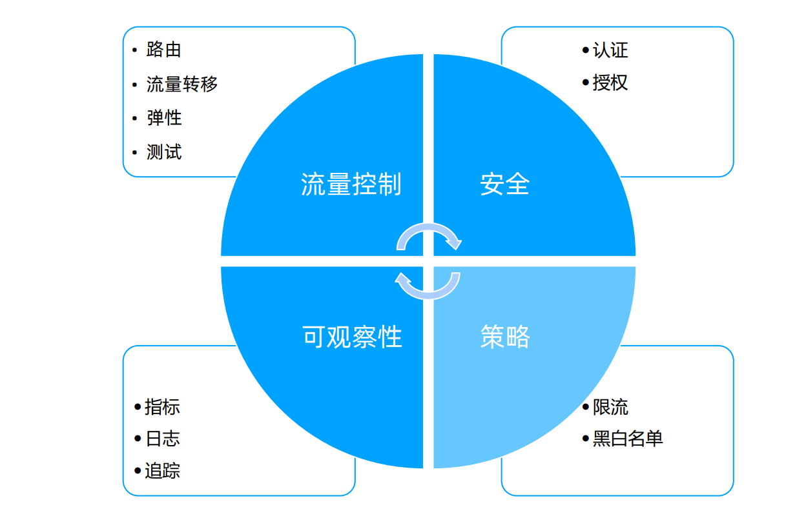


#### Istio 会成为下一个 Kubernetes 吗

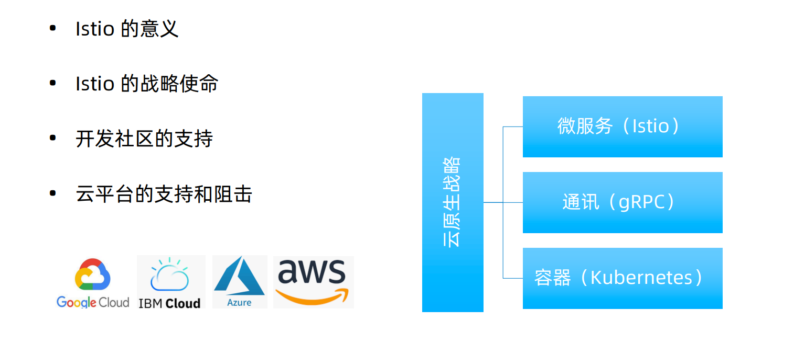


### 为什么 Istio 发生了两次重大的架构变更


#### 架构 1.0 版本

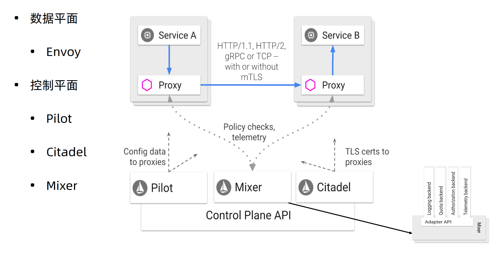

#### 架构 1.1 版本

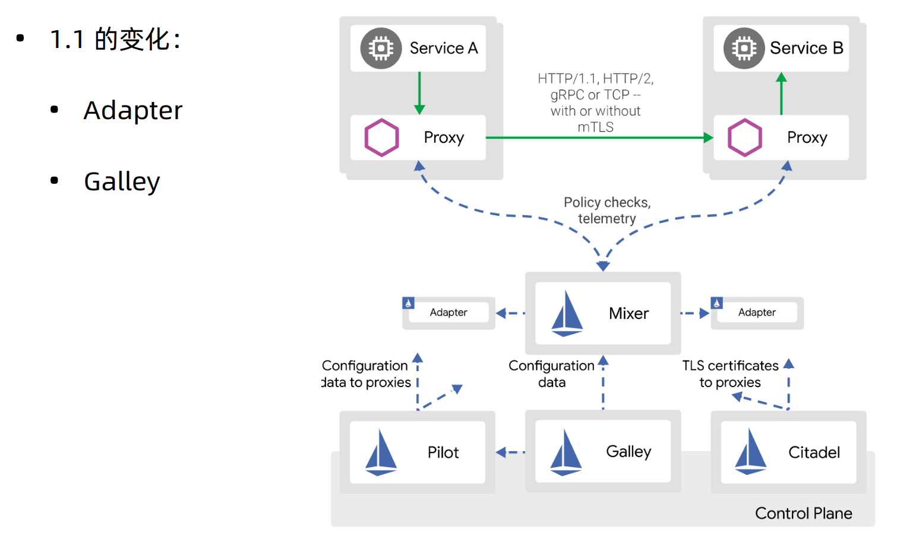


#### Istio 的架构之殇

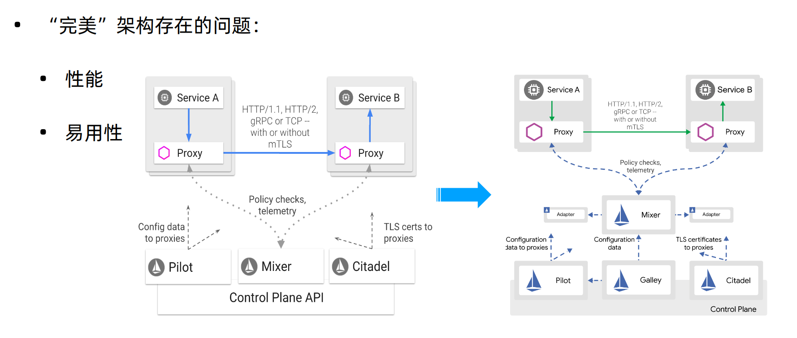

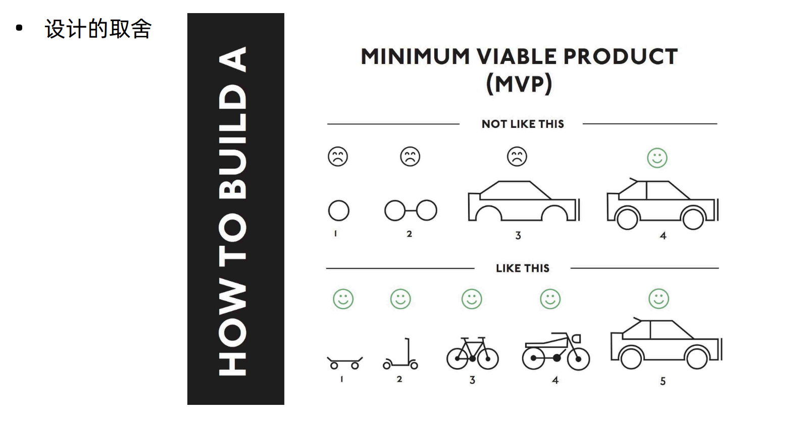


#### 回归单体 - Istio 的自我救赎

- 原有架构的复杂性
  - 维护性
  - 多组件分离的必要性？
  - 伸缩性
  - 安全性
- “复杂是万恶之源，学会停止焦虑，爱上单体” —— Istio 开发团队


#### 架构 1.5 版本

- 重建控制平面
  - 整合为 istiod
  - 废弃 Mixer
- 添加新特性
- 性能提升
- Bug 修复

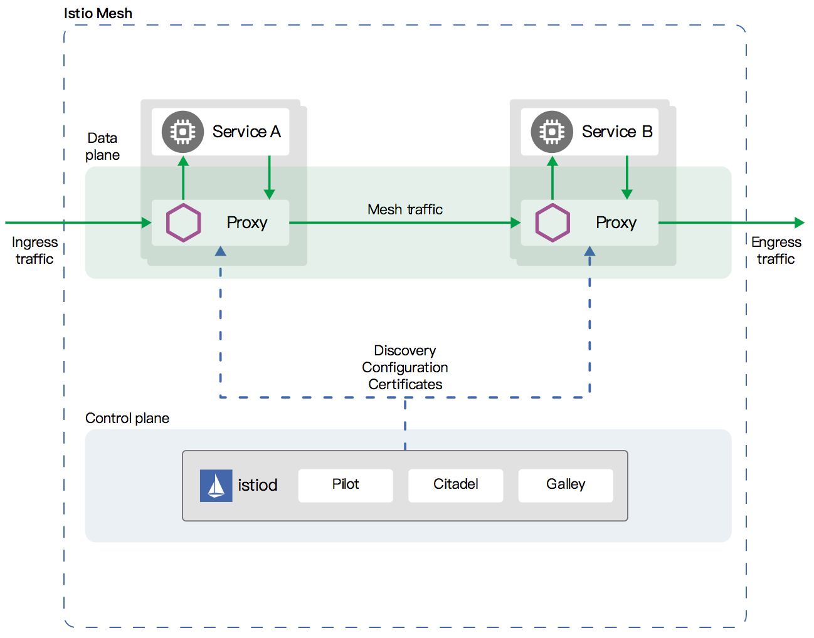


### 流量控制


#### Istio 的流量控制能力

- 主要功能：
  - 路由、流量转移
  - 流量进出
  - 网络弹性能力
  - 测试相关
- 核心资源（CRD）：
  - 虚拟服务（Virtual Service）
  - 目标规则（Destination Rule）
  - 网关（Gateway）
  - 服务入口（Service Entry）
  - Sidecar

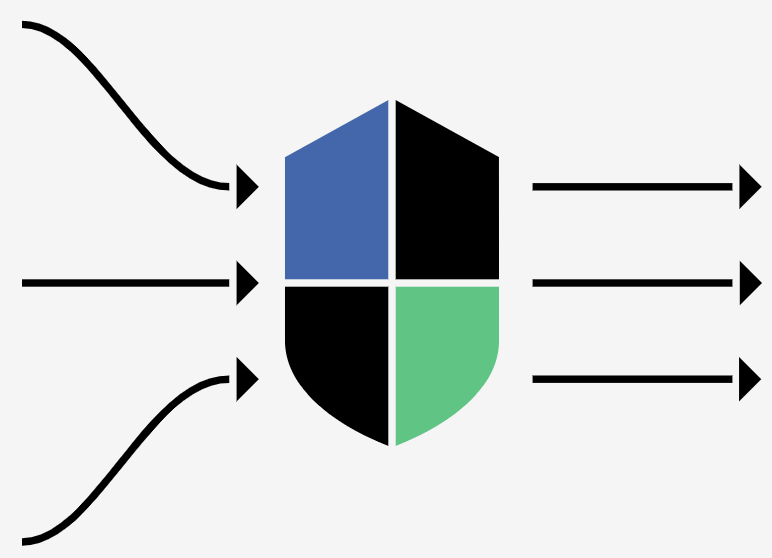


#### 虚拟服务（Virtual Service）

- 将流量路由到给定目标地址
- 请求地址与真实的工作负载解耦
- 包含一组路由规则
- 通常和目标规则（Destination Rule）成对出现
- 丰富的路由匹配规则

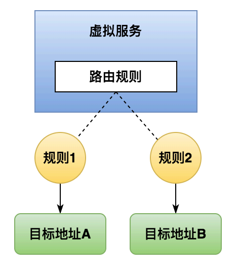

>提供了丰富的路由匹配规则，比如说你可以针对Endpoint 、针对uri、针对Header这样不同lidu的路由进行匹配。


#### 目标规则（Destination Rule）

- 定义虚拟服务路由目标地址的真实地址，即子集（subset）
- 设置负载均衡的方式
  - 随机
  - 权重
  - 最少请求数

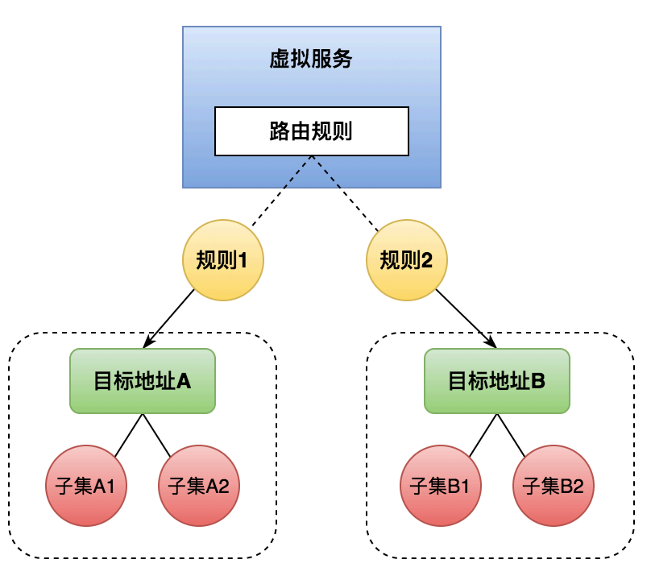


#### 网关（Gateway）

> 用来管理网格以外的流量
>
> 我们可以通过网关来像管理内部流量一样管理网格外部的流量，比如说为进出的流量增加负载均衡的能力、增加超时重试的能力。

- 管理进出网格的流量
- 处在网格边界

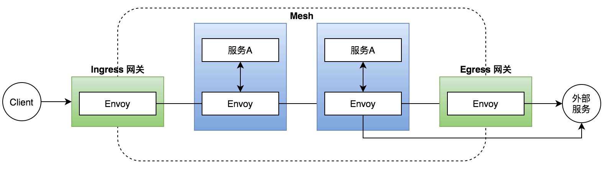


#### 服务入口（Service Entry）

- 把外部服务注册到网格中
- 功能：
  - 为外部目标转发请求
  - 添加超时重试等策略
  - 扩展网格

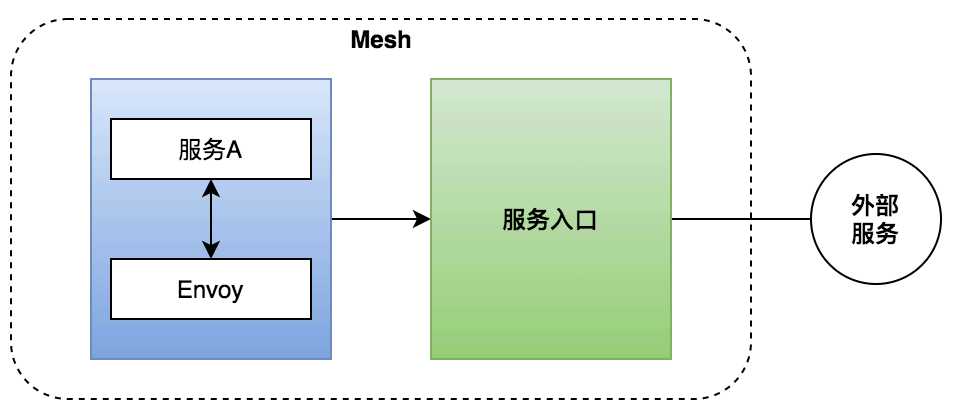


#### Sidecar

- 调整 Envoy 代理接管的端口和协议
- 限制 Envoy 代理可访问的服务

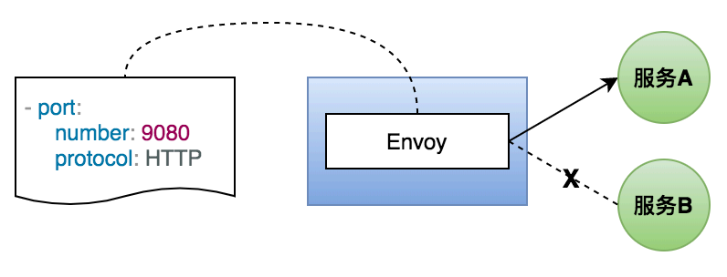


#### 网络弹性和测试

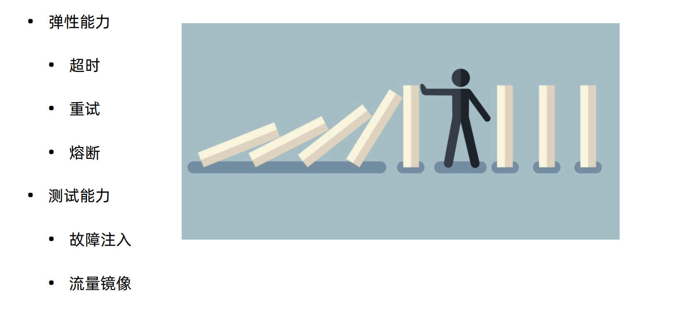


### 服务的可观察性


#### 什么是可观察性

- 可观察性≠监控
- 从开发者的角度探究系统的状态
- 组成：指标、日志、追踪

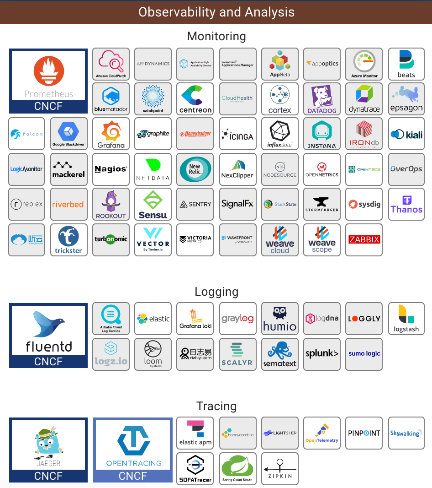


#### 指标（Metrics）

- 以聚合的方式监控和理解系统行为

- Istio 中的指标分类：

  - 代理级别的指标（Proxy-level）

  - 服务级别的指标（Service-level）

  - 控制平面指标（Control plane）

    

##### 代理级别的指标

- 收集目标：Sidecar 代理
- 资源粒度上的网格监控
- 容许指定收集的代理（针对性的调试）

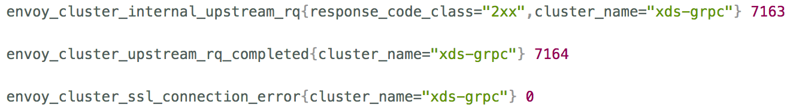

>第一个指标是当前集群中来自于上游服务的总的请求数
>
>第二个指标是上游服务的完成的请求数量
>
>第三个是SSL连接出错的数量


##### 服务级别的指标

- 用于监控服务通信
-  四个基本的服务监控需求：延迟、流量、错误、饱和
- 默认指标导出到 Prometheus（可自定义和更改）
- 可根据需求开启或关闭

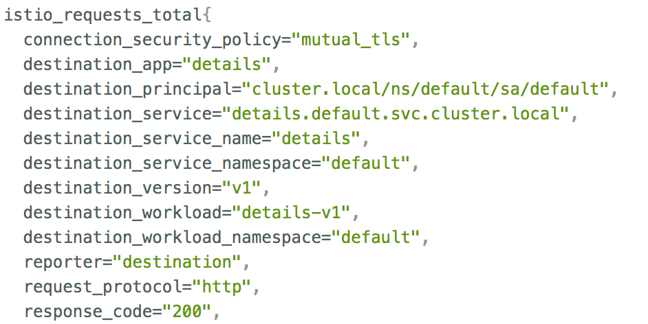


##### 控制平面指标

- 对自身组件行为的监控
- 用于了解网格的健康情况

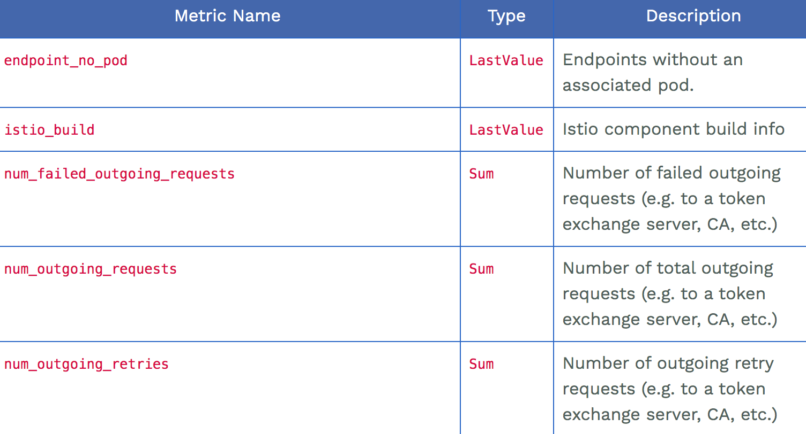


#### 访问日志（Access logs）

- 通过应用产生的事件来了解系统
- 包括了完整的元数据信息（目标、源）
- 生成位置可选（本地、远端，如 filebeat）
-  日志内容
- 应用日志
- Envoy 日志 $ kubectl logs -l app=demo -c istio-proxy


#### 分布式追踪（Distributed tracing）

- 通过追踪请求，了解服务的调用关系
- 常用于调用链的问题排查、性能分析等
- 支持多种追踪系统（Jeager、Zipkin、Datadog）

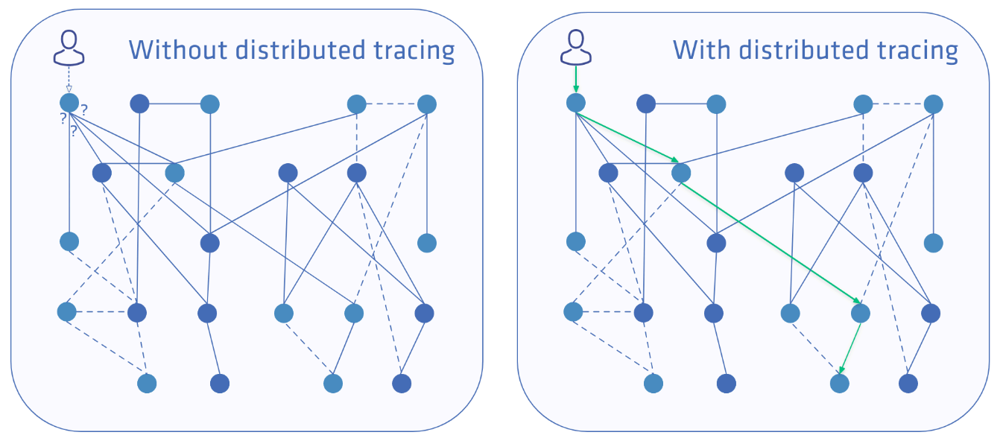


### Istio 是如何设计安全架构的


#### Istio 的安全架构

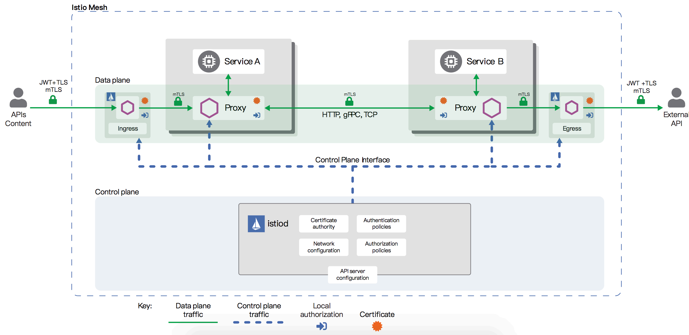

>Istio中的安全主要分为认证和授权两大部分，绝大部分功能都是由Istiod这个控制平面来实现的，我们看一下这张图，在Istiod中CA主要是用来负责证书的管理，认证策略和授权策略都会被存储在对应的模块中。由API Server将这些策略变成配置，下发到对应的数据平面中。当一个终端用户调用网络内的服务的时候，它可以使用经典的JWT方式进行认证，而网格内服务与服务之间可以使用双向的TLS进行认证。


#### 认证

- 认证方式
-  策略存储
- 支持兼容模式

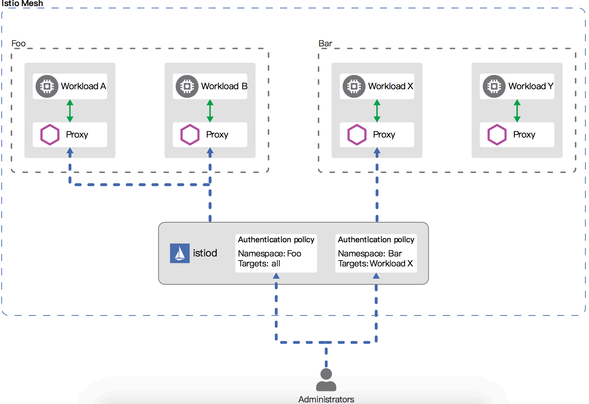

>认证策略会被保存在配置存储中，然后下发给数据平面，我们来看一下这张图，管理员配置了两种策略，一种是针对Foo这个Namespace，它的目标是全体的服务，而另外一种策略是针对Bar这个NameSpace，它的目标是Workload X，这些策略会被转变成具体的配置信息，然后由Istiod下发给具体的Sidecar代理。值得一提的是，Istio在认证中提供了一种兼容模式，即你可以以不加密的方式和加密的方式同时进行请求的传输。


##### 认证方式

- 对等认证（Peer authentication）
  - 用于服务间身份认证
  - Mutual TLS（mTLS）
- 请求认证（Request authentication）
  - 用于终端用户身份认证
  - JSON Web Token（JWT）


##### 认证策略

- 配置方式
-  配置生效范围
  - 网格
  - 命名空间
  - 工作负载（服务）
- 策略的更新

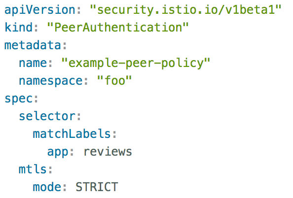


#### 授权

- 授权级别
- 策略分发
- 授权引擎
- 无需显式启用

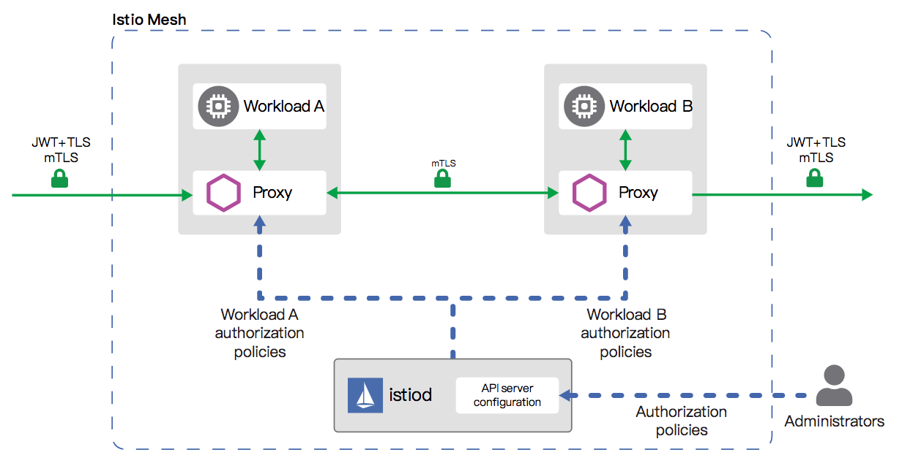


##### 授权策略

- 通过创建 AuthorizationPolicy 实现
- 组成部分
  - 选择器（Selector）
  - 行为（Action）
  - 规则列表（Rules）
    - 来源（from）
    - 操作（to）
    - 匹配条件（when）

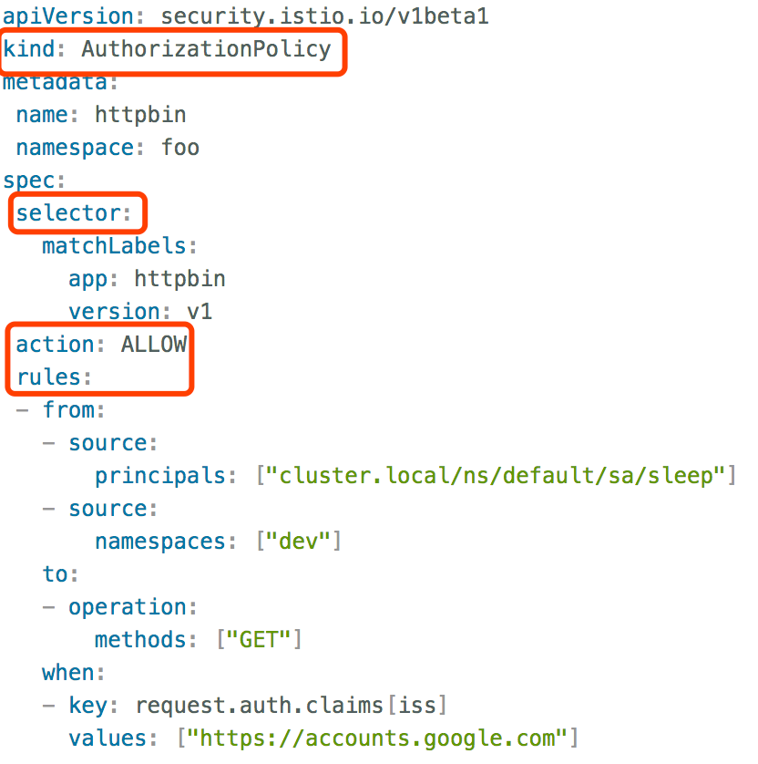


##### 授权策略的设置

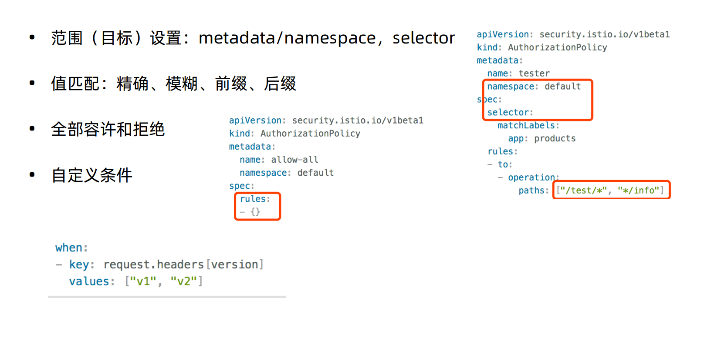


## 实验篇


### Istio 的安装与部署

略


### 部署 Bookinfo 应用

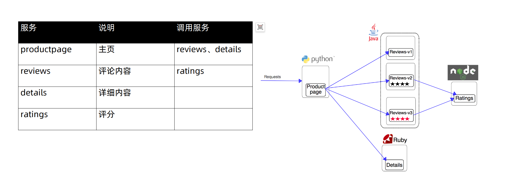

#### 注入 Sidecar

自动：

```shell
$ kubectl label namespace default istioinjection=enabled 
```

手动： 

```shell
$ kubectl apply -f <(istioctl kube-inject -f  samples/bookinfo/platform/kube/bookinfo.yaml)

```


#### 部署应用

```shell
$ kubectl apply -f samples/bookinfo/platform/kube/bookinfo.yaml
```

确认服务、Pod 已启动


- 创建 Ingress 网关

- ```shell
   $ kubectl apply -f samples/bookinfo/networking/bookinfo-gateway.yaml
  ```

- 确认网关和访问地址

- 访问应用页面

  

### 动态路由：用Virtual Service和 Destination Rule设置路由规则

略


### 网关-用 Gateway 管理进入网格的流量


#### 什么是网关（Gateway）

- 一个运行在网格边缘的负载均衡器
- 接收外部请求，转发给网格内的服务
- 配置对外的端口、协议与内部服务的映射关系


#### 任务：创建网关

- 任务说明
  - 创建一个入口网关，将进入网格的流量分发到不同地址
- 任务目标
  - 学会用 Gateway 控制入口流量
  -  掌握 Gateway 的配置方法

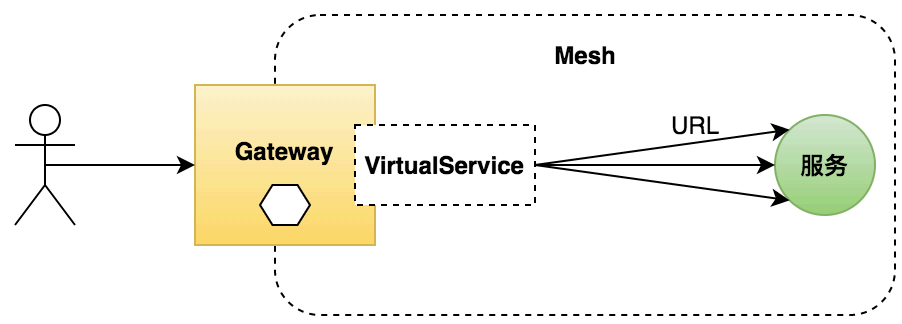


#### 配置分析

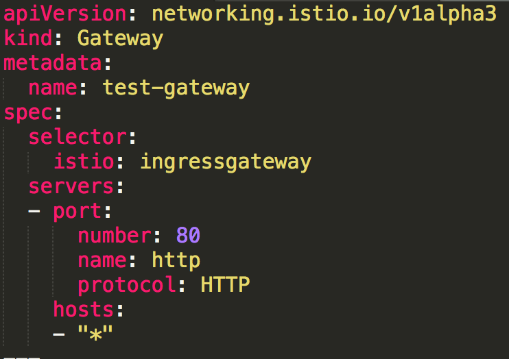

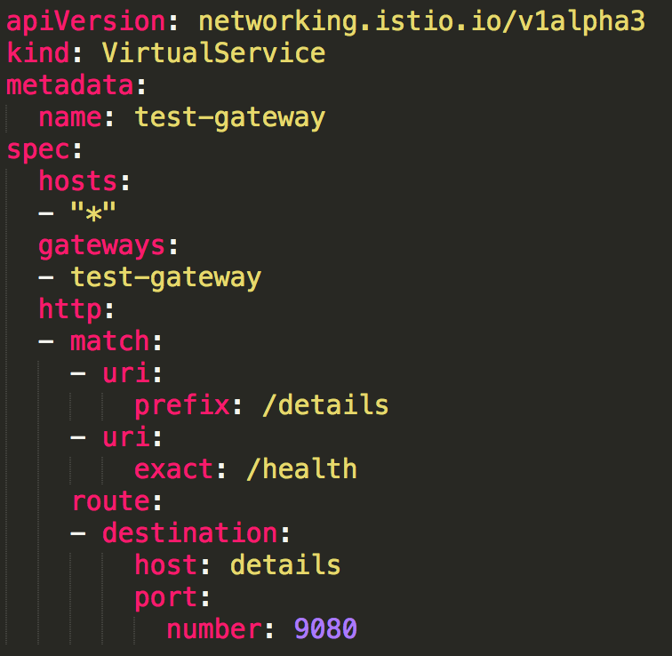

>这是一段 Istio 配置文件，用于定义一个名为 `test-gateway` 的网关。让我们详细解释每一部分的含义：
>
>1. `apiVersion: networking.istio.io/v1alpha3`
>   - 这表示该配置文件使用的是 Istio 的 `networking.istio.io` API 版本 `v1alpha3`。
>2. `kind: Gateway`
>   - 这表示该资源的类型是 `Gateway`，即网关。网关是用来管理进出服务网格的流量的。
>3. `metadata`
>   - 这部分包含了该网关的元数据。
>4. `name: test-gateway`
>   - 这定义了网关的名称为 `test-gateway`。
>5. `spec`
>   - 这部分定义了网关的具体配置。
>6. `selector`
>   - 选择器用于选择特定的 Istio 网关（即 Kubernetes 中的服务），在这里选择的是 `ingressgateway`。
>7. `istio: ingressgateway`
>   - 这表示选择标签为 `istio=ingressgateway` 的服务。
>8. `servers`
>   - 这部分定义了网关的服务器配置。
>9. `- port`
>   - 这部分定义了服务器的端口配置。
>10. `number: 80`
>    - 这表示服务器监听的端口号是 `80`。
>11. `name: http`
>    - 这表示端口的名称是 `http`。
>12. `protocol: HTTP`
>    - 这表示服务器使用的协议是 `HTTP`。
>13. `hosts`
>    - 这部分定义了该网关允许的主机。
>14. `- "*"`
>    - 这表示该网关允许所有主机（即任意主机名）。
>
>总结起来，这个网关配置定义了一个监听 HTTP 80 端口的 Istio Ingress 网关，它允许所有主机访问。这个网关可以用来处理进入服务网格的 HTTP 流量。

>这是一段 Istio 配置文件，用于定义一个名为 `test-gateway` 的虚拟服务 (VirtualService)。让我们详细解释每一部分的含义：
>
>1. `apiVersion: networking.istio.io/v1alpha3`
>   - 表示该配置文件使用的是 Istio 的 `networking.istio.io` API 版本 `v1alpha3`。
>2. `kind: VirtualService`
>   - 表示该资源的类型是 `VirtualService`，即虚拟服务。虚拟服务用来定义服务之间的流量路由规则。
>3. `metadata`
>   - 包含了该虚拟服务的元数据。
>4. `name: test-gateway`
>   - 定义了虚拟服务的名称为 `test-gateway`。
>5. `spec`
>   - 定义了虚拟服务的具体配置。
>6. `hosts`
>   - 定义了该虚拟服务允许的主机。
>7. `- "*"`
>   - 表示该虚拟服务允许所有主机（即任意主机名）。
>8. `gateways`
>   - 定义了该虚拟服务使用的网关。
>9. `- test-gateway`
>   - 表示该虚拟服务使用名为 `test-gateway` 的网关。
>10. `http`
>    - 定义了 HTTP 路由规则。
>11. `- match`
>    - 定义了 HTTP 请求的匹配条件。
>12. `- uri`
>    - 定义了 URI 的匹配条件。
>13. `prefix: /details`
>    - 表示匹配所有前缀为 `/details` 的请求。
>14. `- uri`
>    - 定义了 URI 的另一个匹配条件。
>15. `exact: /health`
>    - 表示精确匹配 `/health` 的请求。
>16. `route`
>    - 定义了匹配条件下的路由规则。
>17. `- destination`
>    - 定义了请求的目标服务。
>18. `host: details`
>    - 表示目标服务的主机名为 `details`。
>19. `port`
>    - 定义了目标服务的端口。
>20. `number: 9080`
>    - 表示目标服务的端口号为 `9080`。
>
>总结起来，这个虚拟服务配置定义了一个使用 `test-gateway` 网关的虚拟服务。它包含两个路由规则：
>
>- 所有前缀为 `/details` 的请求将被路由到 `details` 服务的 9080 端口。
>- 精确匹配 `/health` 的请求也将被路由到 `details` 服务的 9080 端口。
>
>这些规则允许流量根据请求的 URI 被路由到不同的服务和端口。


#### 配置选项

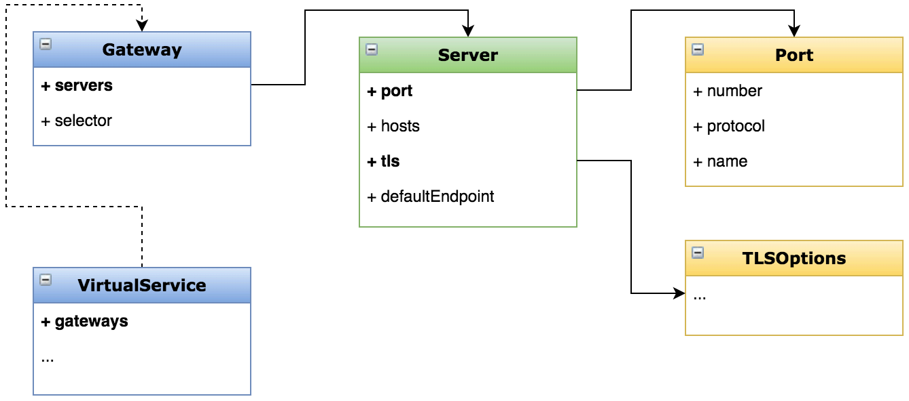


#### Gateway 的应用场景

- 暴露网格内服务给外界访问
- 访问安全（HTTPS、mTLS 等）
- 统一应用入口，API 聚合


### 服务入口


>什么事服务入口呢，你可以这样去理解，它和我们上节课jiang的网关有一点相反的这样的概念，网关可以认为是把我们内部的服务暴漏给外部访问，而这个服务入口正好相反，是把外部的服务纳入到我们网格内部进行管理。那为什么要设置服务入口，主要一个原因就是我们希望能够管理外部服务的请求，比如说你需要对访问外部服务的请求做一些流量控制，那么就需要用到服务入口，还有一个主要的功能，它可以帮助我们扩展我们的Mesh，也就是扩展我们的网格。例如当我们要多个集群共享同一个Mesh的时候，我们就需要用到服务入口。


#### 什么是服务入口（ServiceEntry）

- 添加外部服务到网格内
- 管理到外部服务的请求
- 扩展网格

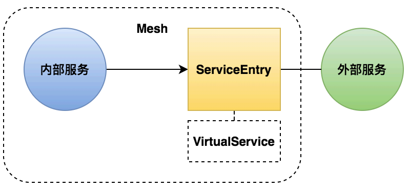


#### 任务：注册外部服务

- 任务说明
  - 将 httpbin 注册为网格内部的服务，并配置流控策略
- 任务目标
  - 学会通过 ServiceEntry 扩展网格
  - 掌握 ServiceEntry 的配置方法


#### 演示

- 添加 sleep 服务
- $ kubectl apply -f samples/sleep/sleep.yaml
- 关闭出流量可访问权限（outboundTrafficPolicy = REGISTRY_ONLY）
-  $ kubectl get configmap istio -n istio-system -o yaml | sed 's/mode: ALLOW_ANY/mode:  REGISTRY_ONLY/g' | kubectl replace -n istio-system -f -
- 为外部服务（httpbin）配置 ServiceEntry
- 测试


#### 配置分析

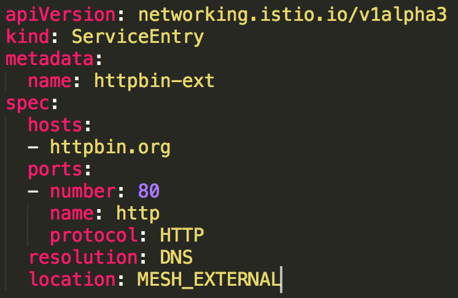

>这是一段 Istio 配置文件，用于定义一个名为 `httpbin-ext` 的服务入口 (ServiceEntry)。ServiceEntry 用来将外部服务引入到 Istio 服务网格中。让我们详细解释每一部分的含义：
>
>1. `apiVersion: networking.istio.io/v1alpha3`
>   - 表示该配置文件使用的是 Istio 的 `networking.istio.io` API 版本 `v1alpha3`。
>2. `kind: ServiceEntry`
>   - 表示该资源的类型是 `ServiceEntry`，即服务入口。服务入口用来将外部服务纳入到服务网格中，使得服务网格内部的服务可以访问这些外部服务。
>3. `metadata`
>   - 包含了该服务入口的元数据。
>4. `name: httpbin-ext`
>   - 定义了服务入口的名称为 `httpbin-ext`。
>5. `spec`
>   - 定义了服务入口的具体配置。
>6. `hosts`
>   - 定义了该服务入口的主机名列表。
>7. `- httpbin.org`
>   - 表示该服务入口对应的外部服务的主机名是 `httpbin.org`。
>8. `ports`
>   - 定义了该服务入口的端口列表。
>9. `- number: 80`
>   - 表示该服务入口的服务监听的端口号是 `80`。
>10. `name: http`
>    - 表示端口的名称是 `http`。
>11. `protocol: HTTP`
>    - 表示该端口使用的协议是 `HTTP`。
>12. `resolution: DNS`
>    - 表示该服务入口使用 DNS 进行服务发现。
>13. `location: MESH_EXTERNAL`
>    - 表示该服务入口对应的是网格外部的服务。
>
>总结起来，这个服务入口配置定义了一个外部服务 `httpbin.org`，使得 Istio 服务网格内部的服务可以通过 HTTP 端口 80 访问这个外部服务。通过这种方式，服务网格内的服务可以直接与外部的 `httpbin.org` 服务进行通信。


#### 配置选项

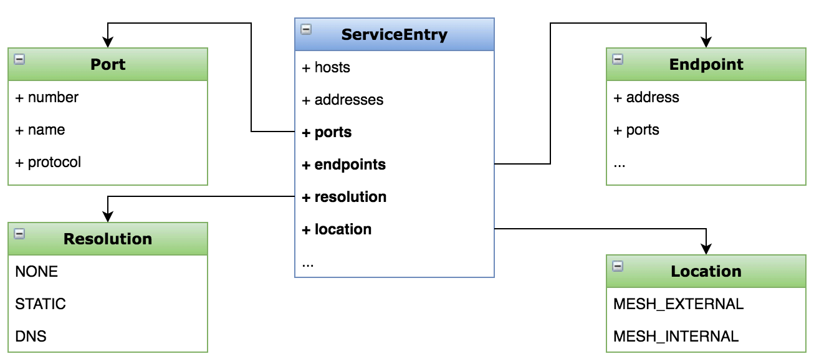


### 流量转移 - 灰度发布是如何实现的


#### 任务：基于权重的路由

- 任务说明
  - 将请求按比例路由到对应的服务版本
- 任务目标
  - 学会设置路由的权重
  - 理解灰度发布、蓝绿部署、A/B 测试的概念
  - 理解与 Kubernetes 基于部署的版本迁移的区别


#### 蓝绿部署

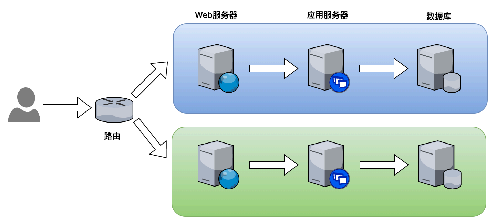


#### 灰度发布（金丝雀发布）

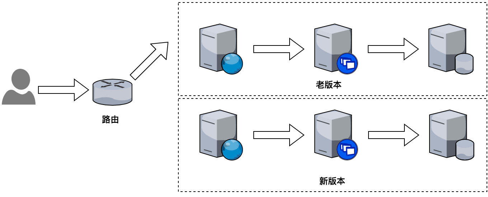

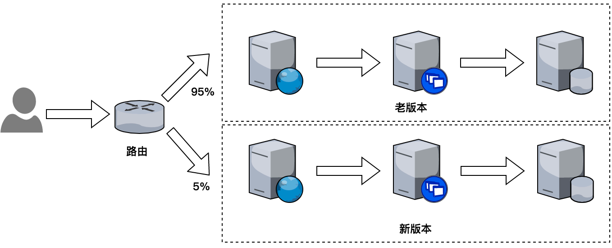

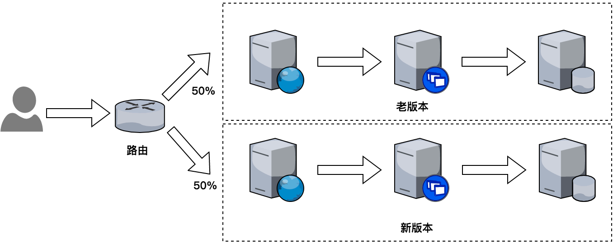

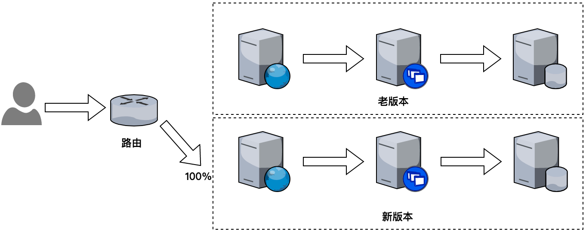


#### A/B 测试

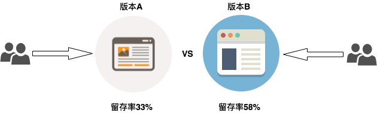


#### 演示

- 利用 reviews 服务的多版本，模拟灰度发布
- 在 VirtualService 中配置权重
- 测试


#### 配置分析

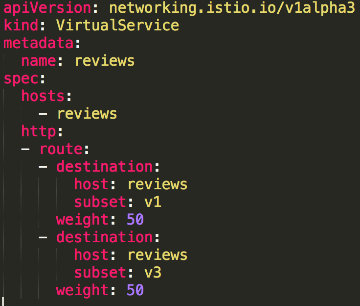


#### 课后练习

- 将 Chrome 浏览器的请求路由到 reviews 的 v2 版本
- 提示：通过 match header 的 User-Agent 实现


### Ingress - 控制进入网格的流量


#### Ingress 基本概念

- 服务的访问入口，接收外部请求并转发到后端服务
- Istio 的 Ingress gateway 和 Kubernetes Ingress 的区别
  - Kubernetes: 针对L7协议（资源受限），可定义路由规则
  - Istio: 针对 L4-6 协议，只定义接入点，复用 Virtual Service 的 L7 路由定义

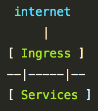


#### 任务：创建 Ingress 网关

- 任务说明
  -  为 httpbin 服务配置 Ingress 网关
- 任务目标
  - 理解 Istio 实现自己的 Ingress 的意义
  - 复习 Gateway 的配置方法
  - 复习 Virtual Service 的配置方法


#### 演示

- 部署 httpbin 服务
- 定义 Ingress gateway
- 定义对应的 Virtual Service
- 测试


#### 配置分析


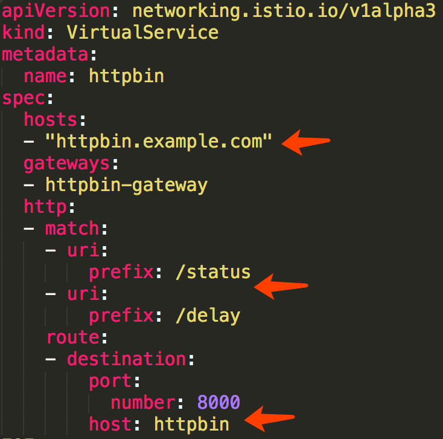


#### 课后练习

- 修改任务中的配置，使其不受域名限制
  - 提示：hosts 使用通配符 *
- 思考为什么 Istio 不使用 Kubernetes 的 Ingress 而要自己实现它？


### 用 Egress 网关实现访问外部服务


#### 访问外部服务的方法

- 配置 global.outboundTrafficPolicy.mode = ALLOW_ANY
- 使用服务入口（ServiceEntry）
- 配置 Sidecar 让流量绕过代理
- 配置 Egress 网关


#### Egress 概念

- Egress 网关
  - 定义了网格的出口点，允许你将监控、路由等功能应用于离开网格的流量
- 应用场景
  - 所有出口流量必须流经一组专用节点（安全因素）
  -  为无法访问公网的内部服务做代理


#### 任务：创建 Egress 网关

- 任务说明
  - 创建一个 Egress 网关，让内部服务通过它访问外部服务
- 任务目标
  - 学会使用 Egress 网关
  - 理解 Egress 的存在意义

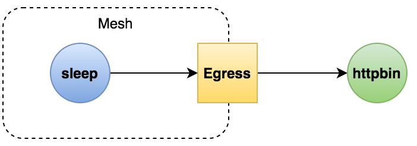


#### 演示

- 查看 egressgateway 组件是否存在
-  为外部服务定义 ServiceEntry
- 定义 Egress gateway
- 定义路由，将流量引导到 egressgateway
- 查看日志验证


#### 配置分析

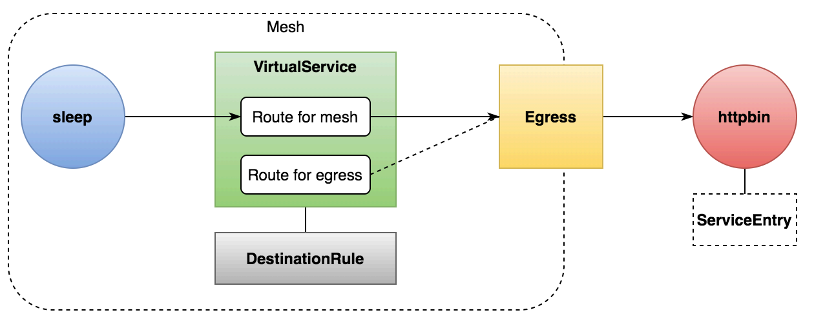

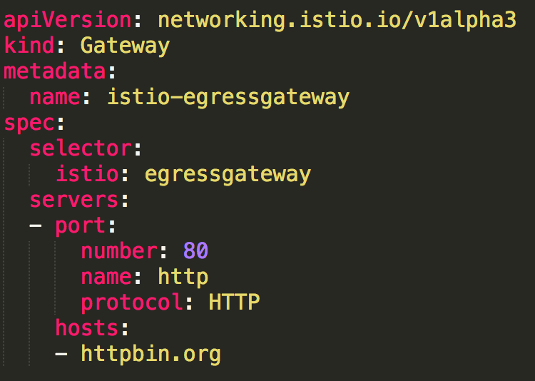


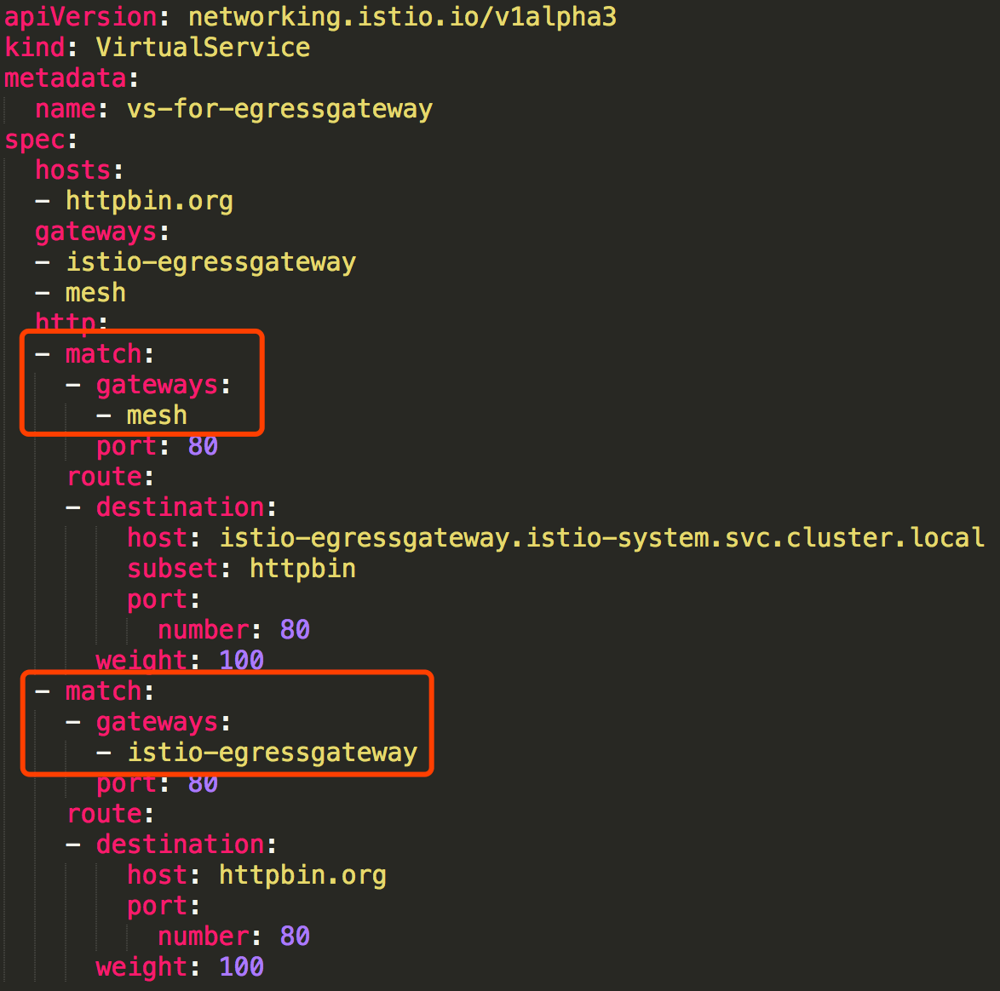


### 超时重试-提升系统的健壮性和可用性


#### 基本概念

- 超时
  - 控制故障范围，避免故障扩散
- 重试
  - 解决网络抖动时通信失败的问题

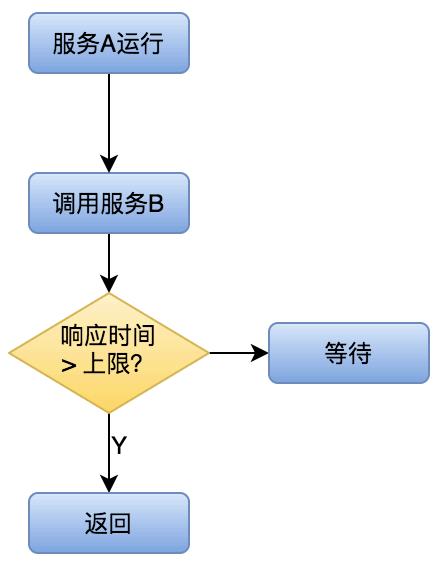

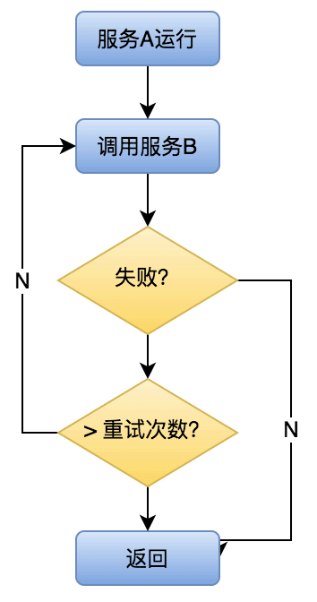


#### 任务：添加超时重试策略

- 任务说明
  - 添加超时策略
  - 添加重试策略
- 任务目标
  - 学会在 VirtualService 中添加超时和重试的配置项
  - 理解超时重试对提升应用健壮性的意义

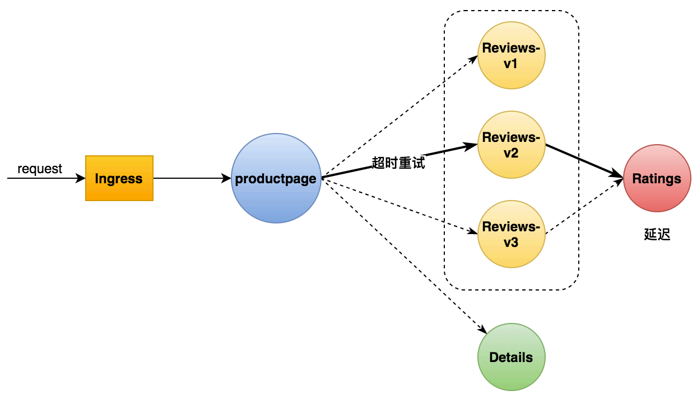


#### 演示步骤

- 给 ratings 服务添加延迟
- 给 reviews 服务添加超时策略
- 给 ratings 服务添加重试策略


#### 配置分析

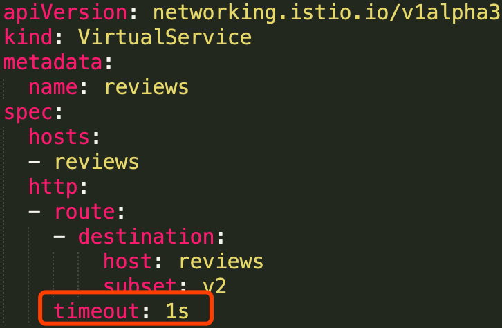

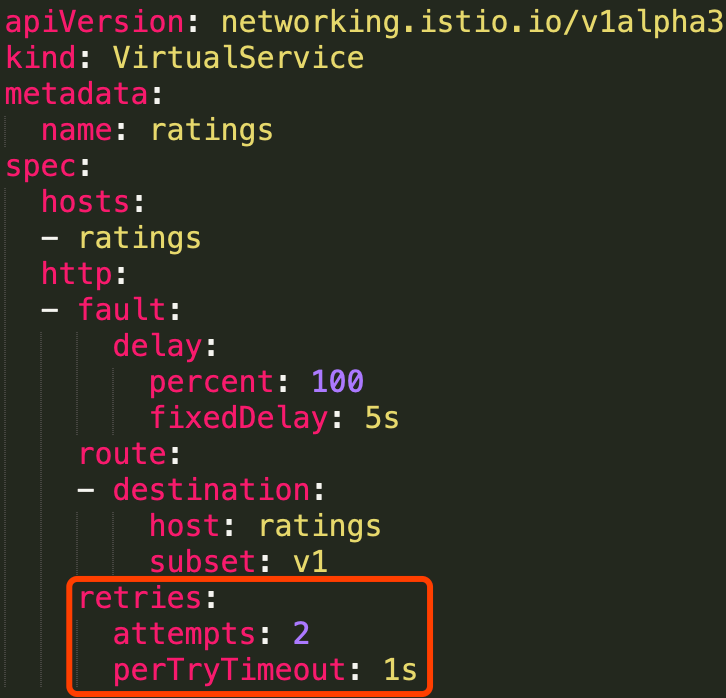

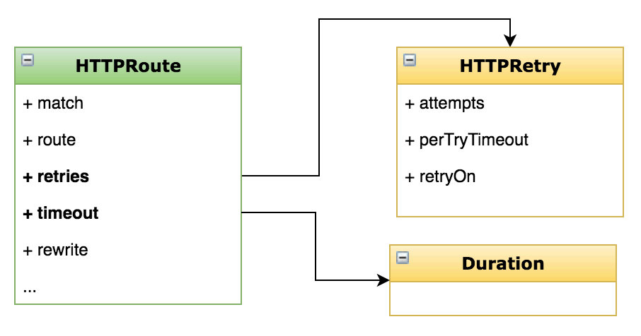


#### 课后练习

- 复习如何配置超时、重试策略。
- 思考为什么有些应用场景要使用指数级退避的重试策略？


## 实战篇