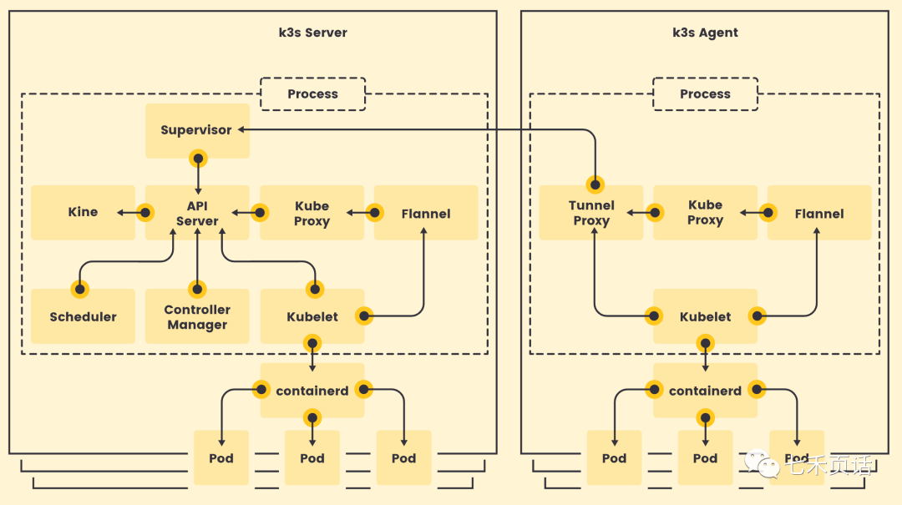
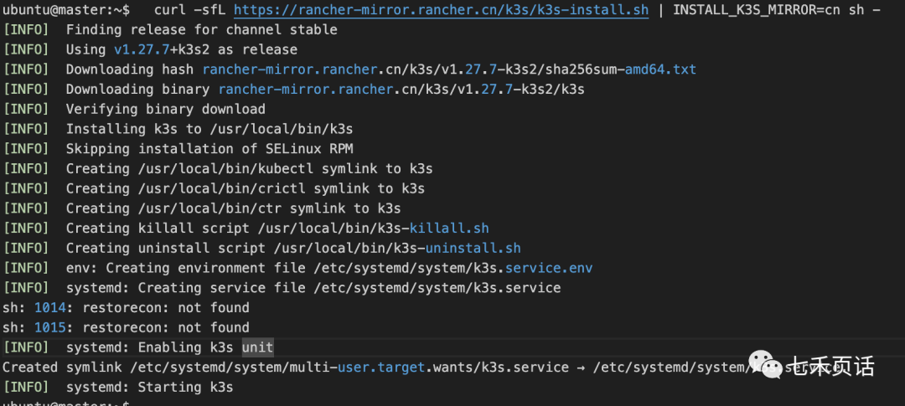
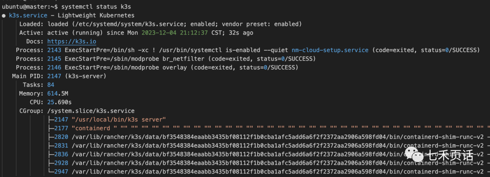
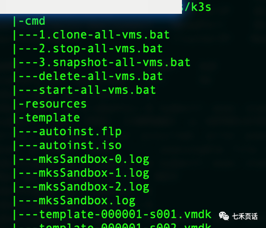

# 快速搭一个Kubernetes集群（一）


Kubernetes从2014年正是发布到现在已经快10个年头了，已经成为容器编排的领导者，而基于Kubernetes的开源项目，各个ICT公司都开启了自己的发行版本，这些版本通常针对不同的使用场景和需求进行了特定的优化，旨在简化Kubernetes的安装、配置和管理过程，以下是一些主要的Kubernetes发行版本：

1. **Minikube**：适用于在个人电脑上本地运行单节点Kubernetes集群的工具，主要用于学习和开发目的。
2. **Kubeadm**：官方工具，用于快速部署标准的Kubernetes集群。它适合于生产环境和更复杂的需求。
3. **MicroK8s**：由Canonical开发的轻量级Kubernetes发行版，适用于边缘计算、IoT和微服务环境。
4. **K3s**：由Rancher Labs开发的轻量级Kubernetes发行版，适用于边缘计算和资源受限的环境。
5. **OpenShift**：Red Hat提供的企业级Kubernetes发行版，包含了开发者工具和CI/CD功能，适用于更复杂的企业应用。
6. **Rancher**：一个企业级容器管理平台，提供了对多个Kubernetes集群的管理功能，包括图形化界面。
7. **Amazon EKS**：Elastic Kubernetes Service是Amazon家的Kubernetes平台，允许在AWS云上运行Kubernetes集群和应用。
8. **Google GKE**：Google自家的Kubernetes全称叫做Google Kubernetes Engine，专为在GCP上运行Kubernetes集群而设计。
9. **Azure AKS**：Azure Kubernetes Service作为Microsoft的云原生平台，提供了托管Kubernetes服务，支持在Azure云上轻松部署和管理Kubernetes集群。

技术学习离不开实验，所以搭建一套小型的Kubernetes是学习的第一步，虽然Kubernetes官方推荐的是使用Minikube，但是我更喜欢使用更加轻量的k3s做实验。

什么是k3s呢？我们知道k8s是因为单词“Kubernetes”中从“K”到“s”之间有8个字母，因此缩写为“K8s”；而K3s是Rancher推出的轻量级Kubernetes发行版，K3s的“3”并不代表字母数量，而意在传达这是一个“更小、更简化”的Kubernetes版本。



K3s作为轻量级发型版本，资源需求如下，可以说是Kubernetes里资源需求非常小的存在了： | Spec | Minimum | Recommended | |:——–:|:———:|:———–:| | CPU | 1 core | 2 cores | | RAM | 512 MB | 1 GB |

当然如果想做一个高可用的，还是要根据业务需求来增加资源的： | Deployment Size | Nodes | VCPUs | RAM | |—————–|————|——-|——-| | Small | Up to 10 | 2 | 4 GB | | Medium | Up to 100 | 4 | 8 GB | | Large | Up to 250 | 8 | 16 GB | | X-Large | Up to 500 | 16 | 32 GB | | XX-Large | 500+ | 32 | 64 GB |

在我的实验中，使用了如下的资源： | VCPUs | RAM | Disk | |——-|——-|——–| | 2 | 4 GB | 40 GB |

环境是使用VMWare的虚拟机，基础系统选择的是Ubuntu 22.04.3这个版本。


## 安装OS并初始化

首先是系统安装，VMWare里加载Ubuntu ISO后一步一步安装即可。

系统安装完成后需要做一些初始化更新：

```sh
sudo apt update
sudo apt upgrade -y
sudo reboot
sudo apt install -y curl wget
```


## 推荐安装K3S Server和节点之前执行

>朋友反馈说K3S安装后，K3S集群状态一直处于 NotReady，我上去获取log日志后发现是Server节点和Agent节点都无法正常获取容器镜像，从而导致集群无法正常启动。
>实际上还是docker hub的无法访问造成的，这里我们只需要配置containerd加速源即可。

```sh
mkdir -p /etc/rancher/k3s/
cat >> /etc/rancher/k3s/registries.yaml << EOF
mirrors:
  docker.io:
    endpoint:
      - "https://docker.m.daocloud.io"
  rancher:
    endpoint:
      - "https://docker.m.daocloud.io"
  gcr.io:
    endpoint:
      - "https://gcr.m.daocloud.io"
  quay.io:
    endpoint:
      - "https://quay.m.daocloud.io"
  registry.k8s.io:
    endpoint:
      - "https://k8s.m.daocloud.io"
  registry-1.docker.io:
    endpoint:
      - "https://docker.m.daocloud.io"
EOF
```


> 建议这个文件worker 节点也整一份。

如果遇到worker 节点 镜像拉不下来（docker Hub 去拉了），可以在worker 节点创建 `/etc/rancher/k3s/registries.yaml`，内容如上。

然后重启 k3s agent：

```sh
systemctl restart k3s-agent.service
```


### 临时解决（最后的方案）：

你也可以直接手动拉取 pause 镜像：

```sh
# 拉取镜像（从 DaoCloud）
sudo ctr -n k8s.io image pull docker.m.daocloud.io/rancher/mirrored-pause:3.6

# 给它打一个 tag 让 K3s 能识别
sudo ctr -n k8s.io image tag docker.m.daocloud.io/rancher/mirrored-pause:3.6 docker.io/rancher/mirrored-pause:3.6
```

再重启 K3s：

```
sudo systemctl restart k3s
```

**worker 节点同理**

## 安装K3s Server

初始化完成后，安装K3s的Server节点，也就是Kubernetes里作为Controller的master节点：

```
curl -sfL https://get.k3s.io | sh -

#如果是大陆用户可以使用如下命令
curl -sfL https://rancher-mirror.rancher.cn/k3s/k3s-install.sh | INSTALL_K3S_MIRROR=cn sh -
```



安装完成后可以查看`k3s.service`的状态:

```sh
#安装完成后查看状态
systemctl status k3s
```




## 无法运行kubectl？

这样K3s的controller就安装好了，但是此时用普通用户运行`kubectl`的命令会失败：

```sh
ubuntu@master:~$ kubectl get pod -A
WARN[0000] Unable to read /etc/rancher/k3s/k3s.yaml, please start server with --write-kubeconfig-mode to modify kube config permissions 
error: error loading config file "/etc/rancher/k3s/k3s.yaml": open /etc/rancher/k3s/k3s.yaml: permission denied
ubuntu@master:~$ 
```

一个是按照提示通过`--write-kubeconfig-mode`来操作，一个是直接将`/etc/rancher/k3s/k3s.yaml`复制到用户的`.kube`文件夹并重命名为`config`，然后需要修改权限成600，并声明给环境变量`KUBECONFIG`：

```sh
mkdir ~/.kube
sudo cp /etc/rancher/k3s/k3s.yaml ~/.kube/config && sudo chown $USER ~/.kube/config
sudo chmod 600 ~/.kube/config && export KUBECONFIG=~/.kube/config
echo "export KUBECONFIG=~/.kube/config" >> .bashrc
```


## kubectl的tab补全

完成上述步骤之后，可以运行`kubectl`命令了，但是不够丝滑，因为使用`tab键`不能自动补全。

一个是只针对某一个用户，只需要将`kubectl`的`bash complete`的声明放到用户的`.bashrc`文件中即可：

```sh
#### bash completion for kubectl
echo "source <(kubectl completion bash)" >> $HOME/.bashrc
source $HOME/.bashrc
```

如果想一劳永逸对所有用户都进行`tab`自动补全，需要将`kubectl`的`bash completion`内容写到`/etc/bash_completion.d/kubectl`这个文件中，下边的例子是当前用户有sudo权限，然后通过一行命令直接写入到kubectl文件中：

```sh
kubectl completion bash | sudo tee /etc/bash_completion.d/kubectl > /dev/null
source /etc/bash_completion.d/kubectl
```

之后就可以很丝滑的运行`kubectl`并使用`tab键`补全了：

```sh
###左右滑动
ubuntu@master:~$ kubectl 
annotate       (Update the annotations on a resource)
api-resources  (Print the supported API resources on the server)
api-versions   (Print the supported API versions on the server, in the form of "group/version")
...........................
taint          (Update the taints on one or more nodes)
top            (Display resource (CPU/memory) usage)
uncordon       (Mark node as schedulable)
version        (Print the client and server version information)
wait           (Experimental: Wait for a specific condition on one or many resources)
ubuntu@master:~$ kubectl get 
addons.k3s.cattle.io                                          ingressclasses.networking.k8s.io                              priorityclasses.scheduling.k8s.io                              
.................
helmcharts.helm.cattle.io                                     pods                                                          validatingwebhookconfigurations.admissionregistration.k8s.io
horizontalpodautoscalers.autoscaling                          podtemplates                                                  volumeattachments.storage.k8s.io    

ubuntu@master:~$ kubectl get pod -n 
default          kube-node-lease  kube-public      kube-system      
ubuntu@master:~$ kubectl get pod -A
NAMESPACE     NAME                                     READY   STATUS      RESTARTS   AGE
kube-system   coredns-77ccd57875-qhxgz                 1/1     Running     0          3m30s
kube-system   local-path-provisioner-957fdf8bc-6n764   1/1     Running     0          3m30s
kube-system   helm-install-traefik-crd-66n28           0/1     Completed   0          3m31s
kube-system   metrics-server-648b5df564-j88vq          1/1     Running     0          3m30s
kube-system   helm-install-traefik-9hgs6               0/1     Completed   2          3m31s
kube-system   svclb-traefik-4f456090-5dvnb             2/2     Running     0          2m7s
kube-system   traefik-768bdcdcdd-rcsjd                 1/1     Running     0          2m7s
ubuntu@master:~$ 
```


## 我的VM模版

那么接下来如果你不想安装环境，可以直接公众号后台回复`k3s`获取安装好的虚拟机(VM)模版，直接下载整个k3s的文件夹：



如果没有安装WMware Workstation，可以尝试使用分享的17.0.0，也可以直接到VMWare官方下载最新的的版本。

下载后文件夹结构不要动，需要注意的是`cmd`文件夹中的`bat`脚本可以直接双击运行，其中第一个最重要(脚本是之前参加一个培训学习到的，使用中又修改了下，比如加入了hostname的修改)：

```sh
1.clone-all-vms.bat：根据clonevms的参数值将template VM复制成不同的VM，并修改其hostname，获取IP
```

克隆完会有三个新的VM，分别是master、worker1和worker2，如果想复制更多的VM，可以修改bat文件中的`clonevms`参数。

修改hostname是因为Kubernetes集群中的所有node不能有相同的hostname，否则无法加入到集群中，因此bat脚本中调用的Linux用户需要有sudo权限并且可以免密切换到sudo，我提供的template vm已经完成了所有的设定并且完成了apt更新，克隆完直接在master vm中安装k3s即可。

其他的`bat`脚本都是辅助，主要是VMWare多vm的管理用`vmrun`确实方便许多。