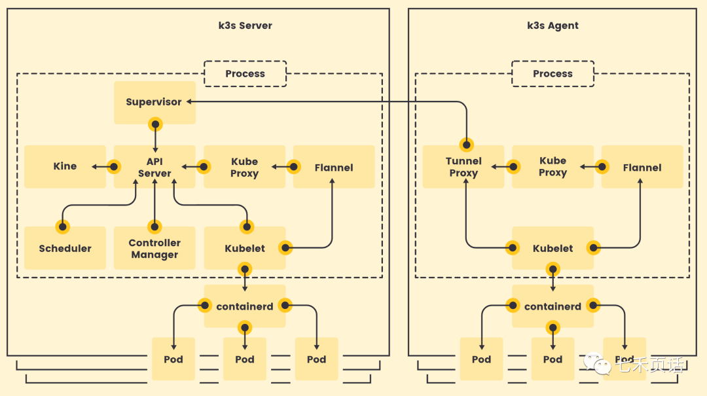
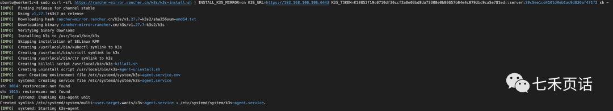
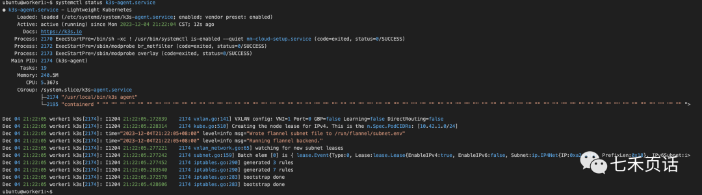
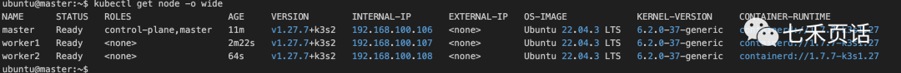
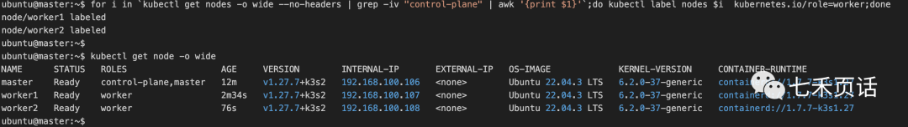
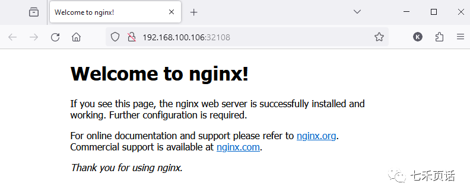
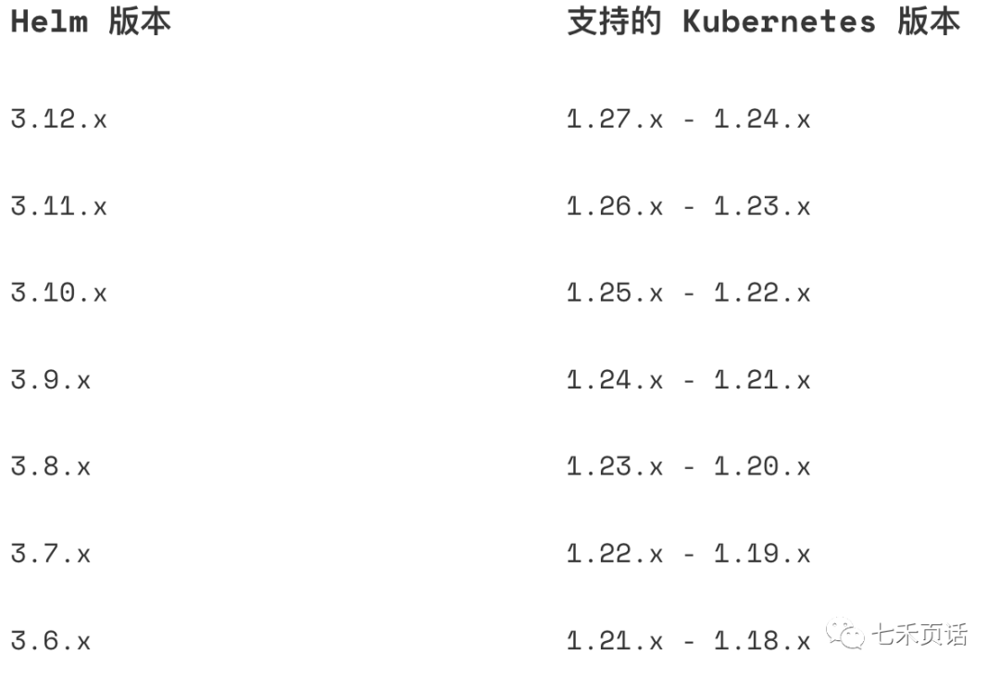

# 快速搭一个Kubernetes集群（二）


上一篇聊完了如何快速安装k3s中master这个controller，一条命令即可。

在Kubernetes的集群中，master也是可以作为worker node使用的，在资源比较紧张的情况下，可以将master作为一个worker来给业务Pod使用，如果资源比较富裕，最好能将master独立出来，不参与业务，仅仅保证它作为集群controller的唯一使用。

上一篇安装的就是下图的左边：k3s server，今天来完成右边的安装：k3s agent。

多说一点儿，K3s这个发行版本中Server就是master，也就是controller；agent就是worker node；k3s server这个master是带有controller功能的特殊agent。

所以这些概念要融会贯通，需要在不同说法中都可以快速抓到核心。

当master安装起来之后，我们就可以开始在其他的node上安装agent并注册到master上了。

流程大概分两步：

1. 拿到master的IP和Token：IP就是`kubectl get node -o wide`的IP，token在`cat /var/lib/rancher/k3s/server/node-token`中。
2. 然后在worker上运行命令`curl -sfL https://get.k3s.io | K3S_URL=https://<master IP>:6443 K3S_TOKEN=<master token> sh -`


## 获取master的信息

所以我的步骤是在`master`上运行如下命令，将打印结果保存后到其他作为worker的node上运行：

```sh
echo "sudo curl -sfL https://rancher-mirror.rancher.cn/k3s/k3s-install.sh | INSTALL_K3S_MIRROR=cn K3S_URL=https://`kubectl get node -o wide | grep -i control-plane | awk '{print $6}'`:6443 K3S_TOKEN=`sudo cat /var/lib/rancher/k3s/server/node-token` sh -"

例子
ubuntu@master:~$ echo "sudo curl -sfL https://rancher-mirror.rancher.cn/k3s/k3s-install.sh | INSTALL_K3S_MIRROR=cn K3S_URL=https://`kubectl get node -o wide | grep -i control-plane | awk '{print $6}'`:6443 K3S_TOKEN=`sudo cat /var/lib/rancher/k3s/server/node-token` sh -"

sudo curl -sfL https://rancher-mirror.rancher.cn/k3s/k3s-install.sh | INSTALL_K3S_MIRROR=cn K3S_URL=https://192.168.100.106:6443 K3S_TOKEN=K10852f19c0710df30ccf2a8e03bd8da73308e0b88657b04e4c079dbc9ca5e781ed::server:29c5ee1cd4101d9eb1ac9d836af471f2 sh -
ubuntu@master:~$ 
```


## Worker注册到master

登录到每一个worker中，运行上边打印的结果，会自动安装`k3s-agent`组件，并注册到master上：

```sh
ubuntu@worker1:~$ sudo curl -sfL https://rancher-mirror.rancher.cn/k3s/k3s-install.sh | INSTALL_K3S_MIRROR=cn K3S_URL=https://192.168.100.106:6443 K3S_TOKEN=K10852f19c0710df30ccf2a8e03bd8da73308e0b88657b04e4c079dbc9ca5e781ed::server:29c5ee1cd4101d9eb1ac9d836af471f2 sh -
```

安装的log如下图：



通过`systemctl status k3s-agent.service `可以查看状态：




## 给worker一个清晰的role

每个worker安装完`k3s-agent`之后就可以回到master去查看node的状态了：

```sh
kubectl get node -o wide
```

但是会看到worker们的role是none：



为了很清晰明了的知道各个node的角色，可以打label：

```sh
kubectl label nodes <node name> kubernetes.io/role=worker

或者for循环
for i in `kubectl get nodes -o wide --no-headers | grep -iv "control-plane" | awk '{print $1}'`;do kubectl label nodes $i kubernetes.io/role=worker;done
```

再打印node的时候就可以看到所有的node都自己的role了：



到此，一个小型Kubernetes集群就建立完成了，其中包含了一个master和两个worker，需要注意的是master也是一种worker，只不过集群的管理系统在master上，所以在资源充足的前提下，可以让master不再参与其他业务Pod的调度。

可以继续查看版本信息，cluster信息，image信息等，值得注意的是Kubernetes新版本放弃了docker开始用containerd管理容器，当然一个过渡阶段两个都支持，但是默认是containerd了：

```sh
k3s -v

kubectl get pod -A
kubectl cluster-info
kubectl get nodes -o wide

sudo crictl image list
sudo crictl info
```


## 创建一个测试的Nginx Pod

集群安装完，就可以安装应用程序了，如同编程使用`hello world`一样，`nginx`似乎成为了Kubernetes集群系统测试中的先行者。

```sh
kubectl create deployment nginx-deployment --image nginx --replicas 1
kubectl get pods

例子
ubuntu@master:~$ kubectl create deployment nginx-deployment --image nginx --replicas 1
deployment.apps/nginx-deployment created
ubuntu@master:~$ kubectl get pod
NAME                                READY   STATUS              RESTARTS   AGE
nginx-deployment-66fb7f764c-rkpcd   0/1     ContainerCreating   0          3s
ubuntu@master:~$ kubectl get pod
NAME                                READY   STATUS    RESTARTS   AGE
nginx-deployment-66fb7f764c-rkpcd   1/1     Running   0          33s
ubuntu@master:~$ 
```

Nginx Pod安装完成后，通过暴漏一个`NodePort`类型的`service`可以打开Nginx的页面：

```
kubectl expose deployment nginx-deployment --type NodePort --port 80
kubectl get svc nginx-deployment

例子：
ubuntu@master:~$ kubectl expose deployment nginx-deployment --type NodePort --port 80
service/nginx-deployment exposed
ubuntu@master:~$ 
ubuntu@master:~$ kubectl get svc
NAME               TYPE        CLUSTER-IP    EXTERNAL-IP   PORT(S)        AGE
kubernetes         ClusterIP   10.43.0.1     <none>        443/TCP        5d14h
nginx-deployment   NodePort    10.43.63.73   <none>        80:32108/TCP   2s
ubuntu@master:~$ 
```

IP就是任何一个worker的IP(包括master)，Port就是nginx service暴漏的外部Port，`80:32108/TCP`中冒号`:`后就是暴漏的外部Port：

```sh
ubuntu@master:~$ kubectl get pod -o wide
NAME                                READY   STATUS    RESTARTS   AGE   IP           NODE      NOMINATED NODE   READINESS GATES
nginx-deployment-66fb7f764c-rkpcd   1/1     Running   0          11m   10.42.3.11   worker2   <none>           <none>
ubuntu@master:~$ kubectl get nodes -o wide
NAME      STATUS   ROLES                  AGE     VERSION        INTERNAL-IP       EXTERNAL-IP   OS-IMAGE             KERNEL-VERSION     CONTAINER-RUNTIME
master    Ready    control-plane,master   5d14h   v1.27.7+k3s2   192.168.100.106   <none>        Ubuntu 22.04.3 LTS   6.2.0-37-generic   containerd://1.7.7-k3s1.
worker2   Ready    worker                 5d14h   v1.27.7+k3s2   192.168.100.108   <none>        Ubuntu 22.04.3 LTS   6.2.0-37-generic   containerd://1.7.7-k3s1.
worker1   Ready    worker                 5d14h   v1.27.7+k3s2   192.168.100.107   <none>        Ubuntu 22.04.3 LTS   6.2.0-37-generic   containerd://1.7.7-k3s1.
ubuntu@master:~$ 
```




## 安装helm

当我们创建Pod的时候，大概有两种方式，一种就是上边创建Nginx Pod的时候直接用`kubectl`创建，但是对于大型的Kubernetes应用程序需要一个强大的包管理来进行程序的维护，目前最优的就是helm。

所以k8s集群安装完后，安装helm也是必不可少的一个步骤。

首先需要确定helm和k8s的版本对应，可以在网站https://helm.sh/zh/docs/topics/version_skew/中查看，下边是部分截图：



通过`kubectl version --short`看到当前的k8s版本是1.27.7，所以可以安装helm的3.12.x的任何版本：

```sh
ubuntu@master:~$ kubectl version --short
Flag --short has been deprecated, and will be removed in the future. The --short output will become the default.
Client Version: v1.27.7+k3s2
Kustomize Version: v5.0.1
Server Version: v1.27.7+k3s2
```

所以我选择了最新版本3.12.2（https://github.com/helm/helm/releases）进行安装。

helm的安装有很多种方式，这里选择用二进制版本安装。每个Helm 版本都提供了各种操作系统的二进制版本，这些版本可以手动下载和安装;

1. 下载需要的版本https://github.com/helm/helm/releases
2. 解压(tar -zxvf helm-v3.x.x-linux-amd64.tar.gz)
3. 在解压目录中找到helm程序，移动到需要的目录中(mv linux-amd64/helm /usr/local/bin/helm)

安装3.12.2的版本命令如下：

```sh
wget https://get.helm.sh/helm-v3.12.2-linux-amd64.tar.gz
tar -zxvf helm-v3.12.2-linux-amd64.tar.gz
sudo mv linux-amd64/helm /usr/local/bin

例如
ubuntu@master:~$ wget https://get.helm.sh/helm-v3.12.2-linux-amd64.tar.gz
--2023-12-09 20:26:29--  https://get.helm.sh/helm-v3.12.2-linux-amd64.tar.gz
Resolving get.helm.sh (get.helm.sh)... 152.199.39.108, 2606:2800:247:1cb7:261b:1f9c:2074:3c
Connecting to get.helm.sh (get.helm.sh)|152.199.39.108|:443... connected.
HTTP request sent, awaiting response... 200 OK
Length: 16028750 (15M) [application/x-tar]
Saving to: ‘helm-v3.12.2-linux-amd64.tar.gz’

helm-v3.12.2-linux-amd64.tar.gz                100%[==================================================================================================>]  15.29M  8.38MB/s    in 1.8s    

2023-12-09 20:26:32 (8.38 MB/s) - ‘helm-v3.12.2-linux-amd64.tar.gz’ saved [16028750/16028750]

ubuntu@master:~$ ls -l | grep helm
-rw-rw-r-- 1 ubuntu ubuntu 16028750 Jul 14 02:29 helm-v3.12.2-linux-amd64.tar.gz
ubuntu@master:~$ 
ubuntu@master:~$  tar -zxvf helm-v3.12.2-linux-amd64.tar.gz 
linux-amd64/
linux-amd64/helm
linux-amd64/LICENSE
linux-amd64/README.md
ubuntu@master:~$ ls -l | grep linux
-rw-rw-r-- 1 ubuntu ubuntu 16028750 Jul 14 02:29 helm-v3.12.2-linux-amd64.tar.gz
drwxr-xr-x 2 ubuntu ubuntu     4096 Jul 14 02:28 linux-amd64           
ubuntu@master:~$ sudo mv linux-amd64/helm /usr/local/bin/helm
ubuntu@master:~$ 
```

安装后查看`helm`的版本：

```sh
ubuntu@master:~$ helm version
version.BuildInfo{Version:"v3.12.2", GitCommit:"1e210a2c8cc5117d1055bfaa5d40f51bbc2e345e", GitTreeState:"clean", GoVersion:"go1.20.5"}
ubuntu@master:~$ 
```

到这里，我们需要记住很多的`helm`命令才可以使用，所以bash completion是非常重要的，跟`kubectl`的bash completion类似，可以针对某一个用户设置：

```sh
echo "source <(helm completion bash)" >> $HOME/.bashrc
source $HOME/.bashrc
```

也可以一劳永逸的对所有用户设置，需要sudo权限或者使用root用户：

```sh
helm completion bash | sudo tee /etc/bash_completion.d/helm > /dev/null
source /etc/bash_completion.d/helm
```

到这里，helm的安装和配置也就完成了，可以愉快的使用`tab键`进行丝滑的补全提醒了：

```sh
ubuntu@master:~$ helm    ////双击tab键
completion  (generate autocompletion scripts for the specified shell)
create      (create a new chart with the given name)
dependency  (manage a chart's dependencies)
env         (helm client environment information)
get         (download extended information of a named release)
help        (Help about any command)
history     (fetch release history)
install     (install a chart)
lint        (examine a chart for possible issues)
..............................
uninstall   (uninstall a release)
upgrade     (upgrade a release)
verify      (verify that a chart at the given path has been signed and is valid)
version     (print the client version information)    
ubuntu@master:~$ helm list -n    ////双击tab键
default          kube-node-lease  kube-public      kube-system      
ubuntu@master:~$ 
```

到此，包含了包管理`helm`命令的集群就完成了，可以通过`helm`管理、安装、升级应用程序了。

至此，一master俩worker node的k8s集群建立完成，使用的是由Rancher Labs发布的轻量级的发行版本——k3s。