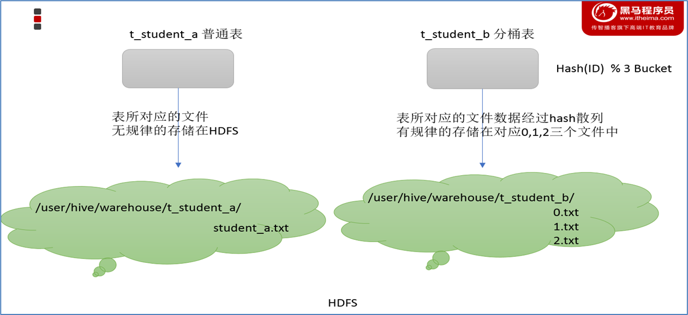
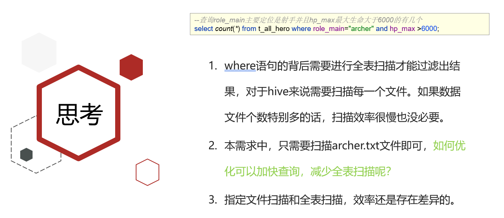

# Hive

## Apache Hive

### Apache Hive概述

- Apache Hive是一款建立在``Hadoop``之上的开源**数据仓库**系统，可以将存储在Hadoop文件中的结构化、半结构化数据文件映射为一张数据库表，基于表提供了一种类似SQL的查询模型，称为Hive查询语言（HQL），用于访问和分析存储在``Hadoop``文件中的大型数据集。
- Hive核心是将``HQL``转换为``MapReduce``程序，然后将程序提交到``Hadoop``群集执行。
- Hive由Facebook实现并开源。

### 场景设计：如何模拟实现Hive功能

#### 案例

如果让您设计Hive这款软件，要求能够实现用户编写sql语句，`Hive`自动将sql转换`MapReduce`程序，处理位于HDFS上的结构化数据。如何实现？

在HDFS文件系统上有一个文件，路径为/data/china_user.txt，其内容如下：

需求：统计来自于上海年龄大于25岁的用户有多少个？

#### **映射信息记录**

- **映射**在数学上称之为一种**对应关系**，比如y=x+1，对于每一个x的值都有与之对应的y的值。
- 在`hive`中能够写sql处理的前提是针对表，而不是针对文件，因此需要将**文件和表之间的对应关系**描述记录清楚。映射信息专业的叫法称之为`元数据信息`（元数据是指用来描述数据的数据 metadata）。
- 具体来看，要记录的元数据信息包括：
  - 表对应着哪个文件（位置信息）
  - 表的列对应着文件哪一个字段（顺序信息）
  - 文件字段之间的分隔符是什么

#### **SQL**语法解析、编译

用户写完sql之后，hive需要针对sql进行语法校验，并且根据记录的元数据信息解读sql背后的含义，制定执行计划。并且把执行计划转换成MapReduce程序来执行，把执行的结果封装返回给用户。

#### **场景目的**

- Hive能将数据文件映射成为一张表，这个**映射**是指什么

  >**文件和表之间的对应关系**

- Hive软件本身到底承担了什么**功能职责**

  >SQL语法解析编译成为MapReduce

  

#### **最终效果**

- 基于上述分析，最终要想模拟实现的Hive的功能，大致需要下图所示组件参与其中。
- 从中可以感受一下Hive承担了什么职责，当然，也可以把这个理解为Hive的架构图。

### Apache Hive架构、组件

#### 架构图

#### 组件

- **用户接口**

  包括 CLI、JDBC/ODBC、WebGUI。其中，CLI(command line interface)为shell命令行；Hive中的Thrift服务器允许外部客户端通过网络与Hive进行交互，类似于JDBC或ODBC协议。WebGUI是通过浏览器访问Hive。

- **元数据存储**

  通常是存储在关系数据库如 mysql/derby中。Hive 中的元数据包括表的名字，表的列和分区及其属性，表的属性（是否为外部表等），表的数据所在目录等。

- Driver驱动程序，包括语法解析器、计划编译器、优化器、执行器

  完成 HQL 查询语句从词法分析、语法分析、编译、优化以及查询计划的生成。生成的查询计划存储在 HDFS 中，并在随后有执行引擎调用执行。

- 执行引擎

  Hive本身并不直接处理数据文件。而是通过执行引擎处理。当下Hive支持MapReduce、Tez、Spark3种执行引擎。

### Apache Hive数据模型

#### **Data Model**概念

- 数据模型：用来描述数据、组织数据和对数据进行操作，是对现实世界数据特征的描述。

- Hive的数据模型类似于RDBMS库表结构，此外还有自己特有模型。

- Hive中的数据可以在粒度级别上分为三类：

  - Table 表
  - Partition 分区
  - Bucket 分桶

  

#### **Databases** **数据库**

- Hive作为一个数据仓库，在结构上积极向传统数据库看齐，也分数据库（Schema），每个数据库下面有各自的表组成。默认数据库default。

- Hive的数据都是存储在HDFS上的，默认有一个根目录，在hive-site.xml中，由参数hive.metastore.warehouse.dir指定。默认值为/user/hive/warehouse。

- 因此，Hive中的数据库在HDFS上的存储路径为：

  >${hive.metastore.warehouse.dir}/databasename.db

- 比如，名为itcast的数据库存储路径为：

  >/user/hive/warehouse/itcast.db

#### **Tables** **表**

- Hive表与关系数据库中的表相同。Hive中的表所对应的数据通常是存储在HDFS中，而表相关的元数据是存储在RDBMS中。

- Hive中的表的数据在HDFS上的存储路径为：

  >${hive.metastore.warehouse.dir}/databasename.db/tablename

- 比如,itcast的数据库下t_user表存储路径为：

  >/user/hive/warehouse/itcast.db/t_user

#### **Partitions** **分区**

- Partition分区是hive的一种优化手段表。分区是指**根据分区列（例如“日期day”）的值将表划分为不同分区**。这样可以更快地对指定分区数据进行查询。
- 分区在存储层面上的表现是:table表目录下以子文件夹形式存在。
- 一个文件夹表示一个分区。子文件命名标准：分区列=分区值
- Hive还支持分区下继续创建分区，所谓的多重分区。关于分区表的使用和详细介绍，后面模块会单独展开。

#### **Buckets** 分桶

- Bucket分桶表是hive的一种优化手段表。分桶是指**根据表中字段（例如“编号ID”）的值,经过hash计算规则将数据文件划分成指定的若干个小文件**。

- 分桶规则：hashfunc(字段) % 桶个数，余数相同的分到同一个文件。

  

- 分桶的好处是可以优化join查询和方便抽样查询。

- Bucket分桶表在HDFS中表现为同一个表目录下数据根据hash散列之后变成多个文件。

### Apache Hive是要取代MySQL吗

- Hive虽然具有RDBMS数据库的外表，包括数据模型、SQL语法都十分相似，但应用场景却完全不同。

- Hive**只适合用来做海量数据的离线分析。**Hive的定位是数据仓库，面向分析的OLAP系统。

- 因此时刻告诉自己，Hive不是大型数据库，也不是要取代MySQL承担业务数据处理。

  

## Hive SQL数据定义语言（DDL）

### 数据定义语言（DDL）概述

**SQL中DDL语法的作用**

- 数据定义语言 (Data Definition Language, DDL)，是SQL语言集中对数据库内部的对象结构进行创建，删除，修改等的操作语言，这些数据库对象包括database（schema）、table、view、index等。
- DDL核心语法由CREATE、ALTER与DROP三个所组成。DDL并不涉及表内部数据的操作。
- 在某些上下文中，该术语也称为数据描述语言，因为它描述了数据库表中的字段和记录。

**Hive中DDL语法的使用**

- Hive SQL（HQL）与标准SQL的语法大同小异，基本相通，注意差异即可；
- 基于Hive的设计、使用特点，HQL中create语法（尤其create table）将是学习掌握Hive DDL语法的重中之重。
- 建表是否成功直接影响数据文件是否映射成功，进而影响后续是否可以基于SQL分析数据。通俗点说，没有表，表没有数据，你用Hive分析什么呢？

### Hive SQL DDL建表基础语法

#### Hive建表完整语法树

**HIVE DDL CREATE TABLE**

**注意事项**

- 蓝色字体是建表语法的关键字，用于指定某些功能。
- [ ]中括号的语法表示可选。
- |表示使用的时候，左右语法二选一。
- 建表语句中的语法顺序要和语法树中顺序保持一致。

#### Hive数据类型详解

##### **整体概述**

- Hive数据类型指的是表中列的字段类型；
- 整体分为两类：原生数据类型（primitive data type）和复杂数据类型（complex data type）。

原生数据类型包括：数值类型、时间日期类型、字符串类型、杂项数据类型；

复杂数据类型包括：array数组、map映射、struct结构、union联合体。

##### **原生数据类型**

##### **复杂数据类型**

##### **注意事项**

- Hive SQL中，数据类型英文字母大小写不敏感；
- 除SQL数据类型外，还支持Java数据类型，比如字符串string；
- 复杂数据类型的使用通常需要和分隔符指定语法配合使用；
- 如果定义的数据类型和文件不一致，Hive会尝试隐式转换，但是不保证成功。

##### **隐式转换**

- 与标准SQL类似，HQL支持隐式和显式类型转换。 
- 原生类型从窄类型到宽类型的转换称为隐式转换，反之，则不允许。 
- 下表描述了类型之间允许的隐式转换：

##### **显示转换**

**显式类型转换使用CAST函数。**

例如，CAST（'100'as INT）会将100字符串转换为100整数值。 

如果强制转换失败，例如CAST（‘Allen'as INT），该函数返回NULL。

#### Hive读写文件机制

##### SerDe是什么

- SerDe是Serializer、Deserializer的简称，目的是用于序列化和反序列化

- 序列化是对象转化为字节码的过程；而反序列化是字节码转换为对象的过程。

- Hive使用SerDe（包括FileFormat）读取和写入表行对象。需要注意的是，“key”部分在读取时会被忽略，而在写入时key始终是常数。基本上行对象存储在“value“中。

  

- 可以通过desc formatted tablename查看表的相关SerDe信息。默认如下：

##### Hive读写文件流程

- Hive读取文件机制：首先调用InputFormat（默认TextInputFormat），返回一条一条kv键值对记录（默认是一行对应一条键值对）。然后调用SerDe（默认LazySimpleSerDe）的Deserializer，将一条记录中的value根据分隔符切分为各个字段。

- Hive写文件机制：将Row写入文件时，首先调用SerDe（默认LazySimpleSerDe）的Serializer将对象转换成字节序列，然后调用OutputFormat将数据写入HDFS文件中。

  

##### SerDe相关语法

- ROW FORMAT这一行所代表的是跟读写文件、序列化SerDe相关的语法，功能有二：

- 使用哪个SerDe类进行序列化；

- 如何指定分隔符

  

- 其中ROW FORMAT是语法关键字，DELIMITED和SERDE二选其一。

- 如果使用delimited表示使用默认的LazySimpleSerDe类来处理数据。

- 如果数据文件格式比较特殊可以使用ROW FORMAT SERDE serde_name指定其他的Serde类来处理数据,甚至支持用户自定义SerDe类。

  

##### LazySimpleSerDe分隔符指定

- LazySimpleSerDe是Hive默认的序列化类，包含4种子语法，分别用于指定字段之间、集合元素之间、map映射 kv之间、换行的分隔符号。

- 在建表的时候可以根据数据的特点灵活搭配使用。

  

##### Hive默认分隔符

- Hive建表时如果没有row format语法指定分隔符，则采用默认分隔符；

- 默认的分割符是'\001'，是一种特殊的字符，使用的是ASCII编码的值，键盘是打不出来的。

  

#### Hive数据存储路径

##### **默认存储路径**

- Hive表默认存储路径是由${HIVE_HOME}/conf/hive-site.xml配置文件的hive.metastore.warehouse.dir属性指定，默认值是：/user/hive/warehouse。

  

- 在该路径下，文件将根据所属的库、表，有规律的存储在对应的文件夹下。

  

  

##### 指定存储路径

- 在Hive建表的时候，可以通过location语法来更改数据在HDFS上的存储路径，使得建表加载数据更加灵活方便。

- 语法：LOCATION '<hdfs_location>'。

- 对于已经生成好的数据文件，使用location指定路径将会很方便。

  

#### 案例--王者荣耀数据Hive建表映射

##### 原生数据类型使用

文件archer.txt中记录了手游《王者荣耀》射手的相关信息，包括生命、物防、物攻等属性信息，其中字段之间分隔符为制表符\t,要求在Hive中建表映射成功该文件。

**（1/3）数据文件**

- 字段含义：id、name（英雄名称）、hp_max（最大生命）、mp_max（最大法力）、attack_max（最高物攻）、defense_max（最大物防）、attack_range（攻击范围）、role_main（主要定位）、role_assist（次要定位）。

- 分析一下：字段都是基本类型，字段的顺序需要注意一下。

- 字段之间的分隔符是制表符，需要使用row format语法进行指定。

  

**（2/3）建表语句**

- 建表成功之后，在Hive的默认存储路径下就生成了表对应的文件夹；

- 把archer.txt文件上传到对应的表文件夹下。

  

**（3/3）结果验证**

- 执行查询操作，可以看出数据已经映射成功。

- 核心语法：row format delimited fields terminated by 指定字段之间的分隔符。

- 想一想：Hive这种直接映射文件的能力是不是比mysql一条一条insert插入数据方便多了？

  

##### 复杂数据类型使用

文件hot_hero_skin_price.txt中记录了手游《王者荣耀》热门英雄的相关皮肤价格信息,要求在Hive中建表映射成功该文件。

**（1/3）数据文件**

- 字段：id、name（英雄名称）、win_rate（胜率）、skin_price（皮肤及价格）；

- 分析一下：前3个字段原生数据类型、最后一个字段复杂类型map。

- 需要指定字段之间分隔符、集合元素之间分隔符、map kv之间分隔符。

  

**（2/3）建表语句**

- 建表成功之后，在Hive的默认存储路径下就生成了表对应的文件夹；

- 把hot_hero_skin_price.txt文件上传到对应的表文件夹下。

  

**（3/3）结果验证**

- 执行查询操作，可以看出数据已经映射成功。

- 想一想：如果最后一个字段以String类型来定义，后续使用方便吗？

  

### Hive SQL DDL建表高阶语法

#### Hive 内部表、外部表

**完整语法树**

##### 什么是内部表

- 内部表（Internal table）也称为被Hive拥有和管理的托管表（Managed table）。

- 默认情况下创建的表就是内部表，Hive拥有该表的结构和文件。换句话说，Hive完全管理表（元数据和数据）的生命周期，类似于RDBMS中的表。

- 当您删除内部表时，它会删除数据以及表的元数据。

  

- 可以使用DESCRIBE FORMATTED tablename,来获取表的元数据描述信息，从中可以看出表的类型。

  

##### **什么是外部表**

- 外部表（External table）中的数据不是Hive拥有或管理的，只管理表元数据的生命周期。

- 要创建一个外部表，需要使用EXTERNAL语法关键字。

- 删除外部表只会删除元数据，而不会删除实际数据。在Hive外部仍然可以访问实际数据。

- 实际场景中，外部表搭配location语法指定数据的路径，可以让数据更安全。

  

##### 内、外部表差异

- 无论内部表还是外部表，Hive都在Hive Metastore中管理表定义、字段类型等元数据信息。

- 删除内部表时，除了会从Metastore中删除表元数据，还会从HDFS中删除其所有数据文件。

- 删除外部表时，只会从Metastore中删除表的元数据，并保持HDFS位置中的实际数据不变。

  

##### 如何选择内、外部表

- 当需要通过Hive完全管理控制表的整个生命周期时，请使用内部表。
- 当数据来之不易，防止误删，请使用外部表，因为即使删除表，文件也会被保留。

#### Hive Partitioned Tables 分区表

##### 分区表产生背景

现有6份结构化数据文件，分别记录了《王者荣耀》中6种位置的英雄相关信息。
现要求通过建立一张表t_all_hero，把6份文件同时映射加载。

- 建表并且加载数据文件到HDFS指定路径下

  

  - 现要求查询role_main主要定位是射手并且hp_max最大生命大于6000的有几个，sql语句如下：

    

    

##### 概念

- 当Hive表对应的数据量大、文件个数多时，为了避免查询时全表扫描数据，Hive支持根据指定的字段对表进行分区，分区的字段可以是日期、地域、种类等具有标识意义的字段。

- 比如把一整年的数据根据月份划分12个月（12个分区），后续就可以查询指定月份分区的数据，尽可能避免了全表扫描查询。

  

##### 完整语法树

**HIVE DDL CREATE TABLE**

##### 创建

- 针对《王者荣耀》英雄数据，重新创建一张分区表t_all_hero_part，以role角色作为分区字段。

  

##### 分区表数据加载--静态分区

- 所谓静态分区指的是分区的属性值是由用户在加载数据的时候手动指定的。

- 语法如下：

  

Local参数用于指定待加载的数据是位于本地文件系统还是HDFS文件系统。关于load语句后续详细展开讲解。

- 静态加载数据操作如下，文件都位于Hive服务器所在机器本地文件系统上（node1）。

  

  

##### 本质

- 外表上看起来分区表好像没多大变化，只不过多了一个分区字段。实际上分区表在底层管理数据的方式发生了改变。这里直接去HDFS查看区别。

  

- 分区的概念提供了一种将Hive表数据分离为多个文件/目录的方法。

- 不同分区对应着不同的文件夹，同一分区的数据存储在同一个文件夹下。

- 查询过滤的时候只需要根据分区值找到对应的文件夹，扫描本文件夹下本分区下的文件即可，避免全表数据扫描。

- 这种指定分区查询的方式叫做分区裁剪。

  

##### **使用**

- 分区表的使用重点在于：

  一、建表时根据业务场景设置合适的分区字段。比如日期、地域、类别等；
  二、查询的时候尽量先使用where进行分区过滤，查询指定分区的数据，避免全表扫描。

- 比如：查询英雄主要定位是射手并且最大生命大于6000的个数。使用分区表查询和使用非分区表进行查询，SQL如下，想一想：底层执行性能来说，分区表的优势在哪里？

  

##### 多重分区表

- 通过建表语句中关于分区的相关语法可以发现，Hive支持多个分区字段：

  PARTITIONED BY (partition1 data_type, partition2 data_type,….)。

- 多重分区下，分区之间是一种递进关系，可以理解为在前一个分区的基础上继续分区。

- 从HDFS的角度来看就是**文件夹下继续划分子文件夹**。比如：把全国人口数据首先根据省进行分区，然后根据市进行划分，如果你需要甚至可以继续根据区县再划分，此时就是3分区表。

  

> 在向Hive分区表加载数据的时候，我们把使用load命令手动指定分区值的方式叫做静态加载，那么有没有动态加载？
> 如果创建的分区很多，是否意味着复制粘贴修改很多load命令去执行，效率低。有没有高效的方法？

##### 分区表数据加载--动态分区

- 所谓动态分区指的是分区的字段值是基于查询结果（参数位置）自动推断出来的。核心语法就是insert+select。

- 启用hive动态分区，需要在hive会话中设置两个参数：

  

- 创建一张新的分区表，执行动态分区插入。

- 动态分区插入时，分区值是根据查询返回字段位置自动推断的。

  

##### 分区表的注意事项

一、分区表不是建表的必要语法规则，是一种优化手段表，可选；
二、分区字段不能是表中已有的字段，不能重复；
三、分区字段是虚拟字段，其数据并不存储在底层的文件中；
四、分区字段值的确定来自于用户价值数据手动指定（静态分区）或者根据查询结果位置自动推断（动态分区）
五、Hive支持多重分区，也就是说在分区的基础上继续分区，划分更加细粒度

#### Hive Bucketed Tables 分桶表

##### 概念

- 分桶表也叫做桶表，叫法源自建表语法中bucket单词，是一种用于优化查询而设计的表类型。

- 分桶表对应的数据文件在底层会被分解为若干个部分，通俗来说就是被拆分成若干个独立的小文件。

- 在分桶时，要指定根据哪个字段将数据分为几桶（几个部分）。

  

##### **规则**

- 分桶规则如下：桶编号相同的数据会被分到同一个桶当中。

  

- hash_function取决于分桶字段bucketing_column的类型：

  1. 1.如果是int类型，hash_function(int) == int;

  2. 如果是其他比如bigint,string或者复杂数据类型，hash_function比较棘手，将是从该类型派生的某个数字，比如hashcode值。

     

     

##### 完整语法树

**HIVE DDL CREATE TABLE**

##### 语法

- CLUSTERED BY (col_name)表示根据哪个字段进行分；

- INTO N BUCKETS表示分为几桶（也就是几个部分）。

- 需要注意的是，分桶的字段必须是表中已经存在的字段。

  

##### 分桶表的创建

- 根据state州把数据分为5桶，建表语句如下：

  

- 在创建分桶表时，还可以指定分桶内的数据排序规则：

  

  

##### 分桶表的数据加载

- 到HDFS上查看t_usa_covid19_bucket底层数据结构可以发现，数据被分为了5个部分。

- 并且从结果可以发现，分桶字段一样的数据就一定被分到同一个桶中。

  

##### 使用好处

- （1/3）基于分桶字段查询时，减少全表扫描

- （2/3）JOIN时可以提高MR程序效率，减少笛卡尔积数量

  

- （3/3）分桶表数据进行高效抽样

  当数据量特别大时，对全体数据进行处理存在困难时，抽样就显得尤其重要了。抽样可以从被抽取的数据中估计和推断出整体的特性，是科学实验、质量检验、社会调查普遍采用的一种经济有效的工作和研究方法。

#### Hive Transactional Tables事务表

##### Hive事务背景知识

- Hive本身从设计之初时，就是不支持事务的，因为Hive的核心目标是将已经存在的结构化数据文件映射成为表，然后提供基于表的SQL分析处理，是一款面向分析的工具。且映射的数据通常存储于HDFS上，而HDFS是不支持随机修改文件数据的。
- 这个定位就意味着在早期的Hive的SQL语法中是没有update，delete操作的，也就没有所谓的事务支持了，因为都是select查询分析操作。
- 从Hive0.14版本开始，具有ACID语义的事务已添加到Hive中，以解决以下场景下遇到的问题：

**流式传输数据**

- 使用如Apache Flume、Apache Kafka之类的工具将数据流式传输到Hadoop集群中。虽然这些工具可以每秒数百行或更多行的速度写入数据，但是Hive只能每隔15分钟到一个小时添加一次分区。如果每分甚至每秒频繁添加分区会很快导致表中大量的分区,并将许多小文件留在目录中，这将给NameNode带来压力。

  因此通常使用这些工具将数据流式传输到已有分区中，但这有可能会造成脏读（数据传输一半失败，回滚了）。

  需要通过事务功能，允许用户获得一致的数据视图并避免过多的小文件产生。

- 尺寸变化缓慢

  星型模式数据仓库中，维度表随时间缓慢变化。例如，零售商将开设新商店，需要将其添加到商店表中，或者现有商店可能会更改其平方英尺或某些其他跟踪的特征。这些更改导致需要插入单个记录或更新单条记录（取决于所选策略）。

- 数据重述

  有时发现收集的数据不正确，需要更正。

##### 局限性

- 虽然Hive支持了具有ACID语义的事务，但是在使用起来，并没有像在MySQL中使用那样方便，有很多局限性。原因很简单，毕竟Hive的设计目标不是为了支持事务操作，而是支持分析操作，且最终基于HDFS的底层存储机制使得文件的增加删除修改操作需要动一些小心思。

    一、尚不支持BEGIN，COMMIT和ROLLBACK。所有语言操作都是自动提交的。

    二、仅支持ORC文件格式（STORED AS ORC）。

    三、默认情况下事务配置为关闭。需要**配置参数开启**使用。

    四、表必须是分桶表（Bucketed）才可以使用事务功能。

    五、表参数transactional必须为true；

    六、外部表不能成为ACID表，不允许从非ACID会话读取/写入ACID表。

##### 创建使用Hive事务表

在Hive中创建一张具备事务功能的表，并尝试进行增删改操作。
体验一下Hive的增删改操作和MySQL比较起来，性能如何？

###### 前置

- 如果不做任何配置修改，直接针对Hive中已有的表进行Update、Delete、Insert操作，可以发现，只有insert语句可以执行，Update和Delete操作会报错。

- Insert插入操作能够成功的原因在于，底层是直接把数据写在一个新的文件中的。

  

###### 配置开启事务、创建事务表

###### insert、update、delete

#### Hive Views 视图

**概念**

- Hive中的视图（view）是一种虚拟表，只保存定义，不实际存储数据。

- 通常从真实的物理表查询中创建生成视图，也可以从已经存在的视图上创建新视图。

- 创建视图时，将冻结视图的架构，如果删除或更改基础表，则视图将失败。

- 视图是用来简化操作的，不缓冲记录，也没有提高查询性能。

  

##### 相关语法

##### 使用视图的好处

- （1/2）将真实表中特定的列数据提供给用户，保护数据隐式

  

- （2/2）降低查询的复杂度，优化查询语句

  

#### Hive3.0新特性：Materialized Views 物化视图

##### **概念**

- 物化视图（Materialized View）是一个包括查询结果的数据库对像，可以用于预先计算并保存表连接或聚集等耗时较多的操作的结果。在执行查询时，就可以避免进行这些耗时的操作，而从快速的得到结果。

- 使用物化视图的目的就是通过预计算，提高查询性能，当然需要占用一定的存储空间。

  

- Hive3.0开始尝试引入物化视图，并提供对于物化视图的查询自动重写机制（基于Apache Calcite实现）。
- Hive的物化视图还提供了物化视图存储选择机制，可以本地存储在Hive，也可以通过用户自定义storage handlers存储在其他系统（如Druid）。
- Hive引入物化视图的目的就是为了优化数据查询访问的效率,相当于从数据预处理的角度优化数据访问。
- Hive从3.0丢弃了index索引的语法支持，推荐使用物化视图和列式存储文件格式来加快查询的速度。

##### **物化视图、视图区别**

- **视图是虚拟的**，逻辑存在的，只有定义没有存储数据。

- **物化视图是真实的**，物理存在的，里面存储着预计算的数据。

  物化视图能够缓存数据，在创建物化视图的时候就把数据缓存起来了，Hive把物化视图当成一张“表”，将数据缓存。而视图只是创建一个虚表，只有表结构，没有数据，实际查询的时候再去改写SQL去访问实际的数据表。

- 视图的目的是简化降低查询的复杂度，而物化视图的目的是提高查询性能。

##### **语法**

（1）物化视图创建后，select查询执行数据自动落地，“自动”也即在query的执行期间，任何用户对该物化视图是不可见的,执行完毕之后物化视图可用；
（2）默认情况下，创建好的物化视图可被用于查询优化器optimizer查询重写，在物化视图创建期间可以通过DISABLE REWRITE参数设置禁止使用。

（3）默认SerDe和storage format为hive.materializedview.serde、 hive.materializedview.fileformat；

（4）物化视图支持将数据存储在外部系统（如druid），如下述语法所示：

（5）目前支持物化视图的drop和show操作，后续会增加其他操作

（6）当数据源变更（新数据插入inserted、数据修改modified），物化视图也需要更新以保持数据一致性，目前需要用户主动触发rebuild重构。

##### **基于物化视图的查询重写**

- 物化视图创建后即可用于相关查询的加速，即：用户提交查询query，若该query经过重写后可以命中已经存在的物化视图，则直接通过物化视图查询数据返回结果，以实现查询加速。

- 是否重写查询使用物化视图可以通过全局参数控制，默认为true： hive.materializedview.rewriting=true;

- 用户可选择性的控制指定的物化视图查询重写机制，语法如下：

  

### Hive SQL DDL其他语法

#### Database|Schema（数据库）DDL操作

##### 整体概述

- 在Hive中，DATABASE的概念和RDBMS中类似，我们称之为数据库，DATABASE和SCHEMA是可互换的，都可以使用。
- 默认的数据库叫做default，存储数据位置位于/user/hive/warehouse下。
- 用户自己创建的数据库存储位置是/user/hive/warehouse/database_name.db下

##### **create database**

- create database用于创建新的数据库

  COMMENT：数据库的注释说明语句

  LOCATION：指定数据库在HDFS存储位置，默认/user/hive/warehouse/dbname.db

  WITH DBPROPERTIES：用于指定一些数据库的属性配置。

  

- 例子：创建数据库itcast

  注意：如果需要使用location指定路径的时候，最好指向的是一个新创建的空文件夹。

  

  

##### **describe database**

- 显示Hive中数据库的名称，注释（如果已设置）及其在文件系统上的位置等信息。

  **EXTENDED**关键字用于显示更多信息。可以将关键字describe简写成desc使用。

  

##### drop database

- 删除数据库

  默认行为是RESTRICT，这意味着仅在数据库为空时才删除它。

  要删除带有表的数据库（不为空的数据库），我们可以使用CASCADE。

  

##### alter database

- 更改与Hive中的数据库关联的元数据

  

#### Table（表）DDL操作

##### 整体概述

- Hive中针对表的DDL操作可以说是DDL中的核心操作，包括建表、修改表、删除表、描述表元数据信息。
- 其中以建表语句为核心中的核心，详见Hive DDL建表语句。
- 可以说表的定义是否成功直接影响着数据能够成功映射，进而影响是否可以顺利的使用Hive开展数据分析。
- 由于Hive建表之后加载映射数据很快，实际中如果建表有问题，可以不用修改，直接删除重建。

##### describe table

- 显示Hive中表的元数据信息

  如果指定了EXTENDED关键字，则它将以Thrift序列化形式显示表的所有元数据。

  如果指定了**FORMATTED**关键字，则它将以表格格式显示元数据。

  

##### **drop table**

- 删除该表的元数据和数据

  如果已配置垃圾桶且未指定PURGE，则该表对应的数据实际上将移动到HDFS垃圾桶，而元数据完全丢失。

  删除EXTERNAL表时，该表中的数据不会从文件系统中删除，只删除元数据。

  如果指定了PURGE，则表数据跳过HDFS垃圾桶直接被删除。因此如果DROP失败，则无法挽回该表数据。

  

##### **truncate table**

- 从表中删除所有行。

  可以简单理解为清空表的所有数据但是保留表的元数据结构。

  如果HDFS启用了垃圾桶，数据将被丢进垃圾桶，否则将被删除。

  

##### **alter table**

#### Partition（分区）DDL操作

##### add partition

- ADD PARTITION会更改表元数据，但不会加载数据。如果分区位置中不存在数据，查询时将不会返回结果。

- 因此需要保证增加的分区位置路径下，数据已经存在，或者增加完分区之后导入分区数据。

  

##### **rename partition**

##### **delete partition**

- 删除表的分区。这将删除该分区的数据和元数据。

  

##### **alter partition**

##### MSCK partition背景

- Hive将每个表的分区列表信息存储在其metastore中。但是，如果将新分区直接添加到HDFS（例如通过使用hadoop fs -put命令）或从HDFS中直接删除分区文件夹，则除非用户ALTER TABLE table_name ADD/DROP PARTITION在每个新添加的分区上运行命令，否则metastore（也就是Hive）将不会意识到分区信息的这些更改。

- MSCK是metastore check的缩写，表示元数据检查操作，可用于元数据的修复。

- MSCK默认行为ADD PARTITIONS，使用此选项，它将把HDFS上存在但元存储中不存在的所有分区添加到metastore。

- DROP PARTITIONS选项将从已经从HDFS中删除的metastore中删除分区信息。

- SYNC PARTITIONS选项等效于调用ADD和DROP PARTITIONS。

- l如果存在大量未跟踪的分区，则可以批量运行MSCK REPAIR TABLE，以避免OOME（内存不足错误）。

  

### Hive Show语法

#### 整体概述

- Show相关的语句提供了一种查询Hive metastore的方法。可以帮助用户查询相关信息。
- 比如我们最常使用的查询当前数据库下有哪些表 show tables.

#### **常用语句**

