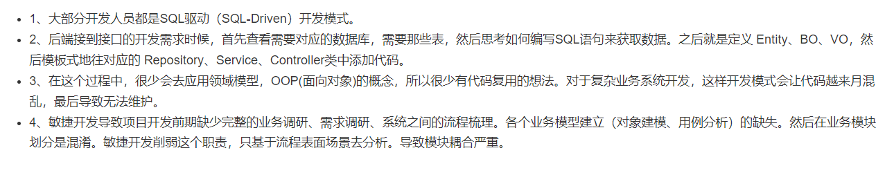

# DDD领域驱动架构模型分析

> 目前公司都是做业务开发的，基本上采用的是基于MVC三层架构模式开发的。虽然这种开发已经成为标准的Web项目开发模式。但是违反面向对象编程风格，也是一种面向过程的编程风格。
>
> 微服务除了监控、调用链追踪、API网关等服务治理系统的开发之外，微服务还有另外一个更加重要的工作，那就是针对公司的业务，合理地做微服务拆分。而领域驱动设计恰妤就是用来指导划分服务的。所以,微服务加速了领域驱动设计的盛行。


## 1.贫血模式传统开发

目前采用的前后端分离的，后端负责暴露接口给前端调用。这种情况下，一般就将后端项目分为 Repository 层Service层、Controler层，其中，Repositorv层负责数据访问，Service层负责业务逻辑，Controller层负责暴露接口。目前几乎已有的业务后端系统，都是是基于贫血模型。如下

```java

public class UserController {
  private UserService userService; 

  public UserVo getUserById(Long userId) {
    UserBo userBo = userService.getUserById(userId);
    UserVo userVo = ... ;
    return userVo;
  }
}

public class UserVo {
  //省略其他属性、get/set/construct方法
  private Long id;
  private String name;
  private String cellphone;
}

@Service
public class UserService {

  @Resource  
  private UserRepository userRepository; 

  public UserBo getUserById(Long userId) {
    UserEntity userEntity = userRepository.getUserById(userId);
    UserBo userBo = [...convert userEntity to userBo...];
    return userBo;
  }
}

public class UserBo {
  private Long id;
  private String name;
  private String cellphone;
}

public class UserRepository {
  public UserEntity getUserById(Long userId) { //... }
}

public class UserEntity {
  private Long id;
  private String name;
  private String cellphone;
}
```


### 代码结构分析

像上面的UserBO这样，只包含数据，不包含逻辑的类。就叫做贫血模式。UserEntity、UserVo都是贫血模型设计，
这种贫血模型将数据与操作分析，破坏了面向对象的封装特性。就是一种面向过程的编程风格.


## 2.基于充血模型DDD开发模式


### 2.1充血模型

充血模型就是将数据和对应的业务逻辑封装到同一个类中。这种充血模型满足面向对象的封装特性，是面向对象编程风格。


### 2.2领域模型设计

>领域模型设计，即DDD,主要是用来指导如何解耦业务系统，划分业务模块，定义业务领域模型及其交互，比如微服务就是基于这一个概念兴起。</br> 微服务除了监控、调用链追踪、AP1网关等服务治理系统的开发之外，微服务还有另外一个更加重要的工作，那就是针对公司的业务，合理地做微服务拆分。而领域驱动设计恰好就是用来指导划分服务的。所以，微服务加速了领域驱动设计的盛行。

领域模型驱动设计是需要对业务熟悉程度。即使对领域驱动了解的再清楚，但是对业务不熟悉，也不一定做出合理的领域设计。


### 2.3 基于充血模型DDD开发

>充血模型的DDD开发模式也是按照MVC三层架构分层。他跟基于贫血模型的传统开发模式的区别主要是在Service层。

在基于充内型的 DDD 开发模式中，Serice层包含Senvice类和Domain类两分。Domain 就相当于贫模型中的 BO。Domain与BO的区别在于它是基于充血模型开发的，既包含数据，也包含业务逻辑。而 Service 类变得非常单薄,总结: 基于贫血模型的传统的开发模式，重Sevice轻BO;基于充血模型的DDD开发横式，轻Service重Domain。


## 3. 项目中应该如何使用基于充血模型的DDD开发模式

>贫血模式比较适合业务表简单的系统开发。相对应的，基于充血模型的DDD开发模式，更适合业务负责的系统开发。比如社保计算模型，订单付款等复杂的金融财务系统。


### 3.1 现有开发模式解析



### 3.2 DDD 架构模型优势

- 在这种模型的开发下，需要先理清楚相应的业务，定义领域模型所包含的属性和方法。领域模型相当于可复用的业务中间层。
- 复杂系统，对代码的复用性，易维护性要求就越高，需要花费更多的时间和精力在前期的设计上，充血模式的DDD开发模式，正需要前期做大量业务调研、领域模型设计，所以更合适复杂系统的开发。业务流程和场景变化的时候，很难去应对这种变更或者是扩展


### 3.3 项目实战

> 设计一个钱包的功能，支持用户充值、提现、支付、冻结、透支、转增、查询账户余额、查询交易流水等操作。


#### DDD领域模型代码demo

> 钱包VirtualWallet类设计成一个充血的Domain领域模型，并且将原来在Service类中的部分业务逻辑移动到VirtualWallet类中。

```java
// Domain领域模型（充血模型）
@Data
public class VirtualWallet {
    private Long id;
    private Long createTime = System.currentTimeMillis();
    private BigDecimal balance = BigDecimal.ZERO;

    // 是否允许透支
    private boolean isAllowedOverdraft = true;

    // 可透支金额
    private BigDecimal overdraftAmount = BigDecimal.ZERO;

    // 冻结金额
    private BigDecimal frozenAmount = BigDecimal.ZERO;

    public VirtualWallet() {
    }

    public VirtualWallet(Long preAllocatedId) {
        this.id = preAllocatedId;
    }


    /**
     * 冻结
     *
     * @param amount 冻结金额
     */
    public void freeze(BigDecimal amount) {
    }

    public void unfreeze(BigDecimal amount) {
        // todo
    }

    /**
     * 增加透支金额
     *
     * @param amount 金额
     */
    public void increaseOverdraftAmount(BigDecimal amount) {
        // todo
    }

    /**
     * 减少透支金额
     *
     * @param amount 金额
     */
    public void decreaseOverdraftAmount(BigDecimal amount) {
        // todo
    }


    /**
     * 关闭信用度透支
     */
    public void closeOverdraft() {
        // todo
    }

    /**
     * 打开信用度透支
     */
    public void openOverdraft() {
        // todo
    }

    public BigDecimal balance() {
        return this.balance;
    }

    /**
     * 获得账户的余额
     *
     * @return 余额
     */
    public BigDecimal getAvailableBalance() {
        BigDecimal totalAvailableBalance = this.balance.subtract(this.frozenAmount);
        if (isAllowedOverdraft) {
            totalAvailableBalance = this.overdraftAmount.add(totalAvailableBalance);
        }
        return totalAvailableBalance;
    }

    /**
     * 出账 开始扣减金额.
     *
     * @param amount 剩余账户的余额
     */
    public void debit(BigDecimal amount) {
        BigDecimal totalAvailableBalance = getAvailableBalance();
        if (totalAvailableBalance.compareTo(amount) < 0) {
            throw new BusinessException("账户余额不足");
        }
        this.balance = this.balance.subtract(amount);
    }

    public void credit(BigDecimal amount) {
        if (amount.compareTo(BigDecimal.ZERO) < 0) {
            throw new BusinessException("入账的金额不能为负数");
        }
        this.balance = this.balance.add(amount);
    }
}


@Service
public class VirtualWalletServiceImpl implements VirtualWalletService {

    @Resource
    private VirtualWalletRepository walletRepo;

    @Resource
    private VirtualWalletTransactionRepository transactionRepo;


    // 查询余额
    @Override
    public BigDecimal getBalance(Long walletId) {
        return walletRepo.getBalance(walletId);
    }

    // 出账
    @Override
    @Transactional(rollbackFor = Exception.class)
    public void debit(Long walletId, BigDecimal amount) {
        VirtualWalletEntity walletEntity = walletRepo.getWalletEntity(walletId);
        VirtualWallet wallet = convert(walletEntity);

        // 充血模式
        wallet.debit(amount);
        VirtualWalletTransactionEntity transactionEntity = new VirtualWalletTransactionEntity();
        transactionEntity.setAmount(amount);
        transactionEntity.setCreateTime(System.currentTimeMillis());
        transactionEntity.setType(TransactionTypeEnum.DEBIT);
        transactionEntity.setFromWalletId(walletId);
        transactionRepo.saveTransaction(transactionEntity);
        walletRepo.updateBalance(walletId, wallet.balance());
    }

    // 入账
    @Override
    @Transactional(rollbackFor = Exception.class)
    public void credit(Long walletId, BigDecimal amount) {
        VirtualWalletTransactionEntity transactionEntity = new VirtualWalletTransactionEntity();
        transactionEntity.setAmount(amount);
        transactionEntity.setCreateTime(System.currentTimeMillis());
        transactionEntity.setType(TransactionTypeEnum.CREDIT);
        transactionEntity.setFromWalletId(walletId);
        transactionRepo.saveTransaction(transactionEntity);
        VirtualWalletEntity walletEntity = walletRepo.getWalletEntity(walletId);
        BigDecimal balance = walletEntity.getBalance();
        walletRepo.updateBalance(walletId, balance.add(amount));
    }


    // 转账
    @Override
    @Transactional(rollbackFor = Exception.class)
    public void transfer(Long fromWalletId, Long toWalletId, BigDecimal amount) {
        VirtualWalletTransactionEntity transactionEntity = new VirtualWalletTransactionEntity();
        transactionEntity.setAmount(amount);
        transactionEntity.setCreateTime(System.currentTimeMillis());
        transactionEntity.setType(TransactionTypeEnum.TRANSFER);
        transactionEntity.setFromWalletId(fromWalletId);
        transactionEntity.setToWalletId(toWalletId);
        transactionRepo.saveTransaction(transactionEntity);
        debit(fromWalletId, amount);
        credit(toWalletId, amount);
    }

}
```

注：知道那个意思即可，完整的代码可以使用 chatGPT补充完整。


### 3.4 领域模型说明

>在领域模型VirtualWallet类中可以实现冻结钱包、解冻钱包、增加透支金额、减少透支金额、打开信用度透支、关闭信用度透支、获得账户的余额、扣减金额等逻辑。随着业务功能的迭代扩张，可以细化透支金额和冻结的策略。也就值得设计成充血模型.

充血模型的DDD 开发模式中，将业务逻辑移动到Domain中，Service类变得很薄。

- 负责与数据层Repository交互(从DB中取数据、映射数据)。
- 负责跨领域模型的业务聚合功能
- 负责一些非功能性及与三方系统交互的工作(幂等、事务、发邮件、发消息、记录日志、RPC接口)


## 4.总结

负责一些非功能性及与三方系统交互的工作(幂等、事务、发邮件、发消息、记录日志、RPC接口)

- 1、DDD模型将原来重的service逻辑转移到Domain领域层中，可以是代码可读性提升。
- 2、模型充血后，基于模型业务在后续的迭代中越发明确，细节也会越开越精确。通过充血后的代码，能够快速了解模块业务，提升开发效率。
- 3、在维护性上来说，如果项目新进了开发人员。充血模型，直接阅读充血模型的行为方法，起码能够很快理解70%左右的业务逻辑，因为充血模型可以说是业务的精准抽象，也就是领域驱动DDD模式带来的效果。

