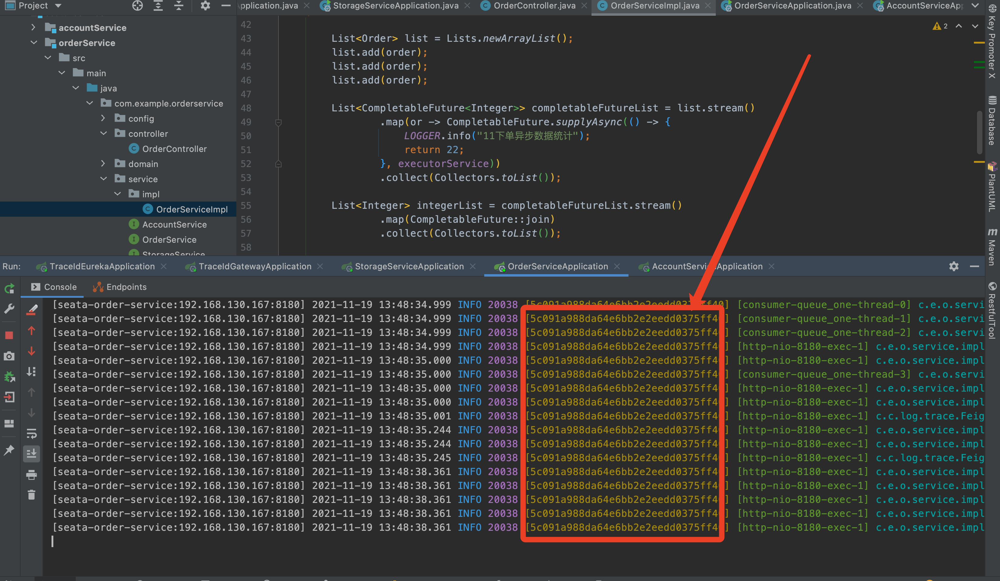
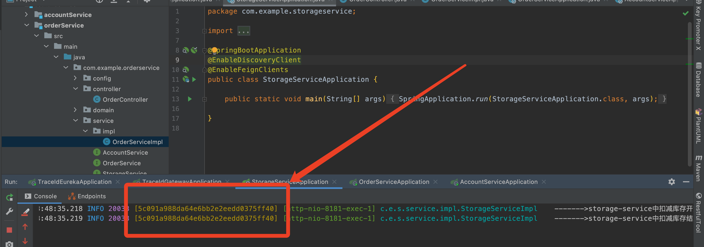
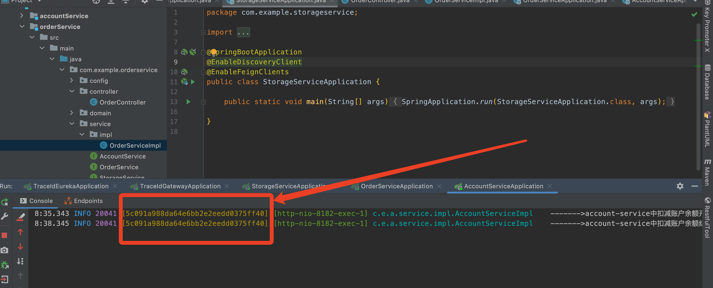

# 分布式日志链路跟踪


## 1 需求场景

目前开发排查问题用的比较多的就是系统日志，在分布式环境中使用 ELK来统一手机日志，但是在并发大时候使用日志定位比较麻烦。大量的用户、其他线程、定时器、消息队列也在一起输出很难筛选出指定的日志，以及下游线程、服务对应的日志.参考: https://github.com/alibaba/transmittable-thread-local

## 2 解决方式

- 每个请求都使用一个**唯一标识**来追踪全部的链路显示在日志中，并且不修改原有的打印方式(代码无入侵)
- 使用Logback的MDC机制日志模板中加入traceld标识，取值方式为%X{traceld}

>MDC(Mapped Diagnostic Context，映射调试上下文)是log4j和logback提供的一种方便在多线程条件下记录日志的功能。MDC可以看成是一个与当前线程绑定的Map，可以往其中添加键值对。MDC中包含的内容可以被同一线程中执行的代码所访问。当前线程的子线程会继承其父线程中的MDC的内容。当需要记录日志时,只需要从MDC中获取所需的信息即可。MDC的内容则由程序在适当的时候保存进去。对于一个Web应用来说，通常是在请求被处理的最开始保存这些数据。


## 3.实现方式

由于MDC内部使用的是ThreadLocal所以只有本线程才有效，子线程和下游的服务MDC里的值会丢失，所以方案主要的难点是解决值的传递问题，主要包括以下几部分：

- API网关中的MDC数据怎么传递给下游.
- 微服务之前调用其他远程服务如何传递接受数据.
- 异步情况下（线程池）怎么样传递给子线程.
- 消息队列生产者与消费者怎么传递和接受消息.


### 3.1 查看项目结构

```
.
|-- HELP.md
|-- seata-service
|   |-- accountService (账号微服务)
|   |-- orderService （订单微服务）
|   `-- storageService（库存微服务）
|-- traceId-commons (工具包)
|   |-- traceId-common-core （核心工具类）
|   `-- traceId-log-springCloud-starter （日志工具类）
|-- traceId-eureka（注册中心）
|   
|-- traceId-gateway（网关微服务）
|  
`-- traceId-loadbalancer（负载均衡）
```


### 3.2 增加日志模板

logback配置文件日志格式添加该标识[%X{traceld}]

```xml
    <!-- 彩色日志格式 -->
    <property name="CONSOLE_LOG_PATTERN" value="[${APP_NAME}:${ServerIP}:${ServerPort}] %clr(%d{yyyy-MM-dd HH:mm:ss.SSS}){faint} %clr(%level){blue} %clr(${PID}){magenta} %clr([%X{traceId}]){yellow} %clr([%thread]){orange} %clr(%-40.40logger{39}){cyan} %m%n${LOG_EXCEPTION_CONVERSION_WORD:-%wEx}"/>
    <property name="CONSOLE_LOG_PATTERN_NO_COLOR" value="[${APP_NAME}:${ServerIP}:${ServerPort}] %d{yyyy-MM-dd HH:mm:ss.SSS} %level ${PID} [%X{traceId}] [%thread] %-40.40logger{39} %m%n${LOG_EXCEPTION_CONVERSION_WORD:-%wEx}"/>
```


### 3.3 APIGateWay网关增加过滤器

生成traceld并通过header传递给下游服务

```java
package com.example.traceidgateway.filter;

import cn.hutool.core.util.IdUtil;
import com.central.common.constant.CommonConstant;
import com.central.log.properties.TraceProperties;
import org.slf4j.MDC;
import org.springframework.cloud.gateway.filter.GatewayFilterChain;
import org.springframework.cloud.gateway.filter.GlobalFilter;
import org.springframework.core.Ordered;
import org.springframework.http.server.reactive.ServerHttpRequest;
import org.springframework.stereotype.Component;
import org.springframework.web.server.ServerWebExchange;
import reactor.core.publisher.Mono;

import javax.annotation.Resource;

/**
 * 生成日志链路追踪id，并传入header中
 */
@Component
public class TraceFilter implements GlobalFilter, Ordered {

    @Resource
    private TraceProperties traceProperties;

    @Override
    public Mono<Void> filter(ServerWebExchange exchange, GatewayFilterChain chain) {

        // 判断是否开启了链路追踪.
        if (traceProperties.getEnable()) {

            //链路追踪id
            String traceId = IdUtil.fastSimpleUUID();
            MDC.put(CommonConstant.LOG_TRACE_ID, traceId);
            ServerHttpRequest serverHttpRequest = exchange.getRequest().mutate()
                    .headers(h -> h.add(CommonConstant.TRACE_ID_HEADER, traceId))
                    .build();

            ServerWebExchange build = exchange.mutate().request(serverHttpRequest).build();
            return chain.filter(build);
        }
        return chain.filter(exchange);
    }

    @Override
    public int getOrder() {
        // Spring IOC容器中Bean的执行顺序的优先级
        return Ordered.HIGHEST_PRECEDENCE;
    }
}
```


### 3.4 下游服务增加拦截器

>接收并保存traceld的值

```java
package com.central.log.trace;

import com.central.log.properties.TraceProperties;
import org.springframework.boot.autoconfigure.condition.ConditionalOnClass;
import org.springframework.core.annotation.Order;
import org.springframework.util.StringUtils;
import org.springframework.web.filter.OncePerRequestFilter;

import javax.annotation.Resource;
import javax.servlet.FilterChain;
import javax.servlet.ServletException;
import javax.servlet.http.HttpServletRequest;
import javax.servlet.http.HttpServletResponse;
import java.io.IOException;

/**
 * web过滤器，生成日志链路追踪id，并赋值MDC
 */
@ConditionalOnClass(value = {HttpServletRequest.class, OncePerRequestFilter.class})
@Order(value = MDCTraceUtils.FILTER_ORDER)
public class WebTraceFilter extends OncePerRequestFilter {

    @Resource
    private TraceProperties traceProperties;

    @Override
    protected boolean shouldNotFilter(HttpServletRequest request) {
        return !traceProperties.getEnable();
    }

    @Override
    protected void doFilterInternal(HttpServletRequest request, HttpServletResponse response, FilterChain filterChain) throws IOException, ServletException {
        try {
            String traceId = request.getHeader(MDCTraceUtils.TRACE_ID_HEADER);
            if (StringUtils.isEmpty(traceId)) {
                MDCTraceUtils.addTraceId();
            } else {
                MDCTraceUtils.putTraceId(traceId);
            }
            filterChain.doFilter(request, response);
        } finally {
            MDCTraceUtils.removeTraceId();
        }
    }
}
```


### 3.5 下游服务增加feign拦截器

```java
package com.central.log.trace;

import com.central.log.properties.TraceProperties;
import feign.RequestInterceptor;
import feign.RequestTemplate;
import org.slf4j.Logger;
import org.slf4j.LoggerFactory;
import org.springframework.util.StringUtils;

import javax.annotation.Resource;

/**
 * @see https://cloud.tencent.com/developer/article/1600718
 * Feign的拦截器RequestInterceptor
 * SpringCloud的微服务使用Feign进行服务间调用的时候可以使用RequestInterceptor统一拦截请求来完成设置header等相关请求，
 */
public class FeignTraceInterceptor implements RequestInterceptor {

    private static final Logger LOGGER = LoggerFactory.getLogger(FeignTraceInterceptor.class);

    @Resource
    private TraceProperties traceProperties;

    @Override
    public void apply(RequestTemplate requestTemplate) {

        LOGGER.info("FeignTraceInterceptor.request: {}", requestTemplate.url());

        if (traceProperties.getEnable()) {
            //传递日志traceId
            String traceId = MDCTraceUtils.getTraceId();
            if (!StringUtils.isEmpty(traceId)) {
                requestTemplate.header(MDCTraceUtils.TRACE_ID_HEADER, traceId);
            }
        }
    }
}
```


### 3.6 解决父子线程传递问题

主要针对业务会使用线程池(异步、并行处理)

#### 重写logback的LogbackMDCAdapter

由于logback的MDC实现内部使用的是ThreadLocal不能传递子线程，所以需要重写替换为阿里的Transmittable ThreadLocal。Transmittable ThreadLocal是Alibaba开源的、用于解决"在使用线程池等会缓存线程的组件情况下传递ThreadLocal"问题的 https://github.com/alibaba/transmittable-thread-local

```java
/**
 * 重构{@link LogbackMDCAdapter}类，搭配TransmittableThreadLocal实现父子线程之间的数据传递
 */
public class TtlMDCAdapter implements MDCAdapter {

    private final ThreadLocal<Map<String, String>> copyOnInheritThreadLocal = new TransmittableThreadLocal<>();

    private static final int WRITE_OPERATION = 1;
    private static final int MAP_COPY_OPERATION = 2;

    private static TtlMDCAdapter mtcMDCAdapter;

    /**
     * keeps track of the last operation performed
     */
    private final ThreadLocal<Integer> lastOperation = new ThreadLocal<>();

    static {
        mtcMDCAdapter = new TtlMDCAdapter();
        MDC.mdcAdapter = mtcMDCAdapter;
    }

    public static MDCAdapter getInstance() {
        return mtcMDCAdapter;

    }
}
```

TtlMDCAdapterInitializer类用于程序启动时加载自己的mdcAdapter实现

```java
/**
 * 初始化TtlMDCAdapter实例，并替换MDC中的adapter对象
 */
public class TtlMDCAdapterInitializer implements ApplicationContextInitializer<ConfigurableApplicationContext> {

    @Override
    public void initialize(ConfigurableApplicationContext applicationContext) {
        //加载TtlMDCAdapter实例
        TtlMDCAdapter.getInstance();
    }
}
```


#### 扩展线程池实现

```java
package com.example.orderservice.thread;

import com.alibaba.ttl.threadpool.TtlExecutors;
import com.central.common.utils.CustomThreadPoolTaskExecutor;
import com.google.common.util.concurrent.ThreadFactoryBuilder;
import org.springframework.context.annotation.Bean;
import org.springframework.context.annotation.Configuration;
import org.springframework.scheduling.concurrent.ThreadPoolTaskExecutor;

import java.util.concurrent.ArrayBlockingQueue;
import java.util.concurrent.ExecutorService;
import java.util.concurrent.ThreadFactory;
import java.util.concurrent.TimeUnit;

/**
 * <消费队列线程>
 *
 * @author fangyang
 * @since 1.0.0
 */
@Configuration
public class TreadPoolConfig {

    // 核心线程数
    private static final int CORE_POOL_SIZE = 5;

    // 最大的线程数.
    private static final int MAX_POOL_SIZE = 20;

    // 最大的的队列的数量.
    private static final int QUEUE_CAPACITY = 30000;

    // 线程生存时间.
    private static final Long KEEP_ALIVE_TIME = 3L;

    /**
     * 政策包导入初始化全局的线程池.
     * 初始化一个全局的线程池.
     *
     * @return the ExecutorService
     */
    @Bean(value = "consumerQueueThreadPool")
    public ExecutorService buildConsumerQueueThreadPool() {

        ThreadFactory namedThreadFactory = new ThreadFactoryBuilder().
                setNameFormat("consumer-queue_one-thread-%d")
                .build();

        ExecutorService executorService = buildExecutor(namedThreadFactory);
        return TtlExecutors.getTtlExecutorService(executorService);
    }

    private static ExecutorService buildExecutor(ThreadFactory namedThreadFactory) {

        // 通过ThreadPoolExecutor构造函数自定义参数创建
        // 当任务添加到线程池中被拒绝时，会在线程池当前正在运行的Thread线程池中处理被拒绝的任务。
        return ExecutorBuilder.create().setCorePoolSize(CORE_POOL_SIZE)
                .setMaxPoolSize(MAX_POOL_SIZE)
                .setKeepAliveTime(KEEP_ALIVE_TIME, TimeUnit.MINUTES)
                .setWorkQueue(new ArrayBlockingQueue<>(QUEUE_CAPACITY))
                .setThreadFactory(namedThreadFactory)
                .setHandler(RejectPolicyEnum.ABORT.getValue())
                .build();

    }
}
```


### 3.7 消息队列传递问题

#### 消息队列模版抽象类

```java
package com.example.traceIdRocketmq.template;

import com.alibaba.fastjson.JSON;
import com.central.common.constant.CommonConstant;
import com.central.log.trace.MDCTraceUtils;
import org.apache.rocketmq.common.message.MessageExt;
import org.apache.rocketmq.spring.core.RocketMQListener;
import org.slf4j.Logger;
import org.slf4j.LoggerFactory;

import java.nio.charset.StandardCharsets;

public abstract class AbstractRocketListener<T> implements RocketMQListener<MessageExt> {

    private final Class<T> tClass;

    public AbstractRocketListener(Class<T> tClass) {
        this.tClass = tClass;
    }

    private final Logger logger = LoggerFactory.getLogger(getClass());

    @Override
    public void onMessage(MessageExt messageExt) {

        String traceId = messageExt.getProperty(CommonConstant.TRACE_ID_HEADER);
        MDCTraceUtils.putTraceId(traceId);

        String body = new String(messageExt.getBody(), StandardCharsets.UTF_8);
        logger.info("Consumer-获取消息-主题topic为={}, 消费消息为={}", messageExt.getTopic(), body);

        doJob(JSON.parseObject(body, tClass));

    }

    /**
     * 模版方法 业务消息处理
     *
     * @param t the Object
     */
    public abstract void doJob(T t);

}
```


#### 消息队列接受实现类

```java
package com.example.orderservice.rocketMqConsumer;

import com.alibaba.fastjson.JSON;
import com.example.orderservice.domain.Demo01Message;
import com.example.orderservice.domain.Order;
import com.example.traceIdRocketmq.template.AbstractRocketListener;
import org.apache.rocketmq.spring.annotation.RocketMQMessageListener;
import org.slf4j.Logger;
import org.slf4j.LoggerFactory;
import org.springframework.stereotype.Component;

@Component
@RocketMQMessageListener(topic = Demo01Message.TOPIC, consumerGroup = "demo01-consumer-group-" + Demo01Message.TOPIC)
public class Demo01Consumer extends AbstractRocketListener<Order> {

    private final Logger logger = LoggerFactory.getLogger(getClass());

    public Demo01Consumer() {
        super(Order.class);
    }

    @Override
    public void doJob(Order body) {
        logger.info("接受到消息通知order={}", JSON.toJSONString(body));
    }

}
```


### 3.8  测试场景

#### 测试如下









#### api网关打印的日志

```
[seata-order-service:192.168.130.167:8180] 2021-12-02 14:09:44.122 INFO 37872 [E38DA5A1E9DA40EBB249CFE6612CC49C] [consumer-queue_one-thread-0] c.e.o.service.impl.OrderServiceImpl      11下单异步数据统计
[seata-order-service:192.168.130.167:8180] 2021-12-02 14:09:44.122 INFO 37872 [E38DA5A1E9DA40EBB249CFE6612CC49C] [consumer-queue_one-thread-2] c.e.o.service.impl.OrderServiceImpl      11下单异步数据统计
[seata-order-service:192.168.130.167:8180] 2021-12-02 14:09:44.122 INFO 37872 [E38DA5A1E9DA40EBB249CFE6612CC49C] [consumer-queue_one-thread-1] c.e.o.service.impl.OrderServiceImpl      11下单异步数据统计
[seata-order-service:192.168.130.167:8180] 2021-12-02 14:09:44.123 INFO 37872 [E38DA5A1E9DA40EBB249CFE6612CC49C] [http-nio-8180-exec-1] c.e.o.service.impl.OrderServiceImpl      integerList=[22, 22, 22]
[seata-order-service:192.168.130.167:8180] 2021-12-02 14:09:44.147 INFO 37872 [E38DA5A1E9DA40EBB249CFE6612CC49C] [http-nio-8180-exec-1] c.e.t.template.RocketMQTemplateProducer  同步发送消息完成：message = Order(id=null, userId=22, productId=null, count=null, money=22, status=2), sendResult = SendResult [sendStatus=SEND_OK, msgId=7F00000193F018B4AAC2083050BB001F, offsetMsgId=AC10101E00002A9F00000000001BA574, messageQueue=MessageQueue [topic=DEMO_01, brokerName=broker-a, queueId=0], queueOffset=21]
[seata-order-service:192.168.130.167:8180] 2021-12-02 14:09:44.147 INFO 37872 [E38DA5A1E9DA40EBB249CFE6612CC49C] [http-nio-8180-exec-1] c.e.o.service.impl.OrderServiceImpl      ------->下单开始
[seata-order-service:192.168.130.167:8180] 2021-12-02 14:09:44.147 INFO 37872 [E38DA5A1E9DA40EBB249CFE6612CC49C] [http-nio-8180-exec-1] c.e.o.service.impl.OrderServiceImpl      ------->order-service中创建订单
[seata-order-service:192.168.130.167:8180] 2021-12-02 14:09:44.147 INFO 37872 [E38DA5A1E9DA40EBB249CFE6612CC49C] [http-nio-8180-exec-1] c.e.o.service.impl.OrderServiceImpl      ------->order-service中扣减库存开始
[seata-order-service:192.168.130.167:8180] 2021-12-02 14:09:44.147 INFO 37872 [E38DA5A1E9DA40EBB249CFE6612CC49C] [http-nio-8180-exec-1] c.c.log.trace.FeignTraceInterceptor      FeignTraceInterceptor.request: /storage/decrease
[seata-order-service:192.168.130.167:8180] 2021-12-02 14:09:44.147 INFO 37872 [E38DA5A1E9DA40EBB249CFE6612CC49C] [ConsumeMessageThread_6] c.e.o.rocketMqConsumer.Demo01Consumer    Consumer-获取消息-主题topic为=DEMO_01, 消费消息为={"id":null,"userId":22,"productId":null,"count":null,"money":22,"status":2}
[seata-order-service:192.168.130.167:8180] 2021-12-02 14:09:44.147 INFO 37872 [E38DA5A1E9DA40EBB249CFE6612CC49C] [ConsumeMessageThread_6] c.e.o.rocketMqConsumer.Demo01Consumer    接受到消息通知order={"money":22,"status":2,"userId":22}
[seata-order-service:192.168.130.167:8180] 2021-12-02 14:09:47.158 INFO 37872 [E38DA5A1E9DA40EBB249CFE6612CC49C] [http-nio-8180-exec-1] c.e.feignokhttp.MyOkhttpInterceptor      接收响应: [http://192.168.130.167:8181/storage/decrease] 
返回json:【{"code":200,"message":"操作成功","data":"扣减库存成功！"}】 3010.2ms

[seata-order-service:192.168.130.167:8180] 2021-12-02 14:09:47.159 INFO 37872 [E38DA5A1E9DA40EBB249CFE6612CC49C] [http-nio-8180-exec-1] c.e.o.service.impl.OrderServiceImpl      ------->order-service中扣减库存结束
[seata-order-service:192.168.130.167:8180] 2021-12-02 14:09:47.159 INFO 37872 [E38DA5A1E9DA40EBB249CFE6612CC49C] [http-nio-8180-exec-1] c.e.o.service.impl.OrderServiceImpl      ------->order-service中扣减余额开始
[seata-order-service:192.168.130.167:8180] 2021-12-02 14:09:47.159 INFO 37872 [E38DA5A1E9DA40EBB249CFE6612CC49C] [http-nio-8180-exec-1] c.c.log.trace.FeignTraceInterceptor      FeignTraceInterceptor.request: /account/decrease?userId=22&money=22
[seata-order-service:192.168.130.167:8180] 2021-12-02 14:09:50.170 INFO 37872 [E38DA5A1E9DA40EBB249CFE6612CC49C] [http-nio-8180-exec-1] c.e.feignokhttp.MyOkhttpInterceptor      接收响应: [http://192.168.130.167:8182/account/decrease?userId=22&money=22] 
返回json:【{"code":200,"message":"操作成功","data":"扣减账户余额成功！"}】 3009.3ms

[seata-order-service:192.168.130.167:8180] 2021-12-02 14:09:50.170 INFO 37872 [E38DA5A1E9DA40EBB249CFE6612CC49C] [http-nio-8180-exec-1] c.e.o.service.impl.OrderServiceImpl      ------->order-service中扣减余额结束
[seata-order-service:192.168.130.167:8180] 2021-12-02 14:09:50.170 INFO 37872 [E38DA5A1E9DA40EBB249CFE6612CC49C] [http-nio-8180-exec-1] c.e.o.service.impl.OrderServiceImpl      ------->order-service中修改订单状态开始
[seata-order-service:192.168.130.167:8180] 2021-12-02 14:09:50.170 INFO 37872 [E38DA5A1E9DA40EBB249CFE6612CC49C] [http-nio-8180-exec-1] c.e.o.service.impl.OrderServiceImpl      ------->order-service中修改订单状态中
[seata-order-service:192.168.130.167:8180] 2021-12-02 14:09:50.170 INFO 37872 [E38DA5A1E9DA40EBB249CFE6612CC49C] [http-nio-8180-exec-1] c.e.o.service.impl.OrderServiceImpl      ------->order-service中修改订单状态结束
[seata-order-service:192.168.130.167:8180] 2021-12-02 14:09:50.170 INFO 37872 [E38DA5A1E9DA40EBB249CFE6612CC49C] [http-nio-8180-exec-1] c.e.o.service.impl.OrderServiceImpl      ------->下单结束
```

网关生成traceId值为 E38DA5A1E9DA40EBB249CFE6612CC49C

