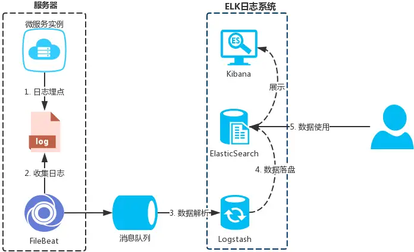
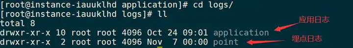
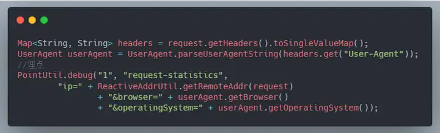
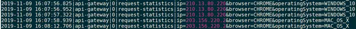
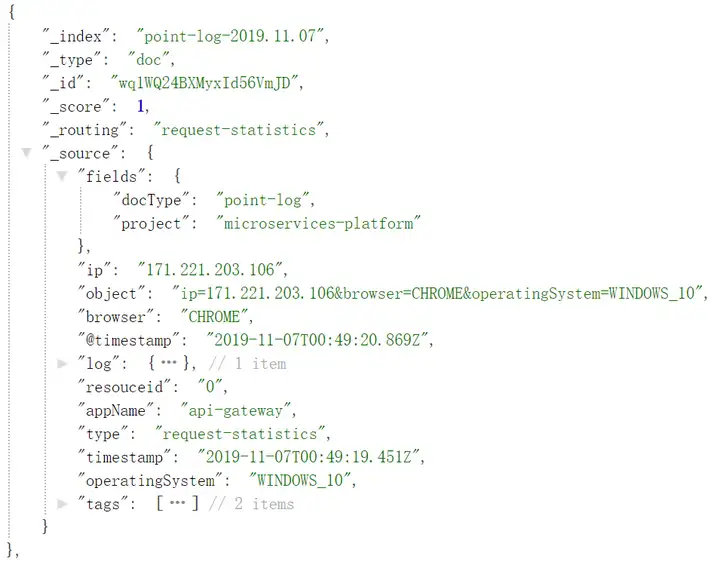
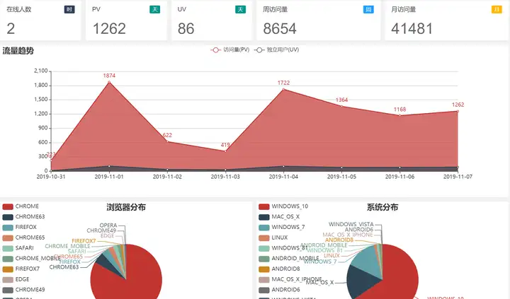

# 微服务业务监控和行为分析怎么做？试试日志埋点

## 一、说明

互联网公司一般都会有专门的数据团队对公司的一些业务指标负责；为了拿到这些基本的业务指标，一般也要工程团队去配合做一些数据采集工作，于是**埋点**诞生了。 

**埋点**的方式有很多种，本文主要介绍 `日志埋点` 这种方式以及实现思路和案例。

> `日志埋点` 就是通过程序打印 `log` 日志的方式进行业务/行为数据的记录


## 二、总体架构



通过 `日志埋点` 来实现业务监控和行为分析主要需要以下4个步骤

1. 数据生成(埋点) 
2. 数据收集 
3. 数据解析(结构化) 
4. 数据落盘 
5. 数据使用(展示/分析) 


## 三、方案说明

### 3.1. 数据生成

日志数据的生成直接使用 `Logback` 等日志框架就可以了，可以自己封装公共方法、aop、注解等方式来生成指定的埋点日志。

但是为了便于后面的数据解析，日志数据需要**规范先行**

-  所有的埋点日志必需约定好统一的格式，例如：{时间}|{来源}|{对象id}|{类型}|{对象属性(以&分割)} 

> 按上面的格式生成的日志为：
>
> 2019-11-07 10:32:01|api-gateway|1|request-
>
> statistics|ip=171.221.203.106&browser=CHROME&operatingSystem=WINDOWS_10

-  避免埋点的日志文件和系统本身输出的日志混淆



> 埋点的日志输出的目录、文件等需要和应用本身的日志分离，通过 `Logback` 的配置就能实现 


**埋点案例**



**生成日志**



> 网关埋点用户请求 


### 3.2. 数据收集

关于日志数据的收集可选择的中间件比较多，除了图中的 `FileBeat` 之外还有 `Flume`、`Fluentd`、`rsyslog` 等；需要每台服务器都部署一个收集中间件。

> 每台服务器部署一个就行了，就算一台服务器中启了多个微服务也是可以一齐收集

**PS**：日志收集后面的 `消息队列` 并不是必需的可以去掉，但是增加 `消息队列` 后有以下两个优点

1. 削峰填谷：减轻后面日志解析的压力 
2. 数据共享：日志数据除了提供给日志系统之外，可以增加消费端的同时提供给其他地方使用，如流计算等 


### 3.3. 数据解析

使用 `Logstash` 的**grok**表达式解析日志数据并结构化，以上面的日志数据为例

> 2019-11-07 10:32:01|api-gateway|1|request-
>
> statistics|ip=171.221.203.106&browser=CHROME&operatingSystem=WINDOWS_10

结构化后的日志数据为：

```json
{
    timestamp: '2019-11-07 10:32:01',
    appName: 'api-gateway',
    resouceid: '1',
    type: 'request-statistics',
    ip: '171.221.203.106',
    browser: 'CHROME',
    operatingSystem: 'WINDOWS_10'
}
```


### 3.4. 数据落盘

通过 `Logstash` 能自动创建 `Elasticsearch` 索引并以天为单位分片



> 可以通过索引模板来指定每个字段的类型和分词器等属性 


### 3.5. 数据使用

日志数据落盘到 `Elasticsearch` 后，就可以通过聚合查询等方式实时显示监控数据或者分析日志数据

**监控案例**



> 聚合查询逻辑可参考 [https://gitee.com/zlt2000/microservices-platform](http://link.zhihu.com/?target=https%3A//gitee.com/zlt2000/microservices-platform) 


## 四、总结

`日志埋点` 只是其中一种埋点手段而已，**优点是系统无入侵且灵活**；日志收集、解析、落盘等都可以灵活搭配选择不同的中间件，并且不需要修改源系统的代码；并且可以方便对接其他分析平台(例如: 大数据平台)

**PS**：业务监控是否可以不做日志埋点，直接查询业务的数据库呢？(不建议这样做)

1. 使用日志埋点能实现监控数据与业务数据分离，监控平台不会影响或增加业务数据库的压力 
2. 使用日志埋点能方便实现实时业务数据预警 

> 举个栗子：日志收集后面添加**流计算中间件**，计算某个时间窗口内优惠卷日志的数量或者金额大于某个阀值，则发出预警