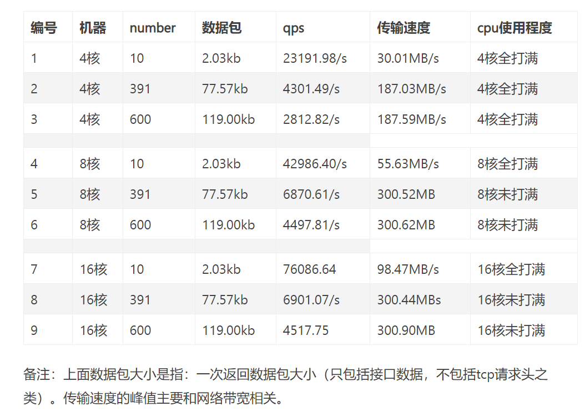

# java接口压测：当接口不是瓶颈，机器cpu和网络带宽对接口qps的影响


最近有客户对接口的qps要求特别高，所以我对接口做了很多压力测试和代码优化。代码优化主要是在减少网络请求，以及避免大量使用循环，把有些逻辑拆到定时器，然后就是热点数据缓存到redis以及jvm内存中。
 除了接口优化，我想知道，当接口不是瓶颈的时候，机器的性能和网络带宽对接口qps的影响。于是，我做了以下实验。


## 实验目的

- 了解cpu和接口qps的关系
- 了解接口数据包大小和qps的关系
- 了解网络带宽和接口qps的关系

## 部署api的实验三台机器配置分别为（阿里云内网测试）

- 阿里云4核4g
- 阿里云8核16g
- 阿里云16核32g

## 测试工具

- wrk

## 部署wrk的机器配置

- 阿里云8核16g


## wrk测试参数

```
wrk -t16 -c400 -d30s -s test-nginx.lua --latency  http://172.26.68.135:9000/test/testApi
```


## test-nginx.lua

```
wrk.method = "POST"
wrk.headers["Content-Type"] = "application/json"
wrk.body   = "{ \"number\": 2}"
```

上面的参数是本地内网环境下最优参数，测试过程中需要更改接口ip和端口。


## 测试代码

```java
   Cache<String, List<TestNginxResp>> cache = Caffeine.newBuilder()
            .expireAfterWrite(1000, TimeUnit.MINUTES)
            .maximumSize(1000)
            .build();

    @PostMapping("/testApi")
    public Response<List<TestNginxResp>> getTest(@Valid @RequestBody TestNginxReq req) {
        List<TestNginxResp> cacheList = getCache(req);
        if (cacheList != null) {
            return Response.ok(cacheList);
        }
        List<TestNginxResp> list = new ArrayList<>();
        for (int i = 0; i < req.getNumber(); i++) {
            list.add(TestNginxResp.buildDefault());
        }
        cachePush(req, list);
        return Response.ok(list);
    }

    private List<TestNginxResp> getCache(TestNginxReq req) {
        String key = "test-api".concat(String.valueOf(req.getNumber()));
        List<TestNginxResp> resps = cache.getIfPresent(key);
        return resps;
    }

    public void cachePush(TestNginxReq req, List<TestNginxResp> klineRespList) {
        String key = "test-api".concat(String.valueOf(req.getNumber()));
        cache.put(key, klineRespList);
    }
```

**请求参数示例**

```java
{
    "number":2
}
```

**返回接口实例**

```java
{
   "code" : 200 , 
    "msg" : "ok" , 
    "body" : [
        {
            "name" : "nginx" ,
            "author" : "Igor Sysoev" , 
            "version" : "1.18" , 
            "desp":"高性能代理工具"
        },
        {
            "name" : "nginx" ,
            "author" : "Igor Sysoev" , 
            "version" : "1.18" , 
            "desp":"高性能代理工具"
        }
    ]
}
```

## 接口说明

参数中`number`传入数字几，就返回几个上面的`bean`。通过这个`test-nginx.lua`中的`number`控制返回数据包的大小。接口第一次是通过循环创建`list`，然后放入`Caffeine`的本地缓存。下次同样数量就直接从缓存拿。

## 影响qps的因素

1.网络

2.cpu

3.内存

4.磁盘
 首先分析，我们上面的接口调用过程中，主要是通过从Caffeine的本地缓存中去拿取数据，`没有mysql，redis，或者其他第三方调用，所以接口不可能成为瓶颈`。我们的变量是number，也就是可以改变返回数据包的大小。这里不存在磁盘的读写性能问题，全部走jvm内存，jvm 2g堆内存足够了，所以机器内存大小对本次实验没影响。

>综上，磁盘性能和内存的因素在本次测试中没什么影响。本次主要是测试`cpu`和`网络`对qps的影响。


## 实验结果



## 实验结果分析

**对比5，6或者8，9号实验现象为发现都是cup未打满，但是传输速度300M/s左右。**

- 结论1：推断这里cpu不是瓶颈，网络带宽是瓶颈。极限值300M/s，提工单问了阿里云，我们的机器内网带宽为2.5Gbps，的确带宽极限下载速度为300M/s。
- 结论2：在每次请求数据量变大后，带宽打满了,qps下降了，说明包越大，接口越慢。（这很容易理解,马路就那么宽，车变多了，车速就慢了）


**对比1，4，7号实验,现象为数据量为10条，包很小，全部都是cpu打满，然后传输速度依次递增，最大为98.47MB/s，没有达到极限值300M/s,qps随cpu核心数递增。**

- 结论1：这里带宽不是瓶颈，cpu是瓶颈，且，cpu数量越多，qps越高，qps基本是和cpu核心数成正比。
- 结论2：如果继续购买32核cpu，传输速度没有达到300M/s的情况下，qps会更高。


**对比5，8号或者6，9实验现象：5，8号都是391条，数据包很大。传输速度300M/s，cpu都没打满，cpu虽然加了，但是qps没变。（6，9一样）**

- 结论1：这里cpu不是瓶颈，带宽是瓶颈，所以当cpu增加的时候，qps并没有对应增加。
- 结论2：当带宽打满了，继续增加cpu，qps基本不会有变化。


## 总结

当带宽没打满，增加cpu能够增加qps。

当带宽打满了，增加cpu不能够增加qps

当带宽都打满了，cpu不变，每次包越大qps越低

当一直增加cpu，但是一直打不满带宽的时候，就能说明瓶颈在接口，需要查看是否是mysql，redis或者程序中的哪些逻辑成为瓶颈。

最后上一张wrk测试接口图，以及工单和阿里云沟通的截图


### 小tip

**极限压力测试需要一个相对干净的机器，避免机器上面应用对接口性能的影响。为了测试机器性能对接口影响，甚至需要需要各种不同参数的机器，比如4核8g，8核8g，16核8g。这个时候可以在阿里云上开一台按量付费的机器，上面很干净，然后做完测试就关闭，甚至释放掉，一个小时也就一两块钱，很便宜，几乎不耗资源。**


