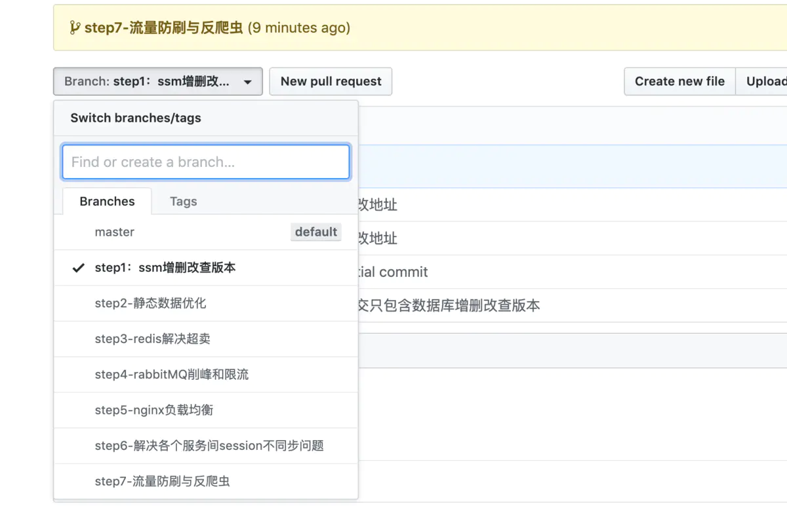

# 优化使用springboot完成的秒杀案例


之前学习了齐毅老师的秒杀优化课程，最近在回顾技术栈的时候，觉得非常有用，所以花些时间总结一下。这篇文章很长，但我感觉都是实实在在能提升程序性能的技术总结，需要结合github上的代码来看文章，代码根据每个优化的点都做了不同的分支，方便查看。



增删改查每个人都会做，但是秒杀系统，仅仅增删改查肯定是远远不够的，因为，要考虑到瞬时高并发，主流电商的秒杀qps峰值都在100w+，如果全部靠查询数据库，页面一定卡死，数据库崩溃。而且，仅仅靠数据库，在高并发必然会导致商品超卖。系统崩溃和商品超卖都是不能接受的问题，所以需要逐步优化。

首先，拉取代码，并切换分支，搭建初步增删改查的项目

```
git clone git@github.com:along05/secKill.git;
git checkout step1：ssm增删改查版本
```

执行数据库脚本，启动项目并访问

```
http://localhost:8080/good?gid=2000
```

项目是一个最基本的商品页面展示，点击抢购会往数据库添加一条记录的demo程序。然后接下来一步一步进行优化。


## 优化的点

稳定不太变化的数据，减少数据查询

redis解决超卖

rabbitMQ削峰和限流

nginx负载均衡

解决负载均衡多个api之间session不同步的问题

nginx静态资源缓存

nginx资源压缩

cdn内容分发

流量防刷以及反爬虫


## 1.稳定数据优化方式

问题分析：电商和我们平时app中，90% 以上都是数据读取操作，在海量数下，数据库最后可能成为高并发的瓶颈，因此减少数据库交互是首先需要考虑的事情。但是要区分静态数据和动态数据。长期不变的数据，比如商品详情，图片，介绍等适合做缓存，但是评论就不适合做缓存。


### 解决方案1：reids缓存

查询一次数据库后，把商品详情，图片，介绍等放入redis，然后下次redis有的话直接从reids查询，避免再次查数据库。
具体切换到 *step2-静态数据优化* 分支

```shell
git checkout step2-静态数据优化
```

安装redis

```shell
docker pull redis；
docker run -d --name redis1 -p 6379:6379 redis --requirepass "123456"
```

安装完redis，对应在yml中修改自己的redis配置，访问下面地址，查看redis，就会发现redis中缓存了商品相关信息，具体实现，查看代码，很简单。

```shell
http://localhost:8080/good?gid=2000
```


### 解决方案2：html页面静态化

页面静态化是指把动态页面，jsp，freemarker等为每一个商品生成一个html静态页面。动态数据例如评论就在html页面用ajax异步获取。这样，就直接访问html避免了页面数据查询，解析的过程。

##### 逻辑流程

- 首先把所有商品生成固定html，然后编写定时器，把每5分钟更新过的的商品重新查询出来，重新生成固定的html页面
- 对于例如评论等动态数据，用ajax动态获取
- 因为是静态页面，需要使用nginx做页面转发

##### 操作流程

- 切换到 step2-静态数据优化 分支，启动项目
- 执行[http://localhost:8080/doStatic](https://links.jianshu.com/go?to=http%3A%2F%2Flocalhost%3A8080%2FdoStatic)，修改doStatic方法中放静态文件的目录。并把static中layui的包拷到生成的html目录，要引入。goods.ftl中路径写的./
- 启动nginx，脚本如下。
- 访问[http://localhost/page/2000.html](https://links.jianshu.com/go?to=http%3A%2F%2Flocalhost%2Fpage%2F2000.html) 就能出现页面。

总结：[http://localhost/page/2000.html](https://links.jianshu.com/go?to=http%3A%2F%2Flocalhost%2Fpage%2F2000.html)这里的流程（根据github上实际路径去调用http://localhost/page/good2000.html）
 是首先去容器内部/usr/share/nginx/html/去找html文件，然后其实是访问到了挂载在本地生成html的目录，然后html里面发起ajax请求去获取评论，实际是通过nginx把请求通过upstream转发到本地。


**docker安装nginx，指令如下：**

```shell
--- nginx
docker pull nginx;
docker run -d --name nginx -p 80:80 -v /Users/along/websoft/nginx:/etc/nginx/conf.d -v /Users/along/Desktop/template:/usr/share/nginx/html nginx

上面启动脚本意思是：映射80端口，然后挂载配置文件目录和放html的目录到nginx里面
启动脚本和html位置在要和上面启动命令中的一致。

--- nginx 脚本
#因为容器内部需要访问到外部的接口，所以需要在容器内容用ip+端口访问本地接口
upstream seckill {
    server 192.168.5.3:8080;    
}
server {
    listen       80;
    server_name localhost;
    #把接口转发到本地起的项目，我的是192.168.5.3:8080;  
    location / {
    proxy_pass http://seckill;
    proxy_set_header Host $host;
    proxy_set_header X-Forwarded-For $proxy_add_x_forwarded_for;
    }
    #页面转发地址是容器内部地址  
    location /page {
       index index.html;
       alias /usr/share/nginx/html/;
    }
}
监听80端口，访问/放转发到本地接口，访问page的时候，定位到nginx的html放置目录，然后之前挂载过这个目录，就能访问到本机的挂载目录。
```

两种方案总结：

- 方案一把静态数据存入到redis，操作简单。但是还是需要付出解析动态页面的时间。
- 方案二非常复杂，需要生成所有html，耗费空间，但是理论上，直接加载html是最快的。


## 2.redis解决秒杀超卖

### 现象分析

使用redis之前的一般做法是，查询数据库，如果剩余大于0，就抢到商品，并把剩余数量减一，并更新数据库。

```java
int num = goodDao.selectRate(num) ; 
if（num>0）{
    //处理生成订单逻辑
    num = num -1; 
    //更新数据
}
```

但是很明显，查询数量和更新数量之前是有时差的，有的请求执行到了生成订单逻辑，东西抢到了，但是没来得及更新数据库，但是有的请求在这时获取了剩余数量，那么就会超卖。
 选取redis因为它是单线程模型，内存存储，官网宣称支持10w qps。而且天生分布式支持。


### 解决方案：

**逻辑流程**

- 每隔5秒定时器扫秒杀表`t_promotion_seckill` 
- 如果扫到开始秒杀，就构建一个商品的list队列，key为seckill:count:秒杀id ，有几个商品，就往list里面初始化几个数据。
- 当用户点击了秒杀按钮就left pop出商品，并把抢到商品的用户存到一个redis set中。弹出一个商品，就存一个userId.

操作流程：

- 切换代码分支到 step3-redis解决超卖
- 相关新增代码在定时器和GoodController的doOrder方法。
- 定时器会扫到 `t_promotion_seckill` ， 如果扫不到，请查看sql，修改数据的状态为0


## 3.rabbitMQ削峰和限流

### 现象分析

在抢购以后，往往会发起存数据库，支付等操作，但是很明显，之前的从redis中取商品，并添加中奖人到redis这个操作是很快的，但是订单入库，支付等操作是很慢的。假设处理取商品，存中奖人每秒可以处理1000，但是处理订单，支付等一秒处理100个，那么，如果是一连串操作，很明显，后面瓶颈，造成前面操作等待。严重的情况，由于支付过慢崩溃，导致前面一系列流程全部崩溃。
 总而言之就是**前台业务处理能力和后台业务能力不对称所导致的**

### 解决方案 - 使用rabbitMQ消息队列

因为可以分离业务，前台业务处理快，尽管处理，然后后面生成订单，支付等在mq中按自己能处理的量异步处理。
 rabbitMQ是使用Erlang开发，也有自己的虚拟机，编译后到处运行，而且编写分布式应用简单。

#### 逻辑流程

- 当redis取出商品，添加中奖id后，往rabbitMQ队列发送一条消息，这里就是消息生成者
- 然后在消息消费者那里执行订单入库等逻辑

#### 操作流程

- 切换分支到
- docker启动一个rabbitMQ服务，并在rabbitMQ管理界面创建一个`exchange-order`的交换机，并且创建一个`queue-order`的队列，把他们绑定
- 在yml编写rabbitMQ相关配置
- 在PromotionSecKillService 编写消息生产者
- 在service编写OrderConsumer消费者逻辑

#### docker起rabbitMQ

```shell
docker pull rabbitmq;
docker run -d -p 15672:15672  -p  5672:5672  
-e RABBITMQ_DEFAULT_USER=admin 
-e RABBITMQ_DEFAULT_PASS=admin 
--name rabbitmq 
rabbitmq
```

用admin和admin打开loaclhost:5672.


## 4.nginx负载均衡

```shell
LoadBalance：负载均衡，把任务分配到多个服务器上进行处理，进而提高效率，缩短执行时间。
```

当一台机器性能到达极限的情况下，横向拓展机器的架构是非常好的，能在不改动代码的情况下成倍的提升效率。

#### 逻辑流程：

- nginx里面配置各个服务地址，请求同一个api的时候，按一定的策略分发请求到不同服务。
- 在docker启动nginx

#### 操作流程

- 切换代码到 `step5-nginx负载均衡` 分支，其中新增了一个 `LBController` 测试负载均衡的控制器。
- 然后在启动设置里面设置 -Dserver.port=8081，-Dserver.port=8082，-Dserver.port=8083三个配置，启动三个服务。
- 然后启动nginx
- 调用 `localhost/LB` 这个地址，会发现，请求到不同的端口。

#### nginx的分发策略

- Round-Robin，轮询调度算法，当配置未指明的时候，默认就是轮询算法。就想听歌列表循环。
- least-connected，下一次链接将被链接到活跃链接最少的机器上
- ip-hash，利用IP地址哈希进行分配 。固定ip的请求分发到固定ip的服务
- weight-balancing，按照权重分配，也就是权重越大，分到的请求越大。能力越大，责任越大。

**我比较喜欢使用权重策略，基本都是根据服务器性能来分配。**

#### nginx的配置以及启动脚本。

```shell
#nginx.conf,配置中的server是本地ip，使用权重的策略
upstream lb {
    #least_conn ; 最少连接
    #ip hash ; ip策略
    #权重
    server 192.168.5.3:8081 weight=4;
    server 192.168.5.3:8082 weight=1;
    server 192.168.5.3:8083 weight=2;
}
location / {
    proxy_pass http://lb;
    proxy_set_header Host $host;
    proxy_set_header X-Forwarded-For $proxy_add_x_forwarded_for;
}

nginx在docker中的启动脚本和上面相同。
```


## 5.解决负载均衡多个服务之间session不同的问题

#### 问题分析

在部署的多个服务中如果使用session传递数据，可能存在获取不到的情况，因为假设在8081中执行登陆，session只会存在8081这个服务中，但是下次请求分发到8082或者8083就获取不到session了。

#### 解决方式

- 利用redis存储session的内容。
- org.springframework.session 这个jar包可以解决问题。只需要引入这个包，并在启动类加上 @EnableRedisHttpSession 注解，无需修改任何代码。

#### 操作流程。

- 切换代码到 `step6-解决各个服务间session不同步问题` 分支
- 和上一步负载均衡一样启动三个服务，开启nginx
- 首先把启动类上的 @EnableRedisHttpSession 注释掉，然后先请求 `localhost/login?u=along`，然后在多次请求`localhost/check`发现，有时候能获取到session，有时不能获取到。
- 然后把注解打开，再执行上面的操作，发现，每次都能获取到session，查看redis，发现，redis多了session的信息。


## 6.nginx静态资源缓存

#### 现象分析

像js，css，图片，字体等静态资源，他们都是一个个的url，每次访问的tamcat都会进行url解析和绑定。但是上线以后，它们几乎是不会修改的。所以在高并发的情况下很浪费资源。

#### 处理方案

nginx区分静态资源和接口url，把url接口送往后端服务器处理，静态资源在nginx端缓存处理。
 主要是修改nginx的配置，配置如下

```shell
#在nginx容器内的/home下面定义缓存文件夹。并设定2层目录，缓存大小以及过期时间。
proxy_temp_path /home/nginx-temp;
proxy_cache_path /home/nginx-cache levels=1:2 keys_zone=lb-cache:100m inactive=7d max_size=20g;

upstream lb {
    #least_conn ; 最少连接
    #ip hash ; ip策略
    #权重
    server 192.168.5.3:8081 weight=4;
    server 192.168.5.3:8082 weight=1;
    server 192.168.5.3:8083 weight=2;
}
#用正则匹配静态资源，~*是不区分大小写。
location ~* \.(gif|jpg|css|png|js|woff|html)(.*){
       proxy_pass http://lb;
       proxy_set_header Host $host;
       proxy_set_header X-Forwarded-For $proxy_add_x_forwarded_for;
       #使用上面定义的缓存地址
       proxy_cache lb-cache;
       proxy_cache_valid 200 302 24h;
       proxy_cache_valid 301 5d;
       proxy_cache_valid any 5m;
       expires 90d;
    }
location / {
    proxy_pass http://lb;
    proxy_set_header Host $host;
    proxy_set_header X-Forwarded-For $proxy_add_x_forwarded_for;
}
```

然后重启nginx就好了，访问以后，进入容器

```shell
docker exec -it nginx /bin/bash 
cd /home/nginx-cache 
如果上面的文件夹出现了两层目录的静态文件，说明设置成功。
```


## 7.nginx资源压缩

### 现象分析

当静态资源被压缩后，降低了后端tomcat的压力，但是在实际开发过程中，大量的压力不在于处理速度，而是在于带宽。带宽决定了下载的总速度，在总速度不变的情况下，资源传到浏览器的大小约小越好。越快下载完资源，卡顿的越少。

### 解释一下带宽和下载速度的关系

**带宽**是网络中某一点到另一点所能通过的"最高数据率"，也就是瞬时最高的下载速度。
 关于带宽和下载速度：首先了解一下存储的单位换算

- 1GB = 1024MB
- 1MB = 1024KB
- 1KB = 1024B
- 1B  = 8bits 

网络传输是以bits为单位，以1M带宽为例，也就是1M bits，也就是瞬时下载速度做多为:

```vim
1M = 10^6;
bits换成B除以8，B换成kb除以1024
1M bits/s = 1000000bits/s = 125000 B/s ≈ 128kb/s 
```


### 解决方案

nginx将静态资源打包成gzip传给浏览器，然后浏览器解压缩gizp（这一步浏览器自动完成）获取到资源文件。最少能较少30%内存，最多减少80%的内存损耗。

#### nginx配置

```
#打开gzip配置
gzip on;
gzip_min_length 1k;
gzip_types text/plain application/javascript text/css application/x-javascript font/woff;
#禁止IE 1-6 
gzip_disable "MSIE [1-6]\.";
gzip_buffers 32 4k;
#压缩级别1-9，选1就行了，大小差别不大
gzip_comp_level 1;

#在nginx容器内的/home下面定义缓存文件夹。并设定2层目录，缓存大小以及过期时间。
proxy_temp_path /home/nginx-temp;
proxy_cache_path /home/nginx-cache levels=1:2 keys_zone=lb-cache:100m inactive=7d max_size=20g;

upstream lb {
    #least_conn ; 最少连接
    #ip hash ; ip策略
    #权重
    server 192.168.5.3:8081 weight=4;
    server 192.168.5.3:8082 weight=1;
    server 192.168.5.3:8083 weight=2;
}
#用正则匹配静态资源，~*是不区分大小写。
location ~* \.(gif|jpg|css|png|js|woff|html)(.*){
       proxy_pass http://lb;
       proxy_set_header Host $host;
       proxy_set_header X-Forwarded-For $proxy_add_x_forwarded_for;
       #使用上面定义的缓存地址
       proxy_cache lb-cache;
       proxy_cache_valid 200 302 24h;
       proxy_cache_valid 301 5d;
       proxy_cache_valid any 5m;
       expires 90d;
    }
location / {
    proxy_pass http://lb;
    proxy_set_header Host $host;
    proxy_set_header X-Forwarded-For $proxy_add_x_forwarded_for;
}
```

在docker重启nginx。访问页面，当看到浏览器，检查看到css，js等的response header中，编码为gzip。就说明设置成功了。


## 8.cdn内容分发

### 现象分析

对静态文件完成了gzip压缩，但是对图片等已经被压缩过的资源gzip传输效果并不好，所以对图片的带宽消问题并没有解决。

### 解决方案

图片可以考虑使用第三方cdn解决带宽问题。

#### cdn简介

cdn全称Content dekivery network，就是内容分发网络。
 例如中国很大，北京和深圳就隔者2000多公里，如果北京访问深圳的网络，必然延时很高。cnd就是把内容放在一台中心服务器上，然后各地有很多节点服务器，中心服务器会把内容同步到各地的节点服务器，然后就进访问资源。

#### 优点

- 就近访问，降低网络延时
- 把对带宽的压力转移到了第三方
- 数据多备份，一个服务挂了可以切换到另一个，就就是高可用。

#### 使用

可以买阿里云，腾讯云，七牛的cdn服务。
 主要流程是买服务，下载客户端，把图片等资源上传到客户端，自动同步，然后为oss配置cdn，进行域名解析。就能通过域名访问到图片，最后就去修改项目中静态资源的路径。


## 9.流量防刷以及反爬虫

### 流量防刷

有些人会恶意一直访问网站，甚至用脚本去刷页面。
 所以在一定时间内只允许一个用户访问固定的次数，一旦超过了就不允许访问。

### 爬虫

会有人用爬虫，爬网站，利用超链接分析内容，提取网站的重要信息，不仅拷贝走了数据，而且，还非常消耗服务器资源。

### 解决方案

- 在代码中，编写拦截器
- 对每个用户，记录ip对应的访问次数，在redis中用ip+请求头信息作为key，存1分钟内访问次数，每次访问count++
- 如果超过设置的访问次数，就不再允许访问。
- 每一分钟清空一次key

### 操作流程

- 切换代码到`step7-流量防刷与反爬虫`分支
- 启动nginx和三个端口分别启动项目
- 访问`localhost/lb`，并多次刷新
- 观察redis是否会有key，以及是否会返回禁用的信息


## 总结

终于写完啦。这篇文章主要是对代码和网络等几个层面做了优化，主要使用了nginx，redis，rabbitMQ等热门工具，希望对各位有帮助，如果有问题，欢迎指正，一起讨论。


