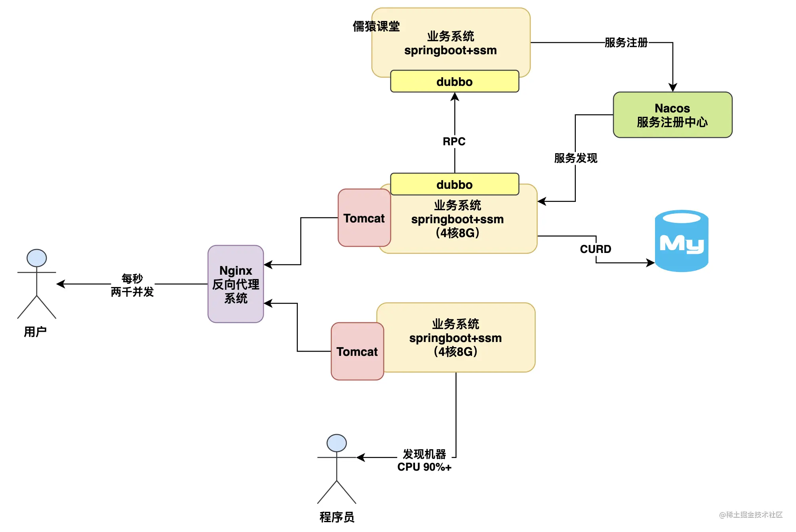

# 天天用MySQL开发，你知道数据库能抗多大并发压力吗？

**目录**

- 一般业务系统运行流程图
- 一台4核8G的机器能抗多少并发量呢？
- 高并发来袭时数据库会先被打死吗？
- 8核16G的数据库每秒大概可以抗多少并发压力？
- 数据库架构可以从哪些方面优化？
- 总结

今天给大家分享一个知识点，是关于MySQL数据库架构演进的，因为很多兄弟天天基于mysql做系统开发，但是写的系统都是那种**低并发压力、小数据量**的，所以哪怕上线了也就是这么正常跑着而已，但是你知道你连接的这个MySQL数据库他到底能抗多大并发压力吗？如果MySQL数据库扛不住压力了，应该如何演进你知道吗？

## 一般业务系统运行流程图

首先，我们先来看一个最最基础的java业务系统连接数据库运行的架构，其实简单来说，我们平时都是用spring boot+ssm技术栈开发一个java业务系统的，用spring boot内嵌tomcat就可以对外提供http接口了，然后最多现在会加上nacos+dubbo调用别的系统接口，数据全部靠连接mysql数据库进行crud就可以了，如下图。

上面那种架构的系统，估计就是很多兄弟日常做的最多的系统架构了，有的兄弟稍微做的高大上一点，大概来说，可能就是会加入一些es、redis、rocketmq一类的中间件简单使用一下，但是大致来说也就这么回事了，那么还是回归主题，大家知道你上述那种系统下，他连接的数据库能抗多大压力吗？

## 一台4核8G的机器能扛多少并发量呢？

说实话，要解决这个问题，一般来说，不是先聊数据能抗多少压力，因为往往不是数据库先去抗高并发，而是你连接数据库的web系统得先去抗高并发！也就是我们的spring boot+ssm那套业务系统能抗多高并发我们得先搞清楚！

所以要搞明白这个问题，就得先说一个主题，一般来说我们的spring boot应用系统大致就是部署在**2核4G或者4核8G的机器上**，这个机器配置其实是很关键的，所以这里直接告诉大家一个经验值，即使说咱们如果部署的是一个4核8G的机器，然后spring boot内嵌的tomcat默认开了200个线程来处理请求，接着每个请求都要读写多次数据库，那么此时，大致来说你的一台机器可以抗大概**500~1000**这个并发量，具体多少得看你的接口复杂度，如下图。

## 高并发来袭时数据库会先被打死吗？

所以其实一般来说，当你的高并发压力来袭的时候，**通常不会是数据库先扛不住了**，而是你的**业务系统**所在机器抗不住了，比如你部署了2台机器，那么其实到每秒一两千并发的时候，这两台机器基本上cpu负载都得飙升到90%以上 ，压力很大，而且**接口性能会开始往下掉很多了**，如下图。

那么这个时候我们的数据库压力会如何呢？其实一般来说你的两台机器抗下每秒一两千的请求的时候后，数据库压力通常也会到一个小瓶颈，因为为什么呢？关键是你的业务系统处理每个业务请求的时候，他是会读写多次数据库的，所以业务系统的**一次请求可能会导致数据库有多次请求**，也正因为这样，所以此时可能你的数据库并发压力会到几千的样子。

## 8核16G的数据库每秒大概可以抗多少并发压力？

那么所以下一个问题来了，你的数据库通常是部署在什么样配置的机器上？一般来说给大家说，数据库的配置如果是那种特别低并发的场景，其实2核4G或者4核8G也是够了，但是如果是常规化一点的公司的生产环境数据库，通常会是8核16G。那么8核16G的数据库每秒大概可以抗多少并发压力？大体上来说，**在几千这个数量级**。

因为这个具体能抗多少并发也得看你数据库里的数据量 以及你的SQL语句的复杂度，所以一般来说8核16G的机器，大概也就是抗到每秒几千并发就差不多了，量再大基本就扛不住了，因为往往到这个量级下，数据库的cpu、内存、网络、io的负载基本都很高了，尤其是cpu，可能至少也在百分之七八十了，如下图。

## What are the limits of mysql? How many queries can it do at the same time?

>That depends on what you mean by a query, and what you mean by "at the same time."
>
>In my experience, a single well-tuned MySQL server can execute over 10,000 queries per second, if they are simple queries.
>
>But queries per second is not the same as "at the same time" because many queries take only a tiny fraction of a second. You might see a peak concurrency of only a few hundred queries, even if you have a throughput of 10,000 qps.
>
>To get greater scalability, most sites use multiple MySQL servers instead of expecting one server to keep handling increasing traffic. For example Wikipedia runs 25,000 queries per second, spread over 20 servers. <https://www.mysql.com/why-mysql/case-studies/mysql-cs-wikipedia.html>
>
>In some benchmarks with high-end servers, it has been proven to run over 1 million queries per second. <https://www.flamingspork.com/blog/2014/06/03/1-million-sql-queries-per-second-mysql-5-7-on-power8/>
>
>The MySQL manual has this page: <https://dev.mysql.com/doc/refman/5.7/en/limits.html> which covers architectural limits like table size.
>
>In the system I manage, our largest table is over 5 billion rows. It takes some care to index and partition this table, and we have to be careful how we query it.
>
>We have many other tables that each have over 100 million rows. These are much easier to manage and query. No partitioning is needed in these tables.
>
>Your server capacity is important too. More RAM, more CPU cores, fast disks are all important to the performance of a database server. You can get a lot of scalability, but it costs a lot.
>
>Ultimately, you really need to know how much can you do with the server you can afford, under your application's workload? That's not something that anyone here on Stack Overflow can answer for you. You have to test it yourself.

简单翻译：

这取决于您所说的查询是什么意思，以及您所说的“同时”是什么意思。

根据我的经验，如果是简单的查询，一个调优良好的 MySQL 服务器每秒可以执行超过 10,000 个查询。

但是每秒的查询次数与“同时”不同，因为许多查询只需要几分之一秒。您可能会看到只有几百个查询的峰值并发，即使您的吞吐量为 10,000 qps。

为了获得更大的可扩展性，大多数站点使用多台 MySQL 服务器，而不是期望一台服务器继续处理不断增加的流量。例如，维基百科每秒运行 25,000 个查询，分布在 20 个服务器上。<https://www.mysql.com/why-mysql/case-studies/mysql-cs-wikipedia.html>

在高端服务器的一些基准测试中，它已被证明每秒运行超过 100 万次查询。<https://www.flamingspork.com/blog/2014/06/03/1-million-sql-queries-per-second-mysql-5-7-on-power8/>

MySQL 手册有此页面：<https://dev.mysql.com/doc/refman/5.7/en/limits.html>，其中涵盖了表大小等体系结构限制。

在我管理的系统中，我们最大的表超过 50 亿行。对这个表进行索引和分区需要小心，我们必须小心查询它的方式。

我们还有许多其他表，每个表都有超过 1 亿行。这些更容易管理和查询。这些表中不需要分区。

您的服务器容量也很重要。更多的 RAM、更多的 CPU 核心、更快的磁盘对数据库服务器的性能都很重要。您可以获得很多可扩展性，但成本很高。

最终，您真的需要知道在您的应用程序工作负载下，您可以用负担得起的服务器做多少事情？Stack Overflow 上的任何人都无法为您解答这些问题。你必须自己测试。