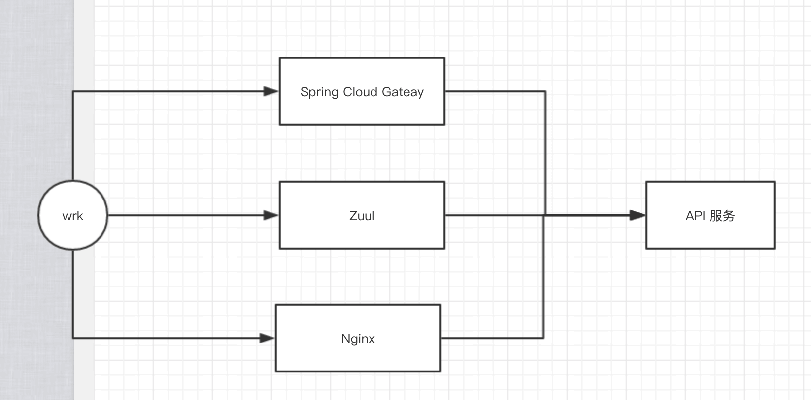

# 性能测试 —— Spring Cloud Gateway、Zuul 基准测试


## 1. 概述

在 [《性能测试 —— SpringMVC、Webflux 基准测试》](http://www.iocoder.cn/Performance-Testing/SpringMVC-Webflux-benchmark?self) 中，我们已经看了 SpringMVC 和 Webflux 的性能测试。而本文，我们来看看 Java 技术栈里，主流的两个网关的选择：

- Zuul ：由 Netflix 开源的，基于阻塞 IO 的 API 网关。

  > 本文，测试的 Zuul 是 1.x 版本。
  >
  > 虽然 Netflix 后来发布了 Zuul 2.x 版本，基于非阻塞 IO 的 API 网关实现，但是从 [how to use zuul2 like the spring-cloud-starter-zuul?](https://github.com/Netflix/zuul/issues/483) 上的讨论来看，Spring Cloud 官方，并不考虑退出 Spring Cloud Zuul 2.x 的支持。当然，原因也非常简单，相信胖友懂的。

- Spring Cloud Gateway ：由 Spring Cloud 源码的，基于 Webflux 实现的非阻塞 IO 的 API 网关。


## 2. 性能指标

和 [《性能测试 —— Nginx 基准测试》](http://www.iocoder.cn/Performance-Testing/Nginx-benchmark/self) 保持一致，我们还是以 **QPS** 作为性能的指标。

在 <https://github.com/YunaiV/SpringBoot-Labs/tree/master/lab-07> 中，我们提供了两个示例，分别是：

- lab-07-spring-cloud-gateway ：Spring Cloud Gateway 2.1.0.RELEASE

  > 底层基于 Webflux + Netty 运行环境

- lab-07-zuul ：Zuul 1.3.1 + Tomcat

  > 底层基于 Servlet 实现，感兴趣的可以看看 ZuulServlet 。

胖友可以使用 `mvn package` 命令，打包出不同的示例，进行压力测试。

当然，既然是网关，我们肯定还是要提供一个后端 API 服务，那么我们使用在 [《性能测试 —— Tomcat、Jetty、Undertow 基准测试》](http://www.iocoder.cn/Performance-Testing/Tomcat-Jetty-Undertow-benchmark?self) 的 [lab-05-benchmark-tomcat-jetty-undertow/lab-05-tomcat](https://github.com/YunaiV/SpringBoot-Labs/tree/master/lab-05-benchmark-tomcat-jetty-undertow/lab-05-tomcat) 这个示例。这样，就是网关到这个后端 API 服务。

为了让这个测试更加有趣，我们也会多测试一个 Nginx 转发请求到后端 API 服务，因为在大多数公司未引入网关的情况下，都是 Nginx 转发请求到后端服务。

> 本文的 Nginx 做了些配置调整，以达到较好的性能状态。胖友可以参考如下两篇文章，进行自己玩耍下：
>
> - [《Nginx 突破高并发的性能优化 - 运维笔记》](https://www.cnblogs.com/kevingrace/p/6094007.html)
> - [《Nginx 配置和性能调优》](https://blog.csdn.net/lamp_yang_3533/article/details/80383039)
>
> 特别需要注意，worker_connections 一定要调大到 65535 ，因为默认是 1000 连接时，在进行 HTTP 压测时，性能会急剧下降，因为每个 Worker 的连接数太小。

所以，本文的整个测试一共有三种：




## 3. 测试环境

- 型号 ：ecs.c5.xlarge

  > 艿艿：和我一样抠门（穷）的胖友，可以买竞价类型服务器，使用完后，做成镜像。等下次需要使用的时候，恢复一下。HOHO 。

- 系统 ：CentOS 7.6 64位

- CPU ：4 核

- 内存 ：8 GB

- 磁盘 ：40 GB ESSD 云盘

- JDK ：openjdk version "1.8.0_212"

- JVM 参数 ：`-Xms2g -Xmx2g -Xmn1g -XX:MaxMetaspaceSize=256m -Xss256k`

因为我们在跑的过程，发现 wrk 占用 CPU 不是很高，所以直接本机运行。

有一点要注意，JVM 本身有[预热](https://codeday.me/bug/20180203/128666.html)的过程，Spring Cloud Gateaway、Zuul 本也有预热的过程（例如说，线程的初始化），所以需要多次测试，取平均值。

本文，我们使用 wrk 如下命令进行测试：

```
./wrk -t50 -c并发 -d30s http://127.0.0.1:8080
```

- `-t50` 参数，设置 50 并发线程。
- `-c并发` 参数，设置并发连接，目前会按照 300、1000、3000、5000 的维度，进行测试。
- `-d30s` 参数，设置执行 30s 的时长的 HTTP 请求。
- `http://127.0.0.1:8080` 参数，请求本地的 Web 服务。


## 4. 第一轮

### 4.1 API 服务

在正式测试网关性能之前，我们先来测试下，API 服务在不同并发下，性能的情况。

启动 API 服务，命令如下：

```
`java -jar lab-05-tomcat-1.0-SNAPSHOT.jar -Xms2g -Xmx2g -Xmn1g -XX:MaxMetaspaceSize=256m -Xss256k`
```


🚚 **300 并发**

```
$wrk -t50 -c300 -d30s http://127.0.0.1:8080/hello

Running 30s test @ http://127.0.0.1:8080/hello
  50 threads and 300 connections
  Thread Stats   Avg      Stdev     Max   +/- Stdev
    Latency    10.52ms    8.48ms 198.51ms   93.18%
    Req/Sec   604.85     74.09     3.05k    80.54%
  905070 requests in 30.10s, 102.01MB read
Requests/sec:  30066.98
Transfer/sec:      3.39MB
```

- QPS 为 30066.98 。
- 平均延迟为 10.52ms 。

🚚 **1000 并发**

```shell
$wrk -t50 -c1000 -d30s http://127.0.0.1:8080/hello

Running 30s test @ http://127.0.0.1:8080/hello
  50 threads and 1000 connections
  Thread Stats   Avg      Stdev     Max   +/- Stdev
    Latency    33.76ms    6.79ms 126.37ms   79.91%
    Req/Sec   594.53     59.55     1.66k    77.89%
  891385 requests in 30.10s, 100.46MB read
Requests/sec:  29614.75
Transfer/sec:      3.34MB
```

- QPS 为 29614.75 。
- 平均延迟为 33.76ms 。


🚚 **3000 并发**

```shell
$wrk -t50 -c3000 -d30s http://127.0.0.1:8080/hello

Running 30s test @ http://127.0.0.1:8080/hello
  50 threads and 3000 connections
  Thread Stats   Avg      Stdev     Max   +/- Stdev
    Latency    99.94ms   15.34ms 438.85ms   91.86%
    Req/Sec   601.61     94.23     4.53k    88.85%
  903962 requests in 30.10s, 101.87MB read
Requests/sec:  30032.17
Transfer/sec:      3.38MB
```

- QPS 为 30032.17 。
- 平均延迟为 99.94ms 。


🚚 **5000 并发**

```shell
$wrk -t50 -c5000 -d30s http://127.0.0.1:8080/hello

  50 threads and 5000 connections
  Thread Stats   Avg      Stdev     Max   +/- Stdev
    Latency   167.14ms   25.40ms 555.49ms   94.09%
    Req/Sec   597.09    174.25     6.35k    78.79%
  895521 requests in 30.10s, 100.87MB read
Requests/sec:  29751.10
Transfer/sec:      3.35MB
```

- QPS 为 29751.10 。
- 平均延迟为 167.14ms 。

**小结**

总的来说，QPS 在 30000 左右。


### 4.2 Spring Cloud Gateway

启动 Spring Cloud Gateway 服务，命令如下：

```shell
java -jar lab-07-spring-cloud-gateway-1.0.0.jar -Xms2g -Xmx2g -Xmn1g -XX:MaxMetaspaceSize=256m -Xss256k
```

🚚 **300 并发**

```shell
$wrk -t50 -c300 -d30s http://127.0.0.1:8081/hello

Running 30s test @ http://127.0.0.1:8081/hello
  50 threads and 300 connections
  Thread Stats   Avg      Stdev     Max   +/- Stdev
    Latency    35.06ms   18.71ms 205.46ms   70.11%
    Req/Sec   175.00     29.25   455.00     70.58%
  262652 requests in 30.10s, 30.06MB read
Requests/sec:   8725.78
Transfer/sec:      1.00MB
```

- QPS 为 8725.78 。
- 平均延迟为 35.06ms 。


🚚 **1000 并发**

```shell
$wrk -t50 -c1000 -d30s http://127.0.0.1:8081/hello

Running 30s test @ http://127.0.0.1:8081/hello
  50 threads and 1000 connections
  Thread Stats   Avg      Stdev     Max   +/- Stdev
    Latency   114.91ms   70.94ms   1.15s    75.94%
    Req/Sec   180.65     44.88   444.00     71.41%
  270352 requests in 30.10s, 30.94MB read
Requests/sec:   8981.58
Transfer/sec:      1.03MB
```

- QPS 为 8981.58 。
- 平均延迟为 114.91ms 。


🚚 **3000 并发**

```shell
$wrk -t50 -c3000 -d30s http://127.0.0.1:8081/hello

Running 30s test @ http://127.0.0.1:8081/hello
  50 threads and 3000 connections

  Thread Stats   Avg      Stdev     Max   +/- Stdev
    Latency   314.83ms  211.95ms   1.96s    75.12%
    Req/Sec   194.02     93.66     0.96k    72.62%
  263753 requests in 30.11s, 30.18MB read
Requests/sec:   8760.64
Transfer/sec:      1.00MB
```

- QPS 为 8760.64 。
- 平均延迟为 314.83ms 。


🚚 **5000 并发**

```shell
$wrk -t50 -c5000 -d30s -T30 http://127.0.0.1:8081/hello

Running 30s test @ http://127.0.0.1:8081/hello
  50 threads and 5000 connections
  Thread Stats   Avg      Stdev     Max   +/- Stdev
    Latency   579.20ms  386.71ms   3.23s    73.00%
    Req/Sec   183.08    102.92     0.94k    68.62%
  237143 requests in 30.16s, 27.14MB read
Requests/sec:   7862.68
Transfer/sec:      0.90MB
```

- QPS 为 7862.68 。
- 平均延迟为 579.20ms 。
- 为了避免 wrk 测试 HTTP 请求超时，我们增加了 `-T30` 参数，即 30 秒超时时间。


### 4.3 Zuul

启动 Zuul 服务，命令如下：

```shell
java -jar lab-07-zuul-1.0.0.jar -Xms2g -Xmx2g -Xmn1g -XX:MaxMetaspaceSize=256m -Xss256k
```


🚚 **300 并发**

```shell
$wrk -t50 -c300 -d30s -T30 http://127.0.0.1:8081/hello

Running 30s test @ http://127.0.0.1:8081/hello
  50 threads and 300 connections
  Thread Stats   Avg      Stdev     Max   +/- Stdev
    Latency    52.74ms   63.66ms 891.03ms   87.37%
    Req/Sec   169.16     51.88   540.00     69.59%
  253446 requests in 30.10s, 33.16MB read
Requests/sec:   8420.10
Transfer/sec:      1.10MB
```

- QPS 为 8420.10 。
- 平均延迟为 52.74ms 。


🚚 **1000 并发**

```shell
$wrk -t50 -c1000 -d30s -T30 http://127.0.0.1:8081/hello

Running 30s test @ http://127.0.0.1:8081/hello
  50 threads and 1000 connections
  Thread Stats   Avg      Stdev     Max   +/- Stdev
    Latency   123.71ms   57.39ms 940.58ms   88.47%
    Req/Sec   167.60     26.11   820.00     78.58%
  250403 requests in 30.10s, 32.75MB read
Requests/sec:   8319.87
Transfer/sec:      1.09MB
```

- QPS 为 8319.87 。
- 平均延迟为 123.71ms 。


🚚 **3000 并发**

```shell
$wrk -t50 -c3000 -d30s -T30 http://127.0.0.1:8081/hello

Running 30s test @ http://127.0.0.1:8081/hello
  50 threads and 3000 connections
  Thread Stats   Avg      Stdev     Max   +/- Stdev
    Latency   352.07ms   59.96ms   1.17s    87.87%
    Req/Sec   169.50     49.45     1.53k    77.05%
  254798 requests in 30.10s, 33.29MB read
Requests/sec:   8465.08
Transfer/sec:      1.11MB
```

- QPS 为 8420.10 。
- 平均延迟为 52.74ms 。


🚚 **5000 并发**

```shell
$wrk -t50 -c5000 -d30s -T30 http://127.0.0.1:8081/hello

Running 30s test @ http://127.0.0.1:8081/hello
  50 threads and 5000 connections
  Thread Stats   Avg      Stdev     Max   +/- Stdev
    Latency   578.86ms   89.32ms   1.41s    87.56%
    Req/Sec   168.64     67.56     1.61k    79.38%
  253573 requests in 30.10s, 33.13MB read
Requests/sec:   8425.73
Transfer/sec:      1.10MB
```

- QPS 为 8425.73 。
- 平均延迟为 578.86ms 。


### 4.4 Nginx

配置 Nginx ，转发到 API 服务。

🚚 **300 并发**

```shell
$wrk -t50 -c300 -d30s -T30 http://127.0.0.1/hello

Running 30s test @ http://127.0.0.1/hello
  50 threads and 300 connections
  Thread Stats   Avg      Stdev     Max   +/- Stdev
    Latency   186.59ms  325.52ms   3.03s    82.92%
    Req/Sec   359.63    172.84     1.12k    65.58%
  515757 requests in 30.10s, 80.15MB read
Requests/sec:  17135.13
Transfer/sec:      2.66MB
```

- QPS 为 17135.13 。
- 平均延迟为 186.59ms 。


🚚 **1000 并发**

```shell
$wrk -t50 -c1000 -d30s -T30 http://127.0.0.1/hello

Running 30s test @ http://127.0.0.1/hello
  50 threads and 1000 connections
  Thread Stats   Avg      Stdev     Max   +/- Stdev
    Latency   345.49ms  624.30ms   7.03s    91.87%
    Req/Sec   359.08    227.23     1.97k    71.05%
  502186 requests in 30.10s, 78.04MB read
  Socket errors: connect 0, read 16, write 0, timeout 0
Requests/sec:  16684.66
Transfer/sec:      2.59MB
```

- QPS 为 16684.66 。
- 平均延迟为 345.49ms 。


🚚 **3000 并发**

```shell
$wrk -t50 -c3000 -d30s -T30 http://127.0.0.1/hello

Running 30s test @ http://127.0.0.1/hello
  50 threads and 3000 connections
  Thread Stats   Avg      Stdev     Max   +/- Stdev
    Latency   521.34ms    1.01s   15.09s    91.57%
    Req/Sec   342.70    244.99     3.73k    78.23%
  492682 requests in 30.10s, 76.57MB read
Requests/sec:  16370.08
Transfer/sec:      2.54MB
```

- QPS 为 16370.08 。
- 平均延迟为 521.34ms 。


🚚 **5000 并发**

```shell
$wrk -t50 -c5000 -d30s -T30 http://127.0.0.1/hello

Running 30s test @ http://127.0.0.1/hello
  50 threads and 5000 connections
  Thread Stats   Avg      Stdev     Max   +/- Stdev
    Latency   769.14ms    1.46s   15.10s    90.37%
    Req/Sec   341.61    284.07     6.46k    83.71%
  493152 requests in 30.10s, 76.65MB read
Requests/sec:  16382.78
Transfer/sec:      2.55MB
```

- QPS 为 16382.78 。
- 平均延迟为 769.14ms 。


### 4.5 小结

- 300 并发时：Nginx > Spring Cloud Gateway > Zuul （17135.13 > 8725.78 > 8420.10）

  > Nginx 性能大大领先，Spring Cloud Gateway 略微优于 Zuul

- 1000 并发时：Nginx > Spring Cloud Gateway > Zuul （16684.66 > 8981.58 > 8319.87）

  > Nginx 性能大大领先，Spring Cloud Gateway 略微优于 Zuul

- 3000 并发时：Nginx > Spring Cloud Gateway > Zuul （16370.08 > 8760.64 > 8420.10）

  > Nginx 性能大大领先，Spring Cloud Gateway 略微优于 Zuul

- 5000 并发时：Nginx > Zuul > Spring Cloud Gateway （16382.78 > 8425.73 > 7862.68）

  > Nginx 性能大大领先，Zuul 优于 Spring Cloud Gateway


## 5. 第二轮

在上一轮测试中，我们发现，随着并发的上升，Spring Cloud Gateway 的 QPS 反倒逐步差于 Zuul ，这个是令我们非常意外的。毕竟 Spring Cloud Gateway 是 Spring Cloud 团队官方发布，并且未来是 Spring Cloud 主打的网关产品。况且 Netflix 团队，后来发布的 Zuul 2 ，也是基于非阻塞 IO 的方式实现的网关。

带着一脸懵逼，我去翻看了 Spring Cloud 官方开发提供的 [spring-cloud-gateway-bench](https://github.com/spencergibb/spring-cloud-gateway-bench) 的项目，其上面发布的测试结果，Spring Cloud Gateway 相比 Zuul 的测试性能，有近 50% 的提升。所以，按照它的方式，我们将 API 服务，替换成了 Static 服务，开始了本轮的测试。

当然，因为上一轮的 Nginx 性能非常优秀，我们在这一轮中，就不重复来跑了。


### 5.1 Static 服务

首先，获取 Static 服务：

```shell
git clone https://github.com/spencergibb/spring-cloud-gateway-bench.git
```

然后，启动 Static 服务：

```shell
cd spring-cloud-gateway-bench/static
nohup ./webserver &
```

最后，测试 Static 服务：

```shell
$ curl 127.0.0.1:8000/hello.txt

{output:"I Love Spring Cloud"}
```

下面，我们先来测试下，Static 服务在不同并发，性能的情况.


🚚 **300 并发**

```shell
$wrk -t50 -c300 -d30s -T30 http://127.0.0.1:8000/hello.txt

Running 30s test @ http://127.0.0.1:8000/hello.txt
  50 threads and 300 connections
  Thread Stats   Avg      Stdev     Max   +/- Stdev
    Latency     5.61ms    4.27ms  49.12ms   69.77%
    Req/Sec     1.16k   266.63     5.66k    70.81%
  1741822 requests in 30.10s, 245.85MB read
Requests/sec:  57865.65
Transfer/sec:      8.17MB
```

- QPS 为 57865.65 。
- 平均延迟为 5.61ms 。


🚚 **1000 并发**

```shell
$wrk -t50 -c1000 -d30s -T30 http://127.0.0.1:8000/hello.txt

Running 30s test @ http://127.0.0.1:8000/hello.txt
  50 threads and 1000 connections
  Thread Stats   Avg      Stdev     Max   +/- Stdev
    Latency    17.71ms   11.46ms 238.71ms   76.46%
    Req/Sec     1.18k   221.06     7.95k    78.41%
  1750853 requests in 30.09s, 247.12MB read
Requests/sec:  58180.49
Transfer/sec:      8.21MB
```

- QPS 为 58180.49 。
- 平均延迟为 17.71ms 。


🚚 **3000 并发**

```shell
$wrk -t50 -c3000 -d30s -T30 http://127.0.0.1:8000/hello.txt

Running 30s test @ http://127.0.0.1:8000/hello.txt
  50 threads and 3000 connections
  Thread Stats   Avg      Stdev     Max   +/- Stdev
    Latency    55.74ms   30.87ms 922.71ms   78.74%
    Req/Sec     1.09k   379.61    21.58k    89.30%
  1585425 requests in 30.10s, 223.77MB read
Requests/sec:  52671.32
Transfer/sec:      7.43MB
```

- QPS 为 52671.32 。
- 平均延迟为 55.74ms 。


🚚 **5000 并发**

```shell
$wrk -t50 -c5000 -d30s -T30 http://127.0.0.1:8000/hello.txt

Running 30s test @ http://127.0.0.1:8000/hello.txt
  50 threads and 5000 connections
  Thread Stats   Avg      Stdev     Max   +/- Stdev
    Latency    87.86ms   41.12ms 937.19ms   78.31%
    Req/Sec     1.07k   479.70    33.72k    86.43%
  1558393 requests in 30.11s, 219.96MB read
Requests/sec:  51752.89
Transfer/sec:      7.30MB
```

- QPS 为 51752.89 。
- 平均延迟为 87.86ms 。


### 5.2 Spring Cloud Gateway

🚚 **300 并发**

```shell
$wrk -t50 -c300 -d30s http://127.0.0.1:8081/hello

Running 30s test @ http://127.0.0.1:8081/hello.txt
  50 threads and 300 connections
  Thread Stats   Avg      Stdev     Max   +/- Stdev
    Latency    29.62ms   16.83ms 172.09ms   70.39%
    Req/Sec   208.88     33.43   600.00     73.20%
  312871 requests in 30.10s, 44.16MB read
Requests/sec:  10392.75
Transfer/sec:      1.47MB
```

- QPS 为 10392.75 。
- 平均延迟为 29.62ms 。


🚚 **1000 并发**

```shell
$wrk -t50 -c1000 -d30s http://127.0.0.1:8081/hello

Running 30s test @ http://127.0.0.1:8081/hello.txt
  50 threads and 1000 connections
  Thread Stats   Avg      Stdev     Max   +/- Stdev
    Latency    98.61ms   55.90ms 462.70ms   69.70%
    Req/Sec   207.29     49.23   519.00     71.14%
  304794 requests in 30.11s, 43.02MB read
Requests/sec:  10123.92
Transfer/sec:      1.43MB
```

- QPS 为 10123.92 。
- 平均延迟为 98.61ms 。


🚚 **3000 并发**

```shell
$wrk -t50 -c3000 -d30s http://127.0.0.1:8081/hello

Running 30s test @ http://127.0.0.1:8081/hello.txt
  50 threads and 3000 connections
  Thread Stats   Avg      Stdev     Max   +/- Stdev
    Latency   293.37ms  172.38ms   2.37s    71.16%
    Req/Sec   191.76     93.74     1.04k    66.49%
  283500 requests in 30.12s, 40.01MB read
Requests/sec:   9411.28
Transfer/sec:      1.33MB
```

- QPS 为 9411.28 。
- 平均延迟为 293.37ms 。


🚚 **5000 并发**

```shell
$wrk -t50 -c5000 -d30s -T30 http://127.0.0.1:8081/hello

Running 30s test @ http://127.0.0.1:8081/hello.txt
  50 threads and 5000 connections

  Thread Stats   Avg      Stdev     Max   +/- Stdev
    Latency   549.86ms  351.91ms   3.50s    72.02%
    Req/Sec   188.87    112.40     1.45k    67.46%
  253979 requests in 30.15s, 35.85MB read
Requests/sec:   8424.33
Transfer/sec:      1.19MB
```

- QPS 为 8424.33 。
- 平均延迟为 549.86ms 。


### 5.3 Zuul

🚚 **300 并发**

```shell
$wrk -t50 -c300 -d30s -T30 http://127.0.0.1:8081/hello

Running 30s test @ http://127.0.0.1:8081/hello.txt
  50 threads and 300 connections

  Thread Stats   Avg      Stdev     Max   +/- Stdev
    Latency    44.20ms   51.78ms 711.17ms   87.13%
    Req/Sec   195.42     56.70     1.07k    72.90%
  291455 requests in 30.10s, 45.63MB read
Requests/sec:   9684.31
Transfer/sec:      1.52MB
```

- QPS 为 9684.31 。
- 平均延迟为 44.20ms 。


🚚 **1000 并发**

```shell
$wrk -t50 -c1000 -d30s -T30 http://127.0.0.1:8081/hello

Running 30s test @ http://127.0.0.1:8081/hello.txt
  50 threads and 1000 connections

  Thread Stats   Avg      Stdev     Max   +/- Stdev
    Latency   106.95ms   45.24ms 811.67ms   88.20%
    Req/Sec   191.83     31.48     1.44k    80.69%
  287645 requests in 30.10s, 45.03MB read
Requests/sec:   9556.68
Transfer/sec:      1.50MB
```

- QPS 为 9556.68 。
- 平均延迟为 106.95ms 。


🚚 **3000 并发**

```shell
$wrk -t50 -c3000 -d30s -T30 http://127.0.0.1:8081/hello

Running 30s test @ http://127.0.0.1:8081/hello.txt
  50 threads and 3000 connections
  Thread Stats   Avg      Stdev     Max   +/- Stdev
    Latency   311.47ms   52.71ms   1.00s    85.88%
    Req/Sec   191.75     50.94     1.73k    80.22%
  287363 requests in 30.10s, 44.95MB read
Requests/sec:   9546.91
Transfer/sec:      1.49MB
```

- QPS 为 9546.91 。
- 平均延迟为 311.47ms 。


🚚 **5000 并发**

```shell
$wrk -t50 -c5000 -d30s -T30 http://127.0.0.1:8081/hello

Running 30s test @ http://127.0.0.1:8081/hello.txt
  50 threads and 5000 connections

  Thread Stats   Avg      Stdev     Max   +/- Stdev
    Latency   515.74ms   70.34ms   1.22s    87.50%
    Req/Sec   191.72     73.11     1.69k    81.85%
  288443 requests in 30.10s, 45.11MB read
Requests/sec:   9583.11
Transfer/sec:      1.50MB
```

- QPS 为 9583.11 。
- 平均延迟为 515.74ms 。


### 5.4 小结

- 300 并发时：Spring Cloud Gateway > Zuul （10392.75 > 9684.31）

  > Spring Cloud Gateway 略微优于 Zuul

- 1000 并发时：Spring Cloud Gateway > Zuul （10123.92 > 9556.68）

  > Spring Cloud Gateway 略微优于 Zuul

- 3000 并发时：Zuul > Spring Cloud Gateway （9546.91 > 8420.10）

  > Zuul 优于 Spring Cloud Gateway

- 5000 并发时：Zuul > Spring Cloud Gateway （9583.11 > 8424.33）

  > Zuul 优于 Spring Cloud Gateway 。

结果发现，还是存在第一轮相同的问题，只是换成 Static 服务后，大家的 QPS 提高了。


## 6. 第三轮

> 艿艿：突然有种“这个糟老头，坏滴很”的感觉。

实际上，第一二轮，被代理请求的接口，都是基本没有任何 IO 操作，虽然说，Static 服务读取文件，但是因为是 SSD 硬盘，太快！再加上，网关和被代理的服务，都在本机，基本也没任何 IO 的损耗。总结来说，整个过程，就已经变成了纯 CPU 的过程了。

所以，本轮，我们来尝试，继续使用第一轮的 API 服务，增加一个“慢”接口，通过 sleep 100ms 来模拟。代码如下：

```java
@GetMapping("/sleep")
public String sleep() throws InterruptedException {
    Thread.sleep(100L);
    return "sleep";
}
```

### 6.1 API 服务

🚚 **300 并发**

```shell
$wrk -t50 -c300 -d30s http://127.0.0.1:8080/sleep

Running 30s test @ http://127.0.0.1:8080/sleep
  50 threads and 300 connections
  Thread Stats   Avg      Stdev     Max   +/- Stdev
    Latency   150.53ms   44.04ms 215.43ms   55.09%
    Req/Sec    39.86     11.79    76.00     80.01%
  59705 requests in 30.08s, 6.73MB read
Requests/sec:   1984.63
Transfer/sec:    228.97K

```

- QPS 为 1984.63 。
- 平均延迟为 150.53ms 。


🚚 **1000 并发**

```shell
$wrk -t50 -c1000 -d30s http://127.0.0.1:8080/sleep

Running 30s test @ http://127.0.0.1:8080/sleep
  50 threads and 1000 connections
  Thread Stats   Avg      Stdev     Max   +/- Stdev
    Latency   498.42ms   71.98ms 617.29ms   88.25%
    Req/Sec    40.67     23.46   191.00     73.05%
  59817 requests in 30.09s, 6.73MB read
Requests/sec:   1987.79
Transfer/sec:    229.06KB
```

- QPS 为 1987.79 。
- 平均延迟为 498.42ms 。


🚚 **3000 并发**

```shell
$wrk -t50 -c3000 -d30s http://127.0.0.1:8080/sleep

Running 30s test @ http://127.0.0.1:8080/sleep
  50 threads and 3000 connections
  Thread Stats   Avg      Stdev     Max   +/- Stdev
    Latency     1.46s   274.77ms   1.79s    94.15%
    Req/Sec    95.45    112.44   590.00     81.85%
  59924 requests in 30.10s, 6.74MB read
Requests/sec:   1990.83
Transfer/sec:    229.41KB
```

- QPS 为 1990.83 。
- 平均延迟为 1.46s 。


🚚 **5000 并发**

```shell
$wrk -t50 -c5000 -d30s http://127.0.0.1:8080/sleep

Running 30s test @ http://127.0.0.1:8080/sleep
  50 threads and 5000 connections
  Thread Stats   Avg      Stdev     Max   +/- Stdev
    Latency     2.39s   525.23ms   2.77s    91.76%
    Req/Sec   123.47    152.17     0.89k    84.97%
  60020 requests in 30.09s, 6.75MB read
Requests/sec:   1994.53
Transfer/sec:    229.84KB
```

- QPS 为 1994.53 。
- 平均延迟为 2.39s 。


### 6.2 Spring Cloud Gateway


🚚 **300 并发**

```shell
$wrk -t50 -c300 -d30s http://127.0.0.1:8081/sleep

Running 30s test @ http://127.0.0.1:8081/sleep
  50 threads and 300 connections
  Thread Stats   Avg      Stdev     Max   +/- Stdev
    Latency   159.66ms   50.00ms 785.35ms   96.07%
    Req/Sec    38.89     12.58    60.00     77.20%
  56346 requests in 30.09s, 6.45MB read
Requests/sec:   1872.46
Transfer/sec:    219.43KB
```

- QPS 为 1872.46 。
- 平均延迟为 159.66ms 。


🚚 **1000 并发**

```shell
$wrk -t50 -c1000 -d30s http://127.0.0.1:8081/sleep

Running 30s test @ http://127.0.0.1:8081/sleep
  50 threads and 1000 connections
  Thread Stats   Avg      Stdev     Max   +/- Stdev
    Latency   491.88ms   58.63ms   1.54s    94.78%
    Req/Sec    45.30     33.09   191.00     63.75%
  59887 requests in 30.10s, 6.85MB read
Requests/sec:   1989.35
Transfer/sec:    233.13KB
```

- QPS 为 1989.35 。
- 平均延迟为 491.88ms 。


🚚 **3000 并发**

```shell
$wrk -t50 -c3000 -d30s http://127.0.0.1:8081/sleep

Running 30s test @ http://127.0.0.1:8081/sleep
  50 threads and 3000 connections
  Thread Stats   Avg      Stdev     Max   +/- Stdev
    Latency     1.44s   249.25ms   2.45s    88.39%
    Req/Sec    58.75     65.30   550.00     88.85%
  60109 requests in 30.09s, 6.88MB read
Requests/sec:   1997.64
Transfer/sec:    234.10KB
```

- QPS 为 1997.64 。
- 平均延迟为 1.44s 。

🚚 **5000 并发**

```shell
$wrk -t50 -c5000 -d30s -T30 http://127.0.0.1:8081/sleep

Running 30s test @ http://127.0.0.1:8081/sleep
  50 threads and 5000 connections
  Thread Stats   Avg      Stdev     Max   +/- Stdev
    Latency     2.34s   537.41ms   3.80s    82.38%
    Req/Sec    72.59     86.86   840.00     88.13%
  59134 requests in 30.11s, 6.77MB read
Requests/sec:   1964.21
Transfer/sec:    230.18KB
```

- QPS 为 1964.21 。
- 平均延迟为 2.34s 。

**小结**

不同并发，QPS 基本和 API 服务 的 QPS 相同，2000 QPS 不到。也是比较合理的结果。


### 6.3 Zuul

🚚 **300 并发**

```shell
$wrk -t50 -c300 -d30s -T30 http://127.0.0.1:8081/sleep

Running 30s test @ http://127.0.0.1:8081/sleep
  50 threads and 300 connections
  Thread Stats   Avg      Stdev     Max   +/- Stdev
    Latency     1.61s     1.26s   11.80s    84.55%
    Req/Sec     5.90      4.57    30.00     84.30%
  5902 requests in 30.10s, 789.75KB read
Requests/sec:    196.08
Transfer/sec:     26.24KB
```

- QPS 为 196.08 。
- 平均延迟为 1.61s 。


🚚 **1000 并发**

```shell
$wrk -t50 -c1000 -d30s -T30 http://127.0.0.1:8081/sleep

Running 30s test @ http://127.0.0.1:8081/sleep
  50 threads and 1000 connections
  Thread Stats   Avg      Stdev     Max   +/- Stdev
    Latency     4.60s     1.63s   18.32s    78.44%
    Req/Sec     6.93      6.13    60.00     88.90%
  5957 requests in 30.10s, 796.98KB read
Requests/sec:    197.91
Transfer/sec:     26.48KB
```

- QPS 为 197.91 。
- 平均延迟为 4.60s 。


🚚 **3000 并发**

```shell
$wrk -t50 -c3000 -d30s -T30 http://127.0.0.1:8081/hello

Running 30s test @ http://127.0.0.1:8081/sleep
  50 threads and 3000 connections
  Thread Stats   Avg      Stdev     Max   +/- Stdev
    Latency    11.15s     5.05s   21.90s    71.44%
    Req/Sec    13.67     13.80   121.00     85.69%
  5960 requests in 30.10s, 797.38KB read
Requests/sec:    198.01
Transfer/sec:     26.49KB
```

- QPS 为 198.01 。
- 平均延迟为 11.15s 。


🚚 **5000 并发**

```shell
$wrk -t50 -c5000 -d30s -T30 http://127.0.0.1:8081/hello

Running 30s test @ http://127.0.0.1:8081/sleep
  50 threads and 5000 connections
  Thread Stats   Avg      Stdev     Max   +/- Stdev
    Latency    14.30s     8.04s   28.97s    56.08%
    Req/Sec    20.30     20.36   140.00     88.96%
  5977 requests in 30.09s, 799.66KB read
Requests/sec:    198.62
Transfer/sec:     26.57KB
```

- QPS 为 198.62 。
- 平均延迟为 14.30s 。

**小结**

一脸懵逼 + 一脸懵逼 + 一脸懵逼？

我们来分析下，为什么会产生 QPS 不到 200 的原因。因为 Zuul 是阻塞 IO 的网关，那么在一个请求的过程中，线程就会一直阻塞着。那么，API 服务一个请求 sleep 了 100ms ，所以导致每秒只能处理 10 个请求。又因为 Zuul 默认配置下，每个路由仅允许 20 个请求( `ZuulProperties.Host.maxPerRouteConnections` ) ，所以结果就是 20 * 10 = 200 QPS 了。

当然，实际场景下，我们会调大 每个路由仅允许 20 个请求( `ZuulProperties.Host.maxPerRouteConnections` )，那这个时候，也是能达到不错的 QPS （此时，可能限制的条件，就是 Zuul 所运行的 Tomcat 的线程数了）。所以，还是我们在 [《性能测试 —— SpringMVC、Webflux 基准测试》](http://www.iocoder.cn/Performance-Testing/SpringMVC-Webflux-benchmark) 提到的观点，非阻塞的特性，给我们带来的是，更好的将耗时的 IO 请求，丢到不同的线程池中。


## 666. 彩蛋

简单总结下：

- Spring Cloud Gateway 因为其非阻塞 IO 的特性，作为网关，会比 Zuul 优秀很多，特别是后端 API 较慢的情况。
- Nginx 的性能非常强劲，如果想要将 Nginx 作为网关，可以考虑使用 Openresty 或者 Kong ，当然需要团队有一定的 Lua 编程能力。
- 如果是 Java 系为主的团队，想要以 Java 作为网关的开发，还是建议使用 Spring Cloud Gateway ，因为虽然测试结果不如 Zuul 理想（在高并发下），但是毕竟是 Spring Cloud 未来主打的 Gateway 选型，未来会越来越好。

推荐与参考文章：

- [《各大 API 网关性能比较》](https://segmentfault.com/a/1190000018838988)
- [《微服务网关哪家强？》](https://zhuanlan.zhihu.com/p/43348509)
- [《微服务 API Gateway 性能测试报告：Kong 性能最优》](https://www.mayi888.com/archives/58842)
- [《聊聊 spring cloud gateway 的 NettyConfiguration》](https://juejin.im/post/5b13d57c6fb9a01e4f47b69e)
- [《纠错帖：Zuul & Spring Cloud Gateway & Linkerd 性能对比》](http://www.itmuch.com/spring-cloud-sum/performance-zuul-and-gateway-linkerd/)


