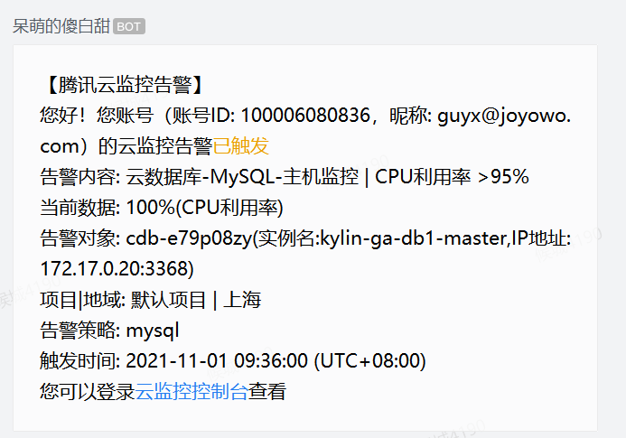

# 大事务导致数据库死锁、引起线上云服务器CPU利用率过高

## 简介

> 今天**（2021-11-01 09:36:00）**腾讯云监控报警、云数据库-MySQL-主机监控报警 **CPU利用率为100%**，针对这样的情况，第一反应可能是不是批量数据的操作导致大事务的数据库的死锁导致的。（ps: 在之前在上线的版本中 我特别留意了线上社保相关的错误日志，其中有一种情况是大批量花名册导入会偶现死锁从而服务器CPU上升场景。当是我并没有进行深入一步的学习，现在又出现类似情况，所以联想到之前情况判断可能也是大事务导致死锁的结论). 下面我证实下关于是否是大事务导致mysql的死锁从而导致线上服务器load飙升。 引用: <https://cloud.tencent.com/developer/article/1595282>
>
> <https://zhuanlan.zhihu.com/p/93647727>
>
> <https://cloud.tencent.com/developer/article/1669350>


### 死锁带来的影响

如果死锁发生，会浪费大量系统资源，甚至导致系统崩溃


### 麒麟系统死锁隐患点

图例

1、目前查询了整个麒麟系统线上最近两周的关于死锁的日志。已经出现了**557次死锁**的。服务CPU飙升等也是死锁导致的其中最重要的原因。

 2、同样Review过麒麟系统其他的一些微服务，大事务、大事务多层嵌套的使用不规范比较常见。这些都为系统埋下隐患点。 


## 反馈图例

### 腾讯云监控告警




### 数据库事件详情


## MySql更新死锁问题 Deadlock found when trying to get lock; try restarting transaction

### 1.3.1 ES日志定位

> 这块一直平稳运行近一年的代码，突然在今天前道专员导入对应的服务网点进行批量生效的时候频繁出现死锁异常，下面我就截取一段高峰期的业务日志:

```bash
### Error updating database.  Cause: com.mysql.jdbc.exceptions.jdbc4.MySQLTransactionRollbackException: Deadlock found when trying to get lock; try restarting transaction

### The error may involve com.joyowo.smarthr.social.infra.mappers.SectionConfigMapper.updateByPrimaryKeySelective-Inline

### The error occurred while setting parameters

### SQL: update section_config   SET soc_service_info_id = ?, is_cross_month = ?, increase_type = ?, increase_day = ?, increase_time = ?,recognize_type = ?,recognize_day = ?,                       recognize_time = ?, order_type = ?,order_day = ?,order_time = ?,                       material_type = ?,                       material_day = ?,                       material_time = ?,                       back_rode_type = ?,                       back_rode_day = ?,                       back_rode_time = ?,                       effective_start_time = ?,                       effective_end_time = ?,                       state = ?,                       create_time = ?,                       update_time = ?,                       verify_time = ?,                              create_uid = ?,                       update_uid = ?,                       verify_uid = ?      where id = ?

### Cause: com.mysql.jdbc.exceptions.jdbc4.MySQLTransactionRollbackException: Deadlock found when trying to get lock; try restarting transaction
```


### 接口请求汇总

| 序号 | 日志id                 | 异常提示                         | 请求开始时间 | 请求结束时间 | 耗 时        |
| ---- | ---------------------- | -------------------------------- | ------------ | ------------ | ------------ |
| 1    | prd_904660322688696320 | 成功                             | 09:17:08.705 | 09:20:16.871 | 耗时188168ms |
| 2    | prd_904660580017635328 | 异常: 截点设置仅可通过待审核状态 | 09:18:10.057 | 09:20:23.334 | 耗时133279ms |
| 3    | prd_904660629439131648 | 异常: 截点设置仅可通过待审核状态 | 09:18:21.840 | 09:20:23.434 | 耗时121596ms |
| 4    | prd_904660975251095552 | 异常: 截点设置仅可通过待审核状态 | 09:19:44.288 | 09:20:29.833 | 耗时45547ms  |

------

## 排查分析

### 场景分析

- 1、 **Deadlock** 非常明显了，说明业务上出现了死锁，可以确定的是业务上有问题。但是改业务代码一直运行了一年，查看Git记录也发现最近没人动该业务相关代码，说明该业务之前就可能有问题，只是最近才达到了触发这种异常的条件
- 2、从异常日志日志可以看出, Mysql出现了死锁，死锁线程会一直处于等待状态，数据库的连接会一直被占用，之后进来的新请求获取不到数据库连接，处于等待状态，这个时候业务人员第一反应可能是网络原因，页面反馈比较慢。从而多次点击该社保服务网点批量通过的接口，请求就在不断的累加，其中某个事务进行回滚，然后同时提交另外一个事务，最后云服务器CPU利用率达到100%，从而导致系统崩溃。


### 对应的代码定位

> 核心错误的调用方法是哪个，即事务开始的方法是哪个?

```java
    @Override
    @Transactional(propagation = Propagation.REQUIRED, rollbackFor = Exception.class)
    public void pass(PassForSessionConfigReqDto dto) {
        for (Long id : dto.getIds()) {
            SectionConfigEntity config1 = sectionConfigLogic.selectByPrimaryKey(id);
            ValidateParam.isEmpty(config1, "截点设置信息不存在");
            if (config1.getState() != 0) {
                throw new ServiceException(ErrorCode.SCO0009);
            }
            config1.setState(2);
            config1.setVerifyTime(new Date());
            config1.setVerifyUid(dto.getStaffId());
            sectionConfigLogic.update(config1);
            try {
                List<String> dateList = DateUtil.getMonthBetween(config1.getEffectiveStartTime(), config1.getEffectiveEndTime());
                for (String date : dateList) {
                  // todo 具体逻辑处理
                  ......

                }
            } catch (ParseException e) {
                logger.error("生成社保日历异常");
            }
        }
    }
```


### 大事务

> 从功能需求上看、批量通过社保服务网点的方法是包裹在一个大事务中的。


#### 什么是大事务？

可以总结成一句话，就是运行时间比较长，操作的数据比较多的事务。


#### 如何查询大事务？

```sql
查询执行时间超过10秒的事务
select * from information_schema.innodb_trx where TIME_TO_SEC(timediff(now(),trx_started))>10
```


#### **大事务一般会对数据库造成什么问题？**


##### **锁定数据过多，容易造成大量的死锁和锁超时**

> 当系统中不同事务之间出现循环资源依赖，涉及的事务都在等待别的事务释放资源时，就会导致这几个事务都进入无限等待的状态，比如下面这个场景：

| 步骤 | **事务A**                                                    | **事务B**                                                    |
| ---- | ------------------------------------------------------------ | ------------------------------------------------------------ |
| 1    | `` BEGIN; ``                                                 |                                                              |
| 2    | `` UPDATE ` mall ` . ` pms_sku_stock ` SET ` price ` = 100.00 WHERE ` id ` = 1; `` |                                                              |
| 3    |                                                              | `` BEGIN; ``                                                 |
| 4    |                                                              | `` UPDATE `mall` . `pms_sku_stock` SET `price` = 100.00 WHERE `id` = 2; `` |
| 5    | `` UPDATE `mall` . `pms_sku_stock` SET `price` = 100.00 WHERE `id` = 2; `` |                                                              |
| 6    |                                                              | `` UPDATE ` mall ` . ` pms_sku_stock ` SET ` price ` = 100.00 WHERE ` id ` = 1; `` |


1、执行mysql返回日志

> 这个时候，事务A在等待事务B释放id=2的行锁，而事务B在等待事务A释放id=2的行锁。事务A和事务B在互相等待对方的资源释放，就是进入了死锁状态

```bash
执行后反馈的异常
1213 - Deadlock found when trying to get lock; try restarting transaction, Time: 0.031000s
```


2、死锁日志

> 去查看对应的数据库最近一次发生死锁日志，使用命令：**show engine innodb status;**

```sql
*** (1) TRANSACTION:
TRANSACTION 12307473, ACTIVE 49 sec starting index read                           #事务一 活跃49S 状态是read
mysql tables in use 1, locked 1                                                   #tables in use 1 表示一个表被使用  locked 1 表示有一个表锁
LOCK WAIT 3 lock struct(s), heap size 1136, 2 row lock(s)                         #LOCK WAIT 表示事务正在等待锁 | 3 lock struct(s) 表示该事务的锁链表的长度为2，每个链表节点代表该事务持有的一个锁结构，包括表锁，记录锁以及 autoinc 锁等| 2 row lock(s) 表示当前事务持有的行锁个数 
MySQL thread id 24584, OS thread handle 139819141809920, query id 108335192 39.170.42.74 fangyang updating
UPDATE `mall`.`pms_sku_stock`
SET `price` = 100.00
WHERE
`id` = 2                                                                          #这里显示的是正在等待锁的SQL语句，通过这个我们可以找到具体的业务数据，不过如果SQL过长的话会被截断，可以结合binlog去找

*** (1) HOLDS THE LOCK(S):                                                        #事务一 持有的行锁，往往就是事务二等待的锁
RECORD LOCKS space id 41 page no 4 n bits 104 index PRIMARY of table `mall`.`pms_sku_stock` trx id 12307473 lock_mode X locks rec but not gap
Record lock, heap no 2 PHYSICAL RECORD: n_fields 17; compact format; info bits 0  #RECORD LOCKS 表示记录锁（并且可以看出要加锁的索引为 id|lock mode X waiting表持有一个记录锁排他锁，非间隙
 0: len 8; hex 8000000000000001; asc         ;;
 1: len 6; hex 000000018bbe; asc       ;;
 2: len 7; hex 85000000d30128; asc       (;;
 3: len 8; hex 000000000001ebdb; asc         ;;
 4: len 8; hex 8003000001da1073; asc        s;;
 5: len 8; hex 8000000000000007; asc         ;;
 6: len 6; hex 737472696e67; asc string;;
 7: len 5; hex 8000006400; asc    d ;;
 8: len 4; hex 80000000; asc     ;;
 9: len 4; hex 80000005; asc     ;;
 10: len 6; hex 737472696e67; asc string;;
 11: len 6; hex 737472696e67; asc string;;
 12: len 6; hex 737472696e67; asc string;;
 13: len 6; hex 737472696e67; asc string;;
 14: len 4; hex 80000000; asc     ;;
 15: SQL NULL;
 16: len 4; hex 80000000; asc     ;;

*** (1) WAITING FOR THIS LOCK TO BE GRANTED:                                      #此处表示当前事务一等待获取行锁；
RECORD LOCKS space id 41 page no 4 n bits 104 index PRIMARY of table `mall`.`pms_sku_stock` trx id 12307473 lock_mode X locks rec but not gap waiting  #InnoDB试图在行上获得排他锁（实际上是对聚集索引记录PK的锁），而不是周围的间隙（间隙锁）
Record lock, heap no 3 PHYSICAL RECORD: n_fields 17; compact format; info bits 0
 0: len 8; hex 8000000000000002; asc         ;;
 1: len 6; hex 000000018bbf; asc       ;;
 2: len 7; hex 86000000d40128; asc       (;;
 3: len 8; hex 000000000001ebdd; asc         ;;
 4: len 8; hex 8004000001ef0d3a; asc        :;;
 5: len 8; hex 8000000000000008; asc         ;;
 6: len 6; hex 737472696e67; asc string;;
 7: len 5; hex 8000006400; asc    d ;;
 8: len 4; hex 80000000; asc     ;;
 9: len 4; hex 80000005; asc     ;;
 10: len 6; hex 737472696e67; asc string;;
 11: len 6; hex 737472696e67; asc string;;
 12: len 6; hex 737472696e67; asc string;;
 13: len 6; hex 737472696e67; asc string;;
 14: len 4; hex 80000000; asc     ;;
 15: SQL NULL;
 16: len 4; hex 80000000; asc     ;;

*** (2) TRANSACTION:                                                               #此处表示事务1开始
TRANSACTION 12307475, ACTIVE 45 sec starting index read                            #事务二 活跃45S 状态是read
mysql tables in use 1, locked 1                                                    
LOCK WAIT 3 lock struct(s), heap size 1136, 2 row lock(s)                          #LOCK WAIT 表示事务正在等待锁 | 2 lock struct(s) 表示该事务的锁链表的长度为2，每个链表节点代表该事务持有的一个锁结构，包括表锁，记录锁以及 autoinc 锁等| 2 row lock(s) 表示当前事务持有的行锁个数 
MySQL thread id 24586, OS thread handle 139818176603904, query id 108335414 39.170.42.74 fangyang updating
UPDATE `mall`.`pms_sku_stock`
SET `price` = 100.00
WHERE
`id` = 1

*** (2) HOLDS THE LOCK(S):                                                         #此处表示当前事务二持有的行锁；
RECORD LOCKS space id 41 page no 4 n bits 104 index PRIMARY of table `mall`.`pms_sku_stock` trx id 12307475 lock_mode X locks rec but not gap
Record lock, heap no 3 PHYSICAL RECORD: n_fields 17; compact format; info bits 0   #事务二 持有一个记录锁排他锁，非间隙锁
 1: len 6; hex 000000018bbf; asc       ;;
 2: len 7; hex 86000000d40128; asc       (;;
 3: len 8; hex 000000000001ebdd; asc         ;;
 4: len 8; hex 8004000001ef0d3a; asc        :;;
 5: len 8; hex 8000000000000008; asc         ;;
 6: len 6; hex 737472696e67; asc string;;
 7: len 5; hex 8000006400; asc    d ;;
 8: len 4; hex 80000000; asc     ;;
 9: len 4; hex 80000005; asc     ;;
 10: len 6; hex 737472696e67; asc string;;
 11: len 6; hex 737472696e67; asc string;;
 12: len 6; hex 737472696e67; asc string;;
 13: len 6; hex 737472696e67; asc string;;
 14: len 4; hex 80000000; asc     ;;
 15: SQL NULL;
 16: len 4; hex 80000000; asc     ;;

*** (2) WAITING FOR THIS LOCK TO BE GRANTED:                                    #此处表示当前事务二等待获取行锁；
RECORD LOCKS space id 41 page no 4 n bits 104 index PRIMARY of table `mall`.`pms_sku_stock` trx id 12307475 lock_mode X locks rec but not gap waiting  # InnoDB试图在行上获得排他锁（实际上是对聚集索引记录PK的锁），而不是周围的间隙（间隙锁）
Record lock, heap no 2 PHYSICAL RECORD: n_fields 17; compact format; info bits 0
 0: len 8; hex 8000000000000001; asc         ;;
 1: len 6; hex 000000018bbe; asc       ;;
 2: len 7; hex 85000000d30128; asc       (;;
 3: len 8; hex 000000000001ebdb; asc         ;;
 4: len 8; hex 8003000001da1073; asc        s;;
 5: len 8; hex 8000000000000007; asc         ;;
 6: len 6; hex 737472696e67; asc string;;
 7: len 5; hex 8000006400; asc    d ;;
 8: len 4; hex 80000000; asc     ;;
 9: len 4; hex 80000005; asc     ;;
 10: len 6; hex 737472696e67; asc string;;
 11: len 6; hex 737472696e67; asc string;;
 12: len 6; hex 737472696e67; asc string;;
 13: len 6; hex 737472696e67; asc string;;
 14: len 4; hex 80000000; asc     ;;
 15: SQL NULL;
 16: len 4; hex 80000000; asc     ;;

*** WE ROLL BACK TRANSACTION (2)
------------

TRANSACTIONS
```

**两种策略可以处理死锁**

> 1、**等待死锁超时**。超时时间（innodb_lock_wait_timeout）默认是50s，这时间可以说真的是太长了，但是如果改小了吧，又可能会影响到本可以正常消除的死锁 
>
>  2、**Mysqlinnodb引擎自动检测死锁机制**。锁检测的配置默认是开启的。MySQL选择打断其中一个事务破坏死锁条件来消除死锁。Mysql官方文档上显示，mysql会选择杀死小的事务，这里的小指的是执行的insert, update, detected语句数目小的事务。需要注意的是mysql inno


##### **回滚记录占用大量存储空间，事务回滚时间长**

> 在MySQL中，实际上每条记录在更新的时候都会同时记录一条回滚操作。记录上的最新值，通过回滚操作，都可以得到前一个状态的值。回滚日志不会一直保留着，当没有事务再需要用到这些回滚日志时，回滚日志会被删除。


##### **执行时间长，容易造成主从延迟**

> 因为主库上必须等事务执行完成才会写入binlog，再传给从库。所以，如果一个主库上的语句执行10分钟，那这个事务很可能就会导致从库延迟10分钟


### 如何解决大事务带来的问题

#### [**基于两阶段锁协议**](https://baike.baidu.com/item/两段锁协议/1008117?fr=aladdin) 

在InnoDB事务中，行锁是在需要的时候加上的，但并不是不需要了就立即释放，而是要等到食物结束时才释放。

 基于两阶段协议我们可以进行优化:**如果事务中需要多个行，要把最可能造成锁冲突的、最可能影响并发度的锁尽量往后放。**

> 比如我之前负责实现的用户报名兼职（**针对单体架构**）。用户报名兼职业务，需要涉及到以下的操作:
>
> 1、生成用户报名记录
>
>  2、对应兼职商家的总的报名单数量-1
>
> 3、记录一条对应商家的报名单消耗的记录

为了保证兼职报名单的原子性，需要将这三个操作放在一个事务中。假设同时有另外一个用户报名该商家发布的同一条个兼职。那么这两个事务冲突的部分就是操作2。因为它们要更新同一个商家账户下的报名单总的余额，需要修改同一行数据。根据两阶段锁协议，不论怎样安排语句顺序，所有的操作需要的行锁都是在事务提交的时候才释放的。但是如果按照1、3、2这样的顺序进行执行，那么商家报名单余量这一行的锁时间就最少。这就最大程度地减少了事务之间的锁等待，提升了并发度。


#### 2、基于死锁检测

如果要解决死锁检测的问题那么就只能控制O(n)的数量，当同一行并发数小的时候死锁检测的成本就会很低了。

**参考JDK1.7的ConcurrentHashMap的分段锁设计，将一行数据改成逻辑上的多行数据来减少锁冲突。**

> 1、接着以用户报名商家兼职为例，可以将一个商家账号信息放在多条记录上，比如5个记录。商家账号报名单总数等于这5个记录的值的总和。这样每次扣减商家报名单数量的的时候，随机选其中一条记录来扣减。这样每次冲突概率变成原来的1/5，可以减少锁等待个数，也就减少了死锁检测的CPU消耗。
>
> 2、对于上面的方案，需要根据业务逻辑做详细设计。特别是当一行的报名单记录为0的时候，需要做特殊处理.


#### 基于事务的隔离级别

MySQL的事务隔离级别默认是可重复读, 在这个隔离级别下写数据的时候会有这些问题：

> 1、**如果有索引（包括主键索引）的时候，以索引列为条件更新数据，会存在间隙锁、行锁的问题，从而锁住一些行**
>
>  2、**如果没有索引，更新数据时会锁住整张表**
>
> 3、如果把隔离级别改为读提交就不存在这两个问题了，每次写数据只会锁一行


## 项目中如何避免引起的死锁

> 死锁在目前的工作中遇到的是比较少的，需要结合不同的死锁日志进行分析和复现需要耗费挺多的精力，Mysql数据库通过行级锁的方式进行底层的优化。但是也产生死锁的问题。在平时的工作中可以通过一些可控的手段，降低出现死锁的概率。


###  避免死锁常见的方案

- 1、在InnoDB事务中，行锁是在需要的时候才加上的，但并不是不需要了就立刻释放，而是要等到事务结束时才释放，如果你的事务中需要锁多个行，要把最可能造成锁冲突、最可能影响并发度的锁尽量往后放。
- 2、案例中的死锁问题为什么之前的一年都没有问题，突然抛出这种异常。业务人员的多次点击批量通过接口，导致有多个事务同时执行，并且多个事务中包含了相同的两个或者两个以上的服务网点的id，刚好其中每个事务是批量执行通过的，其中的某一个网点因为业务原因导致服务网点不能通过，从而导致这一批数据需要全部进行回滚，而在另外一个事务中也在执行批量相同的服务网点id通过，触发了这种异常。所以 **需要添加短时间内的幂等操作，防止并发**
- 3、调整事务的隔离级别。此方法影响面比较广，如果业务允许，将隔离级别调低也是较好的选择.
- 4、**避免大事务，大事务更倾向于死锁，尽量将大事务拆成多个小事务来处理；因为大事务占用资源多，耗时长，与其他事务冲突的概率也会变高**
- 5、**设置锁等待超时参数：innodb_lock_wait_timeout**，这个参数并不是只用来解决死锁问题，在并发访问比较高的情况下，如果大量事务因无法立即获得所需的锁而挂起，会占用大量计算机资源，造成严重性能问题，甚至拖跨数据库。我们通过设置合适的锁等。
- 6、采用固定的顺序去访问表和行数据。比如两个job批量更新的场景，简单方法是对id列表先排序，后执行，这样就避免了交叉等待锁的情形；另外，将两个事务的sql顺序调整为一致，也能避免死锁。
- 7、**尽可能的走主键ID或索引进行更新。可以看到如果不走索引或ID，将会进行全表扫描，会对每一行记录添加上锁，很容易造成死锁。**


## 社保服务网点批量通过业务技术优化调整

### 优化点

> 对麒麟系统目前就只需要控制幂等+大事务拆分就可以解决当前出现的问题

- 1、短时间内的幂等操作，防止并发。
- 2、避免这种大事务，将批量的大事务拆分成单个的小时候处理。（如果考虑到性能可以利用线程池+手动事务处理）。


## 总结

- 回顾下这次故障整个过程，其实整个类似异常信息在一个月前就已经暴露出来了，但是当时服务器性能也正常，偶现的情况没有太过关注。只有当这些小的问题彻底暴露出来，从而拖垮整个服务器才会引起重视, 同时也暴露出目前架构平台监控的力度不够.
- 在今后的业务迭代中、特别是大事务批量执行的场景，在写代码也要多考虑这方面的内容。目前自己的代码是否也能触发死锁的产生。**（⚠️ps: 特别是需要批大量操作数据的业务和导入相关的功能特别注意）**
- 平时可以多关注线上服务的异常的日志，提早发现扼杀在摇篮中。后续会总结下数据库连接池的原理已经innodb下常见的锁类型。