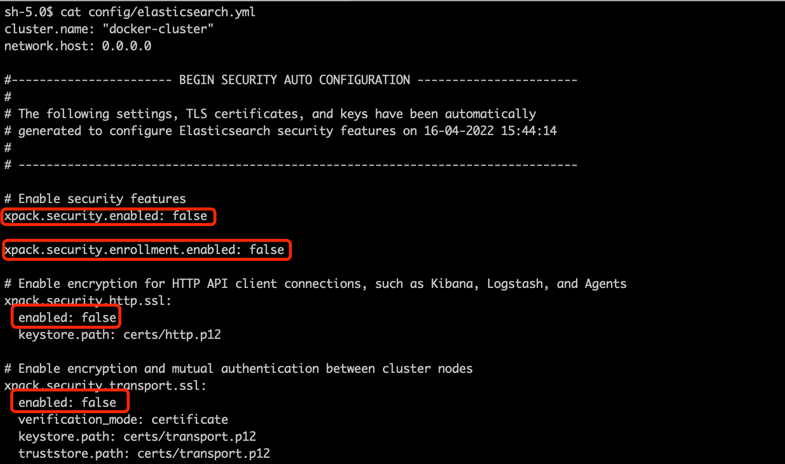
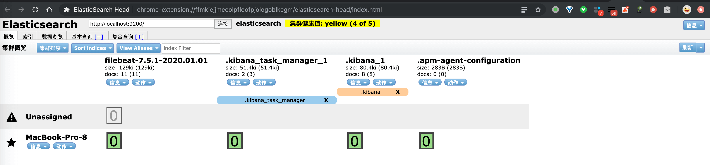

# Elasticsearch 极简入门

## 1. 单机部署

> 考虑到阿里云 Elasticsearch 使用 6.7.X 版本，本小节我们基于 6.7.2 版本进行安装部署。

**前置准备**：

1、安装 JDK 。

2、修改 `/etc/security/limits.conf` ，在此配置中增加以下内容。

> 如果服务器已经配置好，可以不用重复配置。需要在 Root 下执行。


```
root soft nofile 65535
root hard nofile 65535
* soft nofile 65535
* hard nofile 65535
```


- 修改完成后同时使用命令修改配置：

  ```
  $ ulimit -n 65536
  $ ulimit -n
  65536
  ```

  

- 这些配置主要为文件系统描述符及相关的配置，具体的配置可以根据自己的系统配置调大或调小。

3、修改 `/etc/sysctl.conf` ，增加如下内容：

> 如果服务器已经配置好，可以不用重复配置。需要在 Root 下执行。


```
vm.max_map_count=655360
```


- 修改完成后，执行 `sysctl -p` 命令，使配置生效。

**下载**：


```shell
# 创建目录
$ mkdir -p /work/programs/elasticsearch
$ cd /work/programs/elasticsearch

# 下载
$ wget https://artifacts.elastic.co/downloads/elasticsearch/elasticsearch-6.7.2.tar.gz
```


**编辑配置**：


```
$ vi config/elasticsearch.yml
```


修改配置项如下：

- `network.host: 0.0.0.0` ：实现内网可访问。

注意，如果你安装的 Elasticsearch 是 8.X 版本，需要关闭 security 安全相关的功能。如下图所示：



**启动**：

> 注意，需要使用非 Root 账号启动。


```
# 解压
$ tar -zxvf elasticsearch-6.7.2.tar.gz
$ cd elasticsearch-6.7.2

# 启动。通过 -d 参数，表示后台运行。
$ bin/elasticsearch -d
```


可以通过 `logs/elasticsearch.log` 日志，查看启动是否成功。

**测试**：

访问 `http://服务器 IP:9200` 后，成功返回如下 JSON 串，表示成功。


```
{
  "name" : "eog-CRt",
  "cluster_name" : "elasticsearch",
  "cluster_uuid" : "w4lst9oJRT2uOROMBxYqpg",
  "version" : {
    "number" : "6.7.2",
    "build_flavor" : "default",
    "build_type" : "tar",
    "build_hash" : "56c6e48",
    "build_date" : "2019-04-29T09:05:50.290371Z",
    "build_snapshot" : false,
    "lucene_version" : "7.7.0",
    "minimum_wire_compatibility_version" : "5.6.0",
    "minimum_index_compatibility_version" : "5.0.0"
  },
  "tagline" : "You Know, for Search"
}
```


## 2. 安装插件

我们以安装 [elasticsearch-analysis-ik](https://github.com/medcl/elasticsearch-analysis-ik) 插件为示例。

> 本机已经有了 6.5.0 版本，所以本小节我们基于 6.5.0 版本进行安装插件。

**下载**：

在 <https://github.com/medcl/elasticsearch-analysis-ik/releases> 中，提供了各个 elasticsearch-analysis-ik 插件版本。要注意，一定和 Elasticsearch 版本一致。例如说，艿艿 Elasticsearch 版本是 6.5.0 ，所以需要使用 [elasticsearch-analysis-ik-v6.5.0](https://github.com/medcl/elasticsearch-analysis-ik/releases/tag/v6.5.0) 。


```
# 先告诉你，艿艿目前所在目录
$ pwd
/Users/yunai/ES/6.5.0

# 下载
$ wget https://github.com/medcl/elasticsearch-analysis-ik/releases/download/v6.5.0/elasticsearch-analysis-ik-6.5.0.zip
```


**解压：**


```
# 需要解压到 plugins/ik/ 目录下
$ unzip elasticsearch-analysis-ik-6.5.0.zip -d plugins/ik/
```


**重启：**


```
# 查找 ES 进程，并关闭它
$ ps -ef | grep elastic
$ kill 2382 # 假设我们找到的 ES 进程号为 2382 。

# 启动 ES 进程
$ bin/elasticsearch -d
```


**测试：**

IK 分词器提供了 2 种分词模式：

- ik_max_word ：IK 最大化分词，会将文本做最**细**粒度的拆分。
- ik_smart ：IK 智能分词，会做最**粗**粒度的拆分。

我们将 `"百事可乐"` 进行分词，看看他们之间的差异。


```
# ik_max_word 模式
$ curl -X POST \
  http://localhost:9200/_analyze \
  -H 'content-type: application/json' \
  -d '{
	"analyzer": "ik_max_word",
	"text": "百事可乐"
}'
{"tokens":[{"token":"百事可乐","start_offset":0,"end_offset":4,"type":"CN_WORD","position":0},{"token":"百事","start_offset":0,"end_offset":2,"type":"CN_WORD","position":1},{"token":"百","start_offset":0,"end_offset":1,"type":"TYPE_CNUM","position":2},{"token":"事","start_offset":1,"end_offset":2,"type":"CN_CHAR","position":3},{"token":"可乐","start_offset":2,"end_offset":4,"type":"CN_WORD","position":4}]}

# ik_smart 模式
$ curl -X POST \
  http://localhost:9200/_analyze \
  -H 'content-type: application/json' \
  -d '{
	"analyzer": "ik_smart",
	"text": "百事可乐"
}'
{"tokens":[{"token":"百事可乐","start_offset":0,"end_offset":4,"type":"CN_WORD","position":0}]}
```


- 很明显，ik_max_word 比 ik_smart 分出了更多的词。

## 3. Elasticsearch Head

我们可以安装 Chrome 插件 [Elasticsearch Head](https://chrome.google.com/webstore/detail/elasticsearch-head/ffmkiejjmecolpfloofpjologoblkegm) ，可以查看 Elasticsearch 的集群概要、索引、数据。如下图所示：

