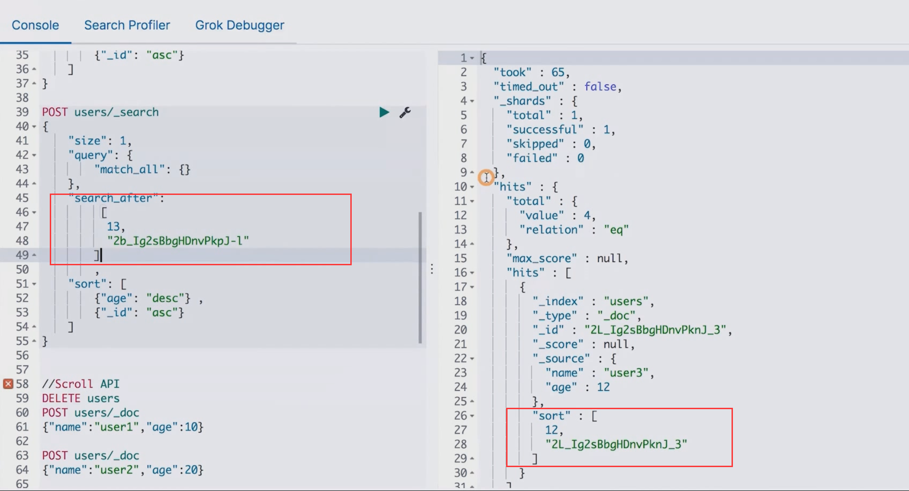

# 分⻚与遍历

>分⻚与遍历 – From，Size，Search After & Scroll API


## From / Size


- 默认情况下，查询按照相关度算分排序，返回前 10 条记录。

  容易理解的分页方案：

  - **From**：开始位置
  - **Size**：期望获取文档的总数


## 分布式系统中深度分页的问题


- ES 天生就是分布式的。查询信息时，数据分别保存在多个分片、多台机器上，ES 天生就需要满足排序的需求（按照相关性算分）。

- 当一个查询：`From = 990, Size = 10`

  - 会在每个分片上先都获取 1000 个文档。然后，通过 **Coordinating Node** 聚合所有结果。最后再通过排序选取前 1000 个文档。

  - 页数越深，占用内存越多。为了避免深度分页带来的内存开销，ES 有一个设定，默认限定到 10000 个文档。

    - **Index.max_result_window**

    

    

### From / Size Demo

- 简单的 From / Size demo
- From + Size 必须小于 10000


## Search After 


- 避免深度分页的性能问题，可以实时获取下一页文档信息

  - 不支持指定页数（From）

  - 只能往下翻

- 第一步搜索需要指定 **sort**，并且保证值是唯一的（可以通过加入 `_id` 保证唯一性）
- 然后使用上一次，最后一个文档的 **sort** 值进行查询


### Demo for Search After

- 避免深度分页的性能问题，可以实时获取下一页文档信息
  - 不支持指定页数（From）
  - 只能往下翻

**初始化数据**

```
POST users/_doc
{"name":"user1","age":10}

POST users/_doc
{"name":"user2","age":11}

POST users/_doc
{"name":"user2","age":12}

POST users/_doc
{"name":"user2","age":13}

POST users/_count
```


**执行分页查询**

```
POST users/_search
{
    "size": 1,
    "query": {
        "match_all": {}
    },
    "sort": [
        {"age": "desc"} ,
        {"_id": "asc"}    
    ]
}
```

**得到结果**


 **执行翻页查询**

```
POST users/_search
{
    "size": 1,
    "query": {
        "match_all": {}
    },
    "search_after":
        [
          13,
          "2b_Ig2sBbgHDnvPkpJ-l"],
    "sort": [
        {"age": "desc"} ,
        {"_id": "asc"}    
    ]
}
```

**拿到翻页的结果**




### Search After 是如何解决深度分页的问题


- 假定 Size 是 10

- 当查询 990 – 1000
- 通过唯一排序值定位，将每次要处理的文档数都控制在 10


上一小节介绍了 `from+size` 的原理，也分析了它的弊端 - 即不适合深分页。好了，如果我们需要获取前 1000 页，每页 10 条文档怎么办？针对这种深分页场景，ES 提供了一种新的分页方式 – `search_after`。Elasticsearch 中的 `search_after` 机制是一种更有效的分页方法，它可以在不加载整个数据集的情况下快速地获取下一页数据。

`search_after` 是一种基于游标的分页方法，使用 `search_after` 查询时必须指定排序字段（可以有多个），它**使用排序字段值作为游标**，从而能够更快地获取下一页的数据。在进行第一次搜索时，ES 会返回第一页的结果，当需要获取下一页数据时，可以使用上一页最后一个文档的排序字段值作为游标进行搜索。通过这种方式，可以逐步遍历整个数据集而无需一次性加载所有数据。

使用 `search_after` 机制需要注意以下几点：

1. 搜索请求必须指定排序字段，用于指定搜索结果的顺序
2. 搜索第一页不必指定 `search_after` 参数，从[第二页](https://zhida.zhihu.com/search?q=第二页&zhida_source=entity&is_preview=1)开始必须指定 `search_after` 为上一页的最后一个游标
3. 游标必须是**唯一**的，否则可能会出现重复的数据


`search_after` 的使用特别灵活，只要指定了游标值，便能根据游标值查询下一页文档。由于查询过程中，可能还会有数据写入，那么多次查询使用一个游标可能得到的结果不一致，如果业务有一致性需求，需要使用 `point in time(PIT)` 来创建一个临时的快照，查询时使用该快照保证数据一致性。


### 实现原理

`search_after` 使用 `PagingFieldCollector` 来收割 doc，原理和 `from+size` 的第三种情况类似，收割`从 doc 0 开始`，不同的是，collect 时会多一次过滤，即会比较当前 doc 的排序字段值和 search_after 值的大小，如果不满足条件则直接过滤掉，也就意味着 pq 操作更少。因此，整体来看性能会更好。

当然，如果写入的数据已按排序字段排序，那么当 pq 满后，会走优化分支触发提前终止，裁剪掉当前 segment 剩下的 doc。


## Scroll API


- 创建一个快照，有新的数据写入以后，无法被查到


- 每次查询后，输入上一次的 Scroll Id


### Demo for Scroll API

- 插入 4 条记录
- 调用 Scroll API
- 插入一条新的记录
- 发现只能查到 4 条数据


**初始化**

```
#Scroll API
DELETE users
POST users/_doc
{"name":"user1","age":10}

POST users/_doc
{"name":"user2","age":20}

POST users/_doc
{"name":"user3","age":30}

POST users/_doc
{"name":"user4","age":40}

POST /users/_search?scroll=5m
{
    "size": 1,
    "query": {
        "match_all" : {
        }
    }
}


POST users/_doc
{"name":"user5","age":50} 
```


**第一次分页查询后拿到scroll_id进行翻页查询**

```
POST /_search/scroll
{
    "scroll" : "1m",
    "scroll_id" : "DXF1ZXJ5QW5kRmV0Y2gBAAAAAAAAAWAWbWdoQXR2d3ZUd2kzSThwVTh4bVE0QQ=="
}
```


## 不同的搜索类型和使用场景

- **Regular**
  - 需要实时获取顶部的部分文档。例如查询最新的订单。
- **Scroll**
  - 需要全部文档，例如导出全部数据。
- **Pagination**
  - From 和 Size
  - 如果需要深度分页，则选用 Search After。
