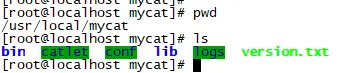

# 数据库中间件Mycat+SpringBoot完成分库分表


## 一、背景


随着时间和业务的发展，数据库中的数据量增长是不可控的，库和表中的数据会越来越大，随之带来的是更高的磁盘、IO、系统开销，甚至性能上的瓶颈，而一台服务的资源终究是有限的，因此需要对数据库和表进行拆分，从而更好的提供数据服务。

当用户表达到千万级别，在做很多操作的时候都会很吃力，所以当数据增长到1000万以上就需要分库分表来缓解单库（表）的压力。


## 二、什么是分库分表


简单来说，就是指通过某种特定的条件，将我们存放在同一个数据库中的数据分散存放到多个数据库（主机）上面，以达到分散单台设备负载的效果。


## 三、垂直切分 

略


### 四、水平切分

略


## 五、什么是Mycat


它是一个开源的分布式数据库系统，是一个实现了 MySQL 协议的的
Server，前端用户可以把它看作是一个数据库代理，用 MySQL 客户端工具和命令行访问，而其后端可以用MySQL 原生（Native）协议与多个 MySQL 服务器通信，也可以用 JDBC 协议与大多数主流数据库服务器通信，其核心功能是分表分库，即将一个大表水平分割为 N 个小表，存储在后端 MySQL 服务器里或者其他数据库里。


### 常见应用场景

- 单纯的读写分离，此时配置最为简单，支持读写分离，主从切换；
- 分表分库，对于超过 1000 万的表进行分片，最大支持 1000 亿的单表分片；
- 多租户应用，每个应用一个库，但应用程序只连接 Mycat，从而不改造程序本身，实现多租户化；
- 报表系统，借助于 Mycat 的分表能力，处理大规模报表的统计；替代 Hbase，分析大数据；
- 作为海量数据实时查询的一种简单有效方案，比如 100 亿条频繁查询的记录需要在 3 秒内查询出来结果，除了基于主键的查询，还可能存在范围查询或其他属性查询，此时 Mycat 可能是最简单有效的选


## 六、SpringBoot+Mycat实现分表分库案例


关于分库分表，Mycat已经帮我们在内部实现了路由的功能，我们只需要在Mycat中配置以下切分规则即可，对于开发者来说，我们就可以把Mycat看做是一个数据库，接下来我们开始搭建环境:


### 步骤一:

Mycat是使用java写的数据库中间件，所以要运行Mycat前要准备要jdk的环境，要求是jdk1.7以上的环境。所以需要在系统中配置JAVA_HOME的环境变量.


### 步骤二:

从官网下载Mycat，<http://dl.mycat.io/1.6-RELEASE/> 我们是基于CentOS7来搭建Mycat环境的，所以下载版本：
 `Mycat-server-1.6-RELEASE-20161028204710-linux.tar.gz`


### 步骤三:

将下载好的安装包上传到服务器上并解压.解压之后目录结构如下：




### 步骤四:

配置切分规则：

将如下配置复制粘贴覆盖`mycat/conf/schema.xml`的内容。

```xml
<?xml version="1.0"?>
<!DOCTYPE mycat:schema SYSTEM "schema.dtd">
<mycat:schema xmlns:mycat="http://io.mycat/">

    <schema name="TESTDB" checkSQLschema="false" sqlMaxLimit="100">
            <table name="user" primaryKey="id" dataNode="dn01,dn02" rule="rule1" />  
    </schema>
    
    <!-- 设置dataNode 对应的数据库,及 mycat 连接的地址dataHost -->  
    <dataNode name="dn01" dataHost="dh01" database="db01" />  
    <dataNode name="dn02" dataHost="dh01" database="db02" />   
    
    <!-- mycat 逻辑主机dataHost对应的物理主机.其中也设置对应的mysql登陆信息 -->  
    <dataHost name="dh01" maxCon="1000" minCon="10" balance="0" writeType="0" dbType="mysql" dbDriver="native">  
            <heartbeat>select user()</heartbeat>  
            <writeHost host="server1" url="127.0.0.1:3306" user="root" password="WolfCode_2017"/>  
    </dataHost> 
</mycat:schema>
```


`<schema>`**: 表示的是在mycat 中的逻辑库配置，逻辑库名称为 TESTDB**

`<table>` **: 表示在mycat 中的逻辑表配置，逻辑表名称为 user, 映射到两个数据库节点 dataNode 中，切分规则为 `rule1`(在rule.xml配置)**

`<dataNode>`**: 表示数据库节点，这个节点不一定是单节点，可以配置成读写分离**

`<dataHost>`**: 真实的数据库的地址配置**

`<heartbeat>`**:用户心跳检测**


将如下配置复制粘贴覆盖`mycat/conf/rule.xml`的内容。

```xml
<?xml version="1.0" encoding="UTF-8"?>
<!DOCTYPE mycat:rule SYSTEM "rule.dtd">
<mycat:rule xmlns:mycat="http://io.mycat/">
    <tableRule name="rule1">
        <rule>
            <columns>id</columns>
            <algorithm>mod-long</algorithm>
        </rule>
    </tableRule>
    <function name="mod-long" class="io.mycat.route.function.PartitionByMod">
        <!-- how many data nodes -->
        <property name="count">2</property>
    </function>
</mycat:rule>
```

这里定义的是切分规则，是按照`id`列进行切分，切分规则是采取取模的方式,
 `<property name="count">2</property>`:这里配置了我们有拆分了多个库(表)，需要和前面配置
 `<table name="user" primaryKey="id" dataNode="dn01,dn02" rule="rule1" />`
 中的dataNode个数一致，否则会出错.


### 步骤五:

在数据库中创建两个数据库db01,db02.
每个库中执行如下建表语句:

```sql
CREATE TABLE `user` (
  `id` bigint(20) NOT NULL,
  `name` varchar(255) DEFAULT NULL,
  PRIMARY KEY (`id`)
) ENGINE=InnoDB DEFAULT CHARSET=utf8;

```


### 步骤六:


启动mycat,执行`mycat/bin/startup_nowrap.sh`


### 步骤七:

搭建SpringBoot环境，执行插入语句.
`application.properties`配置如下：

```pro
#配置数据源
spring.datasource.druid.driver-class-name=com.mysql.jdbc.Driver
#这里配置的是Mycat中server.xml中配置账号密码，不是数据库的密码。
spring.datasource.druid.username=root
spring.datasource.druid.password=123456
#mycat的逻辑库 端口也是mycat的
spring.datasource.druid.url=jdbc:mysql://192.168.142.129:8066/TESTDB
```


`UserMapper.java`代码如下：

```java
@Mapper
public interface UserMapper {
    @Insert("insert into user(id,name) value (#{id},#{name})")
    int insert(User user);
    @Select("select * from user")
    List<User> selectAll();
}
```

`UserController.java`代码如下:

```java
@RestController
@RequestMapping("/user")
public class UserController {
    @Autowired
    private UserMapper userMapper;
    @RequestMapping("/save")
    public String save(User user){
        userMapper.insert(user);
        return "保存成功";
    }
    @RequestMapping("/list")
    public List<User> list(){
        return userMapper.selectAll();
    }
}
```


### 步骤八:


测试:
 在地址栏输入:
 `http://localhost:8080/user/save?id=1&name=tom`
 `http://localhost:8080/user/save?id=2&name=jack`
 查看数据库发现：
 id为1的数据插入到数据库db02中的user表。
 id为2的数据插入到数据库db01中的user表。
 在地址栏输入:
 `http://localhost:8080/user/list`
 是可以看到刚刚插入的两条记录.

好到这一步我们就已经完成了分表分库了.