# 分库分表中间件介绍

## 常见的分库分表中间件

业界常见的分库分表中间件：

​    TDDL：淘宝根据⾃⼰的业务特点开发了 TDDL （Taobao Distributed Data Layer），基于JDBC规范，没有server，以client-jar的形式存在，引⼊项⽬即可使⽤。但是开源版本的TDDL功能⽐较少，阿⾥内部使⽤为主。

​    Mycat: 官网：http://www.mycat.org.cn/ ，Java语⾔编写的MySQL数据库⽹络协议的开源中间件，前身是 Cobar 遵守Mysql原⽣协议，跨语⾔，跨平台，跨数据库的通⽤【中间件代理】；基于 Proxy，复写了 MySQL 协议，将 Mycat Server伪装成⼀个 MySQL 数据库 ；和ShardingShere下的Sharding-Proxy作⽤类似，需要单独部署 。

​    Sharding JDBC ：官网：https://shardingsphere.apache.org/ ，Apache ShardingSphere 是⼀套开源的分布式数据库中间件解决⽅案组成的⽣态圈，它由 Sharding-JDBC、Sharding-Proxy 和 Sharding Sidecar 3个独⽴产品组合；Sharding-JDBC基于jdbc驱动，不⽤额外的proxy，⽀持任意实现 JDBC规范的数据库 ；它使⽤客户端直连数据库，以 jar 包形式提供服务，⽆需额外部署和依赖 ；可理解为加强版的 JDBC 驱动，兼容 JDBC 和各类 ORM框架 。

Mycat的作为分库分表中间件的架构图：

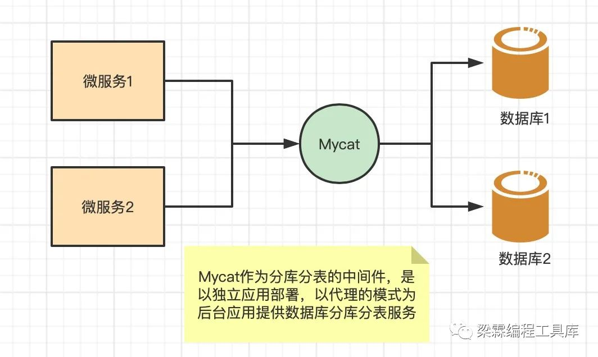

Sharding jdbc作为分库分表中间件的架构图：

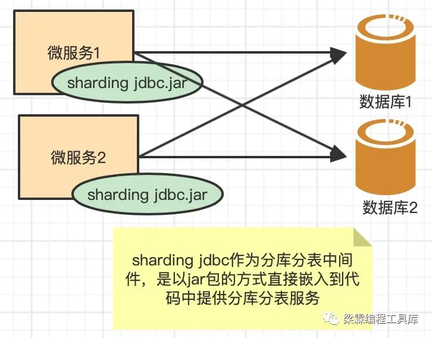

Mycat 和 sharding jdbc的对比

​    相同点：两者设计理念相同，主流程都是SQL解析-->SQL路由-->SQL改写-->结果归并。

​    

区别点： 

​    sharding jdbc ：是基于jdbc驱动，不需要额外的中间代理，在本地应用层重写jdbc的原生方法来实现数据库分片。是基于 JDBC 接⼝的扩展，是以 jar 包的形式提供轻量级服务的，性能⾼。代码具有侵入性，耦合程度更高。

​    Mycat ：是基于 Proxy，它复写了 MySQL 协议，将 Mycat Server伪装成⼀个 MySQL 数据库。客户端所有的jdbc请求都必须要先交给MyCat，再有MyCat转发到具体的真实服务器。缺点是效率偏低，中间包装了⼀层。代码⽆侵⼊性。

## 分布式数据库中间件解决方案 Sharding-Sphere 3.X

码农少闲月，五月人倍忙！Sharding-Sphere在经历公投改名、新官网上线、版权转移等一系列重大变革后，终于迎来了它的3.X新时代！从Sharding-JDBC到Sharding-Sphere，老铁粉陪它一同走过，新朋友也在陆续加入。Sharding-Sphere是什么？做什么？做的如何？三大经典提问帮助新老朋友一同温故知新。

### **Sharding-Sphere是什么?**

Sharding-Sphere是一套开源的分布式数据库中间件解决方案组成的生态圈，它由Sharding-JDBC、Sharding-Proxy和Sharding-Sidecar这3款相互独立的产品组成。他们均提供标准化的数据分片、读写分离、柔性事务和数据治理功能，可适用于如Java同构、异构语言、容器、云原生等各种多样化的应用场景。

Sharding-Sphere定位为关系型数据库中间件，旨在充分合理地在分布式的场景下利用关系型数据库的计算和存储能力，而并非实现一个全新的关系型数据库。它与NoSQL和NewSQL是并存而非互斥的关系。NoSQL和NewSQL作为新技术探索的前沿，是非常值得推荐的。而Sharding-Sphere关注未来不变的东西，进而抓住事物本质。关系型数据库当今依然占有巨大市场，是各个公司核心业务的基石，我们目前阶段更加关注在原有基础上的增量，而非颠覆。其架构如下图所示：

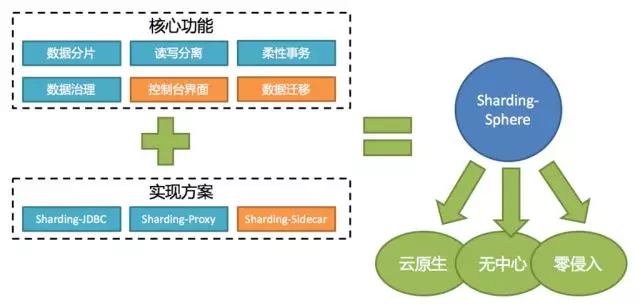

### **Sharding-Sphere家族都有谁?**

Sharding-JDBC, Sharding-Proxy以及Sharding-Sidecar 共同组成了Sharding-Sphere。他们分别定位、适用于不同的应用场景。您也可以将他们组合使用以得到增益的性能表现。

#### **1. Sharding-JDBC**

Sharding-JDBC是Sharding-Sphere的第一个产品，也是Sharding-Sphere的前身。 它定位为轻量级Java框架，在Java的JDBC层提供分库分表、读写分离、数据库治理、柔性事务等服务。它使用客户端直连数据库，以jar包形式提供服务，无需额外部署和依赖，可理解为增强版的JDBC驱动，完全兼容JDBC和各种ORM框架。

#### **2. Sharding-Proxy**

Sharding-Proxy是Sharding-Sphere的第二个产品。 它定位为透明化的数据库代理端，提供封装了数据库二进制协议的服务端版本，用于完成对异构语言的支持。 Sharding-Proxy屏蔽了底层的分库分表，您可以像使用一个简单的数据库一样来操作分库分表的数据。目前提供MySQL版本，它可以使用任何兼容MySQL协议的访问客户端(如：MySQL Command Client, MySQL Workbench等)来访问Sharding-Proxy，进而进行DDL/DML等操作来变更数据，对DBA更加友好。

#### **3. Mixed scheme of Sharding-JDBC & Sharding-Proxy**

为了得到更好的性能以及友好的交互体验，您可以同时使用Sharding-JDBC和Sharding-Proxy。

线上应用使用Sharding-JDBC直连数据库以获取最优性能，使用MySQL命令行或UI客户端连接Sharding-Proxy方便的查询数据和执行各种DDL语句。它们使用同一个注册中心集群，通过管理端配置注册中心中的数据，即可由注册中心自动将配置变更推送至JDBC和Proxy应用。若数据库拆分的过多而导致连接数会暴涨，则可以考虑直接在线上使用Sharding-Proxy，以达到有效控制连接数的目的。其架构如下如所示：

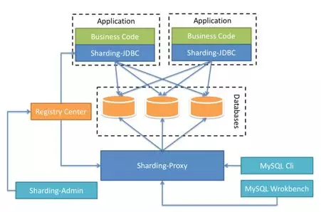

#### **4. Sharding-Sidecar**

Sharding-Sidecar是Sharding-Sphere的第三个产品，目前仍处在孵化中。 定位为Kubernetes或Mesos的云原生数据库代理。其核心思想是Database Mesh，即通过无中心、零侵入的方案提供与数据库交互的啮合层。关注重点在于如何将分布式的数据访问应用与数据库有机串联起来。

### **Sharding-Sphere的功能特性**

#### 1.分库分表

为解决关系型数据库面对海量数据由于数据量过大而导致的性能问题，将数据进行分片是行之有效的解决方案，而将集中于单一节点的数据拆分并分别存储到多个数据库或表，称为分库分表。作为分布式数据库中间件，我们的目标是透明化分库分表所带来的影响，让使用方尽量像使用一个数据库一样使用水平拆分之后的数据库。

#### 2.读写分离

面对日益增加的系统访问量，数据库的吞吐量面临着巨大瓶颈。 对于同一时间有大量并发读操作和较少写操作类型的应用系统来说，将单一的数据库拆分为主库和从库，主库负责处理事务性的增删改操作，从库负责处理查询操作，能够有效的避免由数据更新导致的行锁，使得整个系统的查询性能得到极大的改善。透明化读写分离所带来的影响，让使用方尽量像使用一个数据库一样使用主从数据库，是读写分离中间件的主要功能。

#### **3. 柔性事务**

对于分布式的数据库来说，强一致性分布式事务在性能方面存在明显不足。追求最终一致性的柔性事务，在性能和一致性上则显得更加平衡。 Sharding-Sphere目前支持最大努力送达型柔性事务，未来也将支持TCC柔性事务。若不使用柔性事务，Sharding-Sphere也会自动包含弱XA事务支持。

#### **4. 数据治理**

Sharding-Sphere提供注册中心、配置动态化、数据库熔断禁用、调用链路等治理能力。

#### **Sharding-Sphere 3.X新功能**

1. Sharding-Proxy MySQL版本上线，支持DML/DDL/DAL/DQL等基本 SQL。屏蔽底层所有分库分表，可像使用单一MySQL数据库一样处理分库分表数据。
2. 新增对OR SQL语句的支持，例如：select * from t_order where (id>10 and id<20) or status=‘init’;
3. 新增对INSERT批量插入的支持，例如 insert into t_order(order_id, user_id, status) values (1, 2, ‘init’), (2, 3, ‘init’), (3, 4, ‘init’);
4. 优化对INSERT SQL语句的支持，主要包括不指定具体列进行INSERT操作，例如：insert into t_order values(1, 2,‘init’);
5. 增加解析引擎对SQL的缓存，进一步提升解析性能。
6. Sharding-JDBC新增对InlineExpression占位符$->{}的支持。

新的产品、新的特性、新的优化是不是让你眼前一亮？那就赶快把Sharding-Sphere 3.X用起来吧！

**暖心Tips：**

① 使用Sharding-JDBC，可加入以下Maven依赖：

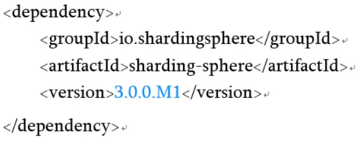

② 使用Sharding-Proxy，可在这里下载：

https://github.com/sharding-sphere/sharding-sphere-doc/raw/master/dist/sharding-proxy-3.0.0.M1.tar.gz

此外，我们的DOCKER下载命令如下所示：

docker pull shardingsphere/sharding-proxy

## Sharding-Proxy —— 面向 DBA 的数据库中间层

### **Sharding-Proxy简介**

#### **Sharding-Proxy概览**

Sharding-Proxy定位为透明化的数据库代理端，提供封装了数据库二进制协议的服务端版本，用于完成对异构语言的支持。目前先提供MySQL版本，它可以使用任何兼容MySQL协议的访问客户端操作数据（如：MySQLCommandClient、MySQLWorkbench等），对DBA更加友好。

- 对应用程序完全透明，可直接当做MySQL使用；

- 适用于任何兼容MySQL协议的客户端。

  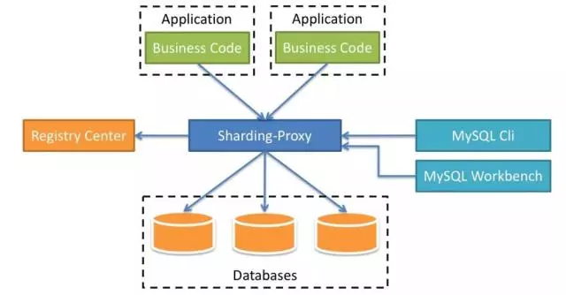

与其他两个产品（Sharding-JDBC、Sharding-Sidecar）的对比：

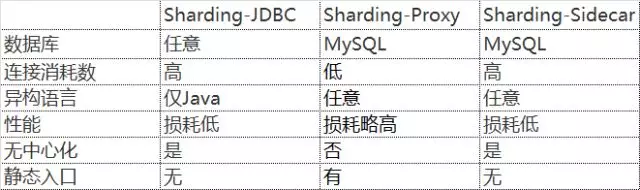

它们既可以独立使用，也可以相互配合，以不同的架构模型、不同的切入点，实现相同的功能目标。而其核心功能，如数据分片、读写分离、柔性事务等，都是同一套实现代码。

举个例子，对于仅使用Java为开发技术栈的场景，Sharding-JDBC对各种Java的ORM框架支持度非常高，开发人员可以非常便利地将数据分片能力引入到现有的系统中，并将其部署至线上环境运行，而DBA就可以通过部署一个Sharding-Proxy实例，对数据进行查询和管理。

#### **Sharding-Proxy架构**

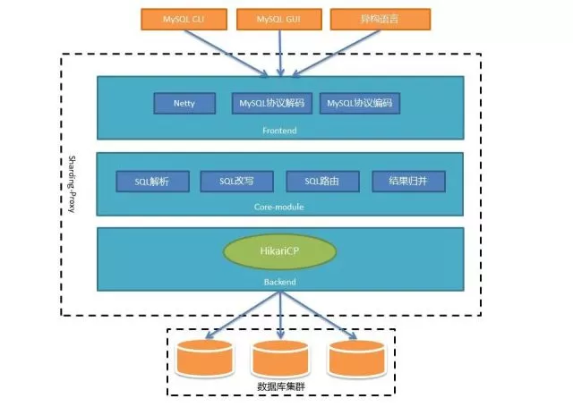

整个架构可以分为前端、后端和核心组件三部分来看：

- 前端（Frontend）负责与客户端进行网络通信，采用的是基于NIO的客户端/服务器框架，在Windows和Mac操作系统下采用NIO模型，Linux系统自动适配为Epoll模型，在通信的过程中完成对MySQL协议的编解码；
- 核心组件（Core-module）得到解码的MySQL命令后，开始调用Sharding-Core对SQL进行解析、改写、路由、归并等核心功能；
- 后端（Backend）与真实数据库的交互暂时借助基于BIO的Hikari连接池。BIO的方式在数据库集群规模很大，或者一主多从的情况下，性能会有所下降。所以未来我们还会提供NIO的方式连接真实数据库。

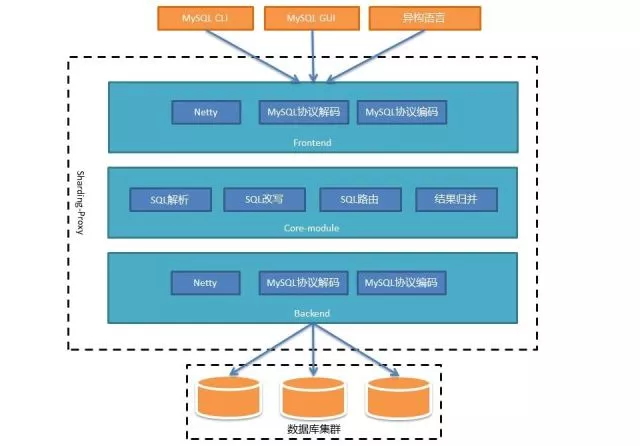

这种方式下Proxy的吞吐量将得到极大提高，能够有效应对大规模数据库集群。

## 分布式事务在 Sharding-Sphere 中的实现

### **Sharding-Sphere对分布式事务的支持**

Sharding-Sphere同时支持XA和柔性事务，它允许每次对数据库的访问，可以自由选择事务类型。分布式事务对业务操作完全透明，极大地降低了引入分布式事务的成本。

1、事务模型

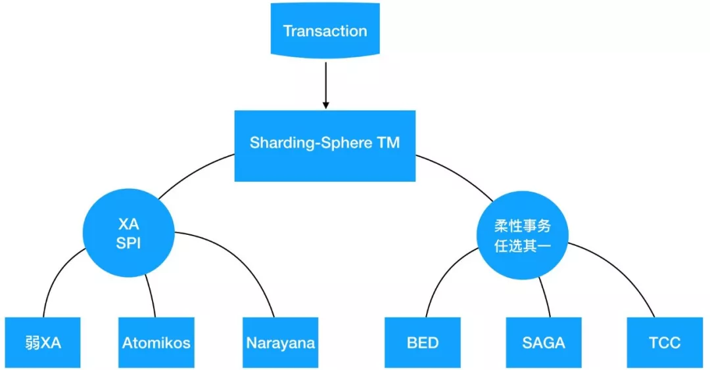

Sharding-Sphere事务管理器集成了XA和柔性事务模型：

- 对于XA事务而言，采用SPI的方式让弱XA、Atomikos、Narayana间保持互斥；
- 对于柔性事务而言，根据每次连接中事务的类型，可以选择独立的事务管理器进行处理，每个事务管理器都会实现标准的ShardingTransaction接口，在TransactionEvent到来时，执行对应的begin、commit、rollback操作。

下面将Sharding-Sphere内部如何用事件驱动方式，将事务从分片主流程中解耦进行详细说明：

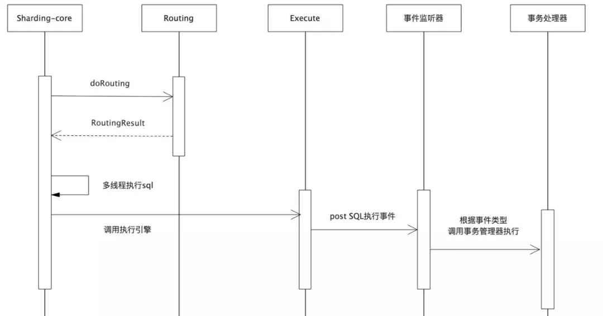

从图可以看出在Sharding-core在调用执行引擎时，会根据SQL的种类产生事件进行分发。事务监听线程在收到符合要求的事件后，再调用对应的事务处理器进行处理。

2、Sharding-Proxy事务实现

Sharding-Proxy是基于netty开发的数据库中间代理层，实现了标准的MySQL协议，可以看做是一个实现了数据分片的数据库。Sharding-Proxy已经实现了基于Atomikos的XA事务，为了保证所有的子事务都处于同一个线程之中，整个Proxy的线程模型进行了如下的调整：

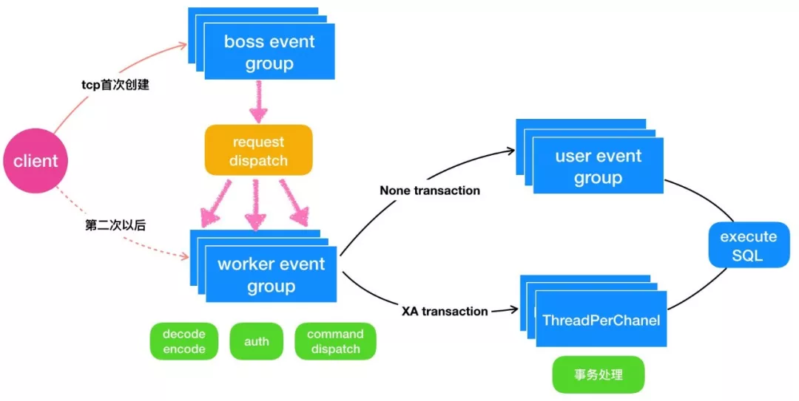

当开启事务后，Proxy后端的SQL命令执行引擎将采用一通道一线程的模式，此事务线程的生命周期同通道保持一致。事务处理的具体过程与Proxy彻底解耦，即Proxy将发布事务类型的事件，然后Sharding-Sphere-TM根据传入的事务消息，选择具体的TM进行处理。

压测结果表明：XA事务的插入和更新的性能，基本上同跨库的个数呈线性关系，查询的性能基本不受影响，建议在并发量不大，每次事务涉及的库在10个以内时，可以使用XA。

#### **Sharding-Sphere的Saga事务实现**

Sharding-Sphere通过与Apache Service Comb的合作，将采用Service Comb的Saga事务引擎作为的分布式事务实现。

Apache Service Comb是华为开源的微服务框架，其中微服务事务处理框架分为集中式和分布式协调器。未来会在Sharding-Sphere内部集成Saga集中式协调器，支持同一线程内不同服务（本地）间的分布式事务。

### **未来计划**

未来Sharding-Sphere将按照文中介绍的Sharding-Sphere-TM逐步完善整个事务框架：

- 弱XA事务 （已发布）
- 基于Atomikos的XA事务（近期发布）
- 基于Narayana的XA事务（规划中）
- BED柔性事务（已发布）
- SAGA（开发中）
- TCC（规划中）

如果前面的分享太过冗长，那么千言万语汇聚成一张表格，欢迎阅读。

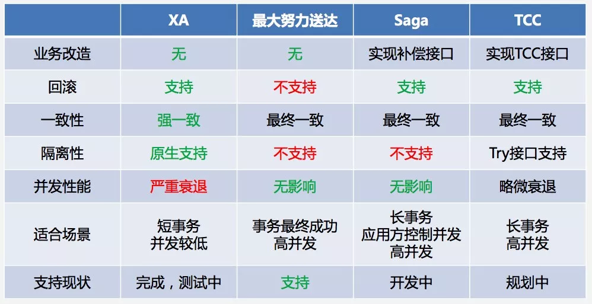

