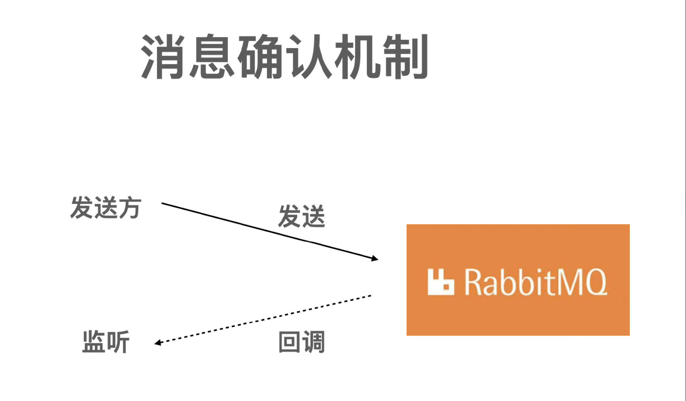
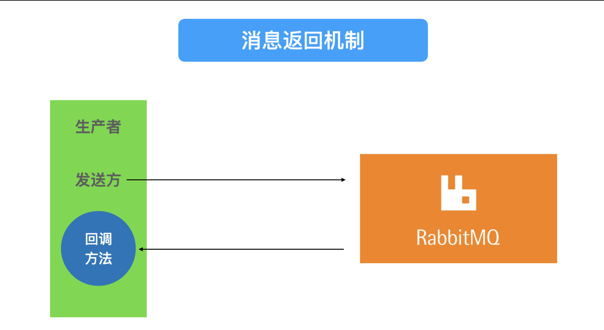
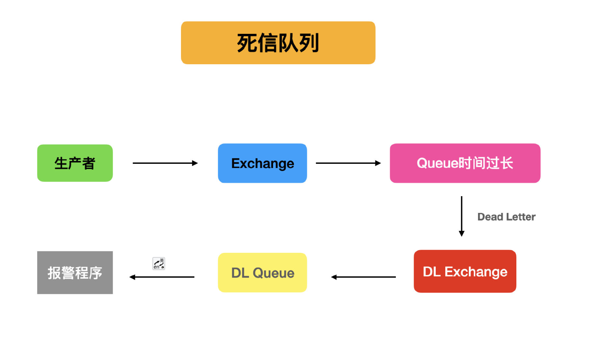

# RabbitMQ教程


## 1. 消息的可靠性如何保证

**发送端**

1. 需要RabbitMQ发送端确认机制，确认消息成功发送到RabbitMQ并被处理。 （如果没有正确发送，要返回报错信息，提醒业务方处理）
2. 需要RabbitMQ消息返回机制，如果没有路由到对应的队列，中间件会通知发送端。（也应该要返回报错信息，提醒业务方处理）

**消费端**

1. 需要RabbitMQ确认机制，确认消息没有发生处理异常。（消费方消费的消息，才应该删除这条消息，否则应该留在RabbitMQ里，等待异常的处理）
2. 需要RabbitMQ消费端限流，限制消息推送速度，保障消费端服务稳定。（不能推的很快）

RabbitMQ

1. 防止消息大量积压，配合RabbitMQ消息过期时间，避免对RabbitMQ自身产生压力过大。
2. 如果当消息过期后，过期丢弃机制，对数据安全产生影响。采用死信队列，收集过期消息，对接报警系统。

**总结**

1. 发送端确认机制(exchange确认和queue确认，没收到，那么应该异常处理)
2. 消费端确认机制（ack）
3. 消费端限流机制
4. 消息过期机制
5. 死信队列（消息过期删掉，这样做不好，消息就是数据，对于数据删除操作，一定要非常慎重。RabbitMQ解决方案：死信队列）

### 1.1 发送端确认原理

在使用RabbitMQ的时候，可以通过**消息持久化操作来解决因为服务器的异常崩溃而导致的消息丢失**，除此之外，我们还会遇到一个问题，**当消息的生产者将消息发送出去之后，消息到底有没有正确地到达服务器呢**?**如果不进行特殊配置，默认情况下发送消息的操作是不会返回任何信息给生产者的，也就是默认情况下生产者是不知道消息有没有正确地到达服务器**。如果在消息到达服务器之前己经丢失，持久化操作也解决不了这个问题，因为消息根本没有到达服务器，何谈持久化?RabbitMQ针对这个问题，提供了两种解决方式:

- 通过事务机制实现:
- 通过发送方确认Cpublisherconfirm)机制实现。


#### 1.1.1 事务机制

RabbitMQ客户端中与事务机制相关的方法有三个:**channel.txSelect**、**channel.txCommit**和**channel.txRollbackochannel.txSelect**用于将当前的信道

设置成**事务模式**，**channel.txCommit用于提交事务**，**channel.txRollback用于事务回滚**。在通过channel.txSelect方法开启事务之后，我们便可以发布消息给RabbitMQ了，**如果事务提交成功，则消息一定到达了RabbitMQ中**，**如果在事务提交执行之前由于RabbitMQ异常崩溃或者其他原因抛出异常，这个时候我们便可以将其捕获，进而通过执行channel.txRollback方法来实现事务回滚**。注意这里的RabbitMQ中的事务机制与大多数数据库中的事务概念井不相同，需要注意区分。

**事务确实能够解决消息发送方和RabbitMQ之间消息确认的问题，只有消息成功被RabbitMQ接收，事务才能提交成功，否则便可在捕获异常之后进行事务回滚，与此同时可以进行消息重发。但是使用事务机制会"吸干"RabbitMQ的性能，那么有没有更好的方法既能保证消息发送方确认消息已经正确送达，又能基本上不带来性能上的损失呢?从AMQP协议层面来看并没有更好的办法，但是RabbitMQ提供了一个改进方案，即发送方确认机制，详情请看下一节的介绍。**


#### 1.1.2 发送方确认机制

前面介绍了RabbitMQ可能会遇到的一个问题，即消息发送方（生产者）并不知道消息是否真正地到达了RabbitMQ。随后了解到在AMQP协议层面提供了事务机制来解决这个问题，但是采用事务机制实现会严重降低RabbitMQ的消息吞吐量，这里就引入了一种轻量级的方式——**发送方确认（publisher confirm）**机制。

生产者将信道设置成**confirm** （确认）模式，一旦信道进入confirm 模式，所有在该信道上面发布的消息都会被指派一个唯一的ID（从1开始)，一旦消息被投递到所有匹配的队列之后，RabbitMQ就会发送一个确认（Basic.Ack）给生产者(包含消息的唯一ID)，这就使得生产者知晓消息已经正确到达了目的地了。**如果消息和队列是可持久化的，那么确认消息会在消息写入磁盘之后发出**。RabbitMQ回传给生产者的确认消息中的**deliveryTag包含了确认消息的序号**，此外RabbitMQ也可以设置channel.basicAck方法中的multiple参数，表示到这个序号之前的所有消息都己经得到了处理。


**事务机制在一条消息发送之后会使发送端阻塞，以等待RabbitMQ的回应，之后才能继续发送下一条消息**。**相比之下，发送方确认机制最大的好处在于它是异步的，一旦发布一条消息，生产者应用程序就可以在等信道返回确认的同时继续发送下一条消息，当消息最终得到确认之后，生产者应用程序便可以通过回调方法来处理该确认消息，如果RabbitMQ因为自身内部错误导致消息丢失，就会发送一条nackCBasic. Nack)命令，生产者应用程序同样可以在回调方法中处理该nack命令。**


**注意要点:**

> ( 1 )事务机制和 publisher confirm机制两者是互斥的，不能共存。
>
>  (2 )事务机制和 publisher confirm 机制确保的是消息能够正确地发送至RabbitMQ，这里的"发送至RabbitMQ"的含义是指消息被正确地发往至RabbitMQ的交换器，如果此交换器没有匹配的队列，那么消息也会丢失。所以在使用这两种机制的时候要确保所涉及的交换器能够有匹配的队列。更进一步地讲，发送方要配合mandatory参数或者备份交换器一起使用来提高消息传输的可靠性


publisher confirm 的优势在于并不一定需要同步确认。这里我们改进了一下使用方式，总结有如下两种:

1. **批量confirm方法**:每发送一批消息后，调用channel.waitForConfirms方法，等待服务器的确认返回。
2. **异步confirm方法**:提供一个回调方法，服务端确认了一条或者多条消息后客户端会回调这个方法进行处理。

在批量confirm方法中，客户端程序需要定期或者定量(达到多少条)，亦或者两者结合起来调用channel.waitForConfirms来等待RabbitMQ的确认返回。相比于前面示例中的普通confirm方法，批量极大地提升了confmn的效率，但是问题在于出现返回Basic.Nack或者超时情况时，客户端需要将这一批次的消息全部重发，这会带来明显的重复消息数量，并且当消息经常丢失时，批量confirm的性能应该是不升反降的。

**异步回调确认**，可能是单条通知，也可能是多条通知，这个是由RabbitMQ以当时的情况决定的。（我们有些业务，已经处理完成了，**但是异步通知回来告诉我们失败了，这个就比较麻烦**，如果返回多条消息中，有多条消息是失败的,是哪几条消息失败了，还要去查询数据库，查找**deliverytag**来判断，所以也不是很推荐。但是异步方式，这种解耦的思想，如果符合你的某些业务场景，可以考虑使用）


### 1.2 消息真的被路由了吗


**mandatory**和 **immediate** 是**channel.basicPublish**方法中的两个参数，它们都有当消息传递过程中不可达目的地时将消息返回给生产者的功能。RabbitMQ提供的**备份交换器**(**Altemate Exchange**)可以将未能被交换器路由的消息(没有绑定队列或者没有匹配的绑定〉存储起来，而不用返回给客户端。对于初学者来说，特别容易将mandatory和工mmediate这两个参数混淆，而对于备份交换器更是一筹莫展，本章对此一一展开探讨。


#### **1.2.1 mandatory参数**

当**mandatory**参数设为true时，交换器无法根据自身的类型和路由键找到一个符合条件的队列，那么RabbitMQ会调用**Basic.Return**命令将消息返回给生产者。当**mandatory**参数设置为**false**时，出现上述情形，则消息直接被丢弃。

那么生产者如何获取到没有被正确路由到合适队列的消息呢?这时候可以通过调用channel.addReturnListener来添加ReturnListener监昕器实现。


#### **1.2.2 immediate参数**

当**immediate**参数设为**true**时，如果交换器在将消息路由到队列时发现队列上并不存在任何消费者，那么这条消息将不会存入队列中。当与路由键匹配的所有队列都没有消费者时，该消息会通过**Basic.Return**返回至生产者。

概括来说，immediate 参数告诉服务器至少将该消息路由到一个队列中，否则将消息返回给生产者。**immediate**  参数告诉服务器，**如果该消息关联的队列上有消费者，则立刻投递:如果所有匹配的队列上都没有消费者，则直接将消息返还给生产者，不用将消息存入队列而等待消费者了**。

RabbitMQ 3.0版本开始**去掉了**对 **immediate**  参数的支持，对此RabbitMQ官方解释是:**imrnediate**参数会影响镜像队列的性能，增加了代码复杂性，建议采用TTL和DLX的方法替代。(有关TTL和DLX的介绍请分别参考4.2节和4.3节。)


#### 1.2.3  备份交换器

备份交换器，英文名称为**Altemate Exchange**，简称AE，或者更直白地称之为"备胎交换器"。生产者在发送消息的时候如果不设置**mandatory**参数，那么消息在未被路由的情况下将会丢失**:如果设置了mandatory参数，那么需要添加ReturnListener的编程逻辑，生产者的代码将变得复杂**。如果既不想复杂化生产者的编程逻辑，又不想消息丢失，那么可以使用备份交换器，这样可以将未被路由的消息存储在RabbitMQ中，再在需要的时候去处理这些消息。

可以通过在声明交换器(调用channel.exchangeDeclare方法)的时候添加**alternate-exchange**参数来实现，也可以通过策略CPolicy，详细参考6.3节〉的方式实现。如果两者同时使用，则前者的优先级更高，会覆盖掉Policy的设置。

使用参数设置的关键代码如代码清单4-2所示。

```java
Map<String, Object> args = new HashMap<String, Object>(); 
args.put("a1ternate-exchange", "myAe"); 
channe1.exchangeDec1are("norma1Exchange", "direct", true, fa1se, args); 
channe1.exchangeDec1are("myAe", "fanout", true, fa1se, nu11); channe1.queueDec1are("norma1Queue", true, fa1se, fa1se, nu11); 
channe1.queueB工nd("norma1Queue"，"norma1Exchange", "norma1Key"); channe1.queueDec1are("unroutedQueue", true, fa1se, fa1se, nu11); 
channel.queueBind("unroutedQueue", "myAe", ""); 
```


#### **1.2.4  综上**

生产者，发送消息后，发送端不知道消息是否被路由了？
如果没有被路由，或路由异常了，消息会被丢弃。 消息被丢弃后，业务流程停止，业务停止，甚至可能出现业务异常。

RabbitMQ解决方案
**消息返回机制**，确认消息被正确路由



**消息被发送以后，Exchange会进行路由，如果没有发现目标Queue,会，通过回调机制，返回通知发送方。**


### 1.3 消息返回机制

生产者，发送消息后，不知道消息是否被真正的路由到了正确的地方？ 如果路由出现异常，那么消息就被丢弃了，如果是重要的业务场景， 如:订单处理，消息丢弃后，必然业务异常，数据错乱。
**解决方案**: RabbitMQ的**消息返回机制**，也就是确认消息是否被正确的路由了。



生产者提供一个回调方法给RabbitMQ,如果生产者发送的消息， 没有正确的路由(也就是没有匹配**Exchange**上的**BindingKey**)，就会回调这个方法，告知生产者，让生产者知道消息没有被正确的路由，接下来采取异常业务处理流程。

RabbitMQ中 **Mandatory**选项配置
**false** - 直接丢弃无法路由的消息
**true** - 发现无法路由，就返回给发送方，


### 1.4 消费端异常怎么处理

#### 1.4.1 消费端确认机制

RabbitMQ默认自动确认（ACK）。但是在消费端如果遇到异常， 发送端和RabbitMQ是不知道的。（如果很重要的信息，比如订单，随便丢弃，那肯定出大事儿）
所以RabbitMQ提供了**消费端确认机制**，确认消息可以被正确处理。如果我们不用代码告诉 RabbitMQ已经签收，那么这条消息就会在RabbitMQ里是未签收状态， 如果这条消息一直未被签收，那么消费端重启后，这条消息会被变成**ready**状态， 还会被其他消费端进行消费。

单条消息手动ACK **multiple**=false
多条消息手动ACK **multiple**=true

多条消息手动ACK,如果有问题，不好处理。

推荐使用:单条消息手动ACK

如果消费端消费失败，可以重回队列，但是，反复从rabbitMQ和消费端，循环消费消息，但是一直不成功
所以不建议使用**重回队列**这个功能，建议使用报警机制。


了保证消息从队列可靠地达到消费者，RabbitMQ提供了消息确认机制(**message acknowledgemen**t)。消费者在订阅队列时，可以指定**autoAck**参数，当**autoAck**等于**false**时，RabbitMQ会等待消费者显式地回复确认信号后才从内存(或者磁盘)中移去消息(实质上是先打上删除标记，之后再删除)。当**autoAck**等于**true**时，RabbitMQ会自动把发送出去的消息置为确认，然后从内存(或者磁盘)中删除，而不管消费者是否真正地消费到了这些消息。

采用消息确认机制后，只要设置**autoAck**参数为**false**，**消费者就有足够的时间处理消息(任务)，不用担心处理消息过程中消费者进程挂掉后消息丢失的问题，因为RabbitMQ会一直等待持有消息直到消费者显式调用Basic.Ack命令为止**。

当**autoAck参数置为false**，对于RabbitMQ服务端而言，队列中的消息分成了两个部分:一部分是等待投递给消费者的消息:一部分是己经投递给消费者，但是还没有收到消费者确认信号的消息。**如果RabbitMQ一直没有收到消费者的确认信号，并且消费此消息的消费者己经断开连接，则RabbitMQ会安排该消息重新进入队列，等待投递给下一个消费者，当然也有可能还是原来的那个消费者。**

RabbitMQ不会为未确认的消息设置过期时间，**它判断此消息是否需要重新投递给消费者的唯一依据是消费该消息的消费者连接是否己经断开**，这么设计的原因是RabbitMQ允许消费者消费一条消息的时间可以很久很久。


**在消费者接收到消息后**，如果想明确拒绝当前的消息而不是确认，那么应该怎么做呢?RabbitMQ在2.0.0版本开始引入了Basic.Reject这个命令，消费者客户端可以调用与其对应的**channel.basicReject方法来告诉RabbitMQ拒绝这个消息**。

Channel类中的basicReject方法定义如下:

```java
void basicReject(long deliveryTag, boolean requeue) throws IOException; 
```

其中**deliveryTag**可以看作消息的编号，它是一个64位的长整型值，最大值是9223372036854775807。如果**requeue**参数设置为**true**，则RabbitMQ会重新将这条消息存入队列，以便可以发送给下一个订阅的消费者;如果**requeue**参数设置为**false**，则RabbitMQ立即会把消息从队列中移除，而不会把它发送给新的消费者。


### 1.5 消息过期机制

默认情况，生产者发送消息到RabbitMQ中，就会被存储下来，直到消费者取走，消费掉。
大量消息堆积会让RabbitMQ产生很大的压力。（可能RabbitMQ崩溃，后果很严重）

需要使用RabbitMQ消息过期机制

**TTL=Time To Live**
**消息TTL** 每个消息有一个过期时间。
**队列TTL** 进入队列的所有消息，有一个统一的过期时间。（非队列过期时间，因为RabbitMQ还有一个队列的过期时间是Expire）

如何合理设置TTL？
**大于服务的最长或平均重启时间，要比业务高峰期时间长**

不推荐直接用TTL,建议和死信队列一起使用。


**目前有两种方法可以设置消息的TTL**。

第一种方法是通过**队列属性设置**，队列中所有消息都有相同的过期时间。

第二种方法是对**消息本身进行单独设置**，每条消息的TTL可以不同。**如果两种方法一起使用，则消息的TTL以两者之间较小的那个数值为准**。消息在队列中的生存时I司一旦超过设置的TTL值时，就会变成"死信"(Dead Message)，消费者将无法再收到该消息(这点不是绝对的，可以参考4.3节---死信队列)。

当大量堆积的消息堆积后，默认是消息进入队列后，一直会存在，直到消费掉。rabbitmq的压力会很大，如果rabbitmq因为消息积压而导致崩溃。 业务会受到影响，甚至瘫痪。

**RabbitMQ解决方案:**
**消息过期时间（TTL=Time to Live）**，防止消息大量堆积。

TTL应该大于服务的平均启动时间。防止由于重启消息过期后被丢弃。如果TTL设置3秒，但是我们的应用启动要8秒，那重启一次，数据就过期了。

TTL大于业务高峰期。比如秒杀这种场景，可以设置30-50分钟。

**消息(TTL)**
单条消息的过期时间。

**队列(TTL)**
进入这个队列的所有消息都有一个固定过期时间，队列中所有消息的过期时间。 队列过期时间(Expire)

在发送的时候,设置消息的过期时间。


### 1.6 消费端限流

如果业务促销，流量暴增，可能出现发送端和消费端性能不一致， 瞬间，大量消息同时推给消费端，导致消费端崩溃。

RabbitMQ提供了消费端限流机制。 限制消息推送速度，保证消费端服务稳定。

如果是微服务，不同物理机部署相同的服务，由于硬件的处理能力差异，最终导致处理慢的机器， 就挂了。

qos（服务质量保证） 不适用自动确认，确保在一定数量的消息未被确认前，不消费新消息。

参数配置
prefetchCount 一个消费端最多推送多少个未确认的消息（如果设置3，意味着如果有3条未被确认，那么就不推送了）
global设置为true 针对整个消费端限流；false针对当前channel
prefetchSize 0 单个消息大小限制，一般设置为0

后2个rabbitmq还没有实现，只是amqp协议里面的


### 1.7 死信队列

前面小节中，学习了如何设置消息过期，过期后消息就被丢弃了。 数据是很宝贵的，丢弃后，后续业务无法运行。

RabbitMQ解决方案：**死信队列**

死信队列:队列被配置DLX属性(Dead-Letter-Exchange)



#### 1.7.1 一个消息如何变成死信？

**消息被拒绝(reject或者nack)，并且requeue=false,如果设置requeue=true， 就会重新回到队列，那么下次还是消费这个消息，还是消费失败，这样反复，对系统压力也大， 那我们消息被拒绝并且设置了requeue=false，就会进入死信队列。**

**消息过期TTL**

**队列达到最大长度(队列的max-length,如果大于这个值，那么就会被发送到死信队列里)**


#### 1.7.2 如何设置死信队列？

Exchange:dlx.exchange
Queue:dlx.queue
RoutingKey:#

在需要设置死信的队列加入参数
x-dead-letter-exchange=dlx.exchange


####  1.7.3 死信队列解决什么问题

消息设置过期时间，过期后直接丢弃，系统也不知道消息被丢弃了（很容易出大事儿，这个锅谁来背）。只能将过期消息转移，并收集起来。 所以就有了死信队列。

死信队列： Dead-Letter-Exchange
一个消息变成死信(也就是消息过期了)后，可以被重新发布到另一个Exchange，这个Exchange是一个普通交换机。 死信被死信交换机路由后，进入一个固定的队列里。


#### 1.7.4 哪些消息会变成死信

1. 消息被拒绝
2. 消息过期
3. 队列达到最大长度


### 1.8 消息传输保障

消息可靠传输一般是业务系统接入消息中间件时首要考虑的问题，一般消息中间件的消息传输保障分为三个层级。

- At most once:最多一次。消息可能会丢失，但绝不会重复传输。
- Atleast once:最少一次。消息绝不会丢失，但可能会重复传输。
- Exactlyonce:恰好一次。每条消息肯定会被传输一次且仅传输一次。

RabbitMQ支持其中的**"最多一次"**和**"最少一次"**。

其中**"最少一次"**投递实现需要考虑以下这个几个方面的内容:

(1)消息生产者需要开启**事务机制**或者**publisher confirm**机制，以确保消息可以可靠地传输到RabbitMQ中。

(2)消息生产者需要配合使用**mandatory**参数或者备份交换器来确保消息能够从交换器路由到队列中，进而能够保存下来而不会被丢弃。

(3)消息和队列都需要进行持久化处理，以确保RabbitMQ服务器在遇到异常情况时不会造成消息丢失。

(4)消费者在消费消息的同时需要将autoAck设置为false，然后通过手动确认的方式去确认己经正确消费的消息，以避免在消费端引起不必要的消息丢失。


**"最多一次"的方式就无须考虑以上那些方面，生产者随意发送，消费者随意消费，不过这样很难确保消息不会丢失。**

**"恰好一次"**是RabbitMQ目前无法保障的。

**考虑这样一种情况**，消费者在消费完一条消息之后向RabbitMQ发送确认Basic.Ack命令，此时由于网络断开或者其他原因造成RabbitMQ并没有收到这个确认命令，那么RabbitMQ不会将此条消息标记删除。在重新建立连接之后，消费者还是会消费到这一条消息，这就造成了重复消费。

**再考虑一种情况**，生产者在使用publisher confirm机制的时候，发送完一条消息等待RabbitMQ返回确认通知，此时网络断开，生产者捕获到异常情况，为了确保消息可靠性选择重新发送，这样RabbitMQ中就有两条同样的消息，在消费的时候，消费者就会重复消费。

那么**RabbitMQ有没有去重的机制来保证"恰好一次"呢**?**答案是并没有**，不仅是RabbitMQ，目前大多数主流的消息中间件都没有消息去重机制，也不保障"恰好一次"。**去重处理一般是在业务客户端实现**，**比如引入GUID(Globally Unique Identifier)的概念**。针对GUID，如果从客户端的角度去重，**那么需要引入集中式缓存，必然会增加依赖复杂度**，另外缓存的大小也难以界定。建议在实际生产环境中，业务方根据自身的业务特性进行去重，比如业务消息本身具备幂等性，或者借助Redis等其他产品进行去重处理。

提升数据可靠性有以下一些途径:**设置mandatory参数或者备份交换器(immediate参数己被陶汰)**;设置**publisher confirm**机制或者事务机制;**设置交换器、队列和消息都为持久化**;**设置消费端对应的autoAck参数为false井在消费完消息之后再进行消息确认**。本章不仅介绍了数据可靠性的一些细节，还展示了RabbitMQ的几种己具备或者衍生的高级特性，包括TTL、死信队列、延迟队列、优先级队列、RPC功能等，这些功能在实际使用中可以让相应应用的实现变得事半功倍。