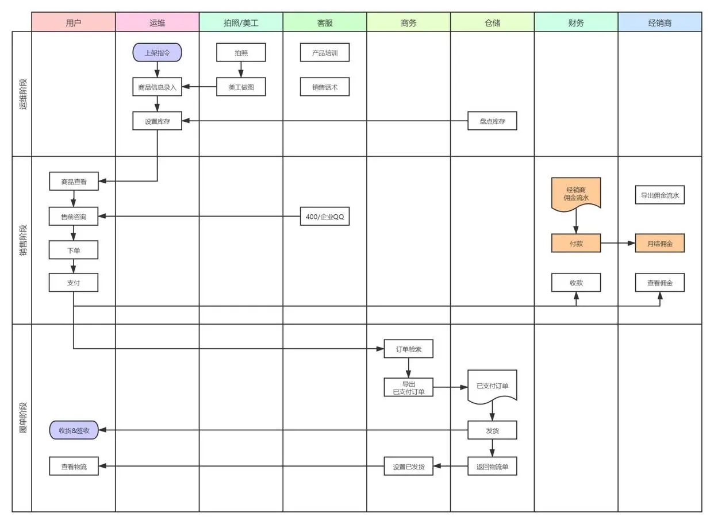

# 泳道图绘制技巧 

## 什么是泳道图

泳道图（Swimlane Diagram），也叫跨职能流程图，旨在分析和展示各个部门在同一任务流程上的不同进程，明确流程环节所属的阶段、流程环节负责人、组织机构或部门。泳道图的名称由来，是流程图中对职能部门的划分像游泳池泳道相类似比拟而来。

## 泳道图的作用

泳道图可以清晰地反映企业不同职能间的关系，令每个部门明确自己的任务范围，同时明确每个阶段需要做哪些动作。对企业而言，泳道图能够让工作部署更加流程化，提高工作效率。

## 泳道图的分类

根据泳道摆放的方向不同，可以分为**垂直泳道图**和**水平泳道图**。

泳道垂直于画布摆放，为垂直泳道图；泳道水平于画布摆放，为水平泳道图。在实际绘制时，两种排版没有太大的差别，可以按照喜好选择。