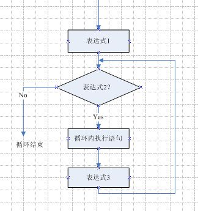
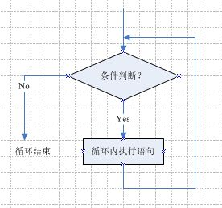
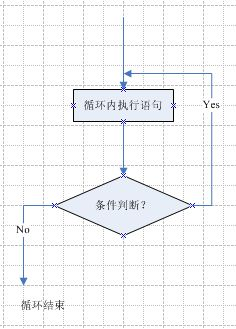
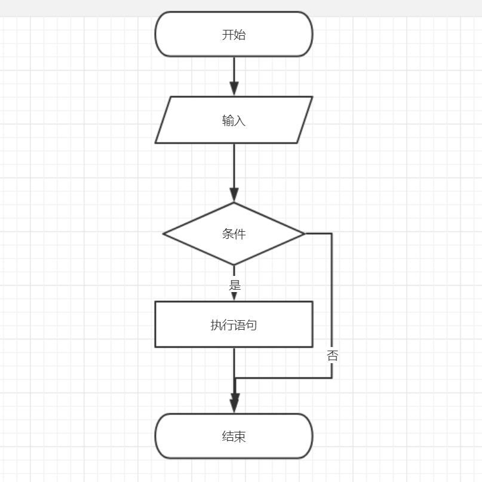
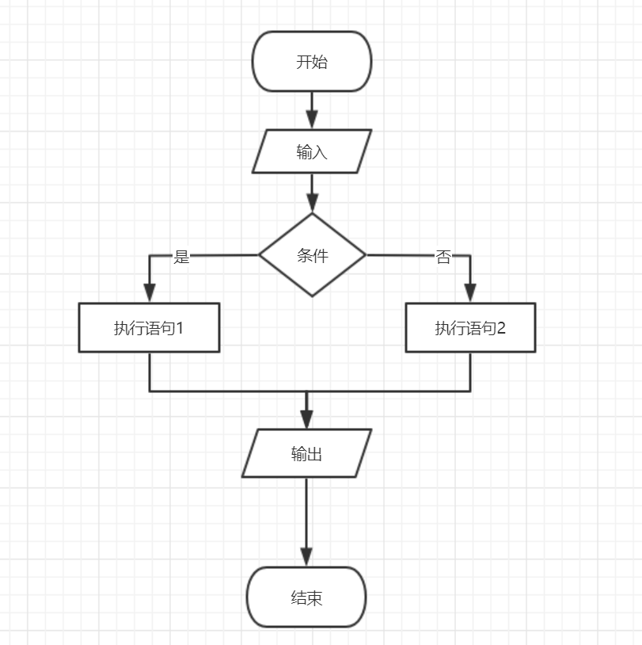
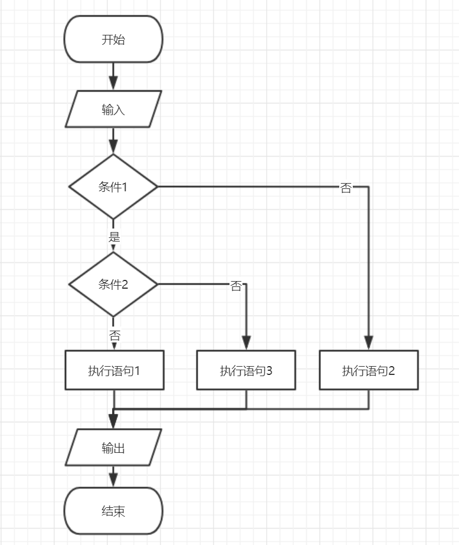
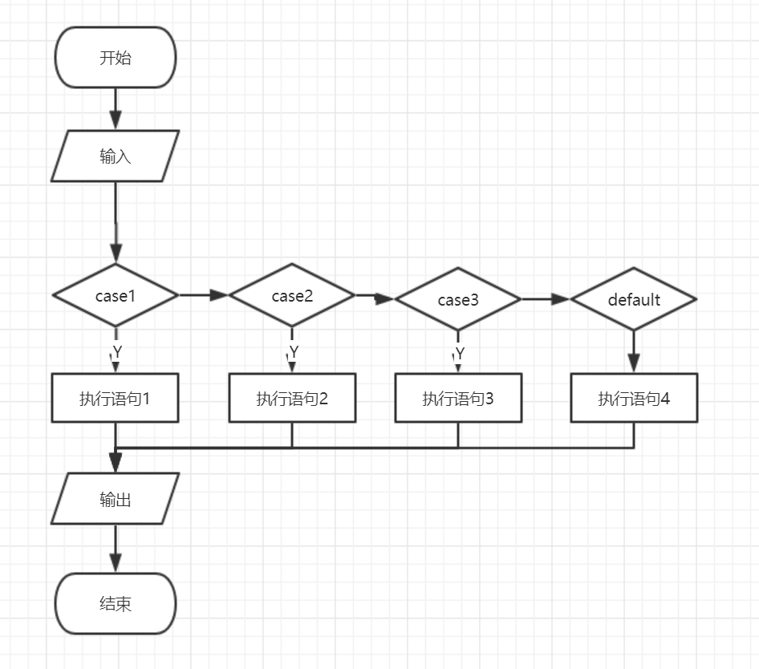

# 流程图画法


## 循环语句流程图


### for循环

```
for循环形式： for（表达式1；表达式2；表达式3）
```





### while循环

```
while（判断条件）{
    执行语句；
}
```




### do-while循环

```
do{
    执行语句
}while(条件判断)；
```




## 分支结构流程图


### 单分支




### 双分支




### 分支嵌套




### switch-case




