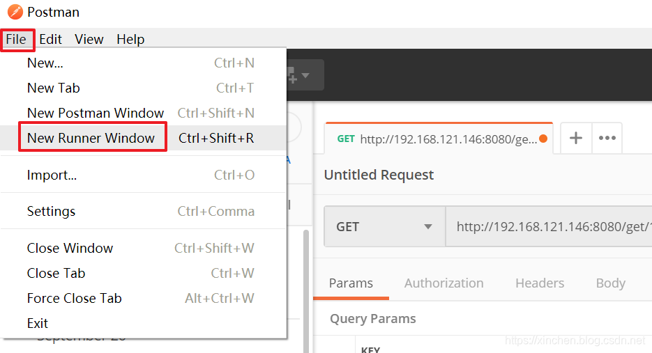

# 分布式系统快速接入pinpoint1.8.3指南

https://developer.aliyun.com/article/1061891


### 欢迎访问我的GitHub

> 这里分类和汇总了欣宸的全部原创(含配套源码)：<https://github.com/zq2599/blog_demos>

### 关于pinpoint

- pinpoint是一款调用链跟踪工具，目前最新版是1.8.5，官方GitHub地址：<https://github.com/naver/pinpoint>

### 构造用于实战的分布式环境

- 今天的实战会先准备一个简单的分布式环境，里面有两个SpringBoot应用，以及mysql、redis，再加上部署pinpoint的服务器，一共用到了五台机器，如下表所示：

| 主机名    | IP地址          | 作用                                                         |
| :-------- | :-------------- | :----------------------------------------------------------- |
| pinpoint  | 192.168.121.148 | pinpoint服务部署所在机器                                     |
| service-a | 192.168.121.146 | 提供两个接口： 1. add : 向mysql新增一条记录，并且调用service-b的set接口 2. get : 调用service-b的get接口查找数据，如果没有就从mysql中查找 |
| service-b | 192.168.121.147 | 提供两个接口： 1. get: 从redis中查找指定的记录 2. set : 将数据写入redis，有效期为30秒 |
| mysql     | 192.168.121.143 | mysql服务所在机器                                            |
| redis     | 192.168.121.144 | redis服务所在机器                                            |

- 整体架构如下图所示：


- 以上应用更多详情请参考[《立即可用的实战源码(springboot+redis+mybatis+restTemplate)》](https://xinchen.blog.csdn.net/article/details/101999606)
- 上述服务的源码可以在GitHub下载，可以直接从GitHub下载完整的demo工程源码，地址和链接信息如下表所示：

| 名称               | 链接                                       | 备注                            |
| :----------------- | :----------------------------------------- | :------------------------------ |
| 项目主页           | <https://github.com/zq2599/blog_demos>     | 该项目在GitHub上的主页          |
| git仓库地址(https) | <https://github.com/zq2599/blog_demos.git> | 该项目源码的仓库地址，https协议 |
| git仓库地址(ssh)   | git@github.com:zq2599/blog_demos.git       | 该项目源码的仓库地址，ssh协议   |

- 这个git项目中有多个文件夹，本章的应用在pinpoint185demo文件夹下，如下图红框所示：


### 配置host

- 为了后续配置方便，将以下内容写入上述五台电脑的/etc/hosts文件中，这样所有的配置文件都可以用hostname来表示了：

```
192.168.121.143 mysql
192.168.121.144 redis
192.168.121.146 service-a
192.168.121.147 service-b
192.168.121.148 pinpoint
```

### 版本信息参考

1. 操作系统：CentOS Linux release 7.7.1908
2. docker：Community 19.03.2
3. docker-compose：1.24.1
4. springboot：2.0.5.RELEASE
5. mysql：5.7.27
6. redis：5.0.6

### 部署pinpoint

- 登录pinpoint主机；
- 登录pinpoint主机；
- 装好docker和docker-comose，可以参考[《一行命令安装docker和docker-compose(CentOS7)》](https://xinchen.blog.csdn.net/article/details/101830200)
- 装好git客户端：yum install git -y
- 执行以下命令会先下载材料再按照docker-compose.yml的编排启动所有容器：

```
git clone https://github.com/naver/pinpoint-docker.git; \
git checkout 1.8.5; \
cd pinpoint-docker; \
docker-compose pull && docker-compose up -d
```

- 控制台提示如下：

```
[root@pinpoint ~]# clear
[root@pinpoint ~]# git clone https://github.com/naver/pinpoint-docker.git; \
> cd pinpoint-docker; \
> git checkout 1.8.5; \
> docker-compose pull && docker-compose up -d
正克隆到 'pinpoint-docker'...
remote: Enumerating objects: 34, done.
remote: Counting objects: 100% (34/34), done.
remote: Compressing objects: 100% (33/33), done.
remote: Total 384 (delta 6), reused 13 (delta 1), pack-reused 350
接收对象中: 100% (384/384), 244.12 MiB | 1.72 MiB/s, done.
处理 delta 中: 100% (185/185), done.
Note: checking out '1.8.5'.

You are in 'detached HEAD' state. You can look around, make experimental
changes and commit them, and you can discard any commits you make in this
state without impacting any branches by performing another checkout.

If you want to create a new branch to retain commits you create, you may
do so (now or later) by using -b with the checkout command again. Example:

  git checkout -b new_branch_name

HEAD 目前位于 39b9e1e... [naver/pinpoint#5998] update for release 1.8.5
Pulling jobmanager          ... done
Pulling zoo2                ... done
Pulling taskmanager         ... done
Pulling zoo1                ... done
Pulling zoo3                ... done
Pulling pinpoint-mysql      ... done
Pulling pinpoint-hbase      ... done
Pulling pinpoint-web        ... done
Pulling pinpoint-collector  ... done
Pulling pinpoint-agent      ... done
Pulling pinpoint-quickstart ... done
Creating network "pinpoint-docker_pinpoint" with driver "bridge"
Creating volume "pinpoint-docker_data-volume" with default driver
Creating volume "pinpoint-docker_mysql_data" with default driver
Creating pinpoint-flink-jobmanager ... done
Creating pinpoint-docker_zoo3_1     ... done
Creating pinpoint-docker_zoo1_1    ... done
Creating pinpoint-docker_zoo2_1     ... done
Creating pinpoint-hbase             ... done
Creating pinpoint-mysql             ... done
Creating pinpoint-flink-taskmanager ... done
Creating pinpoint-web               ... done
Creating pinpoint-collector         ... done
Creating pinpoint-agent             ... done
Creating pinpoint-quickstart        ... done
```

- 此处由于要下载大量文件，并且还要下载docker镜像，因此建议您耐心等待
- 启动完成后，执行命令docker ps -f name=pinpoint-web查看web服务的端口，如下图红框所示，是宿主机的8079端口：


- 访问地址[http://192.168.121.148](http://192.168.121.148/):8079 ，即可进入pinpoint的监控页面，如下图，已经自带了一个demo应用，该应用是在docker-compose.yml中配置的：


- pinpoint服务端已经准备好了，接下来我们将SpringBoot应用接入pinpoint，达到监控和调用链跟踪的效果

### SpringBoot应用接入pinpoint(service-a)

- 接下来要在SpringBoot应用所在机器上做操作，将应用接入pinpoint；
- 下载pinpoint agent包，地址是：<https://github.com/naver/pinpoint/releases> ，要下载的文件如下图红框所示：


- 登录service-a应用所在机器，在/root目录下新建文件夹pinpoint-agent-1.8.5；
- 将刚才下载的pinpoint-agent-1.8.5.tar.gz文件放入/root/pinpoint-agent-1.8.5目录，然后再解压pinpoint-agent-1.8.5.tar.gz（注意，是先放入pinpoint-agent-1.8.5文件夹再解压）；
- 打开文件/root/pinpoint-agent-1.8.5/pinpoint.config，找到profiler.collector.ip、profiler.tomcat.conditional.transform、profiler.applicationservertype这三个配置，修改成以下的值：

```shell
profiler.collector.ip=pinpoint
profiler.tomcat.conditional.transform=false
profiler.applicationservertype=SPRING_BOOT
```

- 重新启动service-a服务，假设原有的启动命令是java -jar service-a-1.0-SNAPSHOT.jar，现在改为：

```shell
java -jar \
-javaagent:/root/pinpoint-agent-1.8.5/pinpoint-bootstrap-1.8.5.jar \
-Dpinpoint.agentId=192.168.121.146 \
-Dpinpoint.applicationName=service-a \
service-a-1.0-SNAPSHOT.jar
```

- 如上所述，一共增加了三个参数：

| 参数名                    | 作用                                                         |
| :------------------------ | :----------------------------------------------------------- |
| javaagent                 | 指定pinpoint-agent所在位置                                   |
| Dpinpoint.applicationName | 上报到pinpoint后，在页面上展示的应用名称                     |
| Dpinpoint.agentId         | 代表当前机器信息的标签，这里填写的是IP地址，当有多个service-a进程接入pinpoint时，要用这个标签来区分 |

### SpringBoot应用接入pinpoint(service-b)

- service-b的配置方式和service-a的一样，注意启动参数要改成service-b有关的，以下是service-b的启动命令：

```shell
java -jar \
-javaagent:/root/pinpoint-agent-1.8.5/pinpoint-bootstrap-1.8.5.jar \
-Dpinpoint.agentId=192.168.121.147 \
-Dpinpoint.applicationName=service-b \
service-b-1.0-SNAPSHOT.jar
```


### 制造一些请求，用于观测数据

- 接下来制造一些请求，让service-a和service-b执行业务代码，我这里用的是Postman，它提供了自动发起重复请求的功能，如下图：


- 接下来打开Runner Window，如下图：



- 按照下图进行设置，即可向service-a持续发起请求：


### pinpoint的监控功能

- 打开pinpoint页面，可以看到service-a、service-b的监控数据已经有了：


- 用鼠标对右上角的请求量进行框选，可以查看请求的详情：


- 如下图，可以详细的看到每个请求内部的执行情况：


- 另外还能观察机器的整体情况：


- 至此，一个典型的Java分布式系统接入pinpoint1.8.3的实战就完成了，如果您正在考虑通过pinpoint来监控系统查看调用链情况，来希望本文能够给您一些参考；


### 友情提示

- 在整个实战过程中，以下小坑请注意跳过：

1. 关闭各个机器的防火墙；
2. 关闭pinpoint机器的swap；