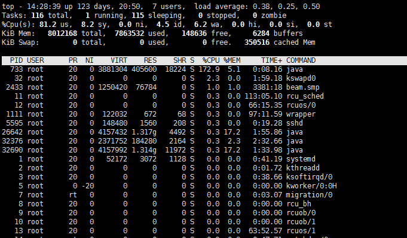
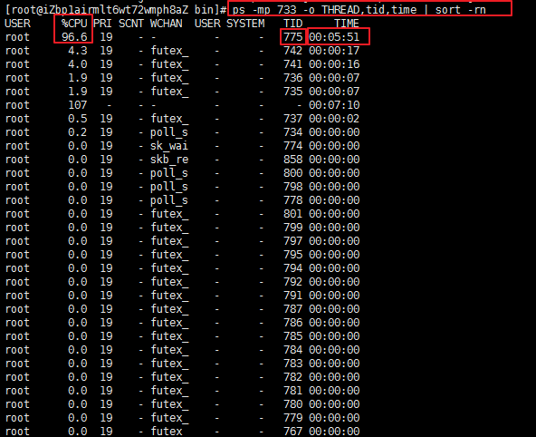
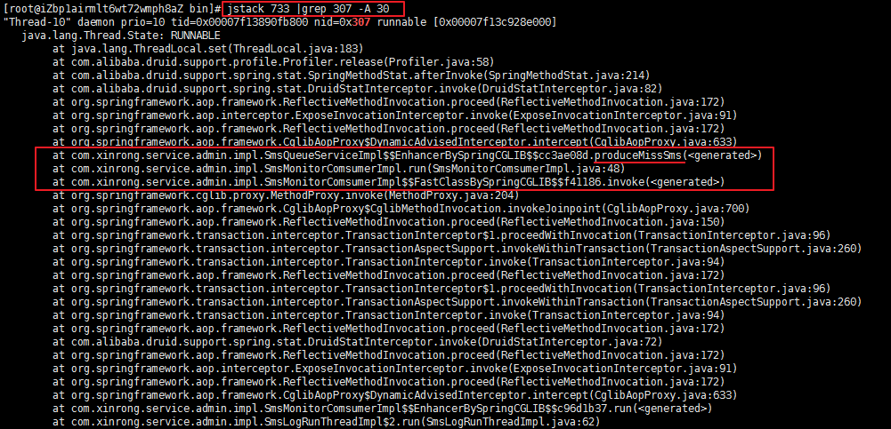
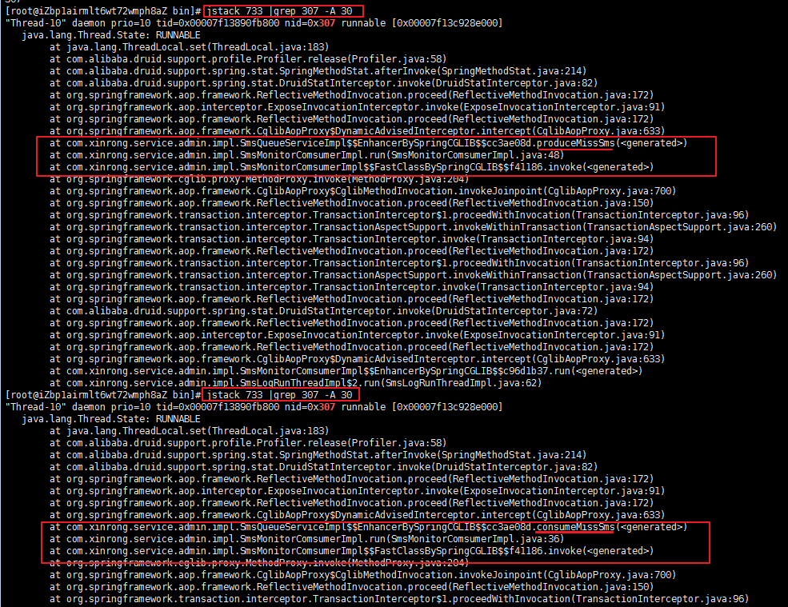

# CPU占用过高排查

## **一.简介**

最近一段时间 某台[服务器](https://cloud.tencent.com/product/cvm?from=10680)上的一个应用总是隔一段时间就自己挂掉 用top看了看 从重新部署应用开始没有多长时间CPU占用上升得很快

**排查步骤**

**1.使用top 定位到占用CPU高的进程PID `top`**

**2.通过ps aux | grep PID命令 获取线程信息，并找到占用CPU高的线程** 

**`ps -mp pid -o THREAD,tid,time | sort -rn`**

**3.将需要的线程ID转换为16进制格式 `printf "%x\n" tid`**

**4.打印线程的堆栈信息 到了这一步具体看堆栈的日志来定位问题了 `jstack pid |grep tid -A 30**`

## **二.例子**

1.`top` 可以看出PID 733进程 的占用CPU 172%

2.查找进程733下的线程 可以看到TID 线程775占用了96%且持有了很长时间 其实到这一步基本上能猜测到应该是 肯定是那段代码发生了死循环
`ps -mp 733 -o THREAD,tid,time | sort -rn`

3.线程ID转换为16进制格式
`printf "%x\n" 775`

4.查看java的堆栈信息，打印30行
`jstack -l pid号 |grep 0x线程号 -A 30`

