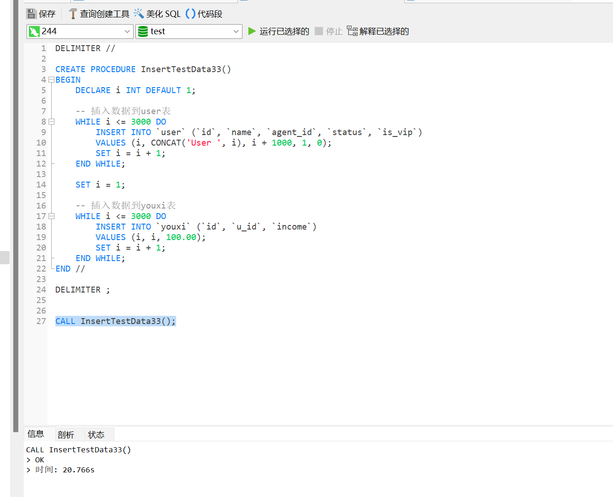
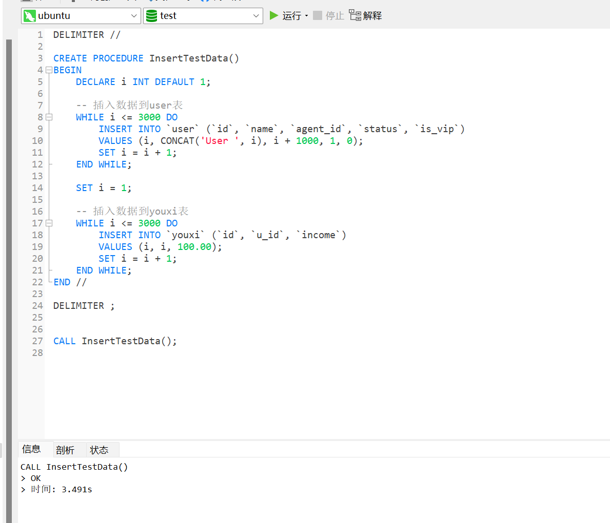

# MySQL 性能差问题排查


**以下简称性能差的MySQL所在的服务器为A ，另一个性能正常的所在的服务器为B。**


## 背景


一个接口时延比较高的问题，我整个链路都排查了，发现是mysq 服务器响应很慢（非sql和索引问题，任何查询都慢），CPU占用很低，初步怀疑是磁盘I/O问题，我怎样排查呢？


## 磁盘性能压测


既然怀疑是磁盘 IO 问题，首先对 服务器I/O进行压测。压测流程参考已有笔记，这里只展示压测结果。


### 服务器A的磁盘压测结果


```shell

```


### 服务器B的磁盘压测结果

```shell

```


### 压测对比


**服务器A**

```shell

```


**服务器B**

```shell

```


我们可以看到服务器A 的磁盘性能很差。

至此，已经判断出磁盘I/O，有问题，下面使用一个实际的例子进行对比。


## 实际案例

我们使用存储在两台服务器各自执行存储过程

数据库sql 

```shell
CREATE TABLE `user` (
  `id` int NOT NULL,
  `name` varchar(255) DEFAULT NULL,
  `agent_id` int DEFAULT NULL,
  `status` int DEFAULT NULL,
  `is_vip` int DEFAULT NULL,
  PRIMARY KEY (`id`)
) ENGINE=InnoDB DEFAULT CHARSET=utf8mb3;

CREATE TABLE `youxi` (
  `id` int NOT NULL,
  `u_id` int DEFAULT NULL,
  `income` decimal(10,2) DEFAULT NULL,
  PRIMARY KEY (`id`),
  KEY `u_id` (`u_id`)
) ENGINE=InnoDB DEFAULT CHARSET=utf8mb3;
```

使用存储过程插入三千条数据

```shell
DELIMITER //

CREATE PROCEDURE InsertTestData()
BEGIN
    DECLARE i INT DEFAULT 1;
    
    -- 插入数据到user表
    WHILE i <= 3000 DO
        INSERT INTO `user` (`id`, `name`, `agent_id`, `status`, `is_vip`)
        VALUES (i, CONCAT('User ', i), i + 1000, 1, 0);
        SET i = i + 1;
    END WHILE;

    SET i = 1;

    -- 插入数据到youxi表
    WHILE i <= 3000 DO
        INSERT INTO `youxi` (`id`, `u_id`, `income`)
        VALUES (i, i, 100.00);
        SET i = i + 1;
    END WHILE;
END //

DELIMITER ;

```

以下是运行存储过程的方法：

```shell
CALL InsertTestData();
```


### **A服务器执行存储过程的同时执行 iostat -d -k -x 1 获得的结果是**




```SHELL
iostat -d -k -x 1
Linux 3.10.0-1160.36.2.el7.x86_64 (taikang_cms) 	2023年08月23日 	_x86_64_	(4 CPU)

Device:         rrqm/s   wrqm/s     r/s     w/s    rkB/s    wkB/s avgrq-sz avgqu-sz   await r_await w_await  svctm  %util
sda               0.00     3.60    1.12    4.19    18.44    57.45    28.59     0.01    1.43    1.03    1.54   0.19   0.10

Device:         rrqm/s   wrqm/s     r/s     w/s    rkB/s    wkB/s avgrq-sz avgqu-sz   await r_await w_await  svctm  %util
sda               0.00     0.00    0.00    0.00     0.00     0.00     0.00     0.00    0.00    0.00    0.00   0.00   0.00

Device:         rrqm/s   wrqm/s     r/s     w/s    rkB/s    wkB/s avgrq-sz avgqu-sz   await r_await w_await  svctm  %util
sda               0.00     0.00    0.00    0.00     0.00     0.00     0.00     0.00    0.00    0.00    0.00   0.00   0.00

Device:         rrqm/s   wrqm/s     r/s     w/s    rkB/s    wkB/s avgrq-sz avgqu-sz   await r_await w_await  svctm  %util
sda               0.00   282.00    0.00  724.00     0.00  4280.00    11.82     0.15    0.21    0.00    0.21   0.20  14.80

Device:         rrqm/s   wrqm/s     r/s     w/s    rkB/s    wkB/s avgrq-sz avgqu-sz   await r_await w_await  svctm  %util
sda               0.00   357.00    0.00  967.00     0.00  5728.00    11.85     0.97    0.98    0.00    0.98   0.85  82.60

Device:         rrqm/s   wrqm/s     r/s     w/s    rkB/s    wkB/s avgrq-sz avgqu-sz   await r_await w_await  svctm  %util
sda               0.00    57.00    0.00  131.00     0.00  1076.00    16.43     1.08    8.29    0.00    8.29   7.43  97.30

Device:         rrqm/s   wrqm/s     r/s     w/s    rkB/s    wkB/s avgrq-sz avgqu-sz   await r_await w_await  svctm  %util
sda               0.00    69.00    0.00  156.00     0.00  1144.00    14.67     1.06    6.91    0.00    6.91   6.21  96.80

Device:         rrqm/s   wrqm/s     r/s     w/s    rkB/s    wkB/s avgrq-sz avgqu-sz   await r_await w_await  svctm  %util
sda               0.00   363.00    0.00  985.00     0.00  5736.00    11.65     0.81    0.82    0.00    0.82   0.82  80.50

Device:         rrqm/s   wrqm/s     r/s     w/s    rkB/s    wkB/s avgrq-sz avgqu-sz   await r_await w_await  svctm  %util
sda               0.00   892.00    0.00 2416.00     0.00 13700.00    11.34     0.53    0.22    0.00    0.22   0.22  52.40

Device:         rrqm/s   wrqm/s     r/s     w/s    rkB/s    wkB/s avgrq-sz avgqu-sz   await r_await w_await  svctm  %util
sda               0.00   923.00    0.00 2496.00     0.00 14156.00    11.34     0.54    0.22    0.00    0.22   0.21  53.60

Device:         rrqm/s   wrqm/s     r/s     w/s    rkB/s    wkB/s avgrq-sz avgqu-sz   await r_await w_await  svctm  %util
sda               0.00   913.00    0.00 2473.00     0.00 13988.00    11.31     0.54    0.22    0.00    0.22   0.22  53.60

Device:         rrqm/s   wrqm/s     r/s     w/s    rkB/s    wkB/s avgrq-sz avgqu-sz   await r_await w_await  svctm  %util
sda               0.00   945.00    0.00 2451.00     0.00 14032.00    11.45     0.53    0.22    0.00    0.22   0.22  53.20

Device:         rrqm/s   wrqm/s     r/s     w/s    rkB/s    wkB/s avgrq-sz avgqu-sz   await r_await w_await  svctm  %util
sda               0.00   901.00    0.00 2436.00     0.00 13792.00    11.32     0.54    0.22    0.00    0.22   0.22  53.70

Device:         rrqm/s   wrqm/s     r/s     w/s    rkB/s    wkB/s avgrq-sz avgqu-sz   await r_await w_await  svctm  %util
sda               0.00   916.00    0.00 2479.00     0.00 14024.00    11.31     0.52    0.21    0.00    0.21   0.21  52.00

Device:         rrqm/s   wrqm/s     r/s     w/s    rkB/s    wkB/s avgrq-sz avgqu-sz   await r_await w_await  svctm  %util
sda               0.00   899.00    0.00 2444.00     0.00 13788.00    11.28     0.54    0.22    0.00    0.22   0.22  53.40

Device:         rrqm/s   wrqm/s     r/s     w/s    rkB/s    wkB/s avgrq-sz avgqu-sz   await r_await w_await  svctm  %util
sda               0.00   912.00    0.00 2484.00     0.00 14028.00    11.29     0.54    0.22    0.00    0.22   0.22  54.10

Device:         rrqm/s   wrqm/s     r/s     w/s    rkB/s    wkB/s avgrq-sz avgqu-sz   await r_await w_await  svctm  %util
sda               0.00   951.00    0.00 2431.00     0.00 13916.00    11.45     0.53    0.22    0.00    0.22   0.22  53.00

Device:         rrqm/s   wrqm/s     r/s     w/s    rkB/s    wkB/s avgrq-sz avgqu-sz   await r_await w_await  svctm  %util
sda               0.00   915.00    0.00 2468.00     0.00 13956.00    11.31     0.53    0.22    0.00    0.22   0.21  52.80

Device:         rrqm/s   wrqm/s     r/s     w/s    rkB/s    wkB/s avgrq-sz avgqu-sz   await r_await w_await  svctm  %util
sda               0.00   309.00    0.00  834.00     0.00  4772.00    11.44     0.96    1.13    0.00    1.13   1.00  83.00

Device:         rrqm/s   wrqm/s     r/s     w/s    rkB/s    wkB/s avgrq-sz avgqu-sz   await r_await w_await  svctm  %util
sda               0.00    54.00    0.00  133.00     0.00   848.00    12.75     1.05    7.86    0.00    7.86   7.31  97.20

Device:         rrqm/s   wrqm/s     r/s     w/s    rkB/s    wkB/s avgrq-sz avgqu-sz   await r_await w_await  svctm  %util
sda               0.00    58.00    0.00  154.00     0.00   944.00    12.26     1.00    6.60    0.00    6.60   6.26  96.40

Device:         rrqm/s   wrqm/s     r/s     w/s    rkB/s    wkB/s avgrq-sz avgqu-sz   await r_await w_await  svctm  %util
sda               0.00   598.00    0.00 1531.00     0.00  8780.00    11.47     0.72    0.47    0.00    0.47   0.47  72.30

Device:         rrqm/s   wrqm/s     r/s     w/s    rkB/s    wkB/s avgrq-sz avgqu-sz   await r_await w_await  svctm  %util
sda               0.00   896.00    0.00 2420.00     0.00 13644.00    11.28     0.54    0.23    0.00    0.23   0.22  54.00

Device:         rrqm/s   wrqm/s     r/s     w/s    rkB/s    wkB/s avgrq-sz avgqu-sz   await r_await w_await  svctm  %util
sda               0.00   930.00    0.00 2512.00     0.00 14324.00    11.40     0.59    0.24    0.00    0.24   0.22  55.60

Device:         rrqm/s   wrqm/s     r/s     w/s    rkB/s    wkB/s avgrq-sz avgqu-sz   await r_await w_await  svctm  %util
sda               0.00   420.00    0.00 1138.00     0.00  6460.00    11.35     0.25    0.22    0.00    0.22   0.22  24.70

Device:         rrqm/s   wrqm/s     r/s     w/s    rkB/s    wkB/s avgrq-sz avgqu-sz   await r_await w_await  svctm  %util
sda               0.00    10.00    0.00   97.00     0.00  4948.00   102.02     0.16    1.65    0.00    1.65   0.26   2.50

Device:         rrqm/s   wrqm/s     r/s     w/s    rkB/s    wkB/s avgrq-sz avgqu-sz   await r_await w_await  svctm  %util
sda               0.00     3.00    0.00    5.00     0.00    28.00    11.20     0.00    0.20    0.00    0.20   0.20   0.10

Device:         rrqm/s   wrqm/s     r/s     w/s    rkB/s    wkB/s avgrq-sz avgqu-sz   await r_await w_await  svctm  %util
sda               0.00     0.00    0.00    0.00     0.00     0.00     0.00     0.00    0.00    0.00    0.00   0.00   0.00

```


### **B服务器执行存储过程的同时执行 iostat -d -k -x 1 获得的结果是**



```shell
Device            r/s     rkB/s   rrqm/s  %rrqm r_await rareq-sz     w/s     wkB/s   wrqm/s  %wrqm w_await wareq-sz     d/s     dkB/s   drqm/s  %drqm d_await dareq-sz     f/s f_await  aqu-sz  %util
sda              0.00      0.00     0.00   0.00    0.00     0.00    0.00      0.00     0.00   0.00    0.00     0.00    0.00      0.00     0.00   0.00    0.00     0.00    0.00    0.00    0.00   0.00
sdb              0.00      0.00     0.00   0.00    0.00     0.00    0.00      0.00     0.00   0.00    0.00     0.00    0.00      0.00     0.00   0.00    0.00     0.00    0.00    0.00    0.00   0.00
sdc              0.00      0.00     0.00   0.00    0.00     0.00    0.00      0.00     0.00   0.00    0.00     0.00    0.00      0.00     0.00   0.00    0.00     0.00    0.00    0.00    0.00   0.00
sdd              0.00      0.00     0.00   0.00    0.00     0.00    0.00      0.00     0.00   0.00    0.00     0.00    0.00      0.00     0.00   0.00    0.00     0.00    0.00    0.00    0.00   0.00


Device            r/s     rkB/s   rrqm/s  %rrqm r_await rareq-sz     w/s     wkB/s   wrqm/s  %wrqm w_await wareq-sz     d/s     dkB/s   drqm/s  %drqm d_await dareq-sz     f/s f_await  aqu-sz  %util
sda              0.00      0.00     0.00   0.00    0.00     0.00    0.00      0.00     0.00   0.00    0.00     0.00    0.00      0.00     0.00   0.00    0.00     0.00    0.00    0.00    0.00   0.00
sdb              0.00      0.00     0.00   0.00    0.00     0.00    0.00      0.00     0.00   0.00    0.00     0.00    0.00      0.00     0.00   0.00    0.00     0.00    0.00    0.00    0.00   0.00
sdc              0.00      0.00     0.00   0.00    0.00     0.00 1651.00   3944.00    50.00   2.94    0.23     2.39    0.00      0.00     0.00   0.00    0.00     0.00  849.00    0.34    0.67  47.00
sdd              0.00      0.00     0.00   0.00    0.00     0.00    0.00      0.00     0.00   0.00    0.00     0.00    0.00      0.00     0.00   0.00    0.00     0.00    0.00    0.00    0.00   0.00


Device            r/s     rkB/s   rrqm/s  %rrqm r_await rareq-sz     w/s     wkB/s   wrqm/s  %wrqm w_await wareq-sz     d/s     dkB/s   drqm/s  %drqm d_await dareq-sz     f/s f_await  aqu-sz  %util
sda              0.00      0.00     0.00   0.00    0.00     0.00    0.00      0.00     0.00   0.00    0.00     0.00    0.00      0.00     0.00   0.00    0.00     0.00    0.00    0.00    0.00   0.00
sdb              0.00      0.00     0.00   0.00    0.00     0.00    0.00      0.00     0.00   0.00    0.00     0.00    0.00      0.00     0.00   0.00    0.00     0.00    0.00    0.00    0.00   0.00
sdc              0.00      0.00     0.00   0.00    0.00     0.00 3576.00   8884.00   108.00   2.93    0.24     2.48    0.00      0.00     0.00   0.00    0.00     0.00 1832.00    0.34    1.47 100.00
sdd              0.00      0.00     0.00   0.00    0.00     0.00    0.00      0.00     0.00   0.00    0.00     0.00    0.00      0.00     0.00   0.00    0.00     0.00    0.00    0.00    0.00   0.00


Device            r/s     rkB/s   rrqm/s  %rrqm r_await rareq-sz     w/s     wkB/s   wrqm/s  %wrqm w_await wareq-sz     d/s     dkB/s   drqm/s  %drqm d_await dareq-sz     f/s f_await  aqu-sz  %util
sda              0.00      0.00     0.00   0.00    0.00     0.00    0.00      0.00     0.00   0.00    0.00     0.00    0.00      0.00     0.00   0.00    0.00     0.00    0.00    0.00    0.00   0.00
sdb              0.00      0.00     0.00   0.00    0.00     0.00    0.00      0.00     0.00   0.00    0.00     0.00    0.00      0.00     0.00   0.00    0.00     0.00    0.00    0.00    0.00   0.00
sdc              0.00      0.00     0.00   0.00    0.00     0.00 3521.00   8732.00   107.00   2.95    0.24     2.48    0.00      0.00     0.00   0.00    0.00     0.00 1809.00    0.34    1.46 100.00
sdd              0.00      0.00     0.00   0.00    0.00     0.00    0.00      0.00     0.00   0.00    0.00     0.00    0.00      0.00     0.00   0.00    0.00     0.00    0.00    0.00    0.00   0.00


Device            r/s     rkB/s   rrqm/s  %rrqm r_await rareq-sz     w/s     wkB/s   wrqm/s  %wrqm w_await wareq-sz     d/s     dkB/s   drqm/s  %drqm d_await dareq-sz     f/s f_await  aqu-sz  %util
sda              0.00      0.00     0.00   0.00    0.00     0.00    0.00      0.00     0.00   0.00    0.00     0.00    0.00      0.00     0.00   0.00    0.00     0.00    0.00    0.00    0.00   0.00
sdb              0.00      0.00     0.00   0.00    0.00     0.00    0.00      0.00     0.00   0.00    0.00     0.00    0.00      0.00     0.00   0.00    0.00     0.00    0.00    0.00    0.00   0.00
sdc              0.00      0.00     0.00   0.00    0.00     0.00 3543.00   8708.00   103.00   2.83    0.24     2.46    0.00      0.00     0.00   0.00    0.00     0.00 1820.00    0.34    1.47 100.00
sdd              0.00      0.00     0.00   0.00    0.00     0.00    0.00      0.00     0.00   0.00    0.00     0.00    0.00      0.00     0.00   0.00    0.00     0.00    0.00    0.00    0.00   0.00


Device            r/s     rkB/s   rrqm/s  %rrqm r_await rareq-sz     w/s     wkB/s   wrqm/s  %wrqm w_await wareq-sz     d/s     dkB/s   drqm/s  %drqm d_await dareq-sz     f/s f_await  aqu-sz  %util
sda              0.00      0.00     0.00   0.00    0.00     0.00    0.00      0.00     0.00   0.00    0.00     0.00    0.00      0.00     0.00   0.00    0.00     0.00    0.00    0.00    0.00   0.00
sdb              0.00      0.00     0.00   0.00    0.00     0.00    0.00      0.00     0.00   0.00    0.00     0.00    0.00      0.00     0.00   0.00    0.00     0.00    0.00    0.00    0.00   0.00
sdc              0.00      0.00     0.00   0.00    0.00     0.00  105.00    508.00     4.00   3.67    0.29     4.84    0.00      0.00     0.00   0.00    0.00     0.00   55.00    0.35    0.05   4.00
sdd              0.00      0.00     0.00   0.00    0.00     0.00    0.00      0.00     0.00   0.00    0.00     0.00    0.00      0.00     0.00   0.00    0.00     0.00    0.00    0.00    0.00   0.00


Device            r/s     rkB/s   rrqm/s  %rrqm r_await rareq-sz     w/s     wkB/s   wrqm/s  %wrqm w_await wareq-sz     d/s     dkB/s   drqm/s  %drqm d_await dareq-sz     f/s f_await  aqu-sz  %util
sda              0.00      0.00     0.00   0.00    0.00     0.00    0.00      0.00     0.00   0.00    0.00     0.00    0.00      0.00     0.00   0.00    0.00     0.00    0.00    0.00    0.00   0.00
sdb              0.00      0.00     0.00   0.00    0.00     0.00    0.00      0.00     0.00   0.00    0.00     0.00    0.00      0.00     0.00   0.00    0.00     0.00    0.00    0.00    0.00   0.00
sdc              0.00      0.00     0.00   0.00    0.00     0.00   35.00   3504.00     5.00  12.50    0.80   100.11    0.00      0.00     0.00   0.00    0.00     0.00    9.00    0.44    0.03   3.00
sdd              0.00      0.00     0.00   0.00    0.00     0.00    0.00      0.00     0.00   0.00    0.00     0.00    0.00      0.00     0.00   0.00    0.00     0.00    0.00    0.00    0.00   0.00


Device            r/s     rkB/s   rrqm/s  %rrqm r_await rareq-sz     w/s     wkB/s   wrqm/s  %wrqm w_await wareq-sz     d/s     dkB/s   drqm/s  %drqm d_await dareq-sz     f/s f_await  aqu-sz  %util
sda              0.00      0.00     0.00   0.00    0.00     0.00    0.00      0.00     0.00   0.00    0.00     0.00    0.00      0.00     0.00   0.00    0.00     0.00    0.00    0.00    0.00   0.00
sdb              0.00      0.00     0.00   0.00    0.00     0.00    0.00      0.00     0.00   0.00    0.00     0.00    0.00      0.00     0.00   0.00    0.00     0.00    0.00    0.00    0.00   0.00
sdc              0.00      0.00     0.00   0.00    0.00     0.00  109.00    516.00    10.00   8.40    1.22     4.73    0.00      0.00     0.00   0.00    0.00     0.00    3.00    0.67    0.14   3.00
sdd              0.00      0.00     0.00   0.00    0.00     0.00    0.00      0.00     0.00   0.00    0.00     0.00    0.00      0.00     0.00   0.00    0.00     0.00    0.00    0.00    0.00   0.00
```


由此看出A服务器的磁盘性能很差。

https://dev.mysql.com/doc/refman/5.7/en/innodb-configuring-io-capacity.html