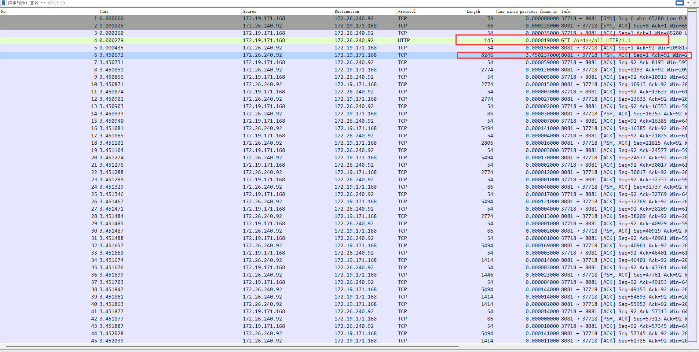

# 抓包


## tcpdump


`tcpdump` 的常用参数如下：

```sql
tcpdump -i eth0 -nn -s0 -v port 80
```


- **-i** : 选择要捕获的接口，通常是以太网卡或无线网卡，也可以是 `vlan` 或其他特殊接口。如果该系统上只有一个网络接口，则无需指定。
- **-nn** : 单个 n 表示不解析域名，直接显示 IP；两个 n 表示不解析域名和端口。这样不仅方便查看 IP 和端口号，而且在抓取大量数据时非常高效，因为域名解析会降低抓取速度。
- **-s0** : tcpdump 默认只会截取前 `96` 字节的内容，要想截取所有的报文内容，可以使用 `-s number`， `number` 就是你要截取的报文字节数，如果是 0 的话，表示截取报文全部内容。
- **-v** : 使用 `-v`，`-vv` 和 `-vvv` 来显示更多的详细信息，通常会显示更多与特定协议相关的信息。
- `port 80` : 这是一个常见的端口过滤器，表示仅抓取 `80` 端口上的流量，通常是 HTTP。
- **-e** : 显示数据链路层信息。默认情况下 tcpdump 不会显示数据链路层信息，使用 `-e` 选项可以显示源和目的 MAC 地址，以及 VLAN tag 信息。例如：


### 抓取特定协议的数据


后面可以跟上协议名称来过滤特定协议的流量，以 UDP 为例，可以加上参数 udp 或 `protocol 17`，这两个命令意思相同。

```sql
$ tcpdump -i eth0 udp
$ tcpdump -i eth0 proto 17
```

同理，tcp 与 `protocol 6` 意思相同。


### 将抓取的数据写入文件


使用 tcpdump  截取数据报文的时候，默认会打印到屏幕的默认输出，你会看到按照顺序和格式，很多的数据一行行快速闪过，根本来不及看清楚所有的内容。不过，tcpdump 提供了把截取的数据保存到文件的功能，以便后面使用其他图形工具（比如 wireshark，Snort）来分析。

`-w` 选项用来把数据报文输出到文件：

```sql
$ tcpdump -i eth0 -s0 -w test.pcap
```


## 性能分析案例


### 案例一

如何通过一个网络抓包获取一个请求、一次SQL 的执行时间，真他妈有用，比业务日志可靠多了，撕逼我全靠这招，战无不胜。
如下图 RT 列就是Wireshark 帮你计算得到3003端口的response time时间，你再看看左侧抓包时间，精准得对手无话可说。绿框是请求、篮筐是响应，这是一次MySQL的查询相应，这个SQL执行时间只花了0.477毫秒，所以极快，说明MySQL没有问题
如果你再到请求端的7520端口也抓包得到同样一个 RT，这个RT就包含了上面的MySQL RT以及网络传输时间，特别大就是网络慢，同样快就说明都没问题。


例如：

**调用接口查看响应时间**

```shell
root@LAPTOP-8VVQRO6C:/home/yuan# curl -o /dev/null -s -w "Response time: %{time_total} seconds\n" http://172.26.240.92:8081/order/all
Response time: 3.463962 seconds

```

抓包

```shell
tcpdump tcp and port 3306 -w test.cap
```



分析接口调用端的包：看出耗时 大约在3.46左右。


**此时再对数据库的包分析**


可以看出这个SQL执行时间只花了0.24毫秒，所以极快，说明MySQL没有问题。

